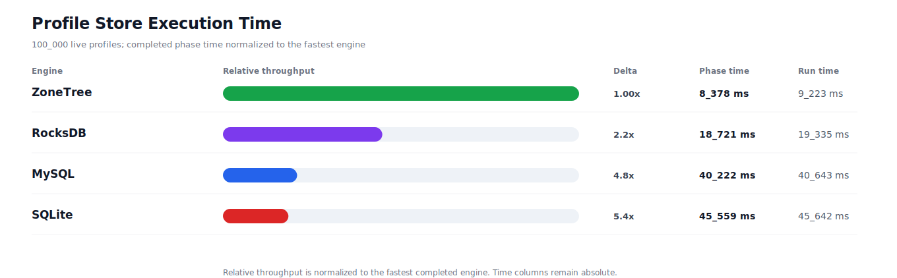
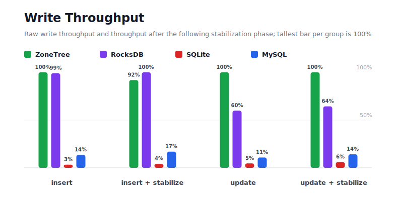
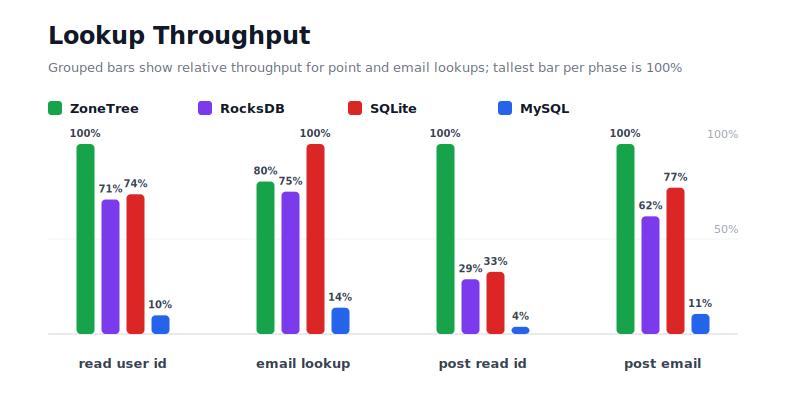
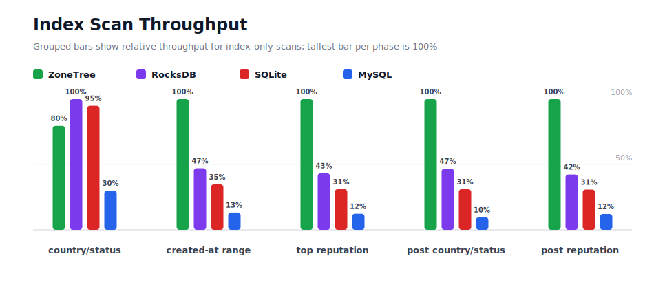
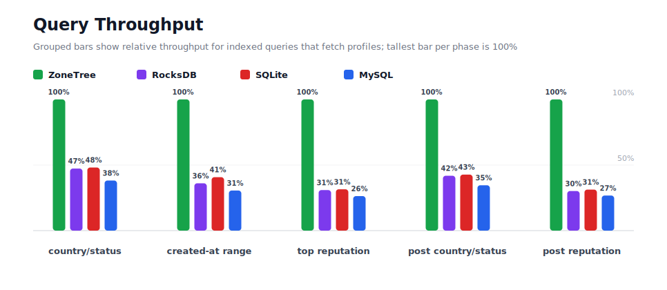
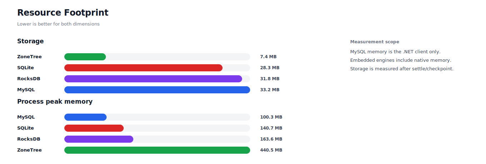

# Benchmark 100K Profiles - Linux

## Charts

### Execution Time

### Write Throughput

### Lookup Throughput

### Index Scan Throughput

### Query Throughput

### Resource Footprint

## Total By Engine

| Engine | Status | Run time | Completed phase time | Pre-read stabilize | Post-update stabilize | Settle | Reopen | Verify | Storage | Process peak memory | Final checksum |
| --- | --- | ---: | ---: | ---: | ---: | ---: | ---: | ---: | ---: | ---: | --- |
| ZoneTree | Completed | 9_223 ms | 8_378 ms | 194 ms | 182 ms | 16 ms | 42 ms | 7 ms | 7.4 MB | 440.5 MB | `1C7232F217FD84C5` |
| RocksDB | Completed | 19_335 ms | 18_721 ms | 130 ms | 214 ms | 0 ms | 89 ms | 19 ms | 31.8 MB | 163.6 MB | `1C7232F217FD84C5` |
| SQLite | Completed | 45_642 ms | 45_559 ms | n/a | n/a | 17 ms | 0 ms | 1 ms | 28.3 MB | 140.7 MB | `1C7232F217FD84C5` |
| MySQL | Completed | 40_643 ms | 40_222 ms | n/a | n/a | 1 ms | 3 ms | 6 ms | 33.2 MB | 100.3 MB | `1C7232F217FD84C5` |

## Correctness

Checksum validation passed across completed engines: ZoneTree, RocksDB, SQLite, MySQL.

## Interpretation Notes

* This benchmark measures live single-operation profile inserts, updates, reads, and indexed queries.
* ZoneTree and RocksDB secondary indexes are maintained by the benchmark application using separate stores.
* SQLite and MySQL maintain secondary indexes inside the database engine.
* MySQL is measured as a client/server database over TCP.
* Embedded engines run in the benchmark process.
* Completed phase time is the sum of measured workload phases. Run time also includes initialization, stabilization, settle/checkpoint, reopen, verification, and reporting overhead.
* The write throughput chart includes raw write phases and derived write-readiness bars that add the following stabilization phase.
* Storage is measured after each engine settles or checkpoints its data.
* Process peak memory is measured for the benchmark process. For MySQL, this excludes MySQL server/container memory.

## Write Readiness

| Engine | Insert | Pre-read stabilize | Insert + stabilize | Insert ready throughput | Update | Post-update stabilize | Update + stabilize | Update ready throughput |
| --- | ---: | ---: | ---: | ---: | ---: | ---: | ---: | ---: |
| ZoneTree | 528 ms | 194 ms | 722 ms | 138_571/s | 584 ms | 182 ms | 766 ms | 130_570/s |
| RocksDB | 533 ms | 130 ms | 663 ms | 150_801/s | 976 ms | 214 ms | 1_190 ms | 84_032/s |
| SQLite | 15_985 ms | n/a | 15_985 ms | 6_256/s | 12_664 ms | n/a | 12_664 ms | 7_897/s |
| MySQL | 3_910 ms | n/a | 3_910 ms | 25_577/s | 5_411 ms | n/a | 5_411 ms | 18_482/s |

## Phase Results

### ZoneTree

| Phase | Operations | Time | Throughput | Checksum |
| --- | ---: | ---: | ---: | --- |
| insert profiles | 100_000 | 528 ms | 189_385/s | `37C6E9056D5AC045` |
| read by user id | 100_000 | 188 ms | 533_046/s | `3C75C3A02940F75F` |
| lookup by email | 100_000 | 358 ms | 279_315/s | `8EACBB38279A3446` |
| scan country/status index | 25_000 | 538 ms | 46_497/s | `550DE764BD164CCC` |
| query country/status | 25_000 | 1_380 ms | 18_118/s | `8A71BD4E88816061` |
| scan created-at index | 25_000 | 150 ms | 166_148/s | `1BED8F615F0CDA9D` |
| query created-at range | 25_000 | 1_045 ms | 23_914/s | `DD87F18F9230D64C` |
| scan top reputation index | 25_000 | 120 ms | 207_880/s | `5045A3EB2C7535C5` |
| query top reputation | 25_000 | 860 ms | 29_062/s | `3C71031ED8049A9D` |
| update profiles | 100_000 | 584 ms | 171_148/s | `FA3F051A503B5D43` |
| post-update read by user id | 100_000 | 71 ms | 1_403_521/s | `2AD19D2C2B2F8F3D` |
| post-update lookup by email | 100_000 | 219 ms | 457_290/s | `6B8148031A502EBA` |
| post-update scan country/status index | 25_000 | 136 ms | 184_230/s | `D57DAE36F8AAE9C3` |
| post-update query country/status | 25_000 | 1_228 ms | 20_365/s | `1583D5A1C67A8B7C` |
| post-update scan top reputation index | 25_000 | 117 ms | 213_246/s | `4EAFA92C8AA7C495` |
| post-update query top reputation | 25_000 | 856 ms | 29_201/s | `8A0AD194E6834A4D` |

### RocksDB

| Phase | Operations | Time | Throughput | Checksum |
| --- | ---: | ---: | ---: | --- |
| insert profiles | 100_000 | 533 ms | 187_637/s | `37C6E9056D5AC045` |
| read by user id | 100_000 | 265 ms | 377_300/s | `3C75C3A02940F75F` |
| lookup by email | 100_000 | 384 ms | 260_691/s | `8EACBB38279A3446` |
| scan country/status index | 25_000 | 428 ms | 58_430/s | `550DE764BD164CCC` |
| query country/status | 25_000 | 2_917 ms | 8_570/s | `8A71BD4E88816061` |
| scan created-at index | 25_000 | 320 ms | 78_215/s | `1BED8F615F0CDA9D` |
| query created-at range | 25_000 | 2_898 ms | 8_626/s | `DD87F18F9230D64C` |
| scan top reputation index | 25_000 | 278 ms | 89_871/s | `5045A3EB2C7535C5` |
| query top reputation | 25_000 | 2_783 ms | 8_982/s | `3C71031ED8049A9D` |
| update profiles | 100_000 | 976 ms | 102_437/s | `FA3F051A503B5D43` |
| post-update read by user id | 100_000 | 247 ms | 404_245/s | `2AD19D2C2B2F8F3D` |
| post-update lookup by email | 100_000 | 353 ms | 283_223/s | `6B8148031A502EBA` |
| post-update scan country/status index | 25_000 | 290 ms | 86_183/s | `D57DAE36F8AAE9C3` |
| post-update query country/status | 25_000 | 2_935 ms | 8_518/s | `1583D5A1C67A8B7C` |
| post-update scan top reputation index | 25_000 | 277 ms | 90_226/s | `4EAFA92C8AA7C495` |
| post-update query top reputation | 25_000 | 2_837 ms | 8_813/s | `8A0AD194E6834A4D` |

### SQLite

| Phase | Operations | Time | Throughput | Checksum |
| --- | ---: | ---: | ---: | --- |
| insert profiles | 100_000 | 15_985 ms | 6_256/s | `37C6E9056D5AC045` |
| read by user id | 100_000 | 255 ms | 391_954/s | `3C75C3A02940F75F` |
| lookup by email | 100_000 | 287 ms | 348_029/s | `8EACBB38279A3446` |
| scan country/status index | 25_000 | 451 ms | 55_469/s | `550DE764BD164CCC` |
| query country/status | 25_000 | 2_869 ms | 8_715/s | `8A71BD4E88816061` |
| scan created-at index | 25_000 | 433 ms | 57_717/s | `1BED8F615F0CDA9D` |
| query created-at range | 25_000 | 2_566 ms | 9_743/s | `DD87F18F9230D64C` |
| scan top reputation index | 25_000 | 387 ms | 64_682/s | `5045A3EB2C7535C5` |
| query top reputation | 25_000 | 2_731 ms | 9_154/s | `3C71031ED8049A9D` |
| update profiles | 100_000 | 12_664 ms | 7_897/s | `FA3F051A503B5D43` |
| post-update read by user id | 100_000 | 218 ms | 458_837/s | `2AD19D2C2B2F8F3D` |
| post-update lookup by email | 100_000 | 284 ms | 352_135/s | `6B8148031A502EBA` |
| post-update scan country/status index | 25_000 | 437 ms | 57_238/s | `D57DAE36F8AAE9C3` |
| post-update query country/status | 25_000 | 2_875 ms | 8_696/s | `1583D5A1C67A8B7C` |
| post-update scan top reputation index | 25_000 | 381 ms | 65_637/s | `4EAFA92C8AA7C495` |
| post-update query top reputation | 25_000 | 2_738 ms | 9_131/s | `8A0AD194E6834A4D` |

### MySQL

| Phase | Operations | Time | Throughput | Checksum |
| --- | ---: | ---: | ---: | --- |
| insert profiles | 100_000 | 3_910 ms | 25_577/s | `37C6E9056D5AC045` |
| read by user id | 100_000 | 1_906 ms | 52_464/s | `3C75C3A02940F75F` |
| lookup by email | 100_000 | 2_076 ms | 48_180/s | `8EACBB38279A3446` |
| scan country/status index | 25_000 | 1_429 ms | 17_496/s | `550DE764BD164CCC` |
| query country/status | 25_000 | 3_614 ms | 6_917/s | `8A71BD4E88816061` |
| scan created-at index | 25_000 | 1_138 ms | 21_973/s | `1BED8F615F0CDA9D` |
| query created-at range | 25_000 | 3_421 ms | 7_308/s | `DD87F18F9230D64C` |
| scan top reputation index | 25_000 | 979 ms | 25_524/s | `5045A3EB2C7535C5` |
| query top reputation | 25_000 | 3_269 ms | 7_647/s | `3C71031ED8049A9D` |
| update profiles | 100_000 | 5_411 ms | 18_482/s | `FA3F051A503B5D43` |
| post-update read by user id | 100_000 | 1_874 ms | 53_374/s | `2AD19D2C2B2F8F3D` |
| post-update lookup by email | 100_000 | 2_068 ms | 48_363/s | `6B8148031A502EBA` |
| post-update scan country/status index | 25_000 | 1_403 ms | 17_817/s | `D57DAE36F8AAE9C3` |
| post-update query country/status | 25_000 | 3_551 ms | 7_040/s | `1583D5A1C67A8B7C` |
| post-update scan top reputation index | 25_000 | 970 ms | 25_775/s | `4EAFA92C8AA7C495` |
| post-update query top reputation | 25_000 | 3_203 ms | 7_804/s | `8A0AD194E6834A4D` |

## Configuration

* Profiles: 100_000
* Profile writes: individual operations
* UserId reads: 100_000
* Email lookups: 100_000
* Query count: 25_000
* Profile updates: 100_000
* Post-update UserId reads: 100_000
* Post-update email lookups: 100_000
* Post-update query count: 25_000
* Query limit: 100
* Seed: 570123434
* Timeout: 120_000 seconds per engine

## Environment

* OS: Ubuntu 24.04.3 LTS
* Architecture: X64
* .NET: 10.0.9
* CPU: AMD EPYC 4345P 8-Core Processor
* Logical processors: 16
* Total available memory: 60.4 GB
* Initial process working set: 56.9 MB

## Engine Settings

### ZoneTree

* MutableSegmentMaxItemCount: 250000
* SparseArrayStepSize: 16
* KeyCacheSize: 1024
* ValueCacheSize: 1024
* IteratorPrefetchSize: 16
* BlockCacheLifeTime: 1 minutes
* BottomMergePolicy: Full bottom merge when bottom segment count exceeds 1
* ReadStabilization: Settle before read/query phases

### RocksDB

* Databases: profiles,email-index,country-status-index,created-at-index,reputation-index
* Compression: Zstd
* WriteBufferMb: 1024
* MaxWriteBufferNumber: 4
* WriteSync: false
* ReadStabilization: Compact before read/query phases

### SQLite

* JournalMode: WAL
* Synchronous: NORMAL
* CacheMb: 1024
* MmapMb: 1024
* TempStore: MEMORY

### MySQL

* Host: 127.0.0.1
* Port: 3306
* Database: profilebench
* User: root

## Durability Settings

* ZoneTree: AsyncCompressed WAL default; MutableSegmentMaxItemCount=250000; SparseArrayStepSize=16; KeyCacheSize=1024; ValueCacheSize=1024; IteratorPrefetchSize=16; BlockCacheLifeTime=1 minutes; application-managed secondary indexes; background maintainers enabled.
* RocksDB: WAL enabled; five separate RocksDB instances; no WriteBatch across indexes; compression=Zstd; write_buffer_size=1024 MB per database; max_write_buffer_number=4.
* SQLite: WAL journal mode; synchronous=NORMAL; cache=1024 MB; mmap=1024 MB; native SQL indexes; single-row writes use autocommit.
* MySQL: InnoDB; benchmark Docker disables binlog, sets innodb_flush_log_at_trx_commit=2 and sync_binlog=0; native SQL indexes; single-row writes use autocommit.
