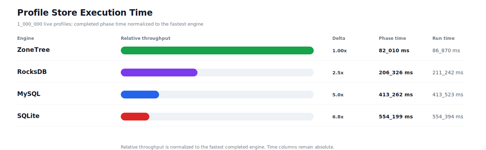
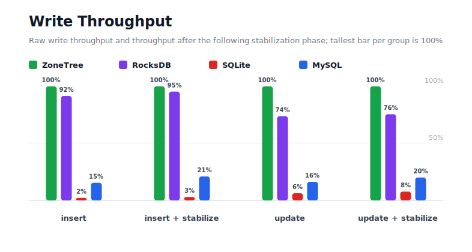
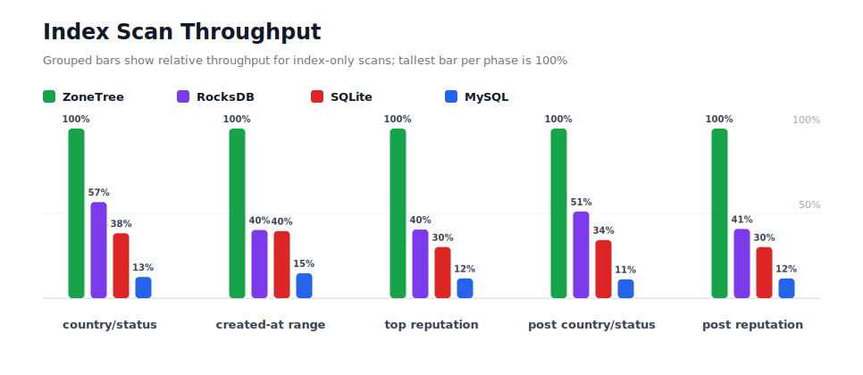
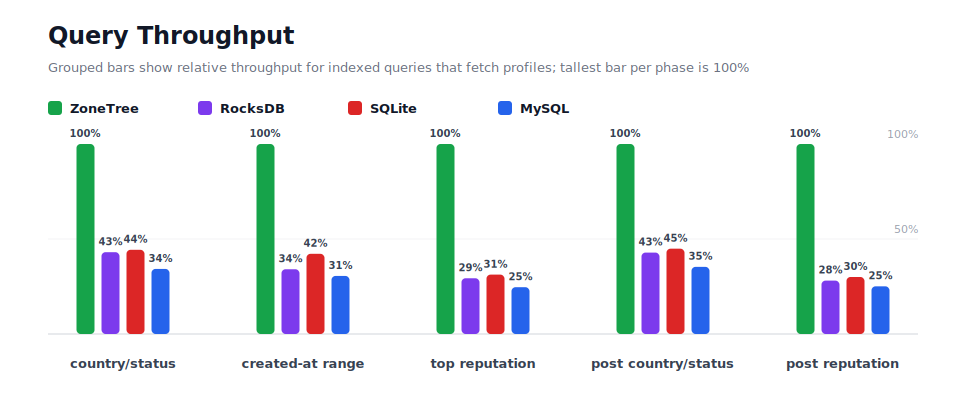
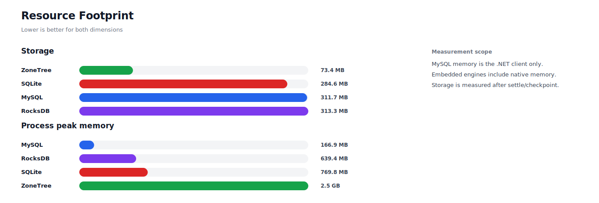

# Benchmark 1M Profiles - Linux

## Charts

### Execution Time

### Write Throughput

### Lookup Throughput

### Index Scan Throughput

### Query Throughput

### Resource Footprint

## Total By Engine

| Engine | Status | Run time | Completed phase time | Pre-read stabilize | Post-update stabilize | Settle | Reopen | Verify | Storage | Process peak memory | Final checksum |
| --- | --- | ---: | ---: | ---: | ---: | ---: | ---: | ---: | ---: | ---: | --- |
| ZoneTree | Completed | 86_870 ms | 82_010 ms | 1_765 ms | 2_368 ms | 95 ms | 156 ms | 8 ms | 73.4 MB | 2.5 GB | `B7578931045C8FC5` |
| RocksDB | Completed | 211_242 ms | 206_326 ms | 1_634 ms | 2_809 ms | 0 ms | 44 ms | 181 ms | 313.3 MB | 639.4 MB | `B7578931045C8FC5` |
| SQLite | Completed | 554_394 ms | 554_199 ms | n/a | n/a | 128 ms | 0 ms | 2 ms | 284.6 MB | 769.8 MB | `B7578931045C8FC5` |
| MySQL | Completed | 413_523 ms | 413_262 ms | n/a | n/a | 1 ms | 3 ms | 43 ms | 311.7 MB | 166.9 MB | `B7578931045C8FC5` |

## Correctness

Checksum validation passed across completed engines: ZoneTree, RocksDB, SQLite, MySQL.

## Interpretation Notes

* This benchmark measures live single-operation profile inserts, updates, reads, and indexed queries.
* ZoneTree and RocksDB secondary indexes are maintained by the benchmark application using separate stores.
* SQLite and MySQL maintain secondary indexes inside the database engine.
* MySQL is measured as a client/server database over TCP.
* Embedded engines run in the benchmark process.
* Completed phase time is the sum of measured workload phases. Run time also includes initialization, stabilization, settle/checkpoint, reopen, verification, and reporting overhead.
* The write throughput chart includes raw write phases and derived write-readiness bars that add the following stabilization phase.
* Storage is measured after each engine settles or checkpoints its data.
* Process peak memory is measured for the benchmark process. For MySQL, this excludes MySQL server/container memory.

## Write Readiness

| Engine | Insert | Pre-read stabilize | Insert + stabilize | Insert ready throughput | Update | Post-update stabilize | Update + stabilize | Update ready throughput |
| --- | ---: | ---: | ---: | ---: | ---: | ---: | ---: | ---: |
| ZoneTree | 4_905 ms | 1_765 ms | 6_670 ms | 149_925/s | 10_270 ms | 2_368 ms | 12_637 ms | 79_132/s |
| RocksDB | 5_355 ms | 1_634 ms | 6_990 ms | 143_070/s | 13_908 ms | 2_809 ms | 16_717 ms | 59_820/s |
| SQLite | 219_596 ms | n/a | 219_596 ms | 4_554/s | 163_694 ms | n/a | 163_694 ms | 6_109/s |
| MySQL | 31_778 ms | n/a | 31_778 ms | 31_468/s | 62_963 ms | n/a | 62_963 ms | 15_882/s |

## Phase Results

### ZoneTree

| Phase | Operations | Time | Throughput | Checksum |
| --- | ---: | ---: | ---: | --- |
| insert profiles | 1_000_000 | 4_905 ms | 203_874/s | `70EEB1E90366F6E5` |
| read by user id | 1_000_000 | 964 ms | 1_037_418/s | `0FB577C390019AC8` |
| lookup by email | 1_000_000 | 2_179 ms | 458_825/s | `9C199CC596F7AC10` |
| scan country/status index | 250_000 | 1_691 ms | 147_818/s | `B3350AAEFBCE068F` |
| query country/status | 250_000 | 12_735 ms | 19_631/s | `11A194A99CB7D634` |
| scan created-at index | 250_000 | 1_727 ms | 144_780/s | `E3FE4E613ABE23A5` |
| query created-at range | 250_000 | 11_107 ms | 22_507/s | `B8595B9702849552` |
| scan top reputation index | 250_000 | 1_127 ms | 221_877/s | `FD457DADD7424105` |
| query top reputation | 250_000 | 8_509 ms | 29_382/s | `B472892F8C7EF235` |
| update profiles | 1_000_000 | 10_270 ms | 97_375/s | `2440ADD57E65500B` |
| post-update read by user id | 1_000_000 | 899 ms | 1_111_751/s | `7DB9AA24CC9A8B8E` |
| post-update lookup by email | 1_000_000 | 2_123 ms | 470_936/s | `43569B6DA38ACCB5` |
| post-update scan country/status index | 250_000 | 1_497 ms | 167_055/s | `896A595A5F979F99` |
| post-update query country/status | 250_000 | 12_925 ms | 19_342/s | `EF5D80897CBF7824` |
| post-update scan top reputation index | 250_000 | 1_130 ms | 221_172/s | `905E8A81EE9017E5` |
| post-update query top reputation | 250_000 | 8_221 ms | 30_410/s | `1A17E74A9E34D635` |

### RocksDB

| Phase | Operations | Time | Throughput | Checksum |
| --- | ---: | ---: | ---: | --- |
| insert profiles | 1_000_000 | 5_355 ms | 186_730/s | `70EEB1E90366F6E5` |
| read by user id | 1_000_000 | 3_548 ms | 281_840/s | `0FB577C390019AC8` |
| lookup by email | 1_000_000 | 6_739 ms | 148_379/s | `9C199CC596F7AC10` |
| scan country/status index | 250_000 | 2_984 ms | 83_790/s | `B3350AAEFBCE068F` |
| query country/status | 250_000 | 29_568 ms | 8_455/s | `11A194A99CB7D634` |
| scan created-at index | 250_000 | 4_291 ms | 58_259/s | `E3FE4E613ABE23A5` |
| query created-at range | 250_000 | 32_592 ms | 7_670/s | `B8595B9702849552` |
| scan top reputation index | 250_000 | 2_783 ms | 89_830/s | `FD457DADD7424105` |
| query top reputation | 250_000 | 29_008 ms | 8_618/s | `B472892F8C7EF235` |
| update profiles | 1_000_000 | 13_908 ms | 71_903/s | `2440ADD57E65500B` |
| post-update read by user id | 1_000_000 | 3_608 ms | 277_178/s | `7DB9AA24CC9A8B8E` |
| post-update lookup by email | 1_000_000 | 6_819 ms | 146_653/s | `43569B6DA38ACCB5` |
| post-update scan country/status index | 250_000 | 2_928 ms | 85_390/s | `896A595A5F979F99` |
| post-update query country/status | 250_000 | 30_163 ms | 8_288/s | `EF5D80897CBF7824` |
| post-update scan top reputation index | 250_000 | 2_768 ms | 90_324/s | `905E8A81EE9017E5` |
| post-update query top reputation | 250_000 | 29_263 ms | 8_543/s | `1A17E74A9E34D635` |

### SQLite

| Phase | Operations | Time | Throughput | Checksum |
| --- | ---: | ---: | ---: | --- |
| insert profiles | 1_000_000 | 219_596 ms | 4_554/s | `70EEB1E90366F6E5` |
| read by user id | 1_000_000 | 2_446 ms | 408_850/s | `0FB577C390019AC8` |
| lookup by email | 1_000_000 | 3_458 ms | 289_196/s | `9C199CC596F7AC10` |
| scan country/status index | 250_000 | 4_417 ms | 56_598/s | `B3350AAEFBCE068F` |
| query country/status | 250_000 | 28_739 ms | 8_699/s | `11A194A99CB7D634` |
| scan created-at index | 250_000 | 4_363 ms | 57_303/s | `E3FE4E613ABE23A5` |
| query created-at range | 250_000 | 26_320 ms | 9_498/s | `B8595B9702849552` |
| scan top reputation index | 250_000 | 3_735 ms | 66_928/s | `FD457DADD7424105` |
| query top reputation | 250_000 | 27_228 ms | 9_182/s | `B472892F8C7EF235` |
| update profiles | 1_000_000 | 163_694 ms | 6_109/s | `2440ADD57E65500B` |
| post-update read by user id | 1_000_000 | 2_444 ms | 409_096/s | `7DB9AA24CC9A8B8E` |
| post-update lookup by email | 1_000_000 | 3_462 ms | 288_809/s | `43569B6DA38ACCB5` |
| post-update scan country/status index | 250_000 | 4_364 ms | 57_290/s | `896A595A5F979F99` |
| post-update query country/status | 250_000 | 28_786 ms | 8_685/s | `EF5D80897CBF7824` |
| post-update scan top reputation index | 250_000 | 3_751 ms | 66_657/s | `905E8A81EE9017E5` |
| post-update query top reputation | 250_000 | 27_396 ms | 9_126/s | `1A17E74A9E34D635` |

### MySQL

| Phase | Operations | Time | Throughput | Checksum |
| --- | ---: | ---: | ---: | --- |
| insert profiles | 1_000_000 | 31_778 ms | 31_468/s | `70EEB1E90366F6E5` |
| read by user id | 1_000_000 | 19_397 ms | 51_553/s | `0FB577C390019AC8` |
| lookup by email | 1_000_000 | 22_003 ms | 45_448/s | `9C199CC596F7AC10` |
| scan country/status index | 250_000 | 13_506 ms | 18_511/s | `B3350AAEFBCE068F` |
| query country/status | 250_000 | 37_179 ms | 6_724/s | `11A194A99CB7D634` |
| scan created-at index | 250_000 | 11_741 ms | 21_292/s | `E3FE4E613ABE23A5` |
| query created-at range | 250_000 | 36_349 ms | 6_878/s | `B8595B9702849552` |
| scan top reputation index | 250_000 | 9_643 ms | 25_926/s | `FD457DADD7424105` |
| query top reputation | 250_000 | 34_542 ms | 7_238/s | `B472892F8C7EF235` |
| update profiles | 1_000_000 | 62_963 ms | 15_882/s | `2440ADD57E65500B` |
| post-update read by user id | 1_000_000 | 19_517 ms | 51_237/s | `7DB9AA24CC9A8B8E` |
| post-update lookup by email | 1_000_000 | 22_199 ms | 45_047/s | `43569B6DA38ACCB5` |
| post-update scan country/status index | 250_000 | 13_391 ms | 18_670/s | `896A595A5F979F99` |
| post-update query country/status | 250_000 | 36_584 ms | 6_834/s | `EF5D80897CBF7824` |
| post-update scan top reputation index | 250_000 | 9_701 ms | 25_771/s | `905E8A81EE9017E5` |
| post-update query top reputation | 250_000 | 32_771 ms | 7_629/s | `1A17E74A9E34D635` |

## Configuration

* Profiles: 1_000_000
* Profile writes: individual operations
* UserId reads: 1_000_000
* Email lookups: 1_000_000
* Query count: 250_000
* Profile updates: 1_000_000
* Post-update UserId reads: 1_000_000
* Post-update email lookups: 1_000_000
* Post-update query count: 250_000
* Query limit: 100
* Seed: 570123434
* Timeout: 120_000 seconds per engine

## Environment

* OS: Ubuntu 24.04.3 LTS
* Architecture: X64
* .NET: 10.0.9
* CPU: AMD EPYC 4345P 8-Core Processor
* Logical processors: 16
* Total available memory: 60.4 GB
* Initial process working set: 115.4 MB

## Engine Settings

### ZoneTree

* MutableSegmentMaxItemCount: 250000
* SparseArrayStepSize: 16
* KeyCacheSize: 1024
* ValueCacheSize: 1024
* IteratorPrefetchSize: 16
* BlockCacheLifeTime: 1 minutes
* BottomMergePolicy: Full bottom merge when bottom segment count exceeds 1
* ReadStabilization: Settle before read/query phases

### RocksDB

* Databases: profiles,email-index,country-status-index,created-at-index,reputation-index
* Compression: Zstd
* WriteBufferMb: 1024
* MaxWriteBufferNumber: 4
* WriteSync: false
* ReadStabilization: Compact before read/query phases

### SQLite

* JournalMode: WAL
* Synchronous: NORMAL
* CacheMb: 1024
* MmapMb: 1024
* TempStore: MEMORY

### MySQL

* Host: 127.0.0.1
* Port: 3306
* Database: profilebench
* User: root

## Durability Settings

* ZoneTree: AsyncCompressed WAL default; MutableSegmentMaxItemCount=250000; SparseArrayStepSize=16; KeyCacheSize=1024; ValueCacheSize=1024; IteratorPrefetchSize=16; BlockCacheLifeTime=1 minutes; application-managed secondary indexes; background maintainers enabled.
* RocksDB: WAL enabled; five separate RocksDB instances; no WriteBatch across indexes; compression=Zstd; write_buffer_size=1024 MB per database; max_write_buffer_number=4.
* SQLite: WAL journal mode; synchronous=NORMAL; cache=1024 MB; mmap=1024 MB; native SQL indexes; single-row writes use autocommit.
* MySQL: InnoDB; benchmark Docker disables binlog, sets innodb_flush_log_at_trx_commit=2 and sync_binlog=0; native SQL indexes; single-row writes use autocommit.
