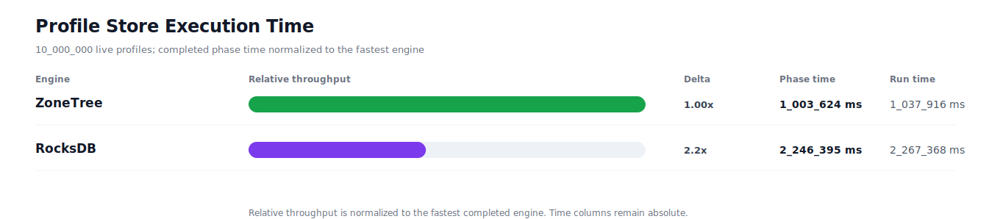
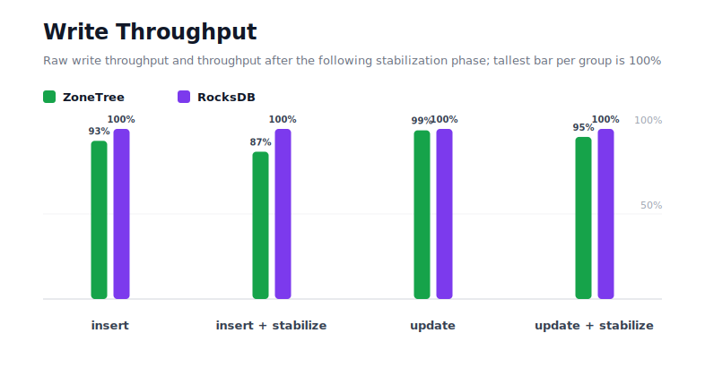
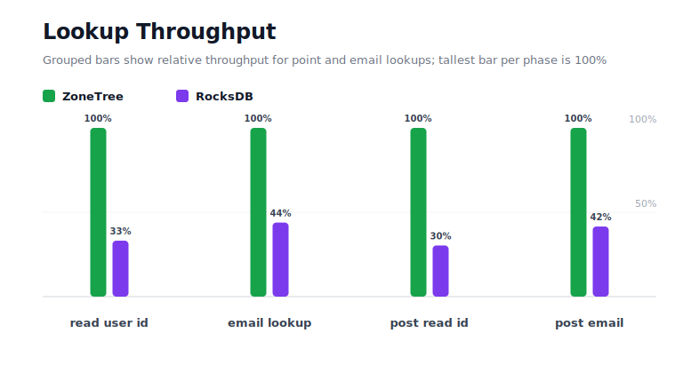
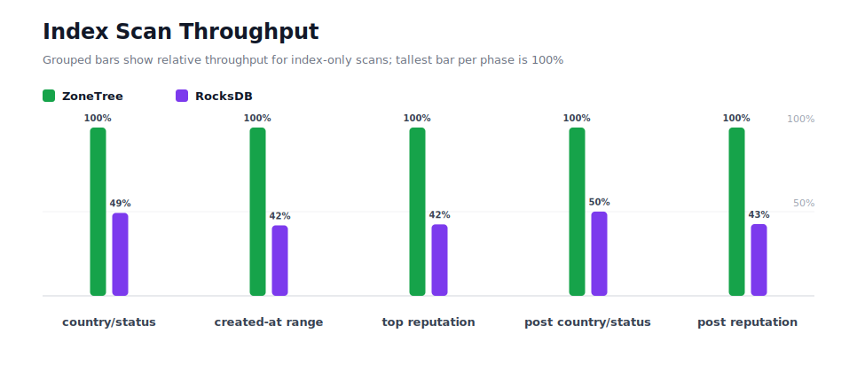
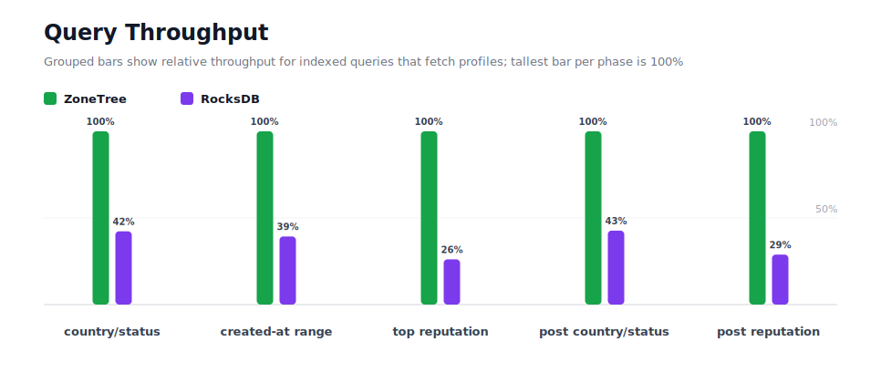
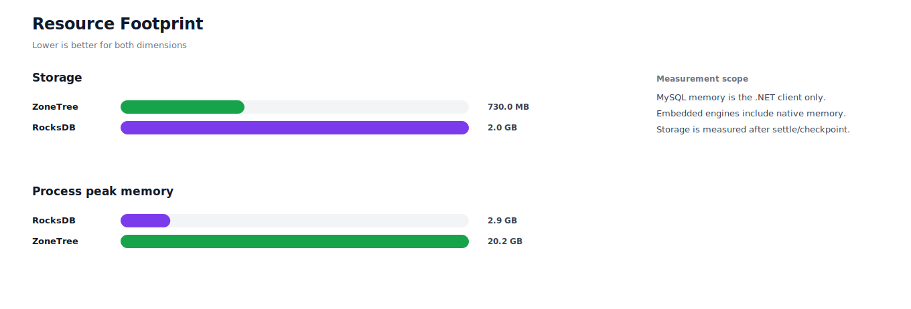

# Benchmark 10M Profiles - Linux

## Charts

### Execution Time

### Write Throughput

### Lookup Throughput

### Index Scan Throughput

### Query Throughput

### Resource Footprint

## Total By Engine

| Engine | Status | Run time | Completed phase time | Pre-read stabilize | Post-update stabilize | Settle | Reopen | Verify | Storage | Process peak memory | Final checksum |
| --- | --- | ---: | ---: | ---: | ---: | ---: | ---: | ---: | ---: | ---: | --- |
| ZoneTree | Completed | 1_037_916 ms | 1_003_624 ms | 11_319 ms | 21_475 ms | 34 ms | 639 ms | 8 ms | 730.0 MB | 20.2 GB | `78E34B89C21C4B51` |
| RocksDB | Completed | 2_267_368 ms | 2_246_395 ms | 5_874 ms | 12_487 ms | 0 ms | 52 ms | 2_175 ms | 2.0 GB | 2.9 GB | `78E34B89C21C4B51` |

## Correctness

Checksum validation passed across completed engines: ZoneTree, RocksDB.

## Interpretation Notes

* This benchmark measures live single-operation profile inserts, updates, reads, and indexed queries.
* ZoneTree and RocksDB secondary indexes are maintained by the benchmark application using separate stores.
* Embedded engines run in the benchmark process.
* Completed phase time is the sum of measured workload phases. Run time also includes initialization, stabilization, settle/checkpoint, reopen, verification, and reporting overhead.
* The write throughput chart includes raw write phases and derived write-readiness bars that add the following stabilization phase.
* Storage is measured after each engine settles or checkpoints its data.
* Process peak memory is measured for the benchmark process.

## Write Readiness

| Engine | Insert | Pre-read stabilize | Insert + stabilize | Insert ready throughput | Update | Post-update stabilize | Update + stabilize | Update ready throughput |
| --- | ---: | ---: | ---: | ---: | ---: | ---: | ---: | ---: |
| ZoneTree | 61_305 ms | 11_319 ms | 72_624 ms | 137_696/s | 205_745 ms | 21_475 ms | 227_220 ms | 44_010/s |
| RocksDB | 57_008 ms | 5_874 ms | 62_881 ms | 159_030/s | 204_026 ms | 12_487 ms | 216_512 ms | 46_187/s |

## Phase Results

### ZoneTree

| Phase | Operations | Time | Throughput | Checksum |
| --- | ---: | ---: | ---: | --- |
| insert profiles | 10_000_000 | 61_305 ms | 163_119/s | `07762AC56C55E0A5` |
| read by user id | 10_000_000 | 14_612 ms | 684_376/s | `F4608F0DA193D0D9` |
| lookup by email | 10_000_000 | 37_524 ms | 266_497/s | `ADE91BF4BD85A55B` |
| scan country/status index | 2_500_000 | 14_682 ms | 170_280/s | `FBF42B2AEF322871` |
| query country/status | 2_500_000 | 128_968 ms | 19_385/s | `590A469174D5C47A` |
| scan created-at index | 2_500_000 | 19_293 ms | 129_581/s | `AA7BB5512A595F45` |
| query created-at range | 2_500_000 | 137_209 ms | 18_220/s | `D5F1890132634766` |
| scan top reputation index | 2_500_000 | 11_524 ms | 216_943/s | `C813C20204E07EE5` |
| query top reputation | 2_500_000 | 79_346 ms | 31_508/s | `7F5BB4ED96D5DEE5` |
| update profiles | 10_000_000 | 205_745 ms | 48_604/s | `6BDE7DC8A52F666F` |
| post-update read by user id | 10_000_000 | 14_518 ms | 688_809/s | `5D5C9BD3AB671AA6` |
| post-update lookup by email | 10_000_000 | 37_267 ms | 268_331/s | `D68F7DE2F29ABC22` |
| post-update scan country/status index | 2_500_000 | 14_702 ms | 170_042/s | `F0F2E613042BB2C5` |
| post-update query country/status | 2_500_000 | 130_125 ms | 19_212/s | `BE9E7BB15662BF49` |
| post-update scan top reputation index | 2_500_000 | 11_503 ms | 217_336/s | `E1890D959DA900A5` |
| post-update query top reputation | 2_500_000 | 85_302 ms | 29_308/s | `B57C8C02E31652A5` |

### RocksDB

| Phase | Operations | Time | Throughput | Checksum |
| --- | ---: | ---: | ---: | --- |
| insert profiles | 10_000_000 | 57_008 ms | 175_415/s | `07762AC56C55E0A5` |
| read by user id | 10_000_000 | 44_080 ms | 226_863/s | `F4608F0DA193D0D9` |
| lookup by email | 10_000_000 | 85_513 ms | 116_942/s | `ADE91BF4BD85A55B` |
| scan country/status index | 2_500_000 | 29_793 ms | 83_913/s | `FBF42B2AEF322871` |
| query country/status | 2_500_000 | 305_075 ms | 8_195/s | `590A469174D5C47A` |
| scan created-at index | 2_500_000 | 46_090 ms | 54_241/s | `AA7BB5512A595F45` |
| query created-at range | 2_500_000 | 348_998 ms | 7_163/s | `D5F1890132634766` |
| scan top reputation index | 2_500_000 | 27_152 ms | 92_074/s | `C813C20204E07EE5` |
| query top reputation | 2_500_000 | 304_148 ms | 8_220/s | `7F5BB4ED96D5DEE5` |
| update profiles | 10_000_000 | 204_026 ms | 49_013/s | `6BDE7DC8A52F666F` |
| post-update read by user id | 10_000_000 | 47_916 ms | 208_701/s | `5D5C9BD3AB671AA6` |
| post-update lookup by email | 10_000_000 | 89_672 ms | 111_518/s | `D68F7DE2F29ABC22` |
| post-update scan country/status index | 2_500_000 | 29_363 ms | 85_140/s | `F0F2E613042BB2C5` |
| post-update query country/status | 2_500_000 | 304_905 ms | 8_199/s | `BE9E7BB15662BF49` |
| post-update scan top reputation index | 2_500_000 | 26_980 ms | 92_661/s | `E1890D959DA900A5` |
| post-update query top reputation | 2_500_000 | 295_678 ms | 8_455/s | `B57C8C02E31652A5` |

## Configuration

* Profiles: 10_000_000
* Profile writes: individual operations
* UserId reads: 10_000_000
* Email lookups: 10_000_000
* Query count: 2_500_000
* Profile updates: 10_000_000
* Post-update UserId reads: 10_000_000
* Post-update email lookups: 10_000_000
* Post-update query count: 2_500_000
* Query limit: 100
* Seed: 570123434
* Timeout: 120_000 seconds per engine

## Environment

* OS: Ubuntu 24.04.3 LTS
* Architecture: X64
* .NET: 10.0.9
* CPU: AMD EPYC 4345P 8-Core Processor
* Logical processors: 16
* Total available memory: 60.4 GB
* Initial process working set: 708.3 MB

## Engine Settings

### ZoneTree

* MutableSegmentMaxItemCount: 250000
* SparseArrayStepSize: 16
* KeyCacheSize: 1024
* ValueCacheSize: 1024
* IteratorPrefetchSize: 16
* BlockCacheLifeTime: 1 minutes
* BottomMergePolicy: Full bottom merge when bottom segment count exceeds 1
* ReadStabilization: Settle before read/query phases

### RocksDB

* Databases: profiles,email-index,country-status-index,created-at-index,reputation-index
* Compression: Zstd
* WriteBufferMb: 1024
* MaxWriteBufferNumber: 4
* WriteSync: false
* ReadStabilization: Compact before read/query phases

## Durability Settings

* ZoneTree: AsyncCompressed WAL default; MutableSegmentMaxItemCount=250000; SparseArrayStepSize=16; KeyCacheSize=1024; ValueCacheSize=1024; IteratorPrefetchSize=16; BlockCacheLifeTime=1 minutes; application-managed secondary indexes; background maintainers enabled.
* RocksDB: WAL enabled; five separate RocksDB instances; no WriteBatch across indexes; compression=Zstd; write_buffer_size=1024 MB per database; max_write_buffer_number=4.
