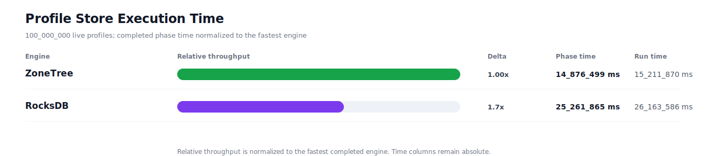
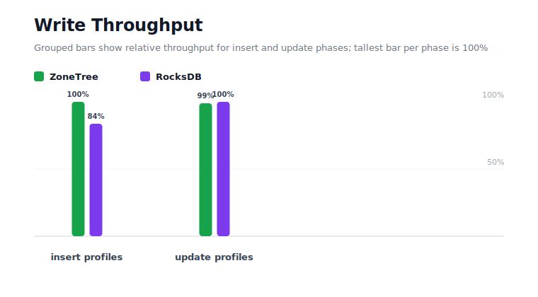
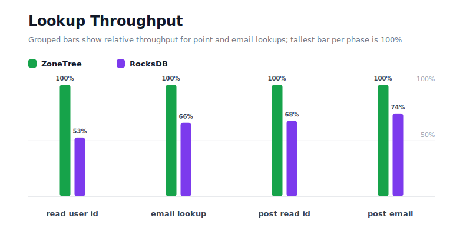
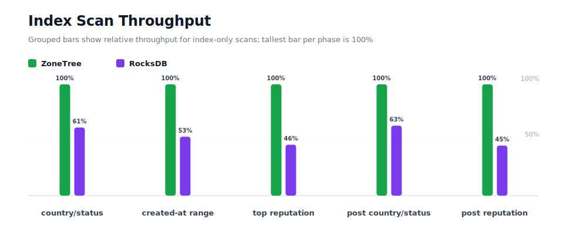
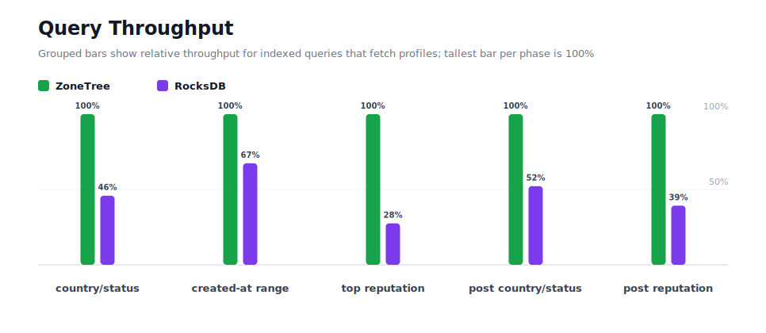
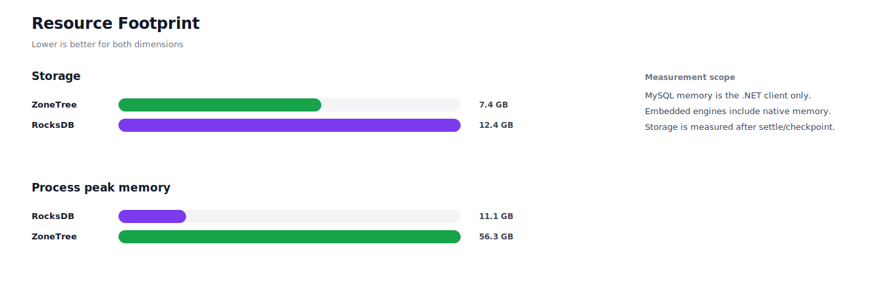

# Benchmark 100M Profiles - Linux

## Charts

### Execution Time

### Write Throughput

### Lookup Throughput

### Index Scan Throughput

### Query Throughput

### Resource Footprint

## Total By Engine

| Engine | Status | Run time | Completed phase time | Pre-read stabilize | Post-update stabilize | Settle | Reopen | Verify | Storage | Process peak memory | Final checksum |
| --- | --- | ---: | ---: | ---: | ---: | ---: | ---: | ---: | ---: | ---: | --- |
| ZoneTree | Completed | 15_211_870 ms | 14_876_499 ms | 72_094 ms | 213_421 ms | 46 ms | 6_166 ms | 42_588 ms | 7.4 GB | 56.3 GB | `4E408868CAFD4857` |
| RocksDB | Completed | 26_163_586 ms | 25_261_865 ms | 467_556 ms | 412_322 ms | 0 ms | 158 ms | 21_305 ms | 12.4 GB | 11.1 GB | `4E408868CAFD4857` |

## Correctness

Checksum validation passed across completed engines: ZoneTree, RocksDB.

## Interpretation Notes

* This benchmark measures live single-operation profile inserts, updates, reads, and indexed queries.
* ZoneTree and RocksDB secondary indexes are maintained by the benchmark application using separate stores.
* Embedded engines run in the benchmark process.
* Completed phase time is the sum of measured workload phases. Run time also includes initialization, stabilization, settle/checkpoint, reopen, verification, and reporting overhead.
* The write throughput chart includes raw write phases and derived write-readiness bars that add the following stabilization phase.
* Storage is measured after each engine settles or checkpoints its data.
* Process peak memory is measured for the benchmark process.

## Write Readiness

| Engine | Insert | Pre-read stabilize | Insert + stabilize | Insert ready throughput | Update | Post-update stabilize | Update + stabilize | Update ready throughput |
| --- | ---: | ---: | ---: | ---: | ---: | ---: | ---: | ---: |
| ZoneTree | 816_344 ms | 72_094 ms | 888_438 ms | 112_557/s | 3_526_941 ms | 213_421 ms | 3_740_362 ms | 26_735/s |
| RocksDB | 975_579 ms | 467_556 ms | 1_443_135 ms | 69_294/s | 3_488_173 ms | 412_322 ms | 3_900_494 ms | 25_638/s |

## Phase Results

### ZoneTree

| Phase | Operations | Time | Throughput | Checksum |
| --- | ---: | ---: | ---: | --- |
| insert profiles | 100_000_000 | 816_344 ms | 122_497/s | `FCB46248E0D81425` |
| read by user id | 100_000_000 | 284_645 ms | 351_315/s | `67AE5B5CBB949FF2` |
| lookup by email | 100_000_000 | 688_776 ms | 145_185/s | `194BD509DF206EEF` |
| scan country/status index | 25_000_000 | 184_348 ms | 135_613/s | `E5AD445D8FD41F6E` |
| query country/status | 25_000_000 | 1_397_633 ms | 17_887/s | `CB50E4518707DF74` |
| scan created-at index | 25_000_000 | 269_914 ms | 92_622/s | `BAA51FE433523875` |
| query created-at range | 25_000_000 | 2_466_040 ms | 10_138/s | `2686C0AE1BD960A6` |
| scan top reputation index | 25_000_000 | 125_808 ms | 198_716/s | `7A98B23B6A0990A5` |
| query top reputation | 25_000_000 | 869_563 ms | 28_750/s | `26ACD96F896D94A5` |
| update profiles | 100_000_000 | 3_526_941 ms | 28_353/s | `F7A87BCF70BA626A` |
| post-update read by user id | 100_000_000 | 361_216 ms | 276_843/s | `554A87520F10E43D` |
| post-update lookup by email | 100_000_000 | 773_479 ms | 129_286/s | `1745396EBE06F8E3` |
| post-update scan country/status index | 25_000_000 | 187_726 ms | 133_173/s | `5740FFFEAB8201F8` |
| post-update query country/status | 25_000_000 | 1_617_944 ms | 15_452/s | `D31B1C12613C4ED1` |
| post-update scan top reputation index | 25_000_000 | 122_923 ms | 203_380/s | `6AF8CAC8CCE4AD25` |
| post-update query top reputation | 25_000_000 | 1_183_199 ms | 21_129/s | `1BE71DE9C349B225` |

### RocksDB

| Phase | Operations | Time | Throughput | Checksum |
| --- | ---: | ---: | ---: | --- |
| insert profiles | 100_000_000 | 975_579 ms | 102_503/s | `FCB46248E0D81425` |
| read by user id | 100_000_000 | 539_978 ms | 185_193/s | `67AE5B5CBB949FF2` |
| lookup by email | 100_000_000 | 1_044_958 ms | 95_698/s | `194BD509DF206EEF` |
| scan country/status index | 25_000_000 | 301_223 ms | 82_995/s | `E5AD445D8FD41F6E` |
| query country/status | 25_000_000 | 3_047_132 ms | 8_204/s | `CB50E4518707DF74` |
| scan created-at index | 25_000_000 | 509_790 ms | 49_040/s | `BAA51FE433523875` |
| query created-at range | 25_000_000 | 3_661_163 ms | 6_828/s | `2686C0AE1BD960A6` |
| scan top reputation index | 25_000_000 | 275_059 ms | 90_890/s | `7A98B23B6A0990A5` |
| query top reputation | 25_000_000 | 3_160_258 ms | 7_911/s | `26ACD96F896D94A5` |
| update profiles | 100_000_000 | 3_488_173 ms | 28_668/s | `F7A87BCF70BA626A` |
| post-update read by user id | 100_000_000 | 533_499 ms | 187_442/s | `554A87520F10E43D` |
| post-update lookup by email | 100_000_000 | 1_041_403 ms | 96_024/s | `1745396EBE06F8E3` |
| post-update scan country/status index | 25_000_000 | 298_707 ms | 83_694/s | `5740FFFEAB8201F8` |
| post-update query country/status | 25_000_000 | 3_097_923 ms | 8_070/s | `D31B1C12613C4ED1` |
| post-update scan top reputation index | 25_000_000 | 273_433 ms | 91_430/s | `6AF8CAC8CCE4AD25` |
| post-update query top reputation | 25_000_000 | 3_013_588 ms | 8_296/s | `1BE71DE9C349B225` |

## Configuration

* Profiles: 100_000_000
* Profile writes: individual operations
* UserId reads: 100_000_000
* Email lookups: 100_000_000
* Query count: 25_000_000
* Profile updates: 100_000_000
* Post-update UserId reads: 100_000_000
* Post-update email lookups: 100_000_000
* Post-update query count: 25_000_000
* Query limit: 100
* Seed: 570123434
* Timeout: 120_000 seconds per engine

## Environment

* OS: Ubuntu 24.04.3 LTS
* Architecture: X64
* .NET: 10.0.9
* CPU: AMD EPYC 4345P 8-Core Processor
* Logical processors: 16
* Total available memory: 60.4 GB
* Initial process working set: 6.6 GB

## Engine Settings

### ZoneTree

* MutableSegmentMaxItemCount: 250000
* SparseArrayStepSize: 16
* KeyCacheSize: 1024
* ValueCacheSize: 1024
* IteratorPrefetchSize: 16
* BlockCacheLifeTime: 1 minutes
* BottomMergePolicy: Full bottom merge when bottom segment count exceeds 1
* ReadStabilization: Settle before read/query phases

### RocksDB

* Databases: profiles,email-index,country-status-index,created-at-index,reputation-index
* Compression: Zstd
* WriteBufferMb: 1024
* MaxWriteBufferNumber: 4
* WriteSync: false
* ReadStabilization: Compact before read/query phases

## Durability Settings

* ZoneTree: AsyncCompressed WAL default; MutableSegmentMaxItemCount=250000; SparseArrayStepSize=16; KeyCacheSize=1024; ValueCacheSize=1024; IteratorPrefetchSize=16; BlockCacheLifeTime=1 minutes; application-managed secondary indexes; background maintainers enabled.
* RocksDB: WAL enabled; five separate RocksDB instances; no WriteBatch across indexes; compression=Zstd; write_buffer_size=1024 MB per database; max_write_buffer_number=4.
