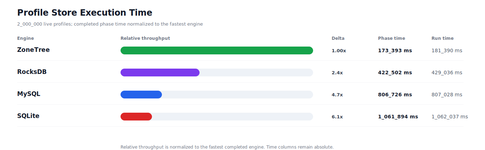
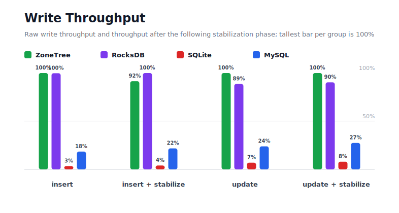
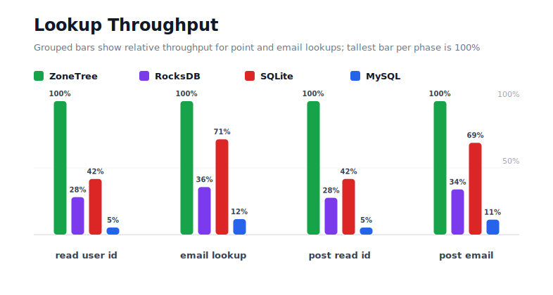
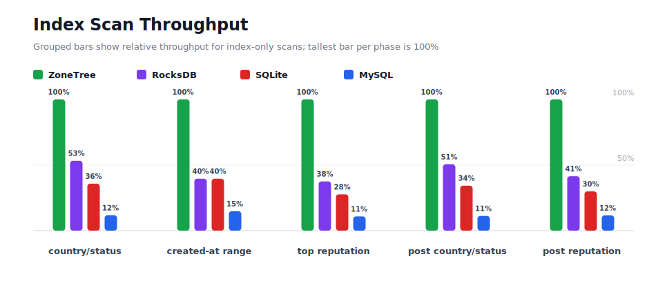
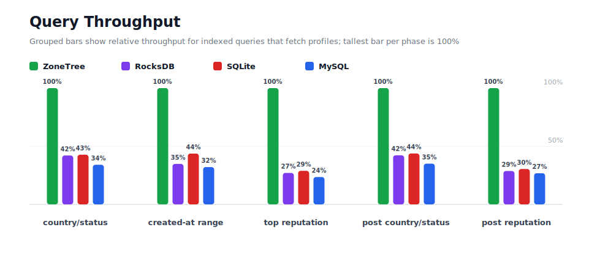
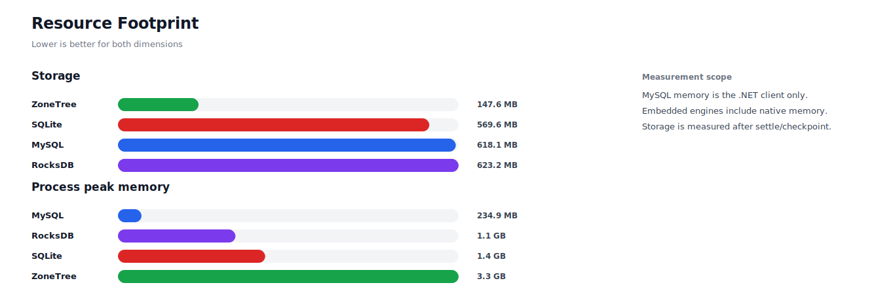

# Benchmark 2M Profiles - Linux

## Charts

### Execution Time

### Write Throughput

### Lookup Throughput

### Index Scan Throughput

### Query Throughput

### Resource Footprint

## Total By Engine

| Engine | Status | Run time | Completed phase time | Pre-read stabilize | Post-update stabilize | Settle | Reopen | Verify | Storage | Process peak memory | Final checksum |
| --- | --- | ---: | ---: | ---: | ---: | ---: | ---: | ---: | ---: | ---: | --- |
| ZoneTree | Completed | 181_390 ms | 173_393 ms | 3_171 ms | 4_104 ms | 17 ms | 150 ms | 9 ms | 147.6 MB | 3.3 GB | `A7EB98FFC773884D` |
| RocksDB | Completed | 429_036 ms | 422_502 ms | 1_947 ms | 3_965 ms | 0 ms | 45 ms | 363 ms | 623.2 MB | 1.1 GB | `A7EB98FFC773884D` |
| SQLite | Completed | 1_062_037 ms | 1_061_894 ms | n/a | n/a | 61 ms | 0 ms | 2 ms | 569.6 MB | 1.4 GB | `A7EB98FFC773884D` |
| MySQL | Completed | 807_028 ms | 806_726 ms | n/a | n/a | 1 ms | 3 ms | 83 ms | 618.1 MB | 234.9 MB | `A7EB98FFC773884D` |

## Correctness

Checksum validation passed across completed engines: ZoneTree, RocksDB, SQLite, MySQL.

## Interpretation Notes

* This benchmark measures live single-operation profile inserts, updates, reads, and indexed queries.
* ZoneTree and RocksDB secondary indexes are maintained by the benchmark application using separate stores.
* SQLite and MySQL maintain secondary indexes inside the database engine.
* MySQL is measured as a client/server database over TCP.
* Embedded engines run in the benchmark process.
* Completed phase time is the sum of measured workload phases. Run time also includes initialization, stabilization, settle/checkpoint, reopen, verification, and reporting overhead.
* The write throughput chart includes raw write phases and derived write-readiness bars that add the following stabilization phase.
* Storage is measured after each engine settles or checkpoints its data.
* Process peak memory is measured for the benchmark process. For MySQL, this excludes MySQL server/container memory.

## Write Readiness

| Engine | Insert | Pre-read stabilize | Insert + stabilize | Insert ready throughput | Update | Post-update stabilize | Update + stabilize | Update ready throughput |
| --- | ---: | ---: | ---: | ---: | ---: | ---: | ---: | ---: |
| ZoneTree | 10_985 ms | 3_171 ms | 14_156 ms | 141_281/s | 27_451 ms | 4_104 ms | 31_555 ms | 63_381/s |
| RocksDB | 11_009 ms | 1_947 ms | 12_957 ms | 154_360/s | 30_965 ms | 3_965 ms | 34_930 ms | 57_257/s |
| SQLite | 320_953 ms | n/a | 320_953 ms | 6_231/s | 393_971 ms | n/a | 393_971 ms | 5_077/s |
| MySQL | 59_427 ms | n/a | 59_427 ms | 33_655/s | 114_801 ms | n/a | 114_801 ms | 17_421/s |

## Phase Results

### ZoneTree

| Phase | Operations | Time | Throughput | Checksum |
| --- | ---: | ---: | ---: | --- |
| insert profiles | 2_000_000 | 10_985 ms | 182_070/s | `4F24F178E189EEA5` |
| read by user id | 2_000_000 | 2_062 ms | 970_010/s | `94FEA7BBDF9EB16F` |
| lookup by email | 2_000_000 | 5_143 ms | 388_867/s | `7911E6F89610C9DB` |
| scan country/status index | 500_000 | 3_161 ms | 158_199/s | `560B74664AA52578` |
| query country/status | 500_000 | 25_152 ms | 19_879/s | `FCF2C9270FA9B0B9` |
| scan created-at index | 500_000 | 3_502 ms | 142_770/s | `C8D3546404935759` |
| query created-at range | 500_000 | 23_198 ms | 21_554/s | `C3FDD5908A1458BA` |
| scan top reputation index | 500_000 | 2_082 ms | 240_191/s | `E7D19A7DA1270425` |
| query top reputation | 500_000 | 16_003 ms | 31_244/s | `5DFA72D2DB36D325` |
| update profiles | 2_000_000 | 27_451 ms | 72_856/s | `1100814B966927C5` |
| post-update read by user id | 2_000_000 | 2_063 ms | 969_623/s | `B004A4D20A4A3848` |
| post-update lookup by email | 2_000_000 | 4_978 ms | 401_774/s | `D353A40B4BEBE4B5` |
| post-update scan country/status index | 500_000 | 3_013 ms | 165_926/s | `A45CF3AB6613BF9E` |
| post-update query country/status | 500_000 | 25_483 ms | 19_621/s | `7899EECCB1694A86` |
| post-update scan top reputation index | 500_000 | 2_254 ms | 221_836/s | `629516A23DD07125` |
| post-update query top reputation | 500_000 | 16_864 ms | 29_648/s | `15A3B24C38088C25` |

### RocksDB

| Phase | Operations | Time | Throughput | Checksum |
| --- | ---: | ---: | ---: | --- |
| insert profiles | 2_000_000 | 11_009 ms | 181_662/s | `4F24F178E189EEA5` |
| read by user id | 2_000_000 | 7_349 ms | 272_133/s | `94FEA7BBDF9EB16F` |
| lookup by email | 2_000_000 | 14_443 ms | 138_471/s | `7911E6F89610C9DB` |
| scan country/status index | 500_000 | 5_933 ms | 84_270/s | `560B74664AA52578` |
| query country/status | 500_000 | 59_838 ms | 8_356/s | `FCF2C9270FA9B0B9` |
| scan created-at index | 500_000 | 8_846 ms | 56_520/s | `C8D3546404935759` |
| query created-at range | 500_000 | 66_680 ms | 7_498/s | `C3FDD5908A1458BA` |
| scan top reputation index | 500_000 | 5_550 ms | 90_094/s | `E7D19A7DA1270425` |
| query top reputation | 500_000 | 59_155 ms | 8_452/s | `5DFA72D2DB36D325` |
| update profiles | 2_000_000 | 30_965 ms | 64_589/s | `1100814B966927C5` |
| post-update read by user id | 2_000_000 | 7_483 ms | 267_256/s | `B004A4D20A4A3848` |
| post-update lookup by email | 2_000_000 | 14_695 ms | 136_105/s | `D353A40B4BEBE4B5` |
| post-update scan country/status index | 500_000 | 5_962 ms | 83_866/s | `A45CF3AB6613BF9E` |
| post-update query country/status | 500_000 | 60_380 ms | 8_281/s | `7899EECCB1694A86` |
| post-update scan top reputation index | 500_000 | 5_433 ms | 92_030/s | `629516A23DD07125` |
| post-update query top reputation | 500_000 | 58_779 ms | 8_506/s | `15A3B24C38088C25` |

### SQLite

| Phase | Operations | Time | Throughput | Checksum |
| --- | ---: | ---: | ---: | --- |
| insert profiles | 2_000_000 | 320_953 ms | 6_231/s | `4F24F178E189EEA5` |
| read by user id | 2_000_000 | 4_945 ms | 404_469/s | `94FEA7BBDF9EB16F` |
| lookup by email | 2_000_000 | 7_204 ms | 277_620/s | `7911E6F89610C9DB` |
| scan country/status index | 500_000 | 8_828 ms | 56_640/s | `560B74664AA52578` |
| query country/status | 500_000 | 58_875 ms | 8_493/s | `FCF2C9270FA9B0B9` |
| scan created-at index | 500_000 | 8_851 ms | 56_489/s | `C8D3546404935759` |
| query created-at range | 500_000 | 53_102 ms | 9_416/s | `C3FDD5908A1458BA` |
| scan top reputation index | 500_000 | 7_529 ms | 66_413/s | `E7D19A7DA1270425` |
| query top reputation | 500_000 | 55_484 ms | 9_012/s | `5DFA72D2DB36D325` |
| update profiles | 2_000_000 | 393_971 ms | 5_077/s | `1100814B966927C5` |
| post-update read by user id | 2_000_000 | 4_945 ms | 404_482/s | `B004A4D20A4A3848` |
| post-update lookup by email | 2_000_000 | 7_240 ms | 276_253/s | `D353A40B4BEBE4B5` |
| post-update scan country/status index | 500_000 | 8_789 ms | 56_892/s | `A45CF3AB6613BF9E` |
| post-update query country/status | 500_000 | 58_213 ms | 8_589/s | `7899EECCB1694A86` |
| post-update scan top reputation index | 500_000 | 7_539 ms | 66_318/s | `629516A23DD07125` |
| post-update query top reputation | 500_000 | 55_427 ms | 9_021/s | `15A3B24C38088C25` |

### MySQL

| Phase | Operations | Time | Throughput | Checksum |
| --- | ---: | ---: | ---: | --- |
| insert profiles | 2_000_000 | 59_427 ms | 33_655/s | `4F24F178E189EEA5` |
| read by user id | 2_000_000 | 38_793 ms | 51_555/s | `94FEA7BBDF9EB16F` |
| lookup by email | 2_000_000 | 44_318 ms | 45_129/s | `7911E6F89610C9DB` |
| scan country/status index | 500_000 | 26_917 ms | 18_575/s | `560B74664AA52578` |
| query country/status | 500_000 | 73_834 ms | 6_772/s | `FCF2C9270FA9B0B9` |
| scan created-at index | 500_000 | 23_679 ms | 21_116/s | `C8D3546404935759` |
| query created-at range | 500_000 | 72_299 ms | 6_916/s | `C3FDD5908A1458BA` |
| scan top reputation index | 500_000 | 19_206 ms | 26_034/s | `E7D19A7DA1270425` |
| query top reputation | 500_000 | 68_032 ms | 7_350/s | `5DFA72D2DB36D325` |
| update profiles | 2_000_000 | 114_801 ms | 17_421/s | `1100814B966927C5` |
| post-update read by user id | 2_000_000 | 39_021 ms | 51_255/s | `B004A4D20A4A3848` |
| post-update lookup by email | 2_000_000 | 44_460 ms | 44_984/s | `D353A40B4BEBE4B5` |
| post-update scan country/status index | 500_000 | 26_839 ms | 18_630/s | `A45CF3AB6613BF9E` |
| post-update query country/status | 500_000 | 72_737 ms | 6_874/s | `7899EECCB1694A86` |
| post-update scan top reputation index | 500_000 | 19_414 ms | 25_754/s | `629516A23DD07125` |
| post-update query top reputation | 500_000 | 62_950 ms | 7_943/s | `15A3B24C38088C25` |

## Configuration

* Profiles: 2_000_000
* Profile writes: individual operations
* UserId reads: 2_000_000
* Email lookups: 2_000_000
* Query count: 500_000
* Profile updates: 2_000_000
* Post-update UserId reads: 2_000_000
* Post-update email lookups: 2_000_000
* Post-update query count: 500_000
* Query limit: 100
* Seed: 570123434
* Timeout: 120_000 seconds per engine

## Environment

* OS: Ubuntu 24.04.3 LTS
* Architecture: X64
* .NET: 10.0.9
* CPU: AMD EPYC 4345P 8-Core Processor
* Logical processors: 16
* Total available memory: 60.4 GB
* Initial process working set: 173.7 MB

## Engine Settings

### ZoneTree

* MutableSegmentMaxItemCount: 250000
* SparseArrayStepSize: 16
* KeyCacheSize: 1024
* ValueCacheSize: 1024
* IteratorPrefetchSize: 16
* BlockCacheLifeTime: 1 minutes
* BottomMergePolicy: Full bottom merge when bottom segment count exceeds 1
* ReadStabilization: Settle before read/query phases

### RocksDB

* Databases: profiles,email-index,country-status-index,created-at-index,reputation-index
* Compression: Zstd
* WriteBufferMb: 1024
* MaxWriteBufferNumber: 4
* WriteSync: false
* ReadStabilization: Compact before read/query phases

### SQLite

* JournalMode: WAL
* Synchronous: NORMAL
* CacheMb: 1024
* MmapMb: 1024
* TempStore: MEMORY

### MySQL

* Host: 127.0.0.1
* Port: 3306
* Database: profilebench
* User: root

## Durability Settings

* ZoneTree: AsyncCompressed WAL default; MutableSegmentMaxItemCount=250000; SparseArrayStepSize=16; KeyCacheSize=1024; ValueCacheSize=1024; IteratorPrefetchSize=16; BlockCacheLifeTime=1 minutes; application-managed secondary indexes; background maintainers enabled.
* RocksDB: WAL enabled; five separate RocksDB instances; no WriteBatch across indexes; compression=Zstd; write_buffer_size=1024 MB per database; max_write_buffer_number=4.
* SQLite: WAL journal mode; synchronous=NORMAL; cache=1024 MB; mmap=1024 MB; native SQL indexes; single-row writes use autocommit.
* MySQL: InnoDB; benchmark Docker disables binlog, sets innodb_flush_log_at_trx_commit=2 and sync_binlog=0; native SQL indexes; single-row writes use autocommit.
