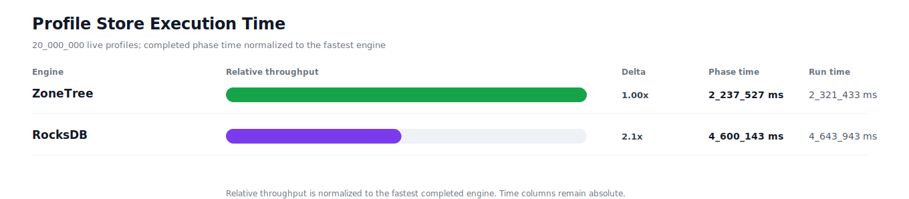
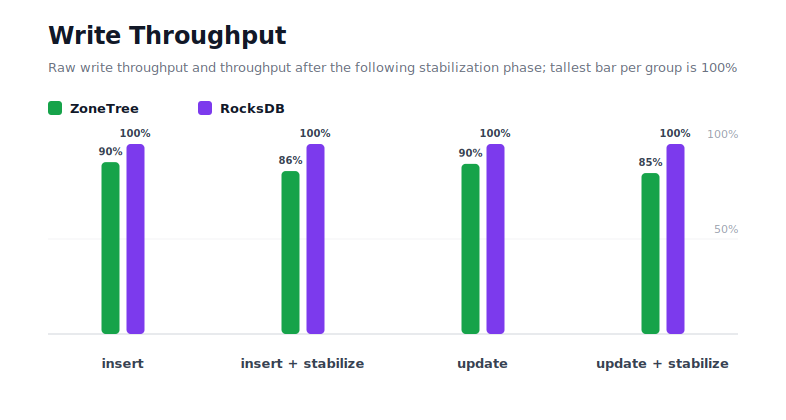
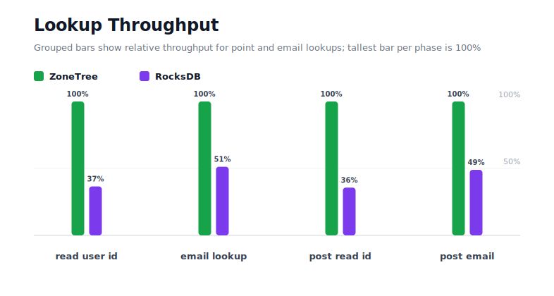
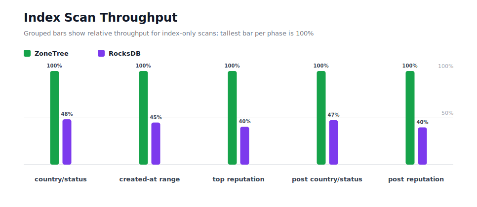
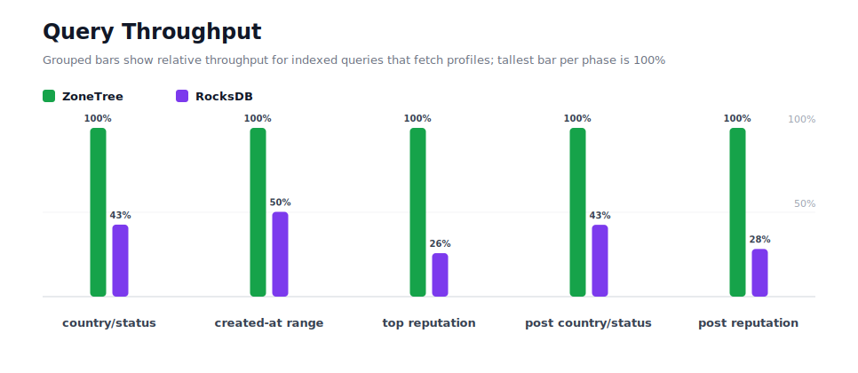
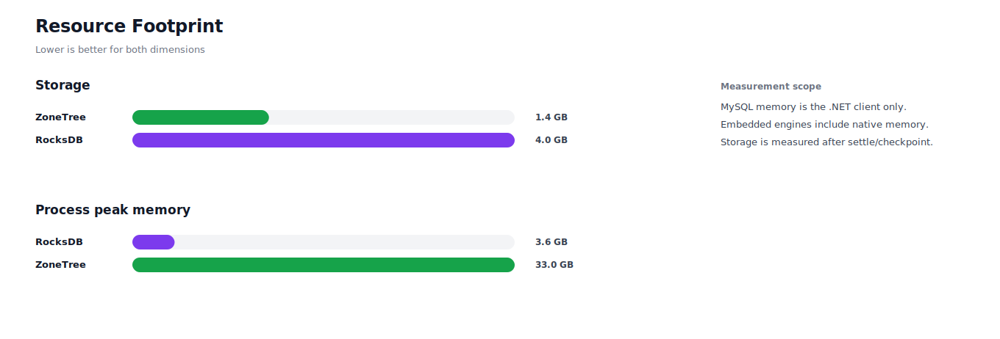

# Benchmark 20M Profiles - Linux

## Charts

### Execution Time

### Write Throughput

### Lookup Throughput

### Index Scan Throughput

### Query Throughput

### Resource Footprint

## Total By Engine

| Engine | Status | Run time | Completed phase time | Pre-read stabilize | Post-update stabilize | Settle | Reopen | Verify | Storage | Process peak memory | Final checksum |
| --- | --- | ---: | ---: | ---: | ---: | ---: | ---: | ---: | ---: | ---: | --- |
| ZoneTree | Completed | 2_321_433 ms | 2_237_527 ms | 27_700 ms | 54_135 ms | 37 ms | 1_203 ms | 8 ms | 1.4 GB | 33.0 GB | `C950499BB359EF1E` |
| RocksDB | Completed | 4_643_943 ms | 4_600_143 ms | 17_764 ms | 21_242 ms | 0 ms | 57 ms | 4_305 ms | 4.0 GB | 3.6 GB | `C950499BB359EF1E` |

## Correctness

Checksum validation passed across completed engines: ZoneTree, RocksDB.

## Interpretation Notes

* This benchmark measures live single-operation profile inserts, updates, reads, and indexed queries.
* ZoneTree and RocksDB secondary indexes are maintained by the benchmark application using separate stores.
* Embedded engines run in the benchmark process.
* Completed phase time is the sum of measured workload phases. Run time also includes initialization, stabilization, settle/checkpoint, reopen, verification, and reporting overhead.
* The write throughput chart includes raw write phases and derived write-readiness bars that add the following stabilization phase.
* Storage is measured after each engine settles or checkpoints its data.
* Process peak memory is measured for the benchmark process.

## Write Readiness

| Engine | Insert | Pre-read stabilize | Insert + stabilize | Insert ready throughput | Update | Post-update stabilize | Update + stabilize | Update ready throughput |
| --- | ---: | ---: | ---: | ---: | ---: | ---: | ---: | ---: |
| ZoneTree | 127_687 ms | 27_700 ms | 155_387 ms | 128_711/s | 507_103 ms | 54_135 ms | 561_237 ms | 35_636/s |
| RocksDB | 115_480 ms | 17_764 ms | 133_245 ms | 150_100/s | 454_087 ms | 21_242 ms | 475_328 ms | 42_076/s |

## Phase Results

### ZoneTree

| Phase | Operations | Time | Throughput | Checksum |
| --- | ---: | ---: | ---: | --- |
| insert profiles | 20_000_000 | 127_687 ms | 156_633/s | `8D2B076CDD049825` |
| read by user id | 20_000_000 | 36_265 ms | 551_502/s | `8151B751760A009D` |
| lookup by email | 20_000_000 | 95_581 ms | 209_248/s | `D6E3DBB6D3168DC8` |
| scan country/status index | 5_000_000 | 28_931 ms | 172_823/s | `21097919F6009119` |
| query country/status | 5_000_000 | 256_312 ms | 19_507/s | `E2672F92B7E6D1B4` |
| scan created-at index | 5_000_000 | 42_220 ms | 118_428/s | `E17333F7B71C76C1` |
| query created-at range | 5_000_000 | 356_634 ms | 14_020/s | `70460EF357988024` |
| scan top reputation index | 5_000_000 | 22_281 ms | 224_405/s | `E00323E0ECFC18A5` |
| query top reputation | 5_000_000 | 158_213 ms | 31_603/s | `683E9E1D4D3D07A5` |
| update profiles | 20_000_000 | 507_103 ms | 39_440/s | `BDD8278E02873C2F` |
| post-update read by user id | 20_000_000 | 35_156 ms | 568_896/s | `35C19AAA9E0C7EA4` |
| post-update lookup by email | 20_000_000 | 90_692 ms | 220_527/s | `F809B066B5BB87F5` |
| post-update scan country/status index | 5_000_000 | 28_254 ms | 176_964/s | `A4787C22008FE48C` |
| post-update query country/status | 5_000_000 | 261_123 ms | 19_148/s | `BE59ABCDAABDF4D9` |
| post-update scan top reputation index | 5_000_000 | 21_693 ms | 230_493/s | `3A9FAA1C2A284F25` |
| post-update query top reputation | 5_000_000 | 169_384 ms | 29_519/s | `BAB1BC6509DAFB65` |

### RocksDB

| Phase | Operations | Time | Throughput | Checksum |
| --- | ---: | ---: | ---: | --- |
| insert profiles | 20_000_000 | 115_480 ms | 173_190/s | `8D2B076CDD049825` |
| read by user id | 20_000_000 | 99_200 ms | 201_613/s | `8151B751760A009D` |
| lookup by email | 20_000_000 | 186_386 ms | 107_304/s | `D6E3DBB6D3168DC8` |
| scan country/status index | 5_000_000 | 59_804 ms | 83_607/s | `21097919F6009119` |
| query country/status | 5_000_000 | 600_767 ms | 8_323/s | `E2672F92B7E6D1B4` |
| scan created-at index | 5_000_000 | 93_966 ms | 53_210/s | `E17333F7B71C76C1` |
| query created-at range | 5_000_000 | 709_950 ms | 7_043/s | `70460EF357988024` |
| scan top reputation index | 5_000_000 | 55_046 ms | 90_833/s | `E00323E0ECFC18A5` |
| query top reputation | 5_000_000 | 613_918 ms | 8_144/s | `683E9E1D4D3D07A5` |
| update profiles | 20_000_000 | 454_087 ms | 44_044/s | `BDD8278E02873C2F` |
| post-update read by user id | 20_000_000 | 98_533 ms | 202_978/s | `35C19AAA9E0C7EA4` |
| post-update lookup by email | 20_000_000 | 185_309 ms | 107_928/s | `F809B066B5BB87F5` |
| post-update scan country/status index | 5_000_000 | 59_561 ms | 83_947/s | `A4787C22008FE48C` |
| post-update query country/status | 5_000_000 | 613_682 ms | 8_148/s | `BE59ABCDAABDF4D9` |
| post-update scan top reputation index | 5_000_000 | 54_569 ms | 91_627/s | `3A9FAA1C2A284F25` |
| post-update query top reputation | 5_000_000 | 599_885 ms | 8_335/s | `BAB1BC6509DAFB65` |

## Configuration

* Profiles: 20_000_000
* Profile writes: individual operations
* UserId reads: 20_000_000
* Email lookups: 20_000_000
* Query count: 5_000_000
* Profile updates: 20_000_000
* Post-update UserId reads: 20_000_000
* Post-update email lookups: 20_000_000
* Post-update query count: 5_000_000
* Query limit: 100
* Seed: 570123434
* Timeout: 120_000 seconds per engine

## Environment

* OS: Ubuntu 24.04.3 LTS
* Architecture: X64
* .NET: 10.0.9
* CPU: AMD EPYC 4345P 8-Core Processor
* Logical processors: 16
* Total available memory: 60.4 GB
* Initial process working set: 1.3 GB

## Engine Settings

### ZoneTree

* MutableSegmentMaxItemCount: 250000
* SparseArrayStepSize: 16
* KeyCacheSize: 1024
* ValueCacheSize: 1024
* IteratorPrefetchSize: 16
* BlockCacheLifeTime: 1 minutes
* BottomMergePolicy: Full bottom merge when bottom segment count exceeds 1
* ReadStabilization: Settle before read/query phases

### RocksDB

* Databases: profiles,email-index,country-status-index,created-at-index,reputation-index
* Compression: Zstd
* WriteBufferMb: 1024
* MaxWriteBufferNumber: 4
* WriteSync: false
* ReadStabilization: Compact before read/query phases

## Durability Settings

* ZoneTree: AsyncCompressed WAL default; MutableSegmentMaxItemCount=250000; SparseArrayStepSize=16; KeyCacheSize=1024; ValueCacheSize=1024; IteratorPrefetchSize=16; BlockCacheLifeTime=1 minutes; application-managed secondary indexes; background maintainers enabled.
* RocksDB: WAL enabled; five separate RocksDB instances; no WriteBatch across indexes; compression=Zstd; write_buffer_size=1024 MB per database; max_write_buffer_number=4.
