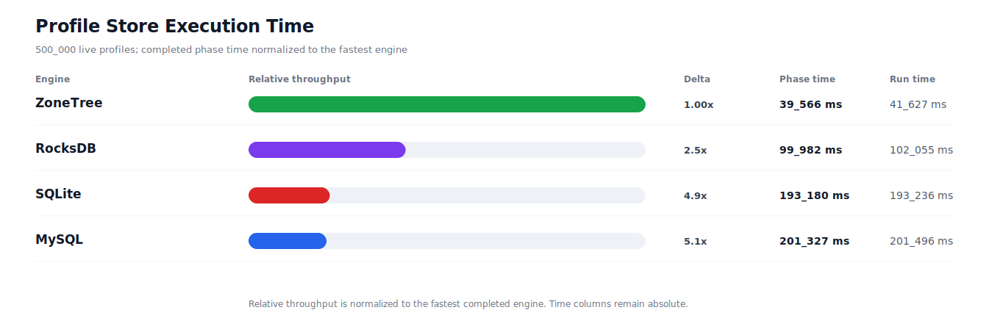
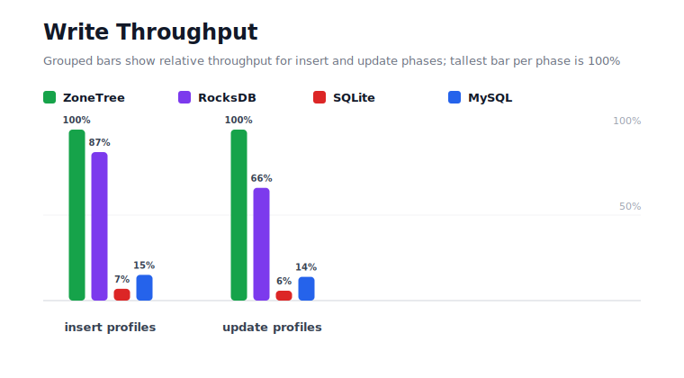
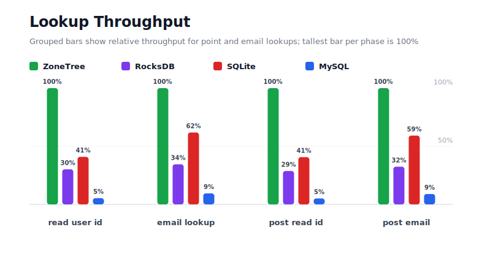
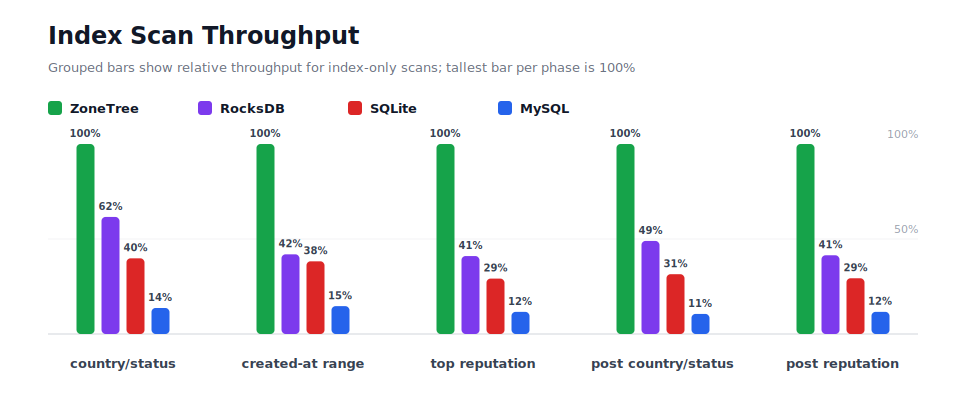
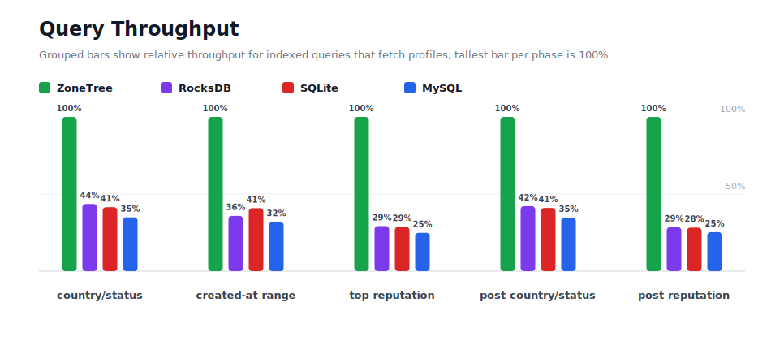
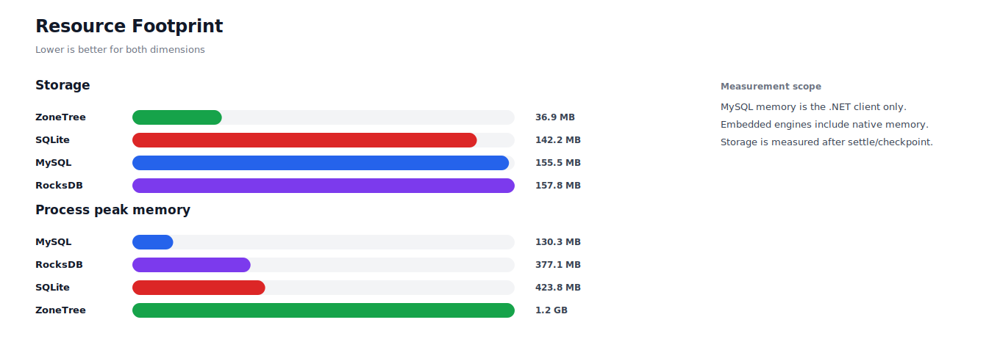

# Benchmark 500K Profiles - Linux

## Charts

### Execution Time

### Write Throughput

### Lookup Throughput

### Index Scan Throughput

### Query Throughput

### Resource Footprint

## Total By Engine

| Engine | Status | Run time | Completed phase time | Pre-read stabilize | Post-update stabilize | Settle | Reopen | Verify | Storage | Process peak memory | Final checksum |
| --- | --- | ---: | ---: | ---: | ---: | ---: | ---: | ---: | ---: | ---: | --- |
| ZoneTree | Completed | 41_627 ms | 39_566 ms | 773 ms | 595 ms | 17 ms | 62 ms | 7 ms | 36.9 MB | 1.2 GB | `DF2D9443B36E4083` |
| RocksDB | Completed | 102_055 ms | 99_982 ms | 517 ms | 1_296 ms | 0 ms | 30 ms | 91 ms | 157.8 MB | 377.1 MB | `DF2D9443B36E4083` |
| SQLite | Completed | 193_236 ms | 193_180 ms | n/a | n/a | 9 ms | 0 ms | 1 ms | 142.2 MB | 423.8 MB | `DF2D9443B36E4083` |
| MySQL | Completed | 201_496 ms | 201_327 ms | n/a | n/a | 1 ms | 4 ms | 22 ms | 155.5 MB | 130.3 MB | `DF2D9443B36E4083` |

## Correctness

Checksum validation passed across completed engines: ZoneTree, RocksDB, SQLite, MySQL.

## Interpretation Notes

* This benchmark measures live single-operation profile inserts, updates, reads, and indexed queries.
* ZoneTree and RocksDB secondary indexes are maintained by the benchmark application using separate stores.
* SQLite and MySQL maintain secondary indexes inside the database engine.
* MySQL is measured as a client/server database over TCP.
* Embedded engines run in the benchmark process.
* Completed phase time is the sum of measured workload phases. Run time also includes initialization, stabilization, settle/checkpoint, reopen, verification, and reporting overhead.
* The write throughput chart includes raw write phases and derived write-readiness bars that add the following stabilization phase.
* Storage is measured after each engine settles or checkpoints its data.
* Process peak memory is measured for the benchmark process. For MySQL, this excludes MySQL server/container memory.

## Write Readiness

| Engine | Insert | Pre-read stabilize | Insert + stabilize | Insert ready throughput | Update | Post-update stabilize | Update + stabilize | Update ready throughput |
| --- | ---: | ---: | ---: | ---: | ---: | ---: | ---: | ---: |
| ZoneTree | 2_217 ms | 773 ms | 2_991 ms | 167_191/s | 4_107 ms | 595 ms | 4_702 ms | 106_333/s |
| RocksDB | 2_554 ms | 517 ms | 3_071 ms | 162_802/s | 6_228 ms | 1_296 ms | 7_523 ms | 66_459/s |
| SQLite | 32_156 ms | n/a | 32_156 ms | 15_549/s | 70_914 ms | n/a | 70_914 ms | 7_051/s |
| MySQL | 14_739 ms | n/a | 14_739 ms | 33_925/s | 29_534 ms | n/a | 29_534 ms | 16_929/s |

## Phase Results

### ZoneTree

| Phase | Operations | Time | Throughput | Checksum |
| --- | ---: | ---: | ---: | --- |
| insert profiles | 500_000 | 2_217 ms | 225_494/s | `B11DAA52EA85C1C5` |
| read by user id | 500_000 | 514 ms | 972_904/s | `C99FB8E32773191A` |
| lookup by email | 500_000 | 1_021 ms | 489_601/s | `706F2D03429A82A7` |
| scan country/status index | 125_000 | 922 ms | 135_625/s | `C8682B5E80F9553A` |
| query country/status | 125_000 | 6_362 ms | 19_647/s | `186611B1858E61AD` |
| scan created-at index | 125_000 | 846 ms | 147_796/s | `66FBD61D49358F91` |
| query created-at range | 125_000 | 5_696 ms | 21_947/s | `94A19BF05C133077` |
| scan top reputation index | 125_000 | 563 ms | 222_058/s | `9C55F81C6EE25A05` |
| query top reputation | 125_000 | 4_193 ms | 29_813/s | `52051AF97B9522C5` |
| update profiles | 500_000 | 4_107 ms | 121_746/s | `6AB28B68BED1A31E` |
| post-update read by user id | 500_000 | 492 ms | 1_017_044/s | `C372C9201718339D` |
| post-update lookup by email | 500_000 | 970 ms | 515_406/s | `EBA2EFF100A143BD` |
| post-update scan country/status index | 125_000 | 713 ms | 175_297/s | `4A2044B0DDBAB55C` |
| post-update query country/status | 125_000 | 6_270 ms | 19_935/s | `186111584003D4F0` |
| post-update scan top reputation index | 125_000 | 566 ms | 220_733/s | `1E83544ACD1CA8B5` |
| post-update query top reputation | 125_000 | 4_114 ms | 30_381/s | `F81DD650BE1CF8C5` |

### RocksDB

| Phase | Operations | Time | Throughput | Checksum |
| --- | ---: | ---: | ---: | --- |
| insert profiles | 500_000 | 2_554 ms | 195_785/s | `B11DAA52EA85C1C5` |
| read by user id | 500_000 | 1_703 ms | 293_654/s | `C99FB8E32773191A` |
| lookup by email | 500_000 | 2_962 ms | 168_779/s | `706F2D03429A82A7` |
| scan country/status index | 125_000 | 1_496 ms | 83_549/s | `C8682B5E80F9553A` |
| query country/status | 125_000 | 14_609 ms | 8_556/s | `186611B1858E61AD` |
| scan created-at index | 125_000 | 2_017 ms | 61_979/s | `66FBD61D49358F91` |
| query created-at range | 125_000 | 15_879 ms | 7_872/s | `94A19BF05C133077` |
| scan top reputation index | 125_000 | 1_372 ms | 91_102/s | `9C55F81C6EE25A05` |
| query top reputation | 125_000 | 14_343 ms | 8_715/s | `52051AF97B9522C5` |
| update profiles | 500_000 | 6_228 ms | 80_284/s | `6AB28B68BED1A31E` |
| post-update read by user id | 500_000 | 1_712 ms | 292_125/s | `C372C9201718339D` |
| post-update lookup by email | 500_000 | 2_991 ms | 167_162/s | `EBA2EFF100A143BD` |
| post-update scan country/status index | 125_000 | 1_456 ms | 85_865/s | `4A2044B0DDBAB55C` |
| post-update query country/status | 125_000 | 14_882 ms | 8_399/s | `186111584003D4F0` |
| post-update scan top reputation index | 125_000 | 1_367 ms | 91_440/s | `1E83544ACD1CA8B5` |
| post-update query top reputation | 125_000 | 14_411 ms | 8_674/s | `F81DD650BE1CF8C5` |

### SQLite

| Phase | Operations | Time | Throughput | Checksum |
| --- | ---: | ---: | ---: | --- |
| insert profiles | 500_000 | 32_156 ms | 15_549/s | `B11DAA52EA85C1C5` |
| read by user id | 500_000 | 1_258 ms | 397_563/s | `C99FB8E32773191A` |
| lookup by email | 500_000 | 1_651 ms | 302_775/s | `706F2D03429A82A7` |
| scan country/status index | 125_000 | 2_314 ms | 54_013/s | `C8682B5E80F9553A` |
| query country/status | 125_000 | 15_336 ms | 8_151/s | `186611B1858E61AD` |
| scan created-at index | 125_000 | 2_210 ms | 56_549/s | `66FBD61D49358F91` |
| query created-at range | 125_000 | 13_944 ms | 8_965/s | `94A19BF05C133077` |
| scan top reputation index | 125_000 | 1_931 ms | 64_735/s | `9C55F81C6EE25A05` |
| query top reputation | 125_000 | 14_548 ms | 8_592/s | `52051AF97B9522C5` |
| update profiles | 500_000 | 70_914 ms | 7_051/s | `6AB28B68BED1A31E` |
| post-update read by user id | 500_000 | 1_210 ms | 413_190/s | `C372C9201718339D` |
| post-update lookup by email | 500_000 | 1_640 ms | 304_820/s | `EBA2EFF100A143BD` |
| post-update scan country/status index | 125_000 | 2_265 ms | 55_177/s | `4A2044B0DDBAB55C` |
| post-update query country/status | 125_000 | 15_296 ms | 8_172/s | `186111584003D4F0` |
| post-update scan top reputation index | 125_000 | 1_930 ms | 64_750/s | `1E83544ACD1CA8B5` |
| post-update query top reputation | 125_000 | 14_574 ms | 8_577/s | `F81DD650BE1CF8C5` |

### MySQL

| Phase | Operations | Time | Throughput | Checksum |
| --- | ---: | ---: | ---: | --- |
| insert profiles | 500_000 | 14_739 ms | 33_925/s | `B11DAA52EA85C1C5` |
| read by user id | 500_000 | 9_602 ms | 52_075/s | `C99FB8E32773191A` |
| lookup by email | 500_000 | 10_814 ms | 46_236/s | `706F2D03429A82A7` |
| scan country/status index | 125_000 | 6_732 ms | 18_568/s | `C8682B5E80F9553A` |
| query country/status | 125_000 | 18_220 ms | 6_861/s | `186611B1858E61AD` |
| scan created-at index | 125_000 | 5_772 ms | 21_655/s | `66FBD61D49358F91` |
| query created-at range | 125_000 | 17_818 ms | 7_015/s | `94A19BF05C133077` |
| scan top reputation index | 125_000 | 4_834 ms | 25_857/s | `9C55F81C6EE25A05` |
| query top reputation | 125_000 | 16_846 ms | 7_420/s | `52051AF97B9522C5` |
| update profiles | 500_000 | 29_534 ms | 16_929/s | `6AB28B68BED1A31E` |
| post-update read by user id | 500_000 | 9_649 ms | 51_817/s | `C372C9201718339D` |
| post-update lookup by email | 500_000 | 10_878 ms | 45_966/s | `EBA2EFF100A143BD` |
| post-update scan country/status index | 125_000 | 6_745 ms | 18_531/s | `4A2044B0DDBAB55C` |
| post-update query country/status | 125_000 | 18_030 ms | 6_933/s | `186111584003D4F0` |
| post-update scan top reputation index | 125_000 | 4_857 ms | 25_736/s | `1E83544ACD1CA8B5` |
| post-update query top reputation | 125_000 | 16_256 ms | 7_689/s | `F81DD650BE1CF8C5` |

## Configuration

* Profiles: 500_000
* Profile writes: individual operations
* UserId reads: 500_000
* Email lookups: 500_000
* Query count: 125_000
* Profile updates: 500_000
* Post-update UserId reads: 500_000
* Post-update email lookups: 500_000
* Post-update query count: 125_000
* Query limit: 100
* Seed: 570123434
* Timeout: 120_000 seconds per engine

## Environment

* OS: Ubuntu 24.04.3 LTS
* Architecture: X64
* .NET: 10.0.9
* CPU: AMD EPYC 4345P 8-Core Processor
* Logical processors: 16
* Total available memory: 60.4 GB
* Initial process working set: 83.5 MB

## Engine Settings

### ZoneTree

* MutableSegmentMaxItemCount: 250000
* SparseArrayStepSize: 16
* KeyCacheSize: 1024
* ValueCacheSize: 1024
* IteratorPrefetchSize: 16
* BlockCacheLifeTime: 1 minutes
* BottomMergePolicy: Full bottom merge when bottom segment count exceeds 1
* ReadStabilization: Settle before read/query phases

### RocksDB

* Databases: profiles,email-index,country-status-index,created-at-index,reputation-index
* Compression: Zstd
* WriteBufferMb: 1024
* MaxWriteBufferNumber: 4
* WriteSync: false
* ReadStabilization: Compact before read/query phases

### SQLite

* JournalMode: WAL
* Synchronous: NORMAL
* CacheMb: 1024
* MmapMb: 1024
* TempStore: MEMORY

### MySQL

* Host: 127.0.0.1
* Port: 3306
* Database: profilebench
* User: root

## Durability Settings

* ZoneTree: AsyncCompressed WAL default; MutableSegmentMaxItemCount=250000; SparseArrayStepSize=16; KeyCacheSize=1024; ValueCacheSize=1024; IteratorPrefetchSize=16; BlockCacheLifeTime=1 minutes; application-managed secondary indexes; background maintainers enabled.
* RocksDB: WAL enabled; five separate RocksDB instances; no WriteBatch across indexes; compression=Zstd; write_buffer_size=1024 MB per database; max_write_buffer_number=4.
* SQLite: WAL journal mode; synchronous=NORMAL; cache=1024 MB; mmap=1024 MB; native SQL indexes; single-row writes use autocommit.
* MySQL: InnoDB; benchmark Docker disables binlog, sets innodb_flush_log_at_trx_commit=2 and sync_binlog=0; native SQL indexes; single-row writes use autocommit.
