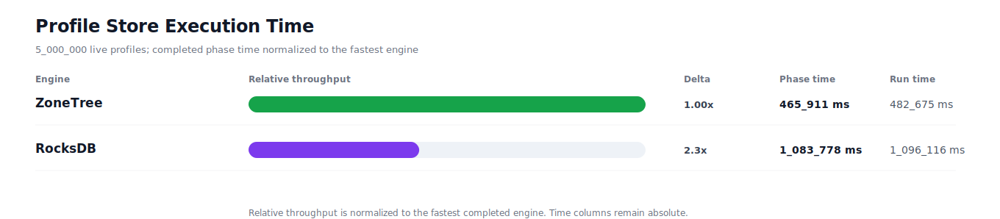
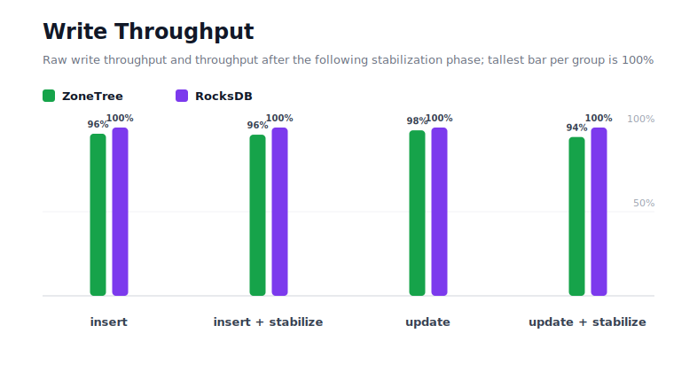
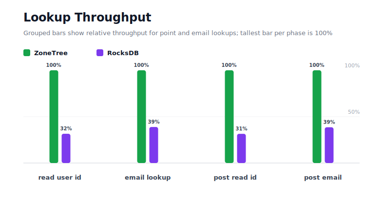
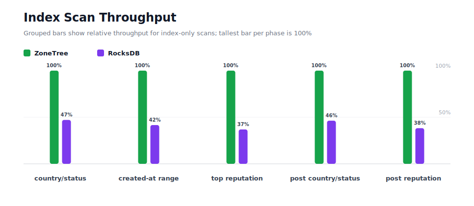
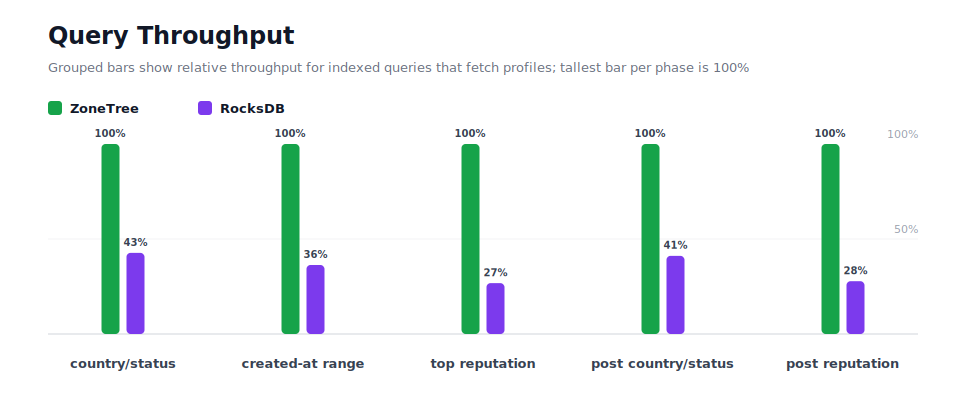
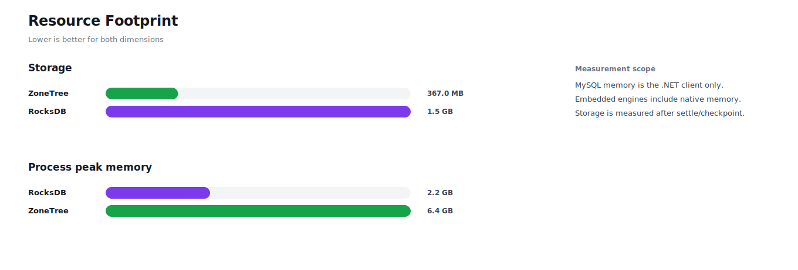

# Benchmark 5M Profiles

## Charts

### Execution Time

### Write Throughput

### Lookup Throughput

### Index Scan Throughput

### Query Throughput

### Resource Footprint

## Total By Engine

| Engine | Status | Run time | Completed phase time | Pre-read stabilize | Post-update stabilize | Settle | Reopen | Verify | Storage | Process peak memory | Final checksum |
| --- | --- | ---: | ---: | ---: | ---: | ---: | ---: | ---: | ---: | ---: | --- |
| ZoneTree | Completed | 482_675 ms | 465_911 ms | 4_743 ms | 11_025 ms | 17 ms | 313 ms | 8 ms | 367.0 MB | 6.4 GB | `46D8A7E801AF2C78` |
| RocksDB | Completed | 1_096_116 ms | 1_083_778 ms | 4_369 ms | 6_788 ms | 0 ms | 48 ms | 905 ms | 1.5 GB | 2.2 GB | `46D8A7E801AF2C78` |

## Correctness

Checksum validation passed across completed engines: ZoneTree, RocksDB.

## Interpretation Notes

* This benchmark measures live single-operation profile inserts, updates, reads, and indexed queries.
* ZoneTree and RocksDB secondary indexes are maintained by the benchmark application using separate stores.
* Embedded engines run in the benchmark process.
* Completed phase time is the sum of measured workload phases. Run time also includes initialization, stabilization, settle/checkpoint, reopen, verification, and reporting overhead.
* Storage is measured after each engine settles or checkpoints its data.
* Process peak memory is measured for the benchmark process.

## Phase Results

### ZoneTree

| Phase | Operations | Time | Throughput | Checksum |
| --- | ---: | ---: | ---: | --- |
| insert profiles | 5_000_000 | 29_378 ms | 170_197/s | `1CE7E98CB02A5BE5` |
| read by user id | 5_000_000 | 6_055 ms | 825_705/s | `AEA5A1780B272814` |
| lookup by email | 5_000_000 | 15_075 ms | 331_678/s | `8C938BAD6D81DE32` |
| scan country/status index | 1_250_000 | 7_195 ms | 173_736/s | `14F9C1B4EC5C77A4` |
| query country/status | 1_250_000 | 63_469 ms | 19_695/s | `BE695CC5C1575C79` |
| scan created-at index | 1_250_000 | 9_426 ms | 132_605/s | `D829C2BE1D8D7CE9` |
| query created-at range | 1_250_000 | 61_383 ms | 20_364/s | `9522258E5C41C535` |
| scan top reputation index | 1_250_000 | 5_283 ms | 236_600/s | `57554D37E1C53C65` |
| query top reputation | 1_250_000 | 40_126 ms | 31_152/s | `C5D2EF10F82C5265` |
| update profiles | 5_000_000 | 91_359 ms | 54_729/s | `AD890A8797F25027` |
| post-update read by user id | 5_000_000 | 6_156 ms | 812_174/s | `537ED4CF9543514D` |
| post-update lookup by email | 5_000_000 | 15_177 ms | 329_450/s | `F71390337A010BCF` |
| post-update scan country/status index | 1_250_000 | 7_031 ms | 177_781/s | `0CC5E86584E76211` |
| post-update query country/status | 1_250_000 | 62_010 ms | 20_158/s | `25EFC06A4834C76C` |
| post-update scan top reputation index | 1_250_000 | 5_438 ms | 229_846/s | `99CD00E2A0593D45` |
| post-update query top reputation | 1_250_000 | 41_349 ms | 30_231/s | `BB9901538093B4C5` |

### RocksDB

| Phase | Operations | Time | Throughput | Checksum |
| --- | ---: | ---: | ---: | --- |
| insert profiles | 5_000_000 | 28_300 ms | 176_681/s | `1CE7E98CB02A5BE5` |
| read by user id | 5_000_000 | 19_200 ms | 260_421/s | `AEA5A1780B272814` |
| lookup by email | 5_000_000 | 38_793 ms | 128_891/s | `8C938BAD6D81DE32` |
| scan country/status index | 1_250_000 | 15_284 ms | 81_784/s | `14F9C1B4EC5C77A4` |
| query country/status | 1_250_000 | 148_662 ms | 8_408/s | `BE695CC5C1575C79` |
| scan created-at index | 1_250_000 | 22_667 ms | 55_147/s | `D829C2BE1D8D7CE9` |
| query created-at range | 1_250_000 | 168_968 ms | 7_398/s | `9522258E5C41C535` |
| scan top reputation index | 1_250_000 | 14_331 ms | 87_226/s | `57554D37E1C53C65` |
| query top reputation | 1_250_000 | 149_858 ms | 8_341/s | `C5D2EF10F82C5265` |
| update profiles | 5_000_000 | 89_846 ms | 55_651/s | `AD890A8797F25027` |
| post-update read by user id | 5_000_000 | 19_552 ms | 255_732/s | `537ED4CF9543514D` |
| post-update lookup by email | 5_000_000 | 39_374 ms | 126_986/s | `F71390337A010BCF` |
| post-update scan country/status index | 1_250_000 | 15_193 ms | 82_276/s | `0CC5E86584E76211` |
| post-update query country/status | 1_250_000 | 150_737 ms | 8_293/s | `25EFC06A4834C76C` |
| post-update scan top reputation index | 1_250_000 | 14_226 ms | 87_868/s | `99CD00E2A0593D45` |
| post-update query top reputation | 1_250_000 | 148_789 ms | 8_401/s | `BB9901538093B4C5` |

## Configuration

* Profiles: 5_000_000
* Profile writes: individual operations
* UserId reads: 5_000_000
* Email lookups: 5_000_000
* Query count: 1_250_000
* Profile updates: 5_000_000
* Post-update UserId reads: 5_000_000
* Post-update email lookups: 5_000_000
* Post-update query count: 1_250_000
* Query limit: 100
* Seed: 570123434
* Timeout: 120_000 seconds per engine

## Environment

* OS: Ubuntu 24.04.3 LTS
* Architecture: X64
* .NET: 10.0.9
* CPU: AMD EPYC 4345P 8-Core Processor
* Logical processors: 16
* Total available memory: 60.4 GB
* Initial process working set: 371.9 MB

## Engine Settings

### ZoneTree

* MutableSegmentMaxItemCount: 250000
* SparseArrayStepSize: 16
* KeyCacheSize: 1024
* ValueCacheSize: 1024
* IteratorPrefetchSize: 16
* BlockCacheLifeTime: 1 minutes
* BottomMergePolicy: Full bottom merge when bottom segment count exceeds 1
* ReadStabilization: Settle before read/query phases

### RocksDB

* Databases: profiles,email-index,country-status-index,created-at-index,reputation-index
* Compression: Zstd
* WriteBufferMb: 1024
* MaxWriteBufferNumber: 4
* WriteSync: false
* ReadStabilization: Compact before read/query phases

## Durability Settings

* ZoneTree: AsyncCompressed WAL default; MutableSegmentMaxItemCount=250000; SparseArrayStepSize=16; KeyCacheSize=1024; ValueCacheSize=1024; IteratorPrefetchSize=16; BlockCacheLifeTime=1 minutes; application-managed secondary indexes; background maintainers enabled.
* RocksDB: WAL enabled; five separate RocksDB instances; no WriteBatch across indexes; compression=Zstd; write_buffer_size=1024 MB per database; max_write_buffer_number=4.
