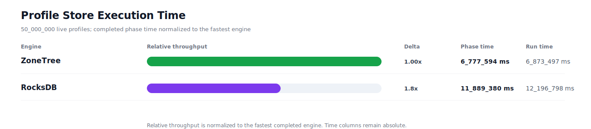
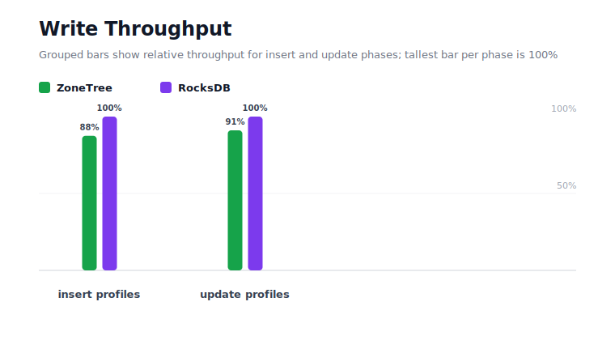
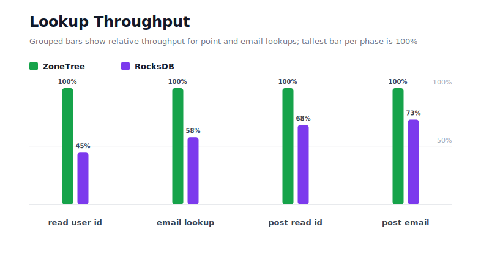
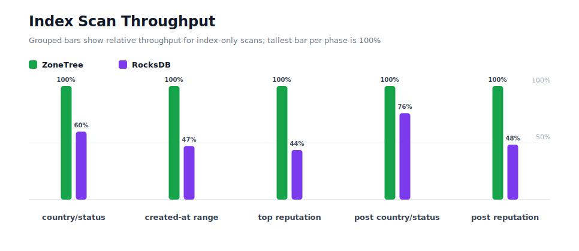
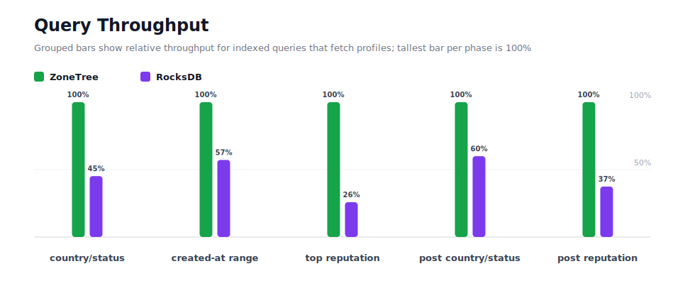
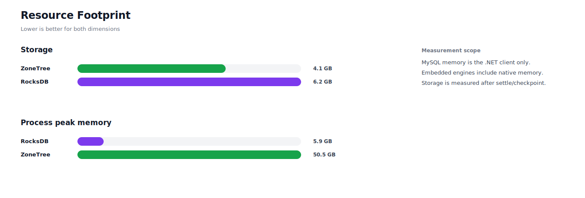

# Benchmark 50M Profiles - Linux

## Charts

### Execution Time

### Write Throughput

### Lookup Throughput

### Index Scan Throughput

### Query Throughput

### Resource Footprint

## Total By Engine

| Engine | Status | Run time | Completed phase time | Pre-read stabilize | Post-update stabilize | Settle | Reopen | Verify | Storage | Process peak memory | Final checksum |
| --- | --- | ---: | ---: | ---: | ---: | ---: | ---: | ---: | ---: | ---: | --- |
| ZoneTree | Completed | 6_873_497 ms | 6_777_594 ms | 44_851 ms | 26_288 ms | 30 ms | 3_420 ms | 20_266 ms | 4.1 GB | 50.5 GB | `5945B5B5E31290C6` |
| RocksDB | Completed | 12_196_798 ms | 11_889_380 ms | 123_175 ms | 173_116 ms | 0 ms | 131 ms | 10_680 ms | 6.2 GB | 5.9 GB | `5945B5B5E31290C6` |

## Correctness

Checksum validation passed across completed engines: ZoneTree, RocksDB.

## Interpretation Notes

* This benchmark measures live single-operation profile inserts, updates, reads, and indexed queries.
* ZoneTree and RocksDB secondary indexes are maintained by the benchmark application using separate stores.
* Embedded engines run in the benchmark process.
* Completed phase time is the sum of measured workload phases. Run time also includes initialization, stabilization, settle/checkpoint, reopen, verification, and reporting overhead.
* The write throughput chart includes raw write phases and derived write-readiness bars that add the following stabilization phase.
* Storage is measured after each engine settles or checkpoints its data.
* Process peak memory is measured for the benchmark process.

## Write Readiness

| Engine | Insert | Pre-read stabilize | Insert + stabilize | Insert ready throughput | Update | Post-update stabilize | Update + stabilize | Update ready throughput |
| --- | ---: | ---: | ---: | ---: | ---: | ---: | ---: | ---: |
| ZoneTree | 336_642 ms | 44_851 ms | 381_493 ms | 131_064/s | 1_447_754 ms | 26_288 ms | 1_474_042 ms | 33_920/s |
| RocksDB | 294_566 ms | 123_175 ms | 417_741 ms | 119_691/s | 1_318_161 ms | 173_116 ms | 1_491_276 ms | 33_528/s |

## Phase Results

### ZoneTree

| Phase | Operations | Time | Throughput | Checksum |
| --- | ---: | ---: | ---: | --- |
| insert profiles | 50_000_000 | 336_642 ms | 148_526/s | `529FAF3D703B3AA5` |
| read by user id | 50_000_000 | 115_970 ms | 431_145/s | `8E8D2ACFC21FB575` |
| lookup by email | 50_000_000 | 290_567 ms | 172_077/s | `56123BF63C522B80` |
| scan country/status index | 12_500_000 | 89_697 ms | 139_358/s | `6854338181DB6593` |
| query country/status | 12_500_000 | 676_616 ms | 18_474/s | `C136508DF3B9DC96` |
| scan created-at index | 12_500_000 | 119_010 ms | 105_033/s | `A9AA867AEE9CC49D` |
| query created-at range | 12_500_000 | 1_027_956 ms | 12_160/s | `BD9340B1F0462E6A` |
| scan top reputation index | 12_500_000 | 60_778 ms | 205_668/s | `C3B61168322AA3E5` |
| query top reputation | 12_500_000 | 411_698 ms | 30_362/s | `317FA8460D5113A5` |
| update profiles | 50_000_000 | 1_447_754 ms | 34_536/s | `21F3E3EC5EA52C34` |
| post-update read by user id | 50_000_000 | 174_033 ms | 287_302/s | `8D911BB787B5674E` |
| post-update lookup by email | 50_000_000 | 362_978 ms | 137_750/s | `A03BB072BD1AE5DF` |
| post-update scan country/status index | 12_500_000 | 115_758 ms | 107_984/s | `0099B00EF08970CC` |
| post-update query country/status | 12_500_000 | 916_573 ms | 13_638/s | `933C3CB3A2A90233` |
| post-update scan top reputation index | 12_500_000 | 67_191 ms | 186_037/s | `41210EF7E182E625` |
| post-update query top reputation | 12_500_000 | 564_373 ms | 22_148/s | `56E59EBFD7C3C965` |

### RocksDB

| Phase | Operations | Time | Throughput | Checksum |
| --- | ---: | ---: | ---: | --- |
| insert profiles | 50_000_000 | 294_566 ms | 169_741/s | `529FAF3D703B3AA5` |
| read by user id | 50_000_000 | 260_052 ms | 192_269/s | `8E8D2ACFC21FB575` |
| lookup by email | 50_000_000 | 502_756 ms | 99_452/s | `56123BF63C522B80` |
| scan country/status index | 12_500_000 | 149_884 ms | 83_398/s | `6854338181DB6593` |
| query country/status | 12_500_000 | 1_498_767 ms | 8_340/s | `C136508DF3B9DC96` |
| scan created-at index | 12_500_000 | 252_046 ms | 49_594/s | `A9AA867AEE9CC49D` |
| query created-at range | 12_500_000 | 1_798_060 ms | 6_952/s | `BD9340B1F0462E6A` |
| scan top reputation index | 12_500_000 | 138_995 ms | 89_931/s | `C3B61168322AA3E5` |
| query top reputation | 12_500_000 | 1_593_720 ms | 7_843/s | `317FA8460D5113A5` |
| update profiles | 50_000_000 | 1_318_161 ms | 37_932/s | `21F3E3EC5EA52C34` |
| post-update read by user id | 50_000_000 | 254_921 ms | 196_139/s | `8D911BB787B5674E` |
| post-update lookup by email | 50_000_000 | 497_823 ms | 100_437/s | `A03BB072BD1AE5DF` |
| post-update scan country/status index | 12_500_000 | 152_060 ms | 82_204/s | `0099B00EF08970CC` |
| post-update query country/status | 12_500_000 | 1_529_698 ms | 8_172/s | `933C3CB3A2A90233` |
| post-update scan top reputation index | 12_500_000 | 138_829 ms | 90_039/s | `41210EF7E182E625` |
| post-update query top reputation | 12_500_000 | 1_509_042 ms | 8_283/s | `56E59EBFD7C3C965` |

## Configuration

* Profiles: 50_000_000
* Profile writes: individual operations
* UserId reads: 50_000_000
* Email lookups: 50_000_000
* Query count: 12_500_000
* Profile updates: 50_000_000
* Post-update UserId reads: 50_000_000
* Post-update email lookups: 50_000_000
* Post-update query count: 12_500_000
* Query limit: 100
* Seed: 570123434
* Timeout: 120_000 seconds per engine

## Environment

* OS: Ubuntu 24.04.3 LTS
* Architecture: X64
* .NET: 10.0.9
* CPU: AMD EPYC 4345P 8-Core Processor
* Logical processors: 16
* Total available memory: 60.4 GB
* Initial process working set: 3.3 GB

## Engine Settings

### ZoneTree

* MutableSegmentMaxItemCount: 250000
* SparseArrayStepSize: 16
* KeyCacheSize: 1024
* ValueCacheSize: 1024
* IteratorPrefetchSize: 16
* BlockCacheLifeTime: 1 minutes
* BottomMergePolicy: Full bottom merge when bottom segment count exceeds 1
* ReadStabilization: Settle before read/query phases

### RocksDB

* Databases: profiles,email-index,country-status-index,created-at-index,reputation-index
* Compression: Zstd
* WriteBufferMb: 1024
* MaxWriteBufferNumber: 4
* WriteSync: false
* ReadStabilization: Compact before read/query phases

## Durability Settings

* ZoneTree: AsyncCompressed WAL default; MutableSegmentMaxItemCount=250000; SparseArrayStepSize=16; KeyCacheSize=1024; ValueCacheSize=1024; IteratorPrefetchSize=16; BlockCacheLifeTime=1 minutes; application-managed secondary indexes; background maintainers enabled.
* RocksDB: WAL enabled; five separate RocksDB instances; no WriteBatch across indexes; compression=Zstd; write_buffer_size=1024 MB per database; max_write_buffer_number=4.
