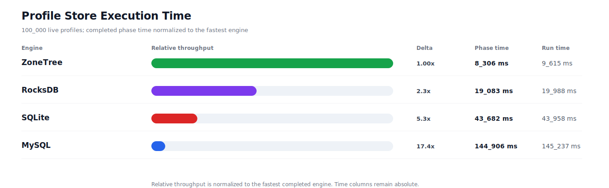
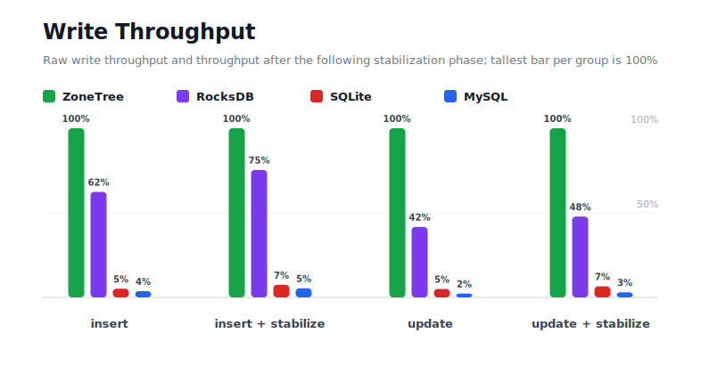
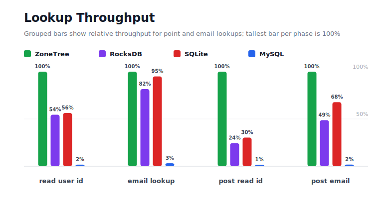
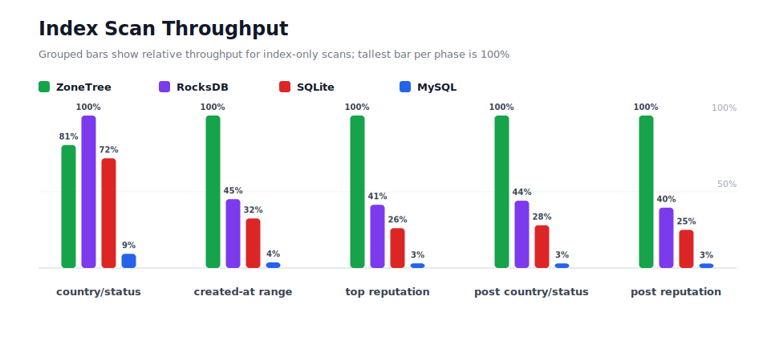
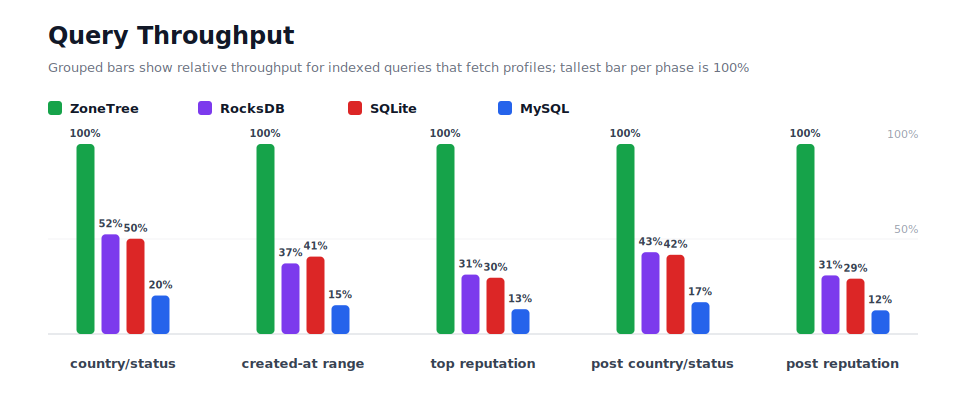
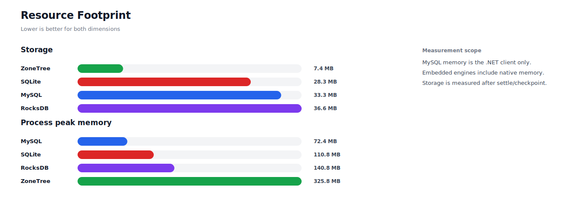

# Benchmark 100K Profiles

## Charts

### Execution Time

### Write Throughput

### Lookup Throughput

### Index Scan Throughput

### Query Throughput

### Resource Footprint

## Total By Engine

| Engine | Status | Run time | Completed phase time | Pre-read stabilize | Post-update stabilize | Settle | Reopen | Verify | Storage | Process peak memory | Final checksum |
| --- | --- | ---: | ---: | ---: | ---: | ---: | ---: | ---: | ---: | ---: | --- |
| ZoneTree | Completed | 9_615 ms | 8_306 ms | 284 ms | 225 ms | 15 ms | 50 ms | 7 ms | 7.4 MB | 325.8 MB | `1C7232F217FD84C5` |
| RocksDB | Completed | 19_988 ms | 19_083 ms | 201 ms | 254 ms | 0 ms | 45 ms | 18 ms | 36.6 MB | 140.8 MB | `1C7232F217FD84C5` |
| SQLite | Completed | 43_958 ms | 43_682 ms | n/a | n/a | 15 ms | 1 ms | 1 ms | 28.3 MB | 110.8 MB | `1C7232F217FD84C5` |
| MySQL | Completed | 145_237 ms | 144_906 ms | n/a | n/a | 1 ms | 5 ms | 6 ms | 33.3 MB | 72.4 MB | `1C7232F217FD84C5` |

## Correctness

Checksum validation passed across completed engines: ZoneTree, RocksDB, SQLite, MySQL.

## Interpretation Notes

* This benchmark measures live single-operation profile inserts, updates, reads, and indexed queries.
* ZoneTree and RocksDB secondary indexes are maintained by the benchmark application using separate stores.
* SQLite and MySQL maintain secondary indexes inside the database engine.
* MySQL is measured as a client/server database over TCP.
* Embedded engines run in the benchmark process.
* Completed phase time is the sum of measured workload phases. Run time also includes initialization, stabilization, settle/checkpoint, reopen, verification, and reporting overhead.
* Storage is measured after each engine settles or checkpoints its data.
* Process peak memory is measured for the benchmark process. For MySQL, this excludes MySQL server/container memory.

## Phase Results

### ZoneTree

| Phase | Operations | Time | Throughput | Checksum |
| --- | ---: | ---: | ---: | --- |
| insert profiles | 100_000 | 638 ms | 156_776/s | `37C6E9056D5AC045` |
| read by user id | 100_000 | 173 ms | 577_385/s | `3C75C3A02940F75F` |
| lookup by email | 100_000 | 342 ms | 292_771/s | `8EACBB38279A3446` |
| scan country/status index | 25_000 | 417 ms | 59_899/s | `550DE764BD164CCC` |
| query country/status | 25_000 | 1_433 ms | 17_441/s | `8A71BD4E88816061` |
| scan created-at index | 25_000 | 147 ms | 169_656/s | `1BED8F615F0CDA9D` |
| query created-at range | 25_000 | 1_050 ms | 23_801/s | `DD87F18F9230D64C` |
| scan top reputation index | 25_000 | 108 ms | 232_144/s | `5045A3EB2C7535C5` |
| query top reputation | 25_000 | 793 ms | 31_532/s | `3C71031ED8049A9D` |
| update profiles | 100_000 | 703 ms | 142_162/s | `FA3F051A503B5D43` |
| post-update read by user id | 100_000 | 75 ms | 1_342_212/s | `2AD19D2C2B2F8F3D` |
| post-update lookup by email | 100_000 | 208 ms | 480_286/s | `6B8148031A502EBA` |
| post-update scan country/status index | 25_000 | 127 ms | 196_118/s | `D57DAE36F8AAE9C3` |
| post-update query country/status | 25_000 | 1_204 ms | 20_760/s | `1583D5A1C67A8B7C` |
| post-update scan top reputation index | 25_000 | 102 ms | 245_935/s | `4EAFA92C8AA7C495` |
| post-update query top reputation | 25_000 | 784 ms | 31_874/s | `8A0AD194E6834A4D` |

### RocksDB

| Phase | Operations | Time | Throughput | Checksum |
| --- | ---: | ---: | ---: | --- |
| insert profiles | 100_000 | 1_023 ms | 97_781/s | `37C6E9056D5AC045` |
| read by user id | 100_000 | 318 ms | 314_467/s | `3C75C3A02940F75F` |
| lookup by email | 100_000 | 419 ms | 238_869/s | `8EACBB38279A3446` |
| scan country/status index | 25_000 | 337 ms | 74_250/s | `550DE764BD164CCC` |
| query country/status | 25_000 | 2_732 ms | 9_151/s | `8A71BD4E88816061` |
| scan created-at index | 25_000 | 326 ms | 76_637/s | `1BED8F615F0CDA9D` |
| query created-at range | 25_000 | 2_826 ms | 8_848/s | `DD87F18F9230D64C` |
| scan top reputation index | 25_000 | 260 ms | 96_240/s | `5045A3EB2C7535C5` |
| query top reputation | 25_000 | 2_536 ms | 9_858/s | `3C71031ED8049A9D` |
| update profiles | 100_000 | 1_688 ms | 59_237/s | `FA3F051A503B5D43` |
| post-update read by user id | 100_000 | 305 ms | 327_873/s | `2AD19D2C2B2F8F3D` |
| post-update lookup by email | 100_000 | 427 ms | 233_983/s | `6B8148031A502EBA` |
| post-update scan country/status index | 25_000 | 289 ms | 86_600/s | `D57DAE36F8AAE9C3` |
| post-update query country/status | 25_000 | 2_797 ms | 8_937/s | `1583D5A1C67A8B7C` |
| post-update scan top reputation index | 25_000 | 257 ms | 97_347/s | `4EAFA92C8AA7C495` |
| post-update query top reputation | 25_000 | 2_544 ms | 9_826/s | `8A0AD194E6834A4D` |

### SQLite

| Phase | Operations | Time | Throughput | Checksum |
| --- | ---: | ---: | ---: | --- |
| insert profiles | 100_000 | 12_408 ms | 8_059/s | `37C6E9056D5AC045` |
| read by user id | 100_000 | 307 ms | 325_235/s | `3C75C3A02940F75F` |
| lookup by email | 100_000 | 360 ms | 278_031/s | `8EACBB38279A3446` |
| scan country/status index | 25_000 | 468 ms | 53_435/s | `550DE764BD164CCC` |
| query country/status | 25_000 | 2_858 ms | 8_746/s | `8A71BD4E88816061` |
| scan created-at index | 25_000 | 454 ms | 55_102/s | `1BED8F615F0CDA9D` |
| query created-at range | 25_000 | 2_579 ms | 9_694/s | `DD87F18F9230D64C` |
| scan top reputation index | 25_000 | 412 ms | 60_683/s | `5045A3EB2C7535C5` |
| query top reputation | 25_000 | 2_677 ms | 9_339/s | `3C71031ED8049A9D` |
| update profiles | 100_000 | 14_162 ms | 7_061/s | `FA3F051A503B5D43` |
| post-update read by user id | 100_000 | 246 ms | 406_614/s | `2AD19D2C2B2F8F3D` |
| post-update lookup by email | 100_000 | 308 ms | 325_187/s | `6B8148031A502EBA` |
| post-update scan country/status index | 25_000 | 455 ms | 54_987/s | `D57DAE36F8AAE9C3` |
| post-update query country/status | 25_000 | 2_889 ms | 8_655/s | `1583D5A1C67A8B7C` |
| post-update scan top reputation index | 25_000 | 406 ms | 61_524/s | `4EAFA92C8AA7C495` |
| post-update query top reputation | 25_000 | 2_693 ms | 9_282/s | `8A0AD194E6834A4D` |

### MySQL

| Phase | Operations | Time | Throughput | Checksum |
| --- | ---: | ---: | ---: | --- |
| insert profiles | 100_000 | 17_103 ms | 5_847/s | `37C6E9056D5AC045` |
| read by user id | 100_000 | 10_444 ms | 9_575/s | `3C75C3A02940F75F` |
| lookup by email | 100_000 | 10_923 ms | 9_155/s | `8EACBB38279A3446` |
| scan country/status index | 25_000 | 3_624 ms | 6_899/s | `550DE764BD164CCC` |
| query country/status | 25_000 | 7_080 ms | 3_531/s | `8A71BD4E88816061` |
| scan created-at index | 25_000 | 4_011 ms | 6_232/s | `1BED8F615F0CDA9D` |
| query created-at range | 25_000 | 6_938 ms | 3_603/s | `DD87F18F9230D64C` |
| scan top reputation index | 25_000 | 3_526 ms | 7_091/s | `5045A3EB2C7535C5` |
| query top reputation | 25_000 | 6_074 ms | 4_116/s | `3C71031ED8049A9D` |
| update profiles | 100_000 | 30_617 ms | 3_266/s | `FA3F051A503B5D43` |
| post-update read by user id | 100_000 | 11_248 ms | 8_890/s | `2AD19D2C2B2F8F3D` |
| post-update lookup by email | 100_000 | 12_133 ms | 8_242/s | `6B8148031A502EBA` |
| post-update scan country/status index | 25_000 | 4_237 ms | 5_901/s | `D57DAE36F8AAE9C3` |
| post-update query country/status | 25_000 | 7_191 ms | 3_477/s | `1583D5A1C67A8B7C` |
| post-update scan top reputation index | 25_000 | 3_463 ms | 7_220/s | `4EAFA92C8AA7C495` |
| post-update query top reputation | 25_000 | 6_297 ms | 3_970/s | `8A0AD194E6834A4D` |

## Configuration

* Profiles: 100_000
* Profile writes: individual operations
* UserId reads: 100_000
* Email lookups: 100_000
* Query count: 25_000
* Profile updates: 100_000
* Post-update UserId reads: 100_000
* Post-update email lookups: 100_000
* Post-update query count: 25_000
* Query limit: 100
* Seed: 570123434
* Timeout: 1_200 seconds per engine

## Environment

* OS: Microsoft Windows 10.0.26200
* Architecture: X64
* .NET: 10.0.6
* CPU: Intel(R) Core(TM) Ultra 7 265KF
* Logical processors: 20
* Total available memory: 63.6 GB
* Initial process working set: 47.0 MB

## Engine Settings

### ZoneTree

* MutableSegmentMaxItemCount: 250000
* SparseArrayStepSize: 16
* KeyCacheSize: 1024
* ValueCacheSize: 1024
* IteratorPrefetchSize: 16
* BlockCacheLifeTime: 1 minutes
* ReadStabilization: Settle before read/query phases

### RocksDB

* Databases: profiles,email-index,country-status-index,created-at-index,reputation-index
* Compression: Zstd
* WriteBufferMb: 1024
* MaxWriteBufferNumber: 4
* WriteSync: false
* ReadStabilization: Compact before read/query phases

### SQLite

* JournalMode: WAL
* Synchronous: NORMAL
* CacheMb: 1024
* MmapMb: 1024
* TempStore: MEMORY

### MySQL

* Host: 192.168.178.25
* Port: 3306
* Database: profilebench
* User: root

## Durability Settings

* ZoneTree: AsyncCompressed WAL default; MutableSegmentMaxItemCount=250000; SparseArrayStepSize=16; KeyCacheSize=1024; ValueCacheSize=1024; IteratorPrefetchSize=16; BlockCacheLifeTime=1 minutes; application-managed secondary indexes; background maintainers enabled.
* RocksDB: WAL enabled; five separate RocksDB instances; no WriteBatch across indexes; compression=Zstd; write_buffer_size=1024 MB per database; max_write_buffer_number=4.
* SQLite: WAL journal mode; synchronous=NORMAL; cache=1024 MB; mmap=1024 MB; native SQL indexes; single-row writes use autocommit.
* MySQL: InnoDB; benchmark Docker disables binlog, sets innodb_flush_log_at_trx_commit=2 and sync_binlog=0; native SQL indexes; single-row writes use autocommit.
