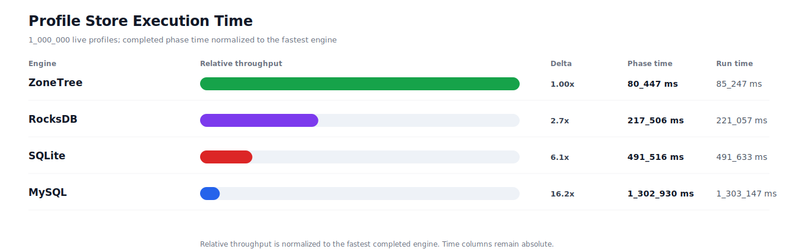
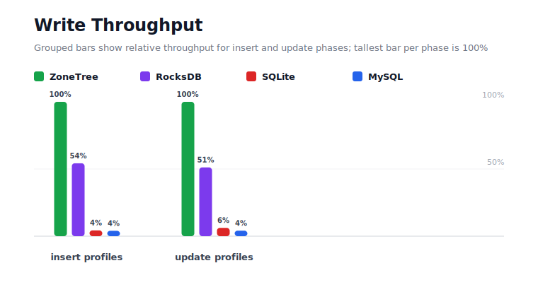
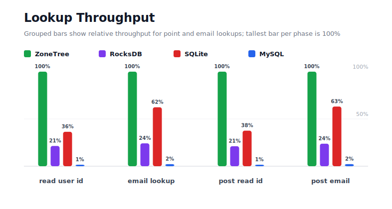
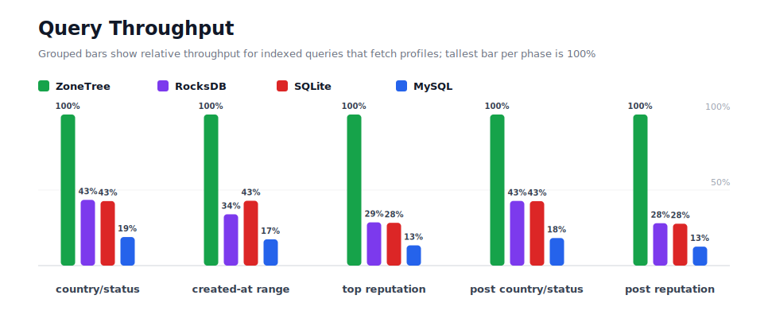
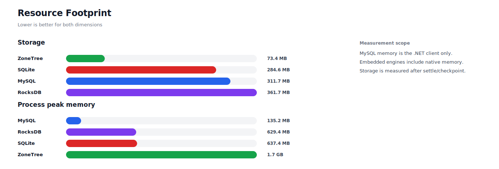

# Benchmark 1M Profiles - Windows

## Charts

### Execution Time

### Write Throughput

### Lookup Throughput

### Index Scan Throughput

### Query Throughput

### Resource Footprint

## Total By Engine

| Engine | Status | Run time | Completed phase time | Pre-read stabilize | Post-update stabilize | Settle | Reopen | Verify | Storage | Process peak memory | Final checksum |
| --- | --- | ---: | ---: | ---: | ---: | ---: | ---: | ---: | ---: | ---: | --- |
| ZoneTree | Completed | 85_247 ms | 80_447 ms | 2_164 ms | 1_681 ms | 15 ms | 112 ms | 7 ms | 73.4 MB | 1.7 GB | `B7578931045C8FC5` |
| RocksDB | Completed | 221_057 ms | 217_506 ms | 1_165 ms | 1_970 ms | 0 ms | 44 ms | 151 ms | 361.7 MB | 629.4 MB | `B7578931045C8FC5` |
| SQLite | Completed | 491_633 ms | 491_516 ms | n/a | n/a | 53 ms | 0 ms | 5 ms | 284.6 MB | 637.4 MB | `B7578931045C8FC5` |
| MySQL | Completed | 1_303_147 ms | 1_302_930 ms | n/a | n/a | 1 ms | 5 ms | 39 ms | 311.7 MB | 135.2 MB | `B7578931045C8FC5` |

## Correctness

Checksum validation passed across completed engines: ZoneTree, RocksDB, SQLite, MySQL.

## Interpretation Notes

* This benchmark measures live single-operation profile inserts, updates, reads, and indexed queries.
* ZoneTree and RocksDB secondary indexes are maintained by the benchmark application using separate stores.
* SQLite and MySQL maintain secondary indexes inside the database engine.
* MySQL is measured as a client/server database over TCP.
* Embedded engines run in the benchmark process.
* Completed phase time is the sum of measured workload phases. Run time also includes initialization, stabilization, settle/checkpoint, reopen, verification, and reporting overhead.
* The write throughput chart includes raw write phases and derived write-readiness bars that add the following stabilization phase.
* Storage is measured after each engine settles or checkpoints its data.
* Process peak memory is measured for the benchmark process. For MySQL, this excludes MySQL server/container memory.

## Write Readiness

| Engine | Insert | Pre-read stabilize | Insert + stabilize | Insert ready throughput | Update | Post-update stabilize | Update + stabilize | Update ready throughput |
| --- | ---: | ---: | ---: | ---: | ---: | ---: | ---: | ---: |
| ZoneTree | 5_629 ms | 2_164 ms | 7_792 ms | 128_333/s | 11_906 ms | 1_681 ms | 13_586 ms | 73_605/s |
| RocksDB | 10_374 ms | 1_165 ms | 11_538 ms | 86_667/s | 23_257 ms | 1_970 ms | 25_228 ms | 39_639/s |
| SQLite | 130_182 ms | n/a | 130_182 ms | 7_682/s | 192_475 ms | n/a | 192_475 ms | 5_195/s |
| MySQL | 141_359 ms | n/a | 141_359 ms | 7_074/s | 289_650 ms | n/a | 289_650 ms | 3_452/s |

## Phase Results

### ZoneTree

| Phase | Operations | Time | Throughput | Checksum |
| --- | ---: | ---: | ---: | --- |
| insert profiles | 1_000_000 | 5_629 ms | 177_664/s | `70EEB1E90366F6E5` |
| read by user id | 1_000_000 | 988 ms | 1_012_059/s | `0FB577C390019AC8` |
| lookup by email | 1_000_000 | 2_227 ms | 448_947/s | `9C199CC596F7AC10` |
| scan country/status index | 250_000 | 1_620 ms | 154_332/s | `B3350AAEFBCE068F` |
| query country/status | 250_000 | 12_075 ms | 20_704/s | `11A194A99CB7D634` |
| scan created-at index | 250_000 | 1_634 ms | 153_026/s | `E3FE4E613ABE23A5` |
| query created-at range | 250_000 | 10_872 ms | 22_995/s | `B8595B9702849552` |
| scan top reputation index | 250_000 | 978 ms | 255_725/s | `FD457DADD7424105` |
| query top reputation | 250_000 | 7_438 ms | 33_610/s | `B472892F8C7EF235` |
| update profiles | 1_000_000 | 11_906 ms | 83_995/s | `2440ADD57E65500B` |
| post-update read by user id | 1_000_000 | 987 ms | 1_013_229/s | `7DB9AA24CC9A8B8E` |
| post-update lookup by email | 1_000_000 | 2_209 ms | 452_782/s | `43569B6DA38ACCB5` |
| post-update scan country/status index | 250_000 | 1_345 ms | 185_899/s | `896A595A5F979F99` |
| post-update query country/status | 250_000 | 12_230 ms | 20_441/s | `EF5D80897CBF7824` |
| post-update scan top reputation index | 250_000 | 976 ms | 256_097/s | `905E8A81EE9017E5` |
| post-update query top reputation | 250_000 | 7_335 ms | 34_085/s | `1A17E74A9E34D635` |

### RocksDB

| Phase | Operations | Time | Throughput | Checksum |
| --- | ---: | ---: | ---: | --- |
| insert profiles | 1_000_000 | 10_374 ms | 96_398/s | `70EEB1E90366F6E5` |
| read by user id | 1_000_000 | 4_617 ms | 216_610/s | `0FB577C390019AC8` |
| lookup by email | 1_000_000 | 9_217 ms | 108_501/s | `9C199CC596F7AC10` |
| scan country/status index | 250_000 | 2_913 ms | 85_815/s | `B3350AAEFBCE068F` |
| query country/status | 250_000 | 27_761 ms | 9_006/s | `11A194A99CB7D634` |
| scan created-at index | 250_000 | 4_840 ms | 51_653/s | `E3FE4E613ABE23A5` |
| query created-at range | 250_000 | 32_011 ms | 7_810/s | `B8595B9702849552` |
| scan top reputation index | 250_000 | 2_549 ms | 98_095/s | `FD457DADD7424105` |
| query top reputation | 250_000 | 25_966 ms | 9_628/s | `B472892F8C7EF235` |
| update profiles | 1_000_000 | 23_257 ms | 42_997/s | `2440ADD57E65500B` |
| post-update read by user id | 1_000_000 | 4_673 ms | 213_988/s | `7DB9AA24CC9A8B8E` |
| post-update lookup by email | 1_000_000 | 9_278 ms | 107_779/s | `43569B6DA38ACCB5` |
| post-update scan country/status index | 250_000 | 2_798 ms | 89_346/s | `896A595A5F979F99` |
| post-update query country/status | 250_000 | 28_567 ms | 8_751/s | `EF5D80897CBF7824` |
| post-update scan top reputation index | 250_000 | 2_547 ms | 98_152/s | `905E8A81EE9017E5` |
| post-update query top reputation | 250_000 | 26_139 ms | 9_564/s | `1A17E74A9E34D635` |

### SQLite

| Phase | Operations | Time | Throughput | Checksum |
| --- | ---: | ---: | ---: | --- |
| insert profiles | 1_000_000 | 130_182 ms | 7_682/s | `70EEB1E90366F6E5` |
| read by user id | 1_000_000 | 2_714 ms | 368_397/s | `0FB577C390019AC8` |
| lookup by email | 1_000_000 | 3_574 ms | 279_794/s | `9C199CC596F7AC10` |
| scan country/status index | 250_000 | 4_514 ms | 55_386/s | `B3350AAEFBCE068F` |
| query country/status | 250_000 | 28_271 ms | 8_843/s | `11A194A99CB7D634` |
| scan created-at index | 250_000 | 4_489 ms | 55_693/s | `E3FE4E613ABE23A5` |
| query created-at range | 250_000 | 25_344 ms | 9_864/s | `B8595B9702849552` |
| scan top reputation index | 250_000 | 3_956 ms | 63_203/s | `FD457DADD7424105` |
| query top reputation | 250_000 | 26_268 ms | 9_517/s | `B472892F8C7EF235` |
| update profiles | 1_000_000 | 192_475 ms | 5_195/s | `2440ADD57E65500B` |
| post-update read by user id | 1_000_000 | 2_627 ms | 380_698/s | `7DB9AA24CC9A8B8E` |
| post-update lookup by email | 1_000_000 | 3_501 ms | 285_638/s | `43569B6DA38ACCB5` |
| post-update scan country/status index | 250_000 | 4_493 ms | 55_643/s | `896A595A5F979F99` |
| post-update query country/status | 250_000 | 28_676 ms | 8_718/s | `EF5D80897CBF7824` |
| post-update scan top reputation index | 250_000 | 3_977 ms | 62_863/s | `905E8A81EE9017E5` |
| post-update query top reputation | 250_000 | 26_456 ms | 9_450/s | `1A17E74A9E34D635` |

### MySQL

| Phase | Operations | Time | Throughput | Checksum |
| --- | ---: | ---: | ---: | --- |
| insert profiles | 1_000_000 | 141_359 ms | 7_074/s | `70EEB1E90366F6E5` |
| read by user id | 1_000_000 | 100_070 ms | 9_993/s | `0FB577C390019AC8` |
| lookup by email | 1_000_000 | 102_114 ms | 9_793/s | `9C199CC596F7AC10` |
| scan country/status index | 250_000 | 36_185 ms | 6_909/s | `B3350AAEFBCE068F` |
| query country/status | 250_000 | 63_856 ms | 3_915/s | `11A194A99CB7D634` |
| scan created-at index | 250_000 | 35_702 ms | 7_002/s | `E3FE4E613ABE23A5` |
| query created-at range | 250_000 | 62_493 ms | 4_000/s | `B8595B9702849552` |
| scan top reputation index | 250_000 | 29_321 ms | 8_526/s | `FD457DADD7424105` |
| query top reputation | 250_000 | 55_532 ms | 4_502/s | `B472892F8C7EF235` |
| update profiles | 1_000_000 | 289_650 ms | 3_452/s | `2440ADD57E65500B` |
| post-update read by user id | 1_000_000 | 92_333 ms | 10_830/s | `7DB9AA24CC9A8B8E` |
| post-update lookup by email | 1_000_000 | 100_100 ms | 9_990/s | `43569B6DA38ACCB5` |
| post-update scan country/status index | 250_000 | 36_727 ms | 6_807/s | `896A595A5F979F99` |
| post-update query country/status | 250_000 | 67_034 ms | 3_729/s | `EF5D80897CBF7824` |
| post-update scan top reputation index | 250_000 | 32_098 ms | 7_789/s | `905E8A81EE9017E5` |
| post-update query top reputation | 250_000 | 58_356 ms | 4_284/s | `1A17E74A9E34D635` |

## Configuration

* Profiles: 1_000_000
* Profile writes: individual operations
* UserId reads: 1_000_000
* Email lookups: 1_000_000
* Query count: 250_000
* Profile updates: 1_000_000
* Post-update UserId reads: 1_000_000
* Post-update email lookups: 1_000_000
* Post-update query count: 250_000
* Query limit: 100
* Seed: 570123434
* Timeout: 120_000 seconds per engine

## Environment

* OS: Microsoft Windows 10.0.26200
* Architecture: X64
* .NET: 10.0.6
* CPU: Intel(R) Core(TM) Ultra 7 265KF
* Logical processors: 20
* Total available memory: 63.6 GB
* Initial process working set: 104.5 MB

## Engine Settings

### ZoneTree

* MutableSegmentMaxItemCount: 250000
* SparseArrayStepSize: 16
* KeyCacheSize: 1024
* ValueCacheSize: 1024
* IteratorPrefetchSize: 16
* BlockCacheLifeTime: 1 minutes
* ReadStabilization: Settle before read/query phases

### RocksDB

* Databases: profiles,email-index,country-status-index,created-at-index,reputation-index
* Compression: Zstd
* WriteBufferMb: 1024
* MaxWriteBufferNumber: 4
* WriteSync: false
* ReadStabilization: Compact before read/query phases

### SQLite

* JournalMode: WAL
* Synchronous: NORMAL
* CacheMb: 1024
* MmapMb: 1024
* TempStore: MEMORY

### MySQL

* Host: 192.168.178.25
* Port: 3306
* Database: profilebench
* User: root

## Durability Settings

* ZoneTree: AsyncCompressed WAL default; MutableSegmentMaxItemCount=250000; SparseArrayStepSize=16; KeyCacheSize=1024; ValueCacheSize=1024; IteratorPrefetchSize=16; BlockCacheLifeTime=1 minutes; application-managed secondary indexes; background maintainers enabled.
* RocksDB: WAL enabled; five separate RocksDB instances; no WriteBatch across indexes; compression=Zstd; write_buffer_size=1024 MB per database; max_write_buffer_number=4.
* SQLite: WAL journal mode; synchronous=NORMAL; cache=1024 MB; mmap=1024 MB; native SQL indexes; single-row writes use autocommit.
* MySQL: InnoDB; benchmark Docker disables binlog, sets innodb_flush_log_at_trx_commit=2 and sync_binlog=0; native SQL indexes; single-row writes use autocommit.
