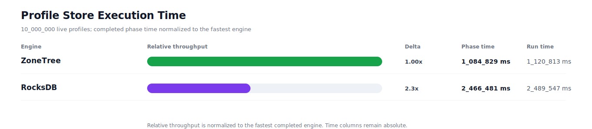
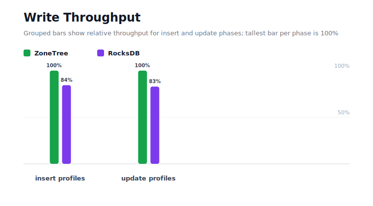
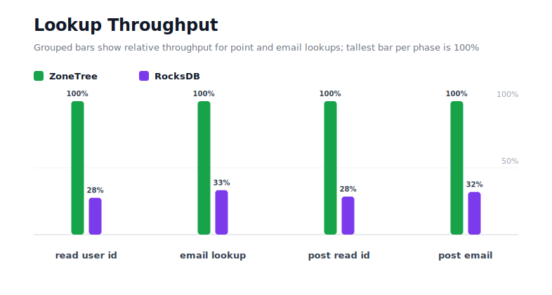
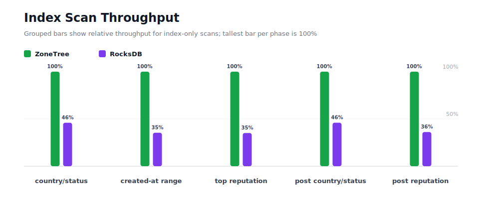
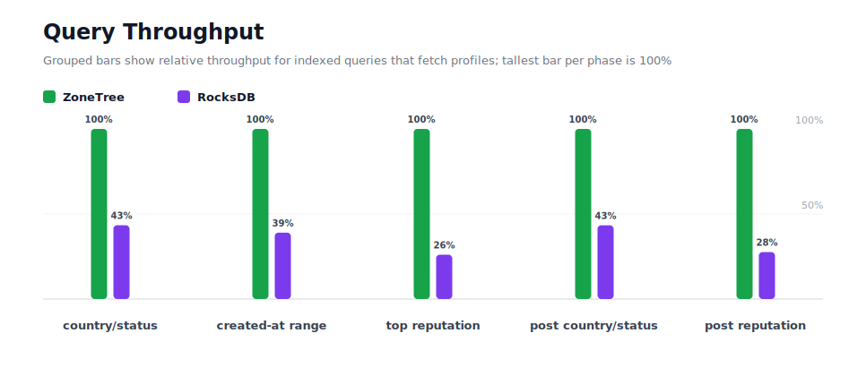
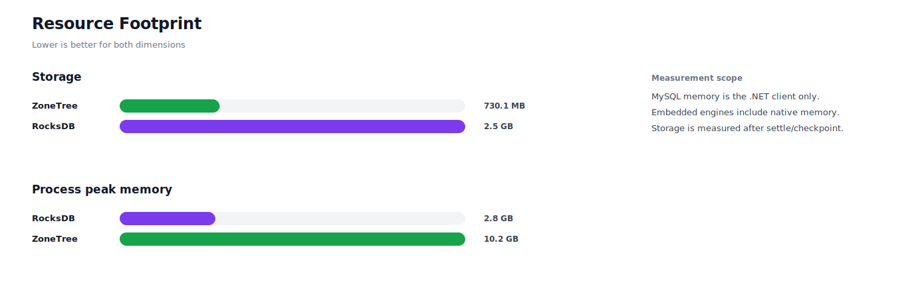

# Benchmark 10M Profiles - Windows

## Charts

### Execution Time

### Write Throughput

### Lookup Throughput

### Index Scan Throughput

### Query Throughput

### Resource Footprint

## Total By Engine

| Engine | Status | Run time | Completed phase time | Pre-read stabilize | Post-update stabilize | Settle | Reopen | Verify | Storage | Process peak memory | Final checksum |
| --- | --- | ---: | ---: | ---: | ---: | ---: | ---: | ---: | ---: | ---: | --- |
| ZoneTree | Completed | 1_120_813 ms | 1_084_829 ms | 11_734 ms | 22_442 ms | 36 ms | 747 ms | 9 ms | 730.1 MB | 10.2 GB | `78E34B89C21C4B51` |
| RocksDB | Completed | 2_489_547 ms | 2_466_481 ms | 8_332 ms | 12_315 ms | 0 ms | 49 ms | 1_812 ms | 2.5 GB | 2.8 GB | `78E34B89C21C4B51` |

## Correctness

Checksum validation passed across completed engines: ZoneTree, RocksDB.

## Interpretation Notes

* This benchmark measures live single-operation profile inserts, updates, reads, and indexed queries.
* ZoneTree and RocksDB secondary indexes are maintained by the benchmark application using separate stores.
* Embedded engines run in the benchmark process.
* Completed phase time is the sum of measured workload phases. Run time also includes initialization, stabilization, settle/checkpoint, reopen, verification, and reporting overhead.
* The write throughput chart includes raw write phases and derived write-readiness bars that add the following stabilization phase.
* Storage is measured after each engine settles or checkpoints its data.
* Process peak memory is measured for the benchmark process.

## Write Readiness

| Engine | Insert | Pre-read stabilize | Insert + stabilize | Insert ready throughput | Update | Post-update stabilize | Update + stabilize | Update ready throughput |
| --- | ---: | ---: | ---: | ---: | ---: | ---: | ---: | ---: |
| ZoneTree | 93_176 ms | 11_734 ms | 104_910 ms | 95_320/s | 275_533 ms | 22_442 ms | 297_975 ms | 33_560/s |
| RocksDB | 110_426 ms | 8_332 ms | 118_759 ms | 84_204/s | 332_463 ms | 12_315 ms | 344_778 ms | 29_004/s |

## Phase Results

### ZoneTree

| Phase | Operations | Time | Throughput | Checksum |
| --- | ---: | ---: | ---: | --- |
| insert profiles | 10_000_000 | 93_176 ms | 107_324/s | `07762AC56C55E0A5` |
| read by user id | 10_000_000 | 16_379 ms | 610_556/s | `F4608F0DA193D0D9` |
| lookup by email | 10_000_000 | 39_692 ms | 251_938/s | `ADE91BF4BD85A55B` |
| scan country/status index | 2_500_000 | 13_130 ms | 190_400/s | `FBF42B2AEF322871` |
| query country/status | 2_500_000 | 122_656 ms | 20_382/s | `590A469174D5C47A` |
| scan created-at index | 2_500_000 | 18_648 ms | 134_063/s | `AA7BB5512A595F45` |
| query created-at range | 2_500_000 | 143_015 ms | 17_481/s | `D5F1890132634766` |
| scan top reputation index | 2_500_000 | 9_096 ms | 274_852/s | `C813C20204E07EE5` |
| query top reputation | 2_500_000 | 77_637 ms | 32_201/s | `7F5BB4ED96D5DEE5` |
| update profiles | 10_000_000 | 275_533 ms | 36_293/s | `6BDE7DC8A52F666F` |
| post-update read by user id | 10_000_000 | 18_078 ms | 553_144/s | `5D5C9BD3AB671AA6` |
| post-update lookup by email | 10_000_000 | 39_085 ms | 255_851/s | `D68F7DE2F29ABC22` |
| post-update scan country/status index | 2_500_000 | 13_012 ms | 192_125/s | `F0F2E613042BB2C5` |
| post-update query country/status | 2_500_000 | 122_738 ms | 20_369/s | `BE9E7BB15662BF49` |
| post-update scan top reputation index | 2_500_000 | 9_191 ms | 272_010/s | `E1890D959DA900A5` |
| post-update query top reputation | 2_500_000 | 73_763 ms | 33_892/s | `B57C8C02E31652A5` |

### RocksDB

| Phase | Operations | Time | Throughput | Checksum |
| --- | ---: | ---: | ---: | --- |
| insert profiles | 10_000_000 | 110_426 ms | 90_558/s | `07762AC56C55E0A5` |
| read by user id | 10_000_000 | 59_394 ms | 168_366/s | `F4608F0DA193D0D9` |
| lookup by email | 10_000_000 | 119_213 ms | 83_884/s | `ADE91BF4BD85A55B` |
| scan country/status index | 2_500_000 | 28_575 ms | 87_490/s | `FBF42B2AEF322871` |
| query country/status | 2_500_000 | 282_898 ms | 8_837/s | `590A469174D5C47A` |
| scan created-at index | 2_500_000 | 52_676 ms | 47_460/s | `AA7BB5512A595F45` |
| query created-at range | 2_500_000 | 366_665 ms | 6_818/s | `D5F1890132634766` |
| scan top reputation index | 2_500_000 | 25_908 ms | 96_494/s | `C813C20204E07EE5` |
| query top reputation | 2_500_000 | 298_043 ms | 8_388/s | `7F5BB4ED96D5DEE5` |
| update profiles | 10_000_000 | 332_463 ms | 30_079/s | `6BDE7DC8A52F666F` |
| post-update read by user id | 10_000_000 | 63_442 ms | 157_625/s | `5D5C9BD3AB671AA6` |
| post-update lookup by email | 10_000_000 | 122_289 ms | 81_773/s | `D68F7DE2F29ABC22` |
| post-update scan country/status index | 2_500_000 | 28_289 ms | 88_373/s | `F0F2E613042BB2C5` |
| post-update query country/status | 2_500_000 | 283_211 ms | 8_827/s | `BE9E7BB15662BF49` |
| post-update scan top reputation index | 2_500_000 | 25_425 ms | 98_329/s | `E1890D959DA900A5` |
| post-update query top reputation | 2_500_000 | 267_563 ms | 9_344/s | `B57C8C02E31652A5` |

## Configuration

* Profiles: 10_000_000
* Profile writes: individual operations
* UserId reads: 10_000_000
* Email lookups: 10_000_000
* Query count: 2_500_000
* Profile updates: 10_000_000
* Post-update UserId reads: 10_000_000
* Post-update email lookups: 10_000_000
* Post-update query count: 2_500_000
* Query limit: 100
* Seed: 570123434
* Timeout: 120_000 seconds per engine

## Environment

* OS: Microsoft Windows 10.0.26200
* Architecture: X64
* .NET: 10.0.6
* CPU: Intel(R) Core(TM) Ultra 7 265KF
* Logical processors: 20
* Total available memory: 63.6 GB
* Initial process working set: 698.7 MB

## Engine Settings

### ZoneTree

* MutableSegmentMaxItemCount: 250000
* SparseArrayStepSize: 16
* KeyCacheSize: 1024
* ValueCacheSize: 1024
* IteratorPrefetchSize: 16
* BlockCacheLifeTime: 1 minutes
* ReadStabilization: Settle before read/query phases

### RocksDB

* Databases: profiles,email-index,country-status-index,created-at-index,reputation-index
* Compression: Zstd
* WriteBufferMb: 1024
* MaxWriteBufferNumber: 4
* WriteSync: false
* ReadStabilization: Compact before read/query phases

## Durability Settings

* ZoneTree: AsyncCompressed WAL default; MutableSegmentMaxItemCount=250000; SparseArrayStepSize=16; KeyCacheSize=1024; ValueCacheSize=1024; IteratorPrefetchSize=16; BlockCacheLifeTime=1 minutes; application-managed secondary indexes; background maintainers enabled.
* RocksDB: WAL enabled; five separate RocksDB instances; no WriteBatch across indexes; compression=Zstd; write_buffer_size=1024 MB per database; max_write_buffer_number=4.
