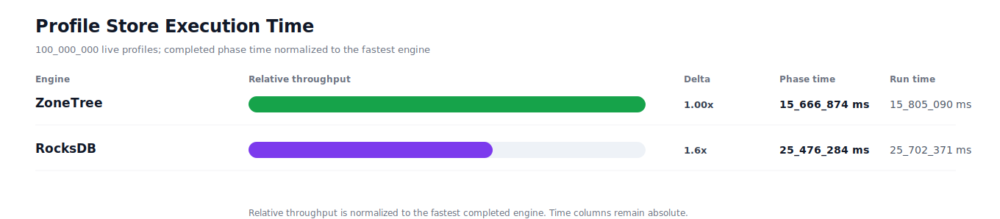
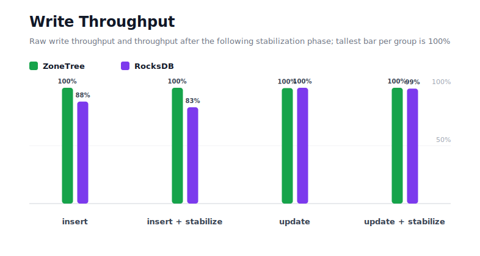
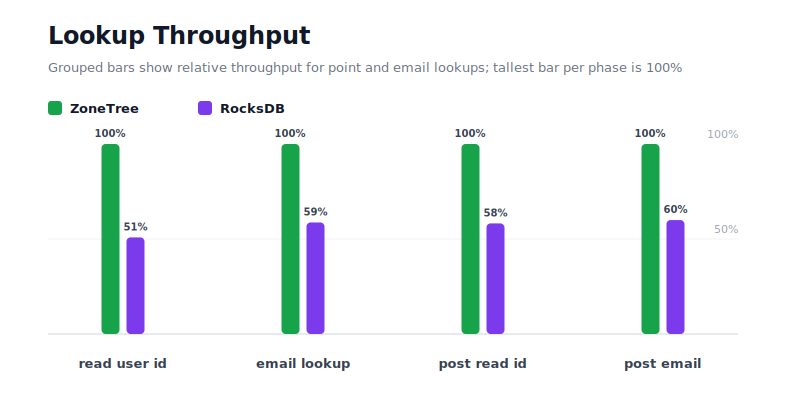
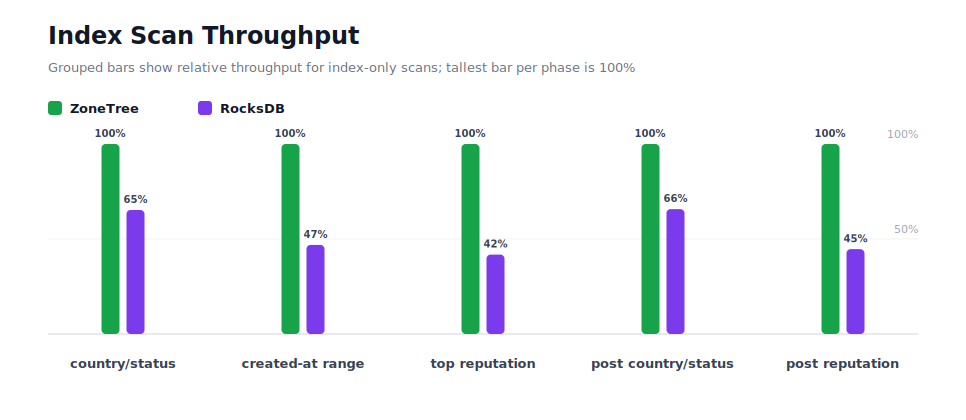
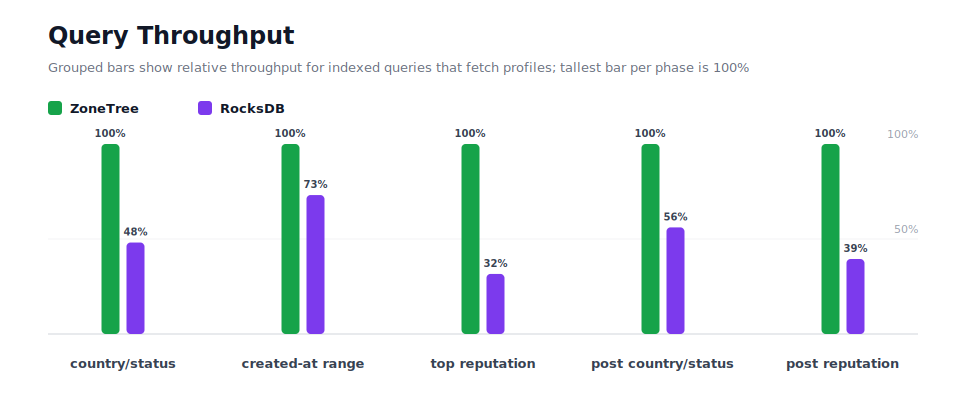
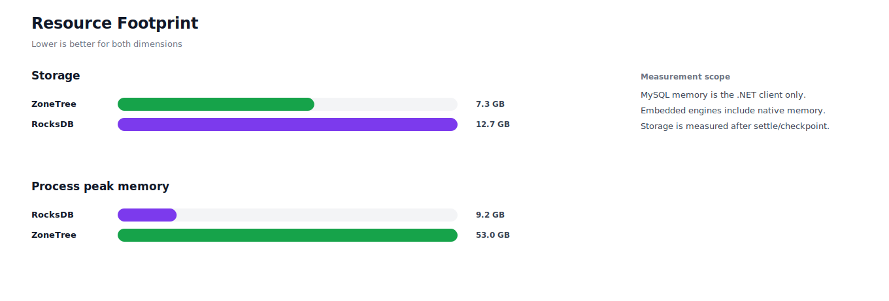

# Benchmark 100M Profiles - Windows

## Charts

### Execution Time

### Write Throughput

### Lookup Throughput

### Index Scan Throughput

### Query Throughput

### Resource Footprint

## Total By Engine

| Engine | Status | Run time | Completed phase time | Pre-read stabilize | Post-update stabilize | Settle | Reopen | Verify | Storage | Process peak memory | Final checksum |
| --- | --- | ---: | ---: | ---: | ---: | ---: | ---: | ---: | ---: | ---: | --- |
| ZoneTree | Completed | 15_805_090 ms | 15_666_874 ms | 36_047 ms | 58_487 ms | 20 ms | 4_111 ms | 38_079 ms | 7.3 GB | 53.0 GB | `4E408868CAFD4857` |
| RocksDB | Completed | 25_702_371 ms | 25_476_284 ms | 108_523 ms | 99_234 ms | 0 ms | 81 ms | 17_805 ms | 12.7 GB | 9.2 GB | `4E408868CAFD4857` |

## Correctness

Checksum validation passed across completed engines: ZoneTree, RocksDB.

## Interpretation Notes

* This benchmark measures live single-operation profile inserts, updates, reads, and indexed queries.
* ZoneTree and RocksDB secondary indexes are maintained by the benchmark application using separate stores.
* Embedded engines run in the benchmark process.
* Completed phase time is the sum of measured workload phases. Run time also includes initialization, stabilization, settle/checkpoint, reopen, verification, and reporting overhead.
* The write throughput chart includes raw write phases and derived write-readiness bars that add the following stabilization phase.
* Storage is measured after each engine settles or checkpoints its data.
* Process peak memory is measured for the benchmark process.

## Write Readiness

| Engine | Insert | Pre-read stabilize | Insert + stabilize | Insert ready throughput | Update | Post-update stabilize | Update + stabilize | Update ready throughput |
| --- | ---: | ---: | ---: | ---: | ---: | ---: | ---: | ---: |
| ZoneTree | 974_508 ms | 36_047 ms | 1_010_555 ms | 98_956/s | 3_956_426 ms | 58_487 ms | 4_014_913 ms | 24_907/s |
| RocksDB | 1_106_727 ms | 108_523 ms | 1_215_249 ms | 82_288/s | 3_944_735 ms | 99_234 ms | 4_043_969 ms | 24_728/s |

## Phase Results

### ZoneTree

| Phase | Operations | Time | Throughput | Checksum |
| --- | ---: | ---: | ---: | --- |
| insert profiles | 100_000_000 | 974_508 ms | 102_616/s | `FCB46248E0D81425` |
| read by user id | 100_000_000 | 356_550 ms | 280_465/s | `67AE5B5CBB949FF2` |
| lookup by email | 100_000_000 | 806_631 ms | 123_972/s | `194BD509DF206EEF` |
| scan country/status index | 25_000_000 | 187_112 ms | 133_609/s | `E5AD445D8FD41F6E` |
| query country/status | 25_000_000 | 1_349_716 ms | 18_522/s | `CB50E4518707DF74` |
| scan created-at index | 25_000_000 | 262_710 ms | 95_162/s | `BAA51FE433523875` |
| query created-at range | 25_000_000 | 2_592_931 ms | 9_642/s | `2686C0AE1BD960A6` |
| scan top reputation index | 25_000_000 | 105_203 ms | 237_637/s | `7A98B23B6A0990A5` |
| query top reputation | 25_000_000 | 856_943 ms | 29_173/s | `26ACD96F896D94A5` |
| update profiles | 100_000_000 | 3_956_426 ms | 25_275/s | `F7A87BCF70BA626A` |
| post-update read by user id | 100_000_000 | 418_580 ms | 238_903/s | `554A87520F10E43D` |
| post-update lookup by email | 100_000_000 | 837_115 ms | 119_458/s | `1745396EBE06F8E3` |
| post-update scan country/status index | 25_000_000 | 188_721 ms | 132_470/s | `5740FFFEAB8201F8` |
| post-update query country/status | 25_000_000 | 1_601_386 ms | 15_611/s | `D31B1C12613C4ED1` |
| post-update scan top reputation index | 25_000_000 | 114_868 ms | 217_641/s | `6AF8CAC8CCE4AD25` |
| post-update query top reputation | 25_000_000 | 1_057_475 ms | 23_641/s | `1BE71DE9C349B225` |

### RocksDB

| Phase | Operations | Time | Throughput | Checksum |
| --- | ---: | ---: | ---: | --- |
| insert profiles | 100_000_000 | 1_106_727 ms | 90_357/s | `FCB46248E0D81425` |
| read by user id | 100_000_000 | 701_275 ms | 142_597/s | `67AE5B5CBB949FF2` |
| lookup by email | 100_000_000 | 1_374_055 ms | 72_777/s | `194BD509DF206EEF` |
| scan country/status index | 25_000_000 | 286_647 ms | 87_215/s | `E5AD445D8FD41F6E` |
| query country/status | 25_000_000 | 2_803_443 ms | 8_918/s | `CB50E4518707DF74` |
| scan created-at index | 25_000_000 | 560_289 ms | 44_620/s | `BAA51FE433523875` |
| query created-at range | 25_000_000 | 3_545_197 ms | 7_052/s | `2686C0AE1BD960A6` |
| scan top reputation index | 25_000_000 | 251_710 ms | 99_321/s | `7A98B23B6A0990A5` |
| query top reputation | 25_000_000 | 2_709_952 ms | 9_225/s | `26ACD96F896D94A5` |
| update profiles | 100_000_000 | 3_944_735 ms | 25_350/s | `F7A87BCF70BA626A` |
| post-update read by user id | 100_000_000 | 719_177 ms | 139_048/s | `554A87520F10E43D` |
| post-update lookup by email | 100_000_000 | 1_395_699 ms | 71_649/s | `1745396EBE06F8E3` |
| post-update scan country/status index | 25_000_000 | 287_131 ms | 87_068/s | `5740FFFEAB8201F8` |
| post-update query country/status | 25_000_000 | 2_853_591 ms | 8_761/s | `D31B1C12613C4ED1` |
| post-update scan top reputation index | 25_000_000 | 257_256 ms | 97_180/s | `6AF8CAC8CCE4AD25` |
| post-update query top reputation | 25_000_000 | 2_679_401 ms | 9_330/s | `1BE71DE9C349B225` |

## Configuration

* Profiles: 100_000_000
* Profile writes: individual operations
* UserId reads: 100_000_000
* Email lookups: 100_000_000
* Query count: 25_000_000
* Profile updates: 100_000_000
* Post-update UserId reads: 100_000_000
* Post-update email lookups: 100_000_000
* Post-update query count: 25_000_000
* Query limit: 100
* Seed: 570123434
* Timeout: 120_000 seconds per engine

## Environment

* OS: Microsoft Windows 10.0.26200
* Architecture: X64
* .NET: 10.0.6
* CPU: Intel(R) Core(TM) Ultra 7 265KF
* Logical processors: 20
* Total available memory: 63.6 GB
* Initial process working set: 6.6 GB

## Engine Settings

### ZoneTree

* MutableSegmentMaxItemCount: 250000
* SparseArrayStepSize: 32
* KeyCacheSize: 1024
* ValueCacheSize: 1024
* IteratorPrefetchSize: 16
* BlockCacheLifeTime: 1 minutes
* BottomMergePolicy: Full bottom merge when bottom segment count exceeds 1
* ReadStabilization: Settle before read/query phases

### RocksDB

* Databases: profiles,email-index,country-status-index,created-at-index,reputation-index
* Compression: Zstd
* WriteBufferMb: 1024
* MaxWriteBufferNumber: 4
* WriteSync: false
* ReadStabilization: Compact before read/query phases

## Durability Settings

* ZoneTree: AsyncCompressed WAL default; MutableSegmentMaxItemCount=250000; SparseArrayStepSize=32; KeyCacheSize=1024; ValueCacheSize=1024; IteratorPrefetchSize=16; BlockCacheLifeTime=1 minutes; application-managed secondary indexes; background maintainers enabled.
* RocksDB: WAL enabled; five separate RocksDB instances; no WriteBatch across indexes; compression=Zstd; write_buffer_size=1024 MB per database; max_write_buffer_number=4.
