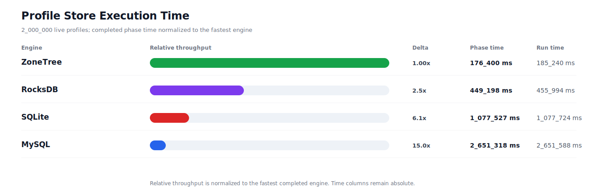
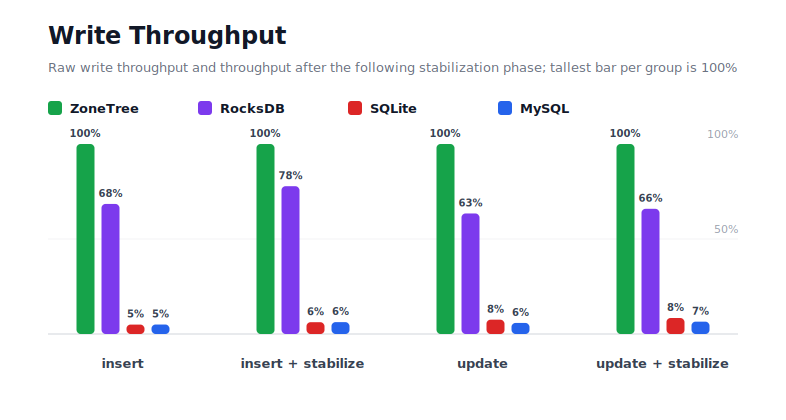
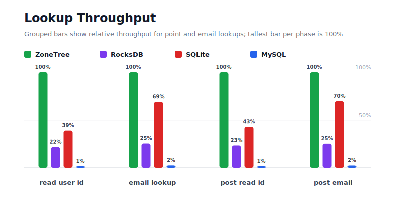
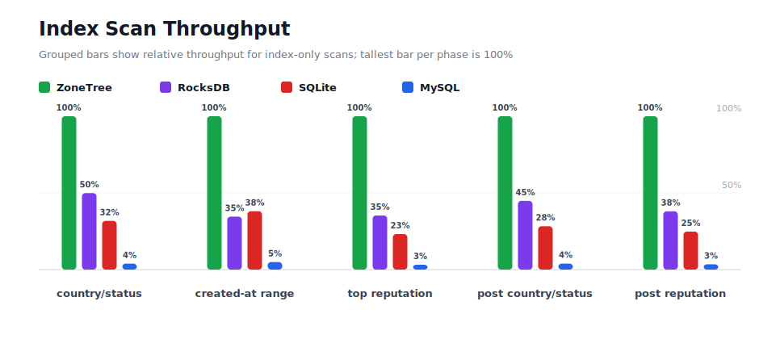
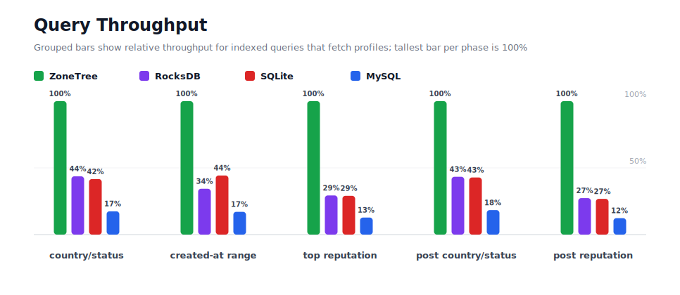
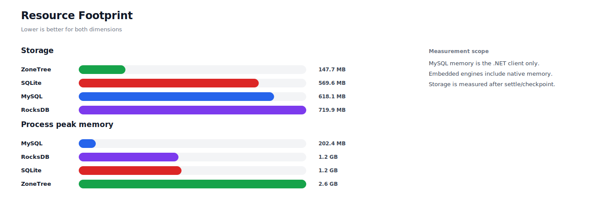

# Benchmark 2M Profiles

## Charts

### Execution Time

### Write Throughput

### Lookup Throughput

### Index Scan Throughput

### Query Throughput

### Resource Footprint

## Total By Engine

| Engine | Status | Run time | Completed phase time | Pre-read stabilize | Post-update stabilize | Settle | Reopen | Verify | Storage | Process peak memory | Final checksum |
| --- | --- | ---: | ---: | ---: | ---: | ---: | ---: | ---: | ---: | ---: | --- |
| ZoneTree | Completed | 185_240 ms | 176_400 ms | 3_697 ms | 3_887 ms | 22 ms | 237 ms | 8 ms | 147.7 MB | 2.6 GB | `A7EB98FFC773884D` |
| RocksDB | Completed | 455_994 ms | 449_198 ms | 2_198 ms | 3_957 ms | 0 ms | 44 ms | 298 ms | 719.9 MB | 1.2 GB | `A7EB98FFC773884D` |
| SQLite | Completed | 1_077_724 ms | 1_077_527 ms | n/a | n/a | 67 ms | 0 ms | 11 ms | 569.6 MB | 1.2 GB | `A7EB98FFC773884D` |
| MySQL | Completed | 2_651_588 ms | 2_651_318 ms | n/a | n/a | 2 ms | 5 ms | 78 ms | 618.1 MB | 202.4 MB | `A7EB98FFC773884D` |

## Correctness

Checksum validation passed across completed engines: ZoneTree, RocksDB, SQLite, MySQL.

## Interpretation Notes

* This benchmark measures live single-operation profile inserts, updates, reads, and indexed queries.
* ZoneTree and RocksDB secondary indexes are maintained by the benchmark application using separate stores.
* SQLite and MySQL maintain secondary indexes inside the database engine.
* MySQL is measured as a client/server database over TCP.
* Embedded engines run in the benchmark process.
* Completed phase time is the sum of measured workload phases. Run time also includes initialization, stabilization, settle/checkpoint, reopen, verification, and reporting overhead.
* Storage is measured after each engine settles or checkpoints its data.
* Process peak memory is measured for the benchmark process. For MySQL, this excludes MySQL server/container memory.

## Phase Results

### ZoneTree

| Phase | Operations | Time | Throughput | Checksum |
| --- | ---: | ---: | ---: | --- |
| insert profiles | 2_000_000 | 14_574 ms | 137_229/s | `4F24F178E189EEA5` |
| read by user id | 2_000_000 | 2_155 ms | 928_047/s | `94FEA7BBDF9EB16F` |
| lookup by email | 2_000_000 | 5_125 ms | 390_271/s | `7911E6F89610C9DB` |
| scan country/status index | 500_000 | 2_849 ms | 175_470/s | `560B74664AA52578` |
| query country/status | 500_000 | 24_018 ms | 20_818/s | `FCF2C9270FA9B0B9` |
| scan created-at index | 500_000 | 3_468 ms | 144_181/s | `C8D3546404935759` |
| query created-at range | 500_000 | 22_670 ms | 22_055/s | `C3FDD5908A1458BA` |
| scan top reputation index | 500_000 | 1_834 ms | 272_691/s | `E7D19A7DA1270425` |
| query top reputation | 500_000 | 15_536 ms | 32_184/s | `5DFA72D2DB36D325` |
| update profiles | 2_000_000 | 33_203 ms | 60_235/s | `1100814B966927C5` |
| post-update read by user id | 2_000_000 | 2_333 ms | 857_163/s | `B004A4D20A4A3848` |
| post-update lookup by email | 2_000_000 | 5_114 ms | 391_071/s | `D353A40B4BEBE4B5` |
| post-update scan country/status index | 500_000 | 2_521 ms | 198_329/s | `A45CF3AB6613BF9E` |
| post-update query country/status | 500_000 | 24_589 ms | 20_334/s | `7899EECCB1694A86` |
| post-update scan top reputation index | 500_000 | 1_969 ms | 253_914/s | `629516A23DD07125` |
| post-update query top reputation | 500_000 | 14_441 ms | 34_623/s | `15A3B24C38088C25` |

### RocksDB

| Phase | Operations | Time | Throughput | Checksum |
| --- | ---: | ---: | ---: | --- |
| insert profiles | 2_000_000 | 21_291 ms | 93_937/s | `4F24F178E189EEA5` |
| read by user id | 2_000_000 | 9_916 ms | 201_688/s | `94FEA7BBDF9EB16F` |
| lookup by email | 2_000_000 | 20_099 ms | 99_509/s | `7911E6F89610C9DB` |
| scan country/status index | 500_000 | 5_715 ms | 87_495/s | `560B74664AA52578` |
| query country/status | 500_000 | 55_008 ms | 9_090/s | `FCF2C9270FA9B0B9` |
| scan created-at index | 500_000 | 10_047 ms | 49_767/s | `C8D3546404935759` |
| query created-at range | 500_000 | 66_026 ms | 7_573/s | `C3FDD5908A1458BA` |
| scan top reputation index | 500_000 | 5_197 ms | 96_206/s | `E7D19A7DA1270425` |
| query top reputation | 500_000 | 52_980 ms | 9_437/s | `5DFA72D2DB36D325` |
| update profiles | 2_000_000 | 52_342 ms | 38_210/s | `1100814B966927C5` |
| post-update read by user id | 2_000_000 | 9_958 ms | 200_852/s | `B004A4D20A4A3848` |
| post-update lookup by email | 2_000_000 | 20_196 ms | 99_030/s | `D353A40B4BEBE4B5` |
| post-update scan country/status index | 500_000 | 5_628 ms | 88_837/s | `A45CF3AB6613BF9E` |
| post-update query country/status | 500_000 | 56_755 ms | 8_810/s | `7899EECCB1694A86` |
| post-update scan top reputation index | 500_000 | 5_184 ms | 96_449/s | `629516A23DD07125` |
| post-update query top reputation | 500_000 | 52_856 ms | 9_460/s | `15A3B24C38088C25` |

### SQLite

| Phase | Operations | Time | Throughput | Checksum |
| --- | ---: | ---: | ---: | --- |
| insert profiles | 2_000_000 | 294_082 ms | 6_801/s | `4F24F178E189EEA5` |
| read by user id | 2_000_000 | 5_508 ms | 363_134/s | `94FEA7BBDF9EB16F` |
| lookup by email | 2_000_000 | 7_443 ms | 268_709/s | `7911E6F89610C9DB` |
| scan country/status index | 500_000 | 8_978 ms | 55_693/s | `560B74664AA52578` |
| query country/status | 500_000 | 57_709 ms | 8_664/s | `FCF2C9270FA9B0B9` |
| scan created-at index | 500_000 | 9_110 ms | 54_883/s | `C8D3546404935759` |
| query created-at range | 500_000 | 51_183 ms | 9_769/s | `C3FDD5908A1458BA` |
| scan top reputation index | 500_000 | 7_923 ms | 63_110/s | `E7D19A7DA1270425` |
| query top reputation | 500_000 | 53_503 ms | 9_345/s | `5DFA72D2DB36D325` |
| update profiles | 2_000_000 | 441_048 ms | 4_535/s | `1100814B966927C5` |
| post-update read by user id | 2_000_000 | 5_420 ms | 369_035/s | `B004A4D20A4A3848` |
| post-update lookup by email | 2_000_000 | 7_356 ms | 271_902/s | `D353A40B4BEBE4B5` |
| post-update scan country/status index | 500_000 | 8_926 ms | 56_015/s | `A45CF3AB6613BF9E` |
| post-update query country/status | 500_000 | 57_445 ms | 8_704/s | `7899EECCB1694A86` |
| post-update scan top reputation index | 500_000 | 7_948 ms | 62_908/s | `629516A23DD07125` |
| post-update query top reputation | 500_000 | 53_947 ms | 9_268/s | `15A3B24C38088C25` |

### MySQL

| Phase | Operations | Time | Throughput | Checksum |
| --- | ---: | ---: | ---: | --- |
| insert profiles | 2_000_000 | 292_181 ms | 6_845/s | `4F24F178E189EEA5` |
| read by user id | 2_000_000 | 200_252 ms | 9_987/s | `94FEA7BBDF9EB16F` |
| lookup by email | 2_000_000 | 209_361 ms | 9_553/s | `7911E6F89610C9DB` |
| scan country/status index | 500_000 | 73_432 ms | 6_809/s | `560B74664AA52578` |
| query country/status | 500_000 | 137_602 ms | 3_634/s | `FCF2C9270FA9B0B9` |
| scan created-at index | 500_000 | 70_781 ms | 7_064/s | `C8D3546404935759` |
| query created-at range | 500_000 | 132_965 ms | 3_760/s | `C3FDD5908A1458BA` |
| scan top reputation index | 500_000 | 57_752 ms | 8_658/s | `E7D19A7DA1270425` |
| query top reputation | 500_000 | 121_747 ms | 4_107/s | `5DFA72D2DB36D325` |
| update profiles | 2_000_000 | 570_478 ms | 3_506/s | `1100814B966927C5` |
| post-update read by user id | 2_000_000 | 196_905 ms | 10_157/s | `B004A4D20A4A3848` |
| post-update lookup by email | 2_000_000 | 214_620 ms | 9_319/s | `D353A40B4BEBE4B5` |
| post-update scan country/status index | 500_000 | 64_558 ms | 7_745/s | `A45CF3AB6613BF9E` |
| post-update query country/status | 500_000 | 134_011 ms | 3_731/s | `7899EECCB1694A86` |
| post-update scan top reputation index | 500_000 | 57_411 ms | 8_709/s | `629516A23DD07125` |
| post-update query top reputation | 500_000 | 117_263 ms | 4_264/s | `15A3B24C38088C25` |

## Configuration

* Profiles: 2_000_000
* Profile writes: individual operations
* UserId reads: 2_000_000
* Email lookups: 2_000_000
* Query count: 500_000
* Profile updates: 2_000_000
* Post-update UserId reads: 2_000_000
* Post-update email lookups: 2_000_000
* Post-update query count: 500_000
* Query limit: 100
* Seed: 570123434
* Timeout: 120_000 seconds per engine

## Environment

* OS: Microsoft Windows 10.0.26200
* Architecture: X64
* .NET: 10.0.6
* CPU: Intel(R) Core(TM) Ultra 7 265KF
* Logical processors: 20
* Total available memory: 63.6 GB
* Initial process working set: 165.4 MB

## Engine Settings

### ZoneTree

* MutableSegmentMaxItemCount: 250000
* SparseArrayStepSize: 16
* KeyCacheSize: 1024
* ValueCacheSize: 1024
* IteratorPrefetchSize: 16
* BlockCacheLifeTime: 1 minutes
* ReadStabilization: Settle before read/query phases

### RocksDB

* Databases: profiles,email-index,country-status-index,created-at-index,reputation-index
* Compression: Zstd
* WriteBufferMb: 1024
* MaxWriteBufferNumber: 4
* WriteSync: false
* ReadStabilization: Compact before read/query phases

### SQLite

* JournalMode: WAL
* Synchronous: NORMAL
* CacheMb: 1024
* MmapMb: 1024
* TempStore: MEMORY

### MySQL

* Host: 192.168.178.25
* Port: 3306
* Database: profilebench
* User: root

## Durability Settings

* ZoneTree: AsyncCompressed WAL default; MutableSegmentMaxItemCount=250000; SparseArrayStepSize=16; KeyCacheSize=1024; ValueCacheSize=1024; IteratorPrefetchSize=16; BlockCacheLifeTime=1 minutes; application-managed secondary indexes; background maintainers enabled.
* RocksDB: WAL enabled; five separate RocksDB instances; no WriteBatch across indexes; compression=Zstd; write_buffer_size=1024 MB per database; max_write_buffer_number=4.
* SQLite: WAL journal mode; synchronous=NORMAL; cache=1024 MB; mmap=1024 MB; native SQL indexes; single-row writes use autocommit.
* MySQL: InnoDB; benchmark Docker disables binlog, sets innodb_flush_log_at_trx_commit=2 and sync_binlog=0; native SQL indexes; single-row writes use autocommit.
