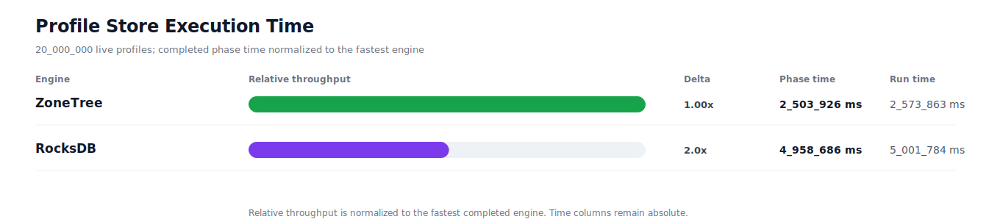
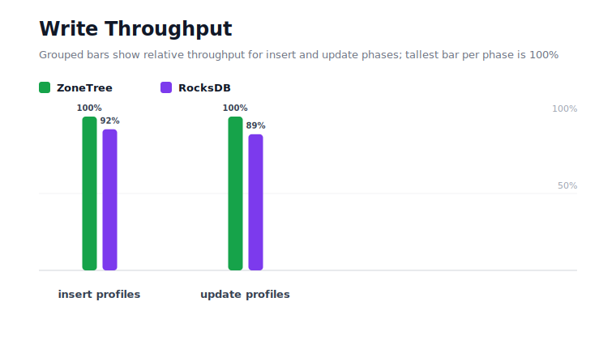
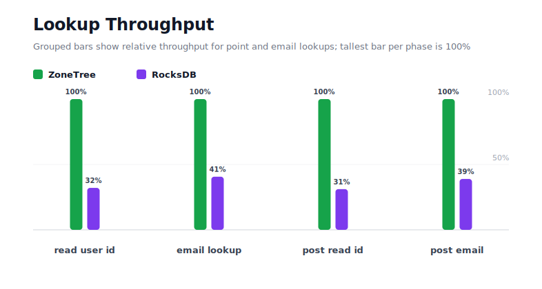
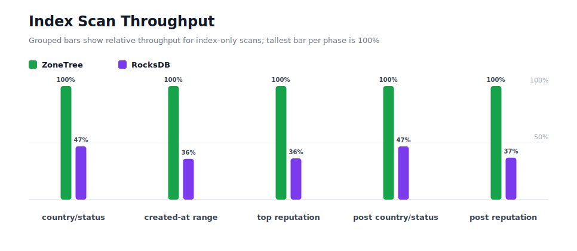
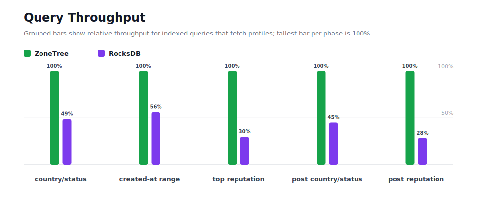
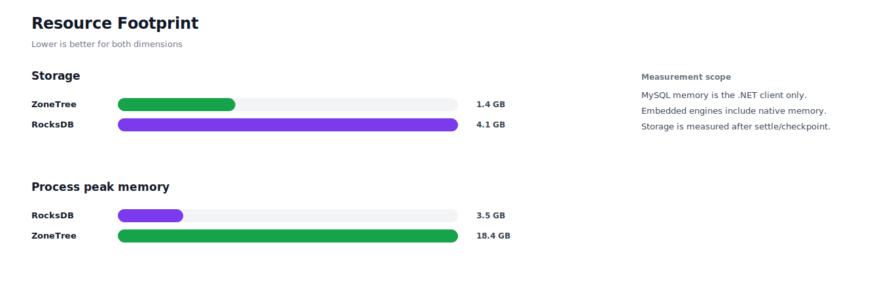

# Benchmark 20M Profiles - Windows

## Charts

### Execution Time

### Write Throughput

### Lookup Throughput

### Index Scan Throughput

### Query Throughput

### Resource Footprint

## Total By Engine

| Engine | Status | Run time | Completed phase time | Pre-read stabilize | Post-update stabilize | Settle | Reopen | Verify | Storage | Process peak memory | Final checksum |
| --- | --- | ---: | ---: | ---: | ---: | ---: | ---: | ---: | ---: | ---: | --- |
| ZoneTree | Completed | 2_573_863 ms | 2_503_926 ms | 21_139 ms | 45_882 ms | 13 ms | 1_822 ms | 8 ms | 1.4 GB | 18.4 GB | `C950499BB359EF1E` |
| RocksDB | Completed | 5_001_784 ms | 4_958_686 ms | 17_037 ms | 22_129 ms | 0 ms | 61 ms | 3_594 ms | 4.1 GB | 3.5 GB | `C950499BB359EF1E` |

## Correctness

Checksum validation passed across completed engines: ZoneTree, RocksDB.

## Interpretation Notes

* This benchmark measures live single-operation profile inserts, updates, reads, and indexed queries.
* ZoneTree and RocksDB secondary indexes are maintained by the benchmark application using separate stores.
* Embedded engines run in the benchmark process.
* Completed phase time is the sum of measured workload phases. Run time also includes initialization, stabilization, settle/checkpoint, reopen, verification, and reporting overhead.
* The write throughput chart includes raw write phases and derived write-readiness bars that add the following stabilization phase.
* Storage is measured after each engine settles or checkpoints its data.
* Process peak memory is measured for the benchmark process.

## Write Readiness

| Engine | Insert | Pre-read stabilize | Insert + stabilize | Insert ready throughput | Update | Post-update stabilize | Update + stabilize | Update ready throughput |
| --- | ---: | ---: | ---: | ---: | ---: | ---: | ---: | ---: |
| ZoneTree | 203_568 ms | 21_139 ms | 224_707 ms | 89_005/s | 644_479 ms | 45_882 ms | 690_361 ms | 28_970/s |
| RocksDB | 221_874 ms | 17_037 ms | 238_911 ms | 83_713/s | 728_061 ms | 22_129 ms | 750_190 ms | 26_660/s |

## Phase Results

### ZoneTree

| Phase | Operations | Time | Throughput | Checksum |
| --- | ---: | ---: | ---: | --- |
| insert profiles | 20_000_000 | 203_568 ms | 98_247/s | `8D2B076CDD049825` |
| read by user id | 20_000_000 | 40_673 ms | 491_721/s | `8151B751760A009D` |
| lookup by email | 20_000_000 | 102_371 ms | 195_368/s | `D6E3DBB6D3168DC8` |
| scan country/status index | 5_000_000 | 26_875 ms | 186_046/s | `21097919F6009119` |
| query country/status | 5_000_000 | 274_700 ms | 18_202/s | `E2672F92B7E6D1B4` |
| scan created-at index | 5_000_000 | 39_893 ms | 125_336/s | `E17333F7B71C76C1` |
| query created-at range | 5_000_000 | 395_582 ms | 12_640/s | `70460EF357988024` |
| scan top reputation index | 5_000_000 | 18_976 ms | 263_492/s | `E00323E0ECFC18A5` |
| query top reputation | 5_000_000 | 161_415 ms | 30_976/s | `683E9E1D4D3D07A5` |
| update profiles | 20_000_000 | 644_479 ms | 31_033/s | `BDD8278E02873C2F` |
| post-update read by user id | 20_000_000 | 40_761 ms | 490_671/s | `35C19AAA9E0C7EA4` |
| post-update lookup by email | 20_000_000 | 99_765 ms | 200_471/s | `F809B066B5BB87F5` |
| post-update scan country/status index | 5_000_000 | 26_528 ms | 188_477/s | `A4787C22008FE48C` |
| post-update query country/status | 5_000_000 | 258_581 ms | 19_336/s | `BE59ABCDAABDF4D9` |
| post-update scan top reputation index | 5_000_000 | 18_993 ms | 263_258/s | `3A9FAA1C2A284F25` |
| post-update query top reputation | 5_000_000 | 150_765 ms | 33_164/s | `BAB1BC6509DAFB65` |

### RocksDB

| Phase | Operations | Time | Throughput | Checksum |
| --- | ---: | ---: | ---: | --- |
| insert profiles | 20_000_000 | 221_874 ms | 90_141/s | `8D2B076CDD049825` |
| read by user id | 20_000_000 | 126_839 ms | 157_680/s | `8151B751760A009D` |
| lookup by email | 20_000_000 | 252_016 ms | 79_360/s | `D6E3DBB6D3168DC8` |
| scan country/status index | 5_000_000 | 57_248 ms | 87_340/s | `21097919F6009119` |
| query country/status | 5_000_000 | 564_520 ms | 8_857/s | `E2672F92B7E6D1B4` |
| scan created-at index | 5_000_000 | 111_033 ms | 45_032/s | `E17333F7B71C76C1` |
| query created-at range | 5_000_000 | 705_731 ms | 7_085/s | `70460EF357988024` |
| scan top reputation index | 5_000_000 | 52_268 ms | 95_662/s | `E00323E0ECFC18A5` |
| query top reputation | 5_000_000 | 538_654 ms | 9_282/s | `683E9E1D4D3D07A5` |
| update profiles | 20_000_000 | 728_061 ms | 27_470/s | `BDD8278E02873C2F` |
| post-update read by user id | 20_000_000 | 131_048 ms | 152_616/s | `35C19AAA9E0C7EA4` |
| post-update lookup by email | 20_000_000 | 256_387 ms | 78_007/s | `F809B066B5BB87F5` |
| post-update scan country/status index | 5_000_000 | 56_645 ms | 88_268/s | `A4787C22008FE48C` |
| post-update query country/status | 5_000_000 | 574_439 ms | 8_704/s | `BE59ABCDAABDF4D9` |
| post-update scan top reputation index | 5_000_000 | 51_401 ms | 97_275/s | `3A9FAA1C2A284F25` |
| post-update query top reputation | 5_000_000 | 530_523 ms | 9_425/s | `BAB1BC6509DAFB65` |

## Configuration

* Profiles: 20_000_000
* Profile writes: individual operations
* UserId reads: 20_000_000
* Email lookups: 20_000_000
* Query count: 5_000_000
* Profile updates: 20_000_000
* Post-update UserId reads: 20_000_000
* Post-update email lookups: 20_000_000
* Post-update query count: 5_000_000
* Query limit: 100
* Seed: 570123434
* Timeout: 120_000 seconds per engine

## Environment

* OS: Microsoft Windows 10.0.26200
* Architecture: X64
* .NET: 10.0.6
* CPU: Intel(R) Core(TM) Ultra 7 265KF
* Logical processors: 20
* Total available memory: 63.6 GB
* Initial process working set: 1.3 GB

## Engine Settings

### ZoneTree

* MutableSegmentMaxItemCount: 250000
* SparseArrayStepSize: 16
* KeyCacheSize: 1024
* ValueCacheSize: 1024
* IteratorPrefetchSize: 16
* BlockCacheLifeTime: 1 minutes
* ReadStabilization: Settle before read/query phases

### RocksDB

* Databases: profiles,email-index,country-status-index,created-at-index,reputation-index
* Compression: Zstd
* WriteBufferMb: 1024
* MaxWriteBufferNumber: 4
* WriteSync: false
* ReadStabilization: Compact before read/query phases

## Durability Settings

* ZoneTree: AsyncCompressed WAL default; MutableSegmentMaxItemCount=250000; SparseArrayStepSize=16; KeyCacheSize=1024; ValueCacheSize=1024; IteratorPrefetchSize=16; BlockCacheLifeTime=1 minutes; application-managed secondary indexes; background maintainers enabled.
* RocksDB: WAL enabled; five separate RocksDB instances; no WriteBatch across indexes; compression=Zstd; write_buffer_size=1024 MB per database; max_write_buffer_number=4.
