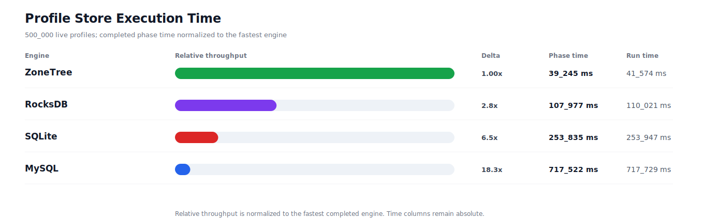
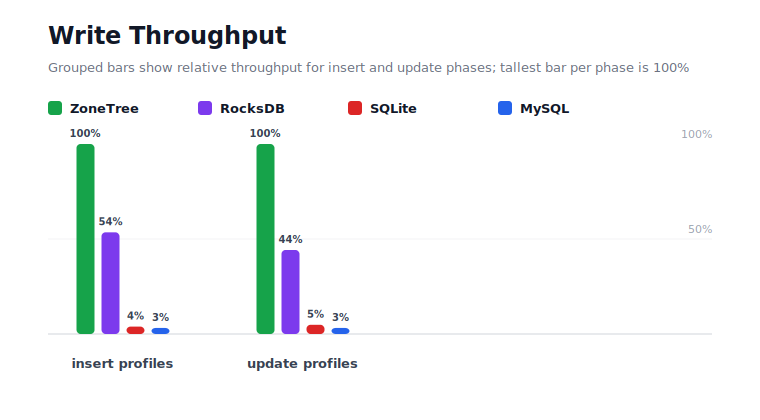
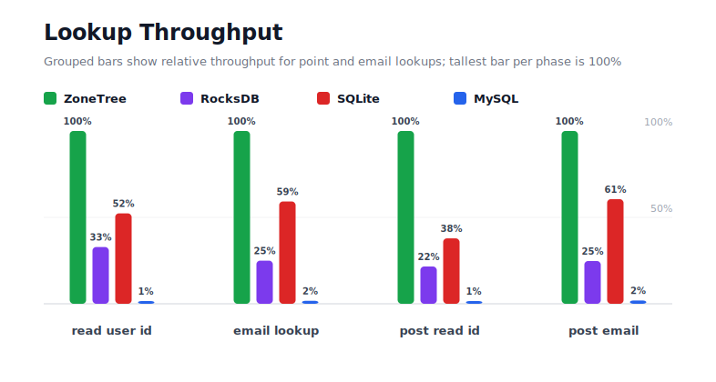
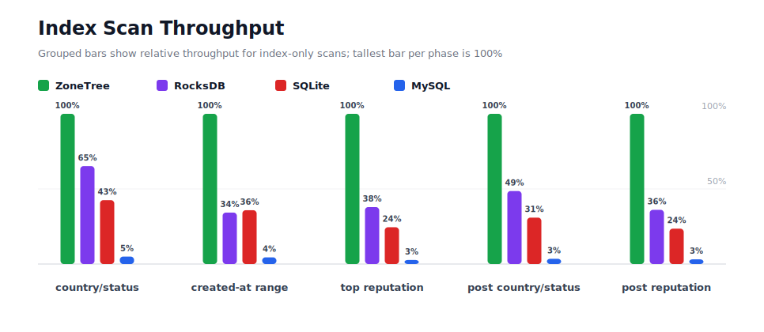
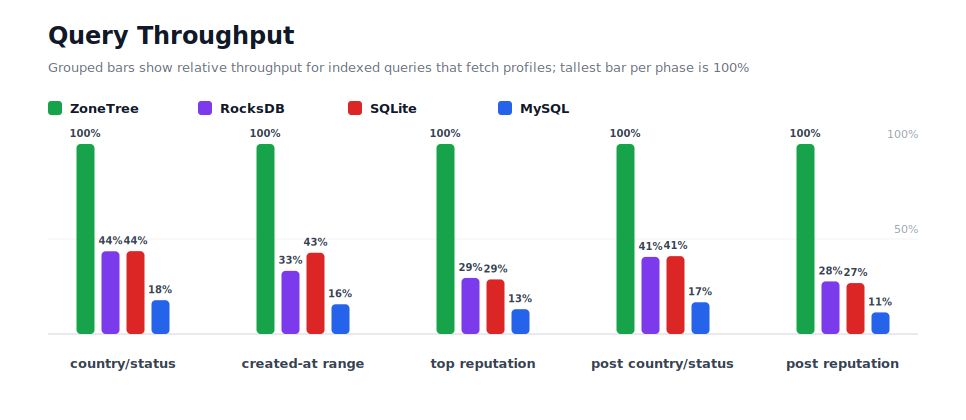
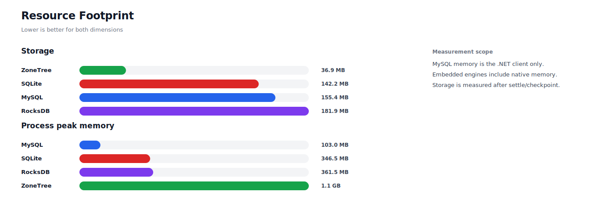

# Benchmark 500K Profiles - Windows

## Charts

### Execution Time

### Write Throughput

### Lookup Throughput

### Index Scan Throughput

### Query Throughput

### Resource Footprint

## Total By Engine

| Engine | Status | Run time | Completed phase time | Pre-read stabilize | Post-update stabilize | Settle | Reopen | Verify | Storage | Process peak memory | Final checksum |
| --- | --- | ---: | ---: | ---: | ---: | ---: | ---: | ---: | ---: | ---: | --- |
| ZoneTree | Completed | 41_574 ms | 39_245 ms | 937 ms | 653 ms | 22 ms | 81 ms | 8 ms | 36.9 MB | 1.1 GB | `DF2D9443B36E4083` |
| RocksDB | Completed | 110_021 ms | 107_977 ms | 638 ms | 1_045 ms | 0 ms | 47 ms | 77 ms | 181.9 MB | 361.5 MB | `DF2D9443B36E4083` |
| SQLite | Completed | 253_947 ms | 253_835 ms | n/a | n/a | 44 ms | 0 ms | 4 ms | 142.2 MB | 346.5 MB | `DF2D9443B36E4083` |
| MySQL | Completed | 717_729 ms | 717_522 ms | n/a | n/a | 2 ms | 5 ms | 21 ms | 155.4 MB | 103.0 MB | `DF2D9443B36E4083` |

## Correctness

Checksum validation passed across completed engines: ZoneTree, RocksDB, SQLite, MySQL.

## Interpretation Notes

* This benchmark measures live single-operation profile inserts, updates, reads, and indexed queries.
* ZoneTree and RocksDB secondary indexes are maintained by the benchmark application using separate stores.
* SQLite and MySQL maintain secondary indexes inside the database engine.
* MySQL is measured as a client/server database over TCP.
* Embedded engines run in the benchmark process.
* Completed phase time is the sum of measured workload phases. Run time also includes initialization, stabilization, settle/checkpoint, reopen, verification, and reporting overhead.
* The write throughput chart includes raw write phases and derived write-readiness bars that add the following stabilization phase.
* Storage is measured after each engine settles or checkpoints its data.
* Process peak memory is measured for the benchmark process. For MySQL, this excludes MySQL server/container memory.

## Write Readiness

| Engine | Insert | Pre-read stabilize | Insert + stabilize | Insert ready throughput | Update | Post-update stabilize | Update + stabilize | Update ready throughput |
| --- | ---: | ---: | ---: | ---: | ---: | ---: | ---: | ---: |
| ZoneTree | 2_712 ms | 937 ms | 3_649 ms | 137_020/s | 4_797 ms | 653 ms | 5_450 ms | 91_746/s |
| RocksDB | 5_068 ms | 638 ms | 5_706 ms | 87_621/s | 10_846 ms | 1_045 ms | 11_891 ms | 42_047/s |
| SQLite | 69_677 ms | n/a | 69_677 ms | 7_176/s | 98_907 ms | n/a | 98_907 ms | 5_055/s |
| MySQL | 85_375 ms | n/a | 85_375 ms | 5_857/s | 150_927 ms | n/a | 150_927 ms | 3_313/s |

## Phase Results

### ZoneTree

| Phase | Operations | Time | Throughput | Checksum |
| --- | ---: | ---: | ---: | --- |
| insert profiles | 500_000 | 2_712 ms | 184_343/s | `B11DAA52EA85C1C5` |
| read by user id | 500_000 | 732 ms | 683_175/s | `C99FB8E32773191A` |
| lookup by email | 500_000 | 1_037 ms | 482_150/s | `706F2D03429A82A7` |
| scan country/status index | 125_000 | 962 ms | 129_882/s | `C8682B5E80F9553A` |
| query country/status | 125_000 | 6_162 ms | 20_284/s | `186611B1858E61AD` |
| scan created-at index | 125_000 | 806 ms | 155_175/s | `66FBD61D49358F91` |
| query created-at range | 125_000 | 5_443 ms | 22_967/s | `94A19BF05C133077` |
| scan top reputation index | 125_000 | 490 ms | 255_093/s | `9C55F81C6EE25A05` |
| query top reputation | 125_000 | 3_895 ms | 32_091/s | `52051AF97B9522C5` |
| update profiles | 500_000 | 4_797 ms | 104_241/s | `6AB28B68BED1A31E` |
| post-update read by user id | 500_000 | 486 ms | 1_028_167/s | `C372C9201718339D` |
| post-update lookup by email | 500_000 | 1_039 ms | 481_170/s | `EBA2EFF100A143BD` |
| post-update scan country/status index | 125_000 | 692 ms | 180_525/s | `4A2044B0DDBAB55C` |
| post-update query country/status | 125_000 | 5_878 ms | 21_267/s | `186111584003D4F0` |
| post-update scan top reputation index | 125_000 | 473 ms | 264_458/s | `1E83544ACD1CA8B5` |
| post-update query top reputation | 125_000 | 3_641 ms | 34_334/s | `F81DD650BE1CF8C5` |

### RocksDB

| Phase | Operations | Time | Throughput | Checksum |
| --- | ---: | ---: | ---: | --- |
| insert profiles | 500_000 | 5_068 ms | 98_657/s | `B11DAA52EA85C1C5` |
| read by user id | 500_000 | 2_229 ms | 224_318/s | `C99FB8E32773191A` |
| lookup by email | 500_000 | 4_154 ms | 120_364/s | `706F2D03429A82A7` |
| scan country/status index | 125_000 | 1_476 ms | 84_673/s | `C8682B5E80F9553A` |
| query country/status | 125_000 | 14_156 ms | 8_830/s | `186611B1858E61AD` |
| scan created-at index | 125_000 | 2_352 ms | 53_154/s | `66FBD61D49358F91` |
| query created-at range | 125_000 | 16_378 ms | 7_632/s | `94A19BF05C133077` |
| scan top reputation index | 125_000 | 1_293 ms | 96_678/s | `9C55F81C6EE25A05` |
| query top reputation | 125_000 | 13_205 ms | 9_466/s | `52051AF97B9522C5` |
| update profiles | 500_000 | 10_846 ms | 46_099/s | `6AB28B68BED1A31E` |
| post-update read by user id | 500_000 | 2_255 ms | 221_711/s | `C372C9201718339D` |
| post-update lookup by email | 500_000 | 4_201 ms | 119_024/s | `EBA2EFF100A143BD` |
| post-update scan country/status index | 125_000 | 1_424 ms | 87_754/s | `4A2044B0DDBAB55C` |
| post-update query country/status | 125_000 | 14_484 ms | 8_630/s | `186111584003D4F0` |
| post-update scan top reputation index | 125_000 | 1_310 ms | 95_402/s | `1E83544ACD1CA8B5` |
| post-update query top reputation | 125_000 | 13_146 ms | 9_509/s | `F81DD650BE1CF8C5` |

### SQLite

| Phase | Operations | Time | Throughput | Checksum |
| --- | ---: | ---: | ---: | --- |
| insert profiles | 500_000 | 69_677 ms | 7_176/s | `B11DAA52EA85C1C5` |
| read by user id | 500_000 | 1_399 ms | 357_392/s | `C99FB8E32773191A` |
| lookup by email | 500_000 | 1_752 ms | 285_377/s | `706F2D03429A82A7` |
| scan country/status index | 125_000 | 2_263 ms | 55_229/s | `C8682B5E80F9553A` |
| query country/status | 125_000 | 14_131 ms | 8_846/s | `186611B1858E61AD` |
| scan created-at index | 125_000 | 2_249 ms | 55_568/s | `66FBD61D49358F91` |
| query created-at range | 125_000 | 12_725 ms | 9_823/s | `94A19BF05C133077` |
| scan top reputation index | 125_000 | 2_002 ms | 62_442/s | `9C55F81C6EE25A05` |
| query top reputation | 125_000 | 13_555 ms | 9_222/s | `52051AF97B9522C5` |
| update profiles | 500_000 | 98_907 ms | 5_055/s | `6AB28B68BED1A31E` |
| post-update read by user id | 500_000 | 1_285 ms | 389_150/s | `C372C9201718339D` |
| post-update lookup by email | 500_000 | 1_716 ms | 291_319/s | `EBA2EFF100A143BD` |
| post-update scan country/status index | 125_000 | 2_242 ms | 55_759/s | `4A2044B0DDBAB55C` |
| post-update query country/status | 125_000 | 14_339 ms | 8_717/s | `186111584003D4F0` |
| post-update scan top reputation index | 125_000 | 2_009 ms | 62_235/s | `1E83544ACD1CA8B5` |
| post-update query top reputation | 125_000 | 13_583 ms | 9_203/s | `F81DD650BE1CF8C5` |

### MySQL

| Phase | Operations | Time | Throughput | Checksum |
| --- | ---: | ---: | ---: | --- |
| insert profiles | 500_000 | 85_375 ms | 5_857/s | `B11DAA52EA85C1C5` |
| read by user id | 500_000 | 58_474 ms | 8_551/s | `C99FB8E32773191A` |
| lookup by email | 500_000 | 59_998 ms | 8_334/s | `706F2D03429A82A7` |
| scan country/status index | 125_000 | 19_511 ms | 6_407/s | `C8682B5E80F9553A` |
| query country/status | 125_000 | 34_634 ms | 3_609/s | `186611B1858E61AD` |
| scan created-at index | 125_000 | 18_146 ms | 6_889/s | `66FBD61D49358F91` |
| query created-at range | 125_000 | 34_757 ms | 3_596/s | `94A19BF05C133077` |
| scan top reputation index | 125_000 | 18_227 ms | 6_858/s | `9C55F81C6EE25A05` |
| query top reputation | 125_000 | 29_880 ms | 4_183/s | `52051AF97B9522C5` |
| update profiles | 500_000 | 150_927 ms | 3_313/s | `6AB28B68BED1A31E` |
| post-update read by user id | 500_000 | 50_912 ms | 9_821/s | `C372C9201718339D` |
| post-update lookup by email | 500_000 | 54_387 ms | 9_193/s | `EBA2EFF100A143BD` |
| post-update scan country/status index | 125_000 | 19_950 ms | 6_266/s | `4A2044B0DDBAB55C` |
| post-update query country/status | 125_000 | 35_162 ms | 3_555/s | `186111584003D4F0` |
| post-update scan top reputation index | 125_000 | 15_168 ms | 8_241/s | `1E83544ACD1CA8B5` |
| post-update query top reputation | 125_000 | 32_017 ms | 3_904/s | `F81DD650BE1CF8C5` |

## Configuration

* Profiles: 500_000
* Profile writes: individual operations
* UserId reads: 500_000
* Email lookups: 500_000
* Query count: 125_000
* Profile updates: 500_000
* Post-update UserId reads: 500_000
* Post-update email lookups: 500_000
* Post-update query count: 125_000
* Query limit: 100
* Seed: 570123434
* Timeout: 1_200 seconds per engine

## Environment

* OS: Microsoft Windows 10.0.26200
* Architecture: X64
* .NET: 10.0.6
* CPU: Intel(R) Core(TM) Ultra 7 265KF
* Logical processors: 20
* Total available memory: 63.6 GB
* Initial process working set: 74.2 MB

## Engine Settings

### ZoneTree

* MutableSegmentMaxItemCount: 250000
* SparseArrayStepSize: 16
* KeyCacheSize: 1024
* ValueCacheSize: 1024
* IteratorPrefetchSize: 16
* BlockCacheLifeTime: 1 minutes
* ReadStabilization: Settle before read/query phases

### RocksDB

* Databases: profiles,email-index,country-status-index,created-at-index,reputation-index
* Compression: Zstd
* WriteBufferMb: 1024
* MaxWriteBufferNumber: 4
* WriteSync: false
* ReadStabilization: Compact before read/query phases

### SQLite

* JournalMode: WAL
* Synchronous: NORMAL
* CacheMb: 1024
* MmapMb: 1024
* TempStore: MEMORY

### MySQL

* Host: 192.168.178.25
* Port: 3306
* Database: profilebench
* User: root

## Durability Settings

* ZoneTree: AsyncCompressed WAL default; MutableSegmentMaxItemCount=250000; SparseArrayStepSize=16; KeyCacheSize=1024; ValueCacheSize=1024; IteratorPrefetchSize=16; BlockCacheLifeTime=1 minutes; application-managed secondary indexes; background maintainers enabled.
* RocksDB: WAL enabled; five separate RocksDB instances; no WriteBatch across indexes; compression=Zstd; write_buffer_size=1024 MB per database; max_write_buffer_number=4.
* SQLite: WAL journal mode; synchronous=NORMAL; cache=1024 MB; mmap=1024 MB; native SQL indexes; single-row writes use autocommit.
* MySQL: InnoDB; benchmark Docker disables binlog, sets innodb_flush_log_at_trx_commit=2 and sync_binlog=0; native SQL indexes; single-row writes use autocommit.
