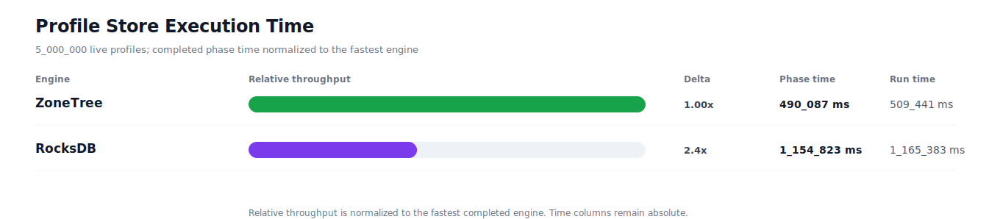
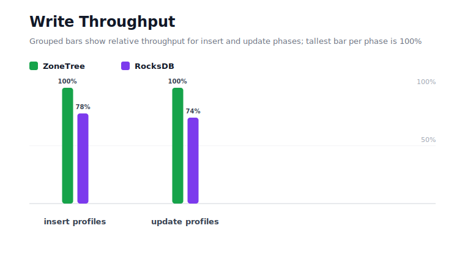
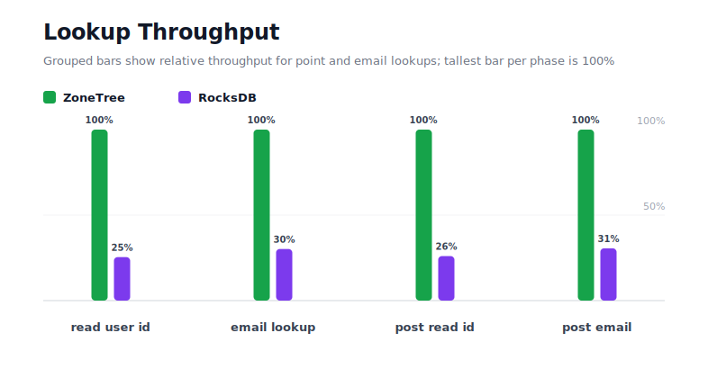
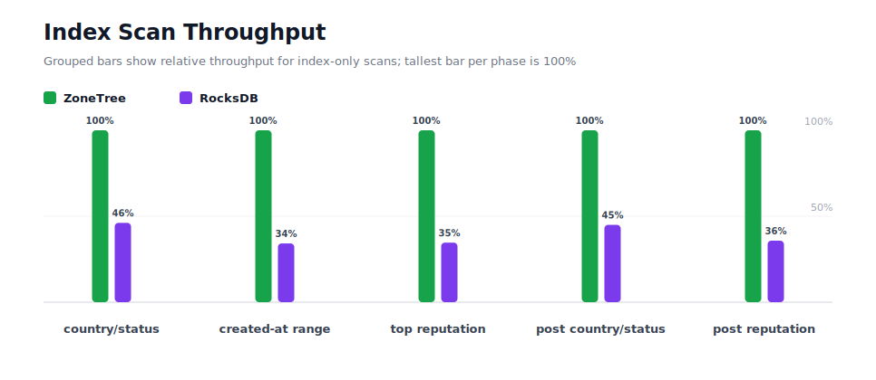
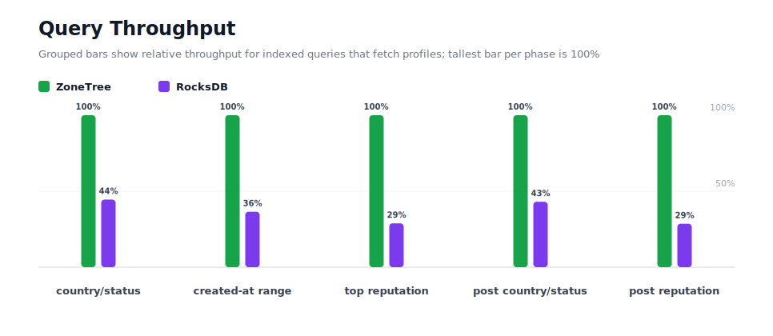
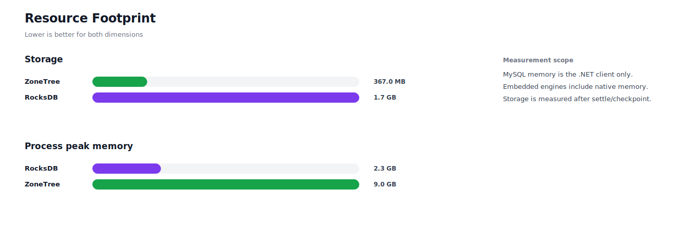

# Benchmark 5M Profiles - Windows

## Charts

### Execution Time

### Write Throughput

### Lookup Throughput

### Index Scan Throughput

### Query Throughput

### Resource Footprint

## Total By Engine

| Engine | Status | Run time | Completed phase time | Pre-read stabilize | Post-update stabilize | Settle | Reopen | Verify | Storage | Process peak memory | Final checksum |
| --- | --- | ---: | ---: | ---: | ---: | ---: | ---: | ---: | ---: | ---: | --- |
| ZoneTree | Completed | 509_441 ms | 490_087 ms | 6_771 ms | 11_155 ms | 22 ms | 501 ms | 8 ms | 367.0 MB | 9.0 GB | `46D8A7E801AF2C78` |
| RocksDB | Completed | 1_165_383 ms | 1_154_823 ms | 4_015 ms | 5_331 ms | 0 ms | 52 ms | 737 ms | 1.7 GB | 2.3 GB | `46D8A7E801AF2C78` |

## Correctness

Checksum validation passed across completed engines: ZoneTree, RocksDB.

## Interpretation Notes

* This benchmark measures live single-operation profile inserts, updates, reads, and indexed queries.
* ZoneTree and RocksDB secondary indexes are maintained by the benchmark application using separate stores.
* Embedded engines run in the benchmark process.
* Completed phase time is the sum of measured workload phases. Run time also includes initialization, stabilization, settle/checkpoint, reopen, verification, and reporting overhead.
* The write throughput chart includes raw write phases and derived write-readiness bars that add the following stabilization phase.
* Storage is measured after each engine settles or checkpoints its data.
* Process peak memory is measured for the benchmark process.

## Write Readiness

| Engine | Insert | Pre-read stabilize | Insert + stabilize | Insert ready throughput | Update | Post-update stabilize | Update + stabilize | Update ready throughput |
| --- | ---: | ---: | ---: | ---: | ---: | ---: | ---: | ---: |
| ZoneTree | 42_810 ms | 6_771 ms | 49_581 ms | 100_845/s | 111_702 ms | 11_155 ms | 122_857 ms | 40_698/s |
| RocksDB | 55_004 ms | 4_015 ms | 59_019 ms | 84_718/s | 150_508 ms | 5_331 ms | 155_839 ms | 32_084/s |

## Phase Results

### ZoneTree

| Phase | Operations | Time | Throughput | Checksum |
| --- | ---: | ---: | ---: | --- |
| insert profiles | 5_000_000 | 42_810 ms | 116_796/s | `1CE7E98CB02A5BE5` |
| read by user id | 5_000_000 | 6_737 ms | 742_140/s | `AEA5A1780B272814` |
| lookup by email | 5_000_000 | 16_416 ms | 304_577/s | `8C938BAD6D81DE32` |
| scan country/status index | 1_250_000 | 6_560 ms | 190_562/s | `14F9C1B4EC5C77A4` |
| query country/status | 1_250_000 | 61_176 ms | 20_433/s | `BE695CC5C1575C79` |
| scan created-at index | 1_250_000 | 8_915 ms | 140_206/s | `D829C2BE1D8D7CE9` |
| query created-at range | 1_250_000 | 60_794 ms | 20_561/s | `9522258E5C41C535` |
| scan top reputation index | 1_250_000 | 4_510 ms | 277_156/s | `57554D37E1C53C65` |
| query top reputation | 1_250_000 | 37_803 ms | 33_066/s | `C5D2EF10F82C5265` |
| update profiles | 5_000_000 | 111_702 ms | 44_762/s | `AD890A8797F25027` |
| post-update read by user id | 5_000_000 | 6_888 ms | 725_882/s | `537ED4CF9543514D` |
| post-update lookup by email | 5_000_000 | 16_607 ms | 301_073/s | `F71390337A010BCF` |
| post-update scan country/status index | 1_250_000 | 6_382 ms | 195_851/s | `0CC5E86584E76211` |
| post-update query country/status | 1_250_000 | 60_626 ms | 20_618/s | `25EFC06A4834C76C` |
| post-update scan top reputation index | 1_250_000 | 4_618 ms | 270_668/s | `99CD00E2A0593D45` |
| post-update query top reputation | 1_250_000 | 37_542 ms | 33_296/s | `BB9901538093B4C5` |

### RocksDB

| Phase | Operations | Time | Throughput | Checksum |
| --- | ---: | ---: | ---: | --- |
| insert profiles | 5_000_000 | 55_004 ms | 90_902/s | `1CE7E98CB02A5BE5` |
| read by user id | 5_000_000 | 26_496 ms | 188_707/s | `AEA5A1780B272814` |
| lookup by email | 5_000_000 | 54_395 ms | 91_921/s | `8C938BAD6D81DE32` |
| scan country/status index | 1_250_000 | 14_214 ms | 87_943/s | `14F9C1B4EC5C77A4` |
| query country/status | 1_250_000 | 137_537 ms | 9_088/s | `BE695CC5C1575C79` |
| scan created-at index | 1_250_000 | 26_076 ms | 47_936/s | `D829C2BE1D8D7CE9` |
| query created-at range | 1_250_000 | 166_609 ms | 7_503/s | `9522258E5C41C535` |
| scan top reputation index | 1_250_000 | 13_020 ms | 96_008/s | `57554D37E1C53C65` |
| query top reputation | 1_250_000 | 130_990 ms | 9_543/s | `C5D2EF10F82C5265` |
| update profiles | 5_000_000 | 150_508 ms | 33_221/s | `AD890A8797F25027` |
| post-update read by user id | 5_000_000 | 26_472 ms | 188_878/s | `537ED4CF9543514D` |
| post-update lookup by email | 5_000_000 | 54_331 ms | 92_028/s | `F71390337A010BCF` |
| post-update scan country/status index | 1_250_000 | 14_191 ms | 88_082/s | `0CC5E86584E76211` |
| post-update query country/status | 1_250_000 | 140_827 ms | 8_876/s | `25EFC06A4834C76C` |
| post-update scan top reputation index | 1_250_000 | 12_906 ms | 96_856/s | `99CD00E2A0593D45` |
| post-update query top reputation | 1_250_000 | 131_247 ms | 9_524/s | `BB9901538093B4C5` |

## Configuration

* Profiles: 5_000_000
* Profile writes: individual operations
* UserId reads: 5_000_000
* Email lookups: 5_000_000
* Query count: 1_250_000
* Profile updates: 5_000_000
* Post-update UserId reads: 5_000_000
* Post-update email lookups: 5_000_000
* Post-update query count: 1_250_000
* Query limit: 100
* Seed: 570123434
* Timeout: 120_000 seconds per engine

## Environment

* OS: Microsoft Windows 10.0.26200
* Architecture: X64
* .NET: 10.0.6
* CPU: Intel(R) Core(TM) Ultra 7 265KF
* Logical processors: 20
* Total available memory: 63.6 GB
* Initial process working set: 369.0 MB

## Engine Settings

### ZoneTree

* MutableSegmentMaxItemCount: 250000
* SparseArrayStepSize: 16
* KeyCacheSize: 1024
* ValueCacheSize: 1024
* IteratorPrefetchSize: 16
* BlockCacheLifeTime: 1 minutes
* ReadStabilization: Settle before read/query phases

### RocksDB

* Databases: profiles,email-index,country-status-index,created-at-index,reputation-index
* Compression: Zstd
* WriteBufferMb: 1024
* MaxWriteBufferNumber: 4
* WriteSync: false
* ReadStabilization: Compact before read/query phases

## Durability Settings

* ZoneTree: AsyncCompressed WAL default; MutableSegmentMaxItemCount=250000; SparseArrayStepSize=16; KeyCacheSize=1024; ValueCacheSize=1024; IteratorPrefetchSize=16; BlockCacheLifeTime=1 minutes; application-managed secondary indexes; background maintainers enabled.
* RocksDB: WAL enabled; five separate RocksDB instances; no WriteBatch across indexes; compression=Zstd; write_buffer_size=1024 MB per database; max_write_buffer_number=4.
