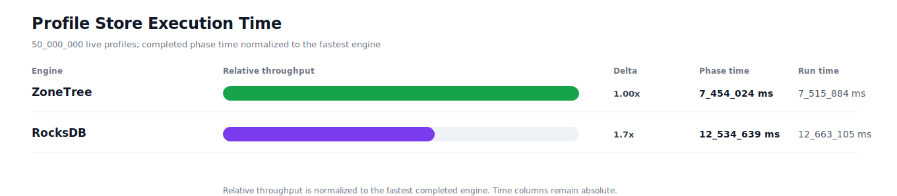
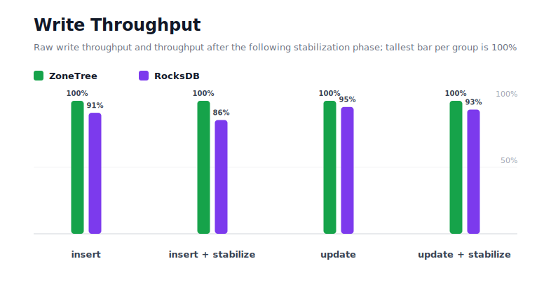
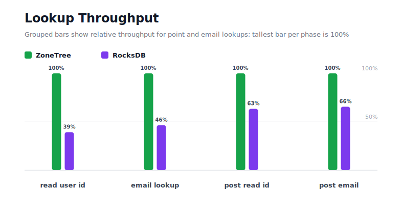
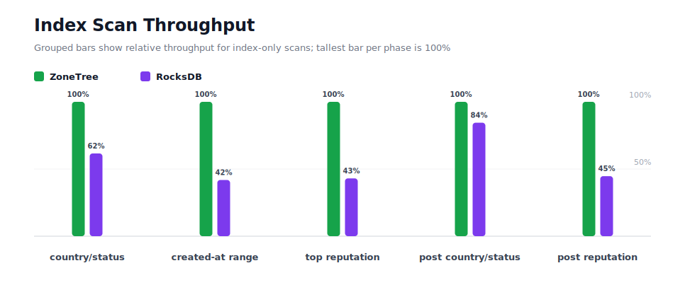
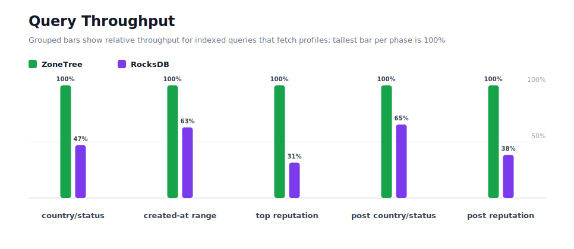
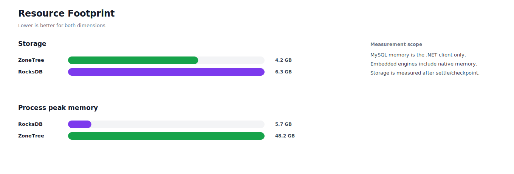

# Benchmark 50M Profiles - Windows

## Charts

### Execution Time

### Write Throughput

### Lookup Throughput

### Index Scan Throughput

### Query Throughput

### Resource Footprint

## Total By Engine

| Engine | Status | Run time | Completed phase time | Pre-read stabilize | Post-update stabilize | Settle | Reopen | Verify | Storage | Process peak memory | Final checksum |
| --- | --- | ---: | ---: | ---: | ---: | ---: | ---: | ---: | ---: | ---: | --- |
| ZoneTree | Completed | 7_515_884 ms | 7_454_024 ms | 21_054 ms | 17_930 ms | 21 ms | 3_605 ms | 18_228 ms | 4.2 GB | 48.2 GB | `5945B5B5E31290C6` |
| RocksDB | Completed | 12_663_105 ms | 12_534_639 ms | 59_449 ms | 59_523 ms | 0 ms | 64 ms | 8_977 ms | 6.3 GB | 5.7 GB | `5945B5B5E31290C6` |

## Correctness

Checksum validation passed across completed engines: ZoneTree, RocksDB.

## Interpretation Notes

* This benchmark measures live single-operation profile inserts, updates, reads, and indexed queries.
* ZoneTree and RocksDB secondary indexes are maintained by the benchmark application using separate stores.
* Embedded engines run in the benchmark process.
* Completed phase time is the sum of measured workload phases. Run time also includes initialization, stabilization, settle/checkpoint, reopen, verification, and reporting overhead.
* The write throughput chart includes raw write phases and derived write-readiness bars that add the following stabilization phase.
* Storage is measured after each engine settles or checkpoints its data.
* Process peak memory is measured for the benchmark process.

## Write Readiness

| Engine | Insert | Pre-read stabilize | Insert + stabilize | Insert ready throughput | Update | Post-update stabilize | Update + stabilize | Update ready throughput |
| --- | ---: | ---: | ---: | ---: | ---: | ---: | ---: | ---: |
| ZoneTree | 498_353 ms | 21_054 ms | 519_406 ms | 96_264/s | 1_812_411 ms | 17_930 ms | 1_830_341 ms | 27_317/s |
| RocksDB | 547_750 ms | 59_449 ms | 607_199 ms | 82_345/s | 1_900_350 ms | 59_523 ms | 1_959_874 ms | 25_512/s |

## Phase Results

### ZoneTree

| Phase | Operations | Time | Throughput | Checksum |
| --- | ---: | ---: | ---: | --- |
| insert profiles | 50_000_000 | 498_353 ms | 100_331/s | `529FAF3D703B3AA5` |
| read by user id | 50_000_000 | 131_118 ms | 381_336/s | `8E8D2ACFC21FB575` |
| lookup by email | 50_000_000 | 304_148 ms | 164_394/s | `56123BF63C522B80` |
| scan country/status index | 12_500_000 | 88_618 ms | 141_055/s | `6854338181DB6593` |
| query country/status | 12_500_000 | 653_174 ms | 19_137/s | `C136508DF3B9DC96` |
| scan created-at index | 12_500_000 | 115_844 ms | 107_904/s | `A9AA867AEE9CC49D` |
| query created-at range | 12_500_000 | 1_097_338 ms | 11_391/s | `BD9340B1F0462E6A` |
| scan top reputation index | 12_500_000 | 54_409 ms | 229_742/s | `C3B61168322AA3E5` |
| query top reputation | 12_500_000 | 429_269 ms | 29_119/s | `317FA8460D5113A5` |
| update profiles | 50_000_000 | 1_812_411 ms | 27_588/s | `21F3E3EC5EA52C34` |
| post-update read by user id | 50_000_000 | 218_104 ms | 229_248/s | `8D911BB787B5674E` |
| post-update lookup by email | 50_000_000 | 436_263 ms | 114_610/s | `A03BB072BD1AE5DF` |
| post-update scan country/status index | 12_500_000 | 121_619 ms | 102_780/s | `0099B00EF08970CC` |
| post-update query country/status | 12_500_000 | 922_684 ms | 13_547/s | `933C3CB3A2A90233` |
| post-update scan top reputation index | 12_500_000 | 57_620 ms | 216_938/s | `41210EF7E182E625` |
| post-update query top reputation | 12_500_000 | 513_053 ms | 24_364/s | `56E59EBFD7C3C965` |

### RocksDB

| Phase | Operations | Time | Throughput | Checksum |
| --- | ---: | ---: | ---: | --- |
| insert profiles | 50_000_000 | 547_750 ms | 91_282/s | `529FAF3D703B3AA5` |
| read by user id | 50_000_000 | 334_090 ms | 149_660/s | `8E8D2ACFC21FB575` |
| lookup by email | 50_000_000 | 654_556 ms | 76_388/s | `56123BF63C522B80` |
| scan country/status index | 12_500_000 | 143_920 ms | 86_854/s | `6854338181DB6593` |
| query country/status | 12_500_000 | 1_393_218 ms | 8_972/s | `C136508DF3B9DC96` |
| scan created-at index | 12_500_000 | 276_987 ms | 45_128/s | `A9AA867AEE9CC49D` |
| query created-at range | 12_500_000 | 1_750_356 ms | 7_141/s | `BD9340B1F0462E6A` |
| scan top reputation index | 12_500_000 | 126_504 ms | 98_811/s | `C3B61168322AA3E5` |
| query top reputation | 12_500_000 | 1_368_968 ms | 9_131/s | `317FA8460D5113A5` |
| update profiles | 50_000_000 | 1_900_350 ms | 26_311/s | `21F3E3EC5EA52C34` |
| post-update read by user id | 50_000_000 | 344_151 ms | 145_285/s | `8D911BB787B5674E` |
| post-update lookup by email | 50_000_000 | 665_626 ms | 75_117/s | `A03BB072BD1AE5DF` |
| post-update scan country/status index | 12_500_000 | 144_017 ms | 86_795/s | `0099B00EF08970CC` |
| post-update query country/status | 12_500_000 | 1_414_680 ms | 8_836/s | `933C3CB3A2A90233` |
| post-update scan top reputation index | 12_500_000 | 128_956 ms | 96_932/s | `41210EF7E182E625` |
| post-update query top reputation | 12_500_000 | 1_340_509 ms | 9_325/s | `56E59EBFD7C3C965` |

## Configuration

* Profiles: 50_000_000
* Profile writes: individual operations
* UserId reads: 50_000_000
* Email lookups: 50_000_000
* Query count: 12_500_000
* Profile updates: 50_000_000
* Post-update UserId reads: 50_000_000
* Post-update email lookups: 50_000_000
* Post-update query count: 12_500_000
* Query limit: 100
* Seed: 570123434
* Timeout: 120_000 seconds per engine

## Environment

* OS: Microsoft Windows 10.0.26200
* Architecture: X64
* .NET: 10.0.6
* CPU: Intel(R) Core(TM) Ultra 7 265KF
* Logical processors: 20
* Total available memory: 63.6 GB
* Initial process working set: 3.3 GB

## Engine Settings

### ZoneTree

* MutableSegmentMaxItemCount: 250000
* SparseArrayStepSize: 16
* KeyCacheSize: 1024
* ValueCacheSize: 1024
* IteratorPrefetchSize: 16
* BlockCacheLifeTime: 1 minutes
* BottomMergePolicy: Full bottom merge when bottom segment count exceeds 1
* ReadStabilization: Settle before read/query phases

### RocksDB

* Databases: profiles,email-index,country-status-index,created-at-index,reputation-index
* Compression: Zstd
* WriteBufferMb: 1024
* MaxWriteBufferNumber: 4
* WriteSync: false
* ReadStabilization: Compact before read/query phases

## Durability Settings

* ZoneTree: AsyncCompressed WAL default; MutableSegmentMaxItemCount=250000; SparseArrayStepSize=16; KeyCacheSize=1024; ValueCacheSize=1024; IteratorPrefetchSize=16; BlockCacheLifeTime=1 minutes; application-managed secondary indexes; background maintainers enabled.
* RocksDB: WAL enabled; five separate RocksDB instances; no WriteBatch across indexes; compression=Zstd; write_buffer_size=1024 MB per database; max_write_buffer_number=4.
