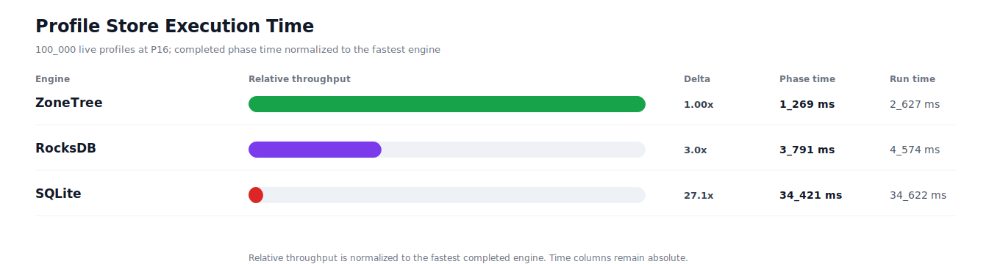
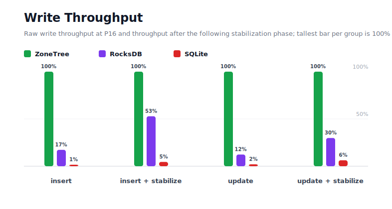
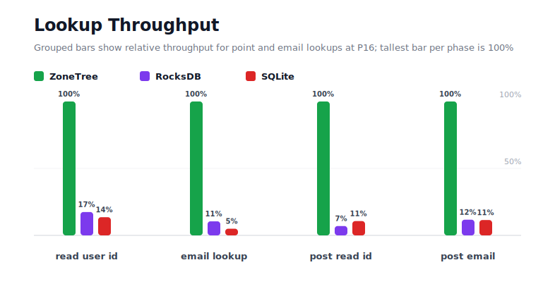
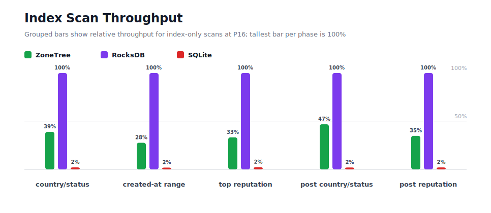
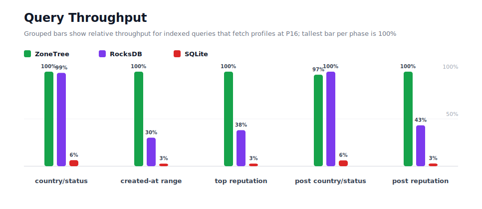
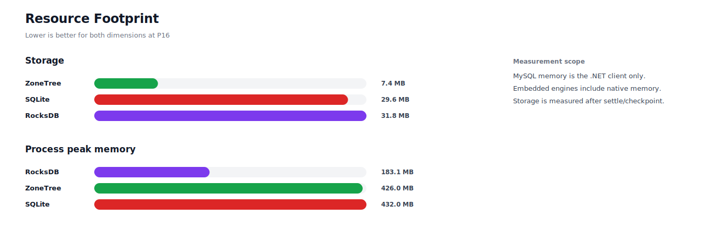

# Benchmark 100K Profiles / P16 - Windows

## Charts

### Execution Time

### Write Throughput

### Lookup Throughput

### Index Scan Throughput

### Query Throughput

### Resource Footprint

## Total By Engine

| Engine | Status | Run time | Completed phase time | Pre-read stabilize | Post-update stabilize | Settle | Reopen | Verify | Storage | Process peak memory | Final checksum |
| --- | --- | ---: | ---: | ---: | ---: | ---: | ---: | ---: | ---: | ---: | --- |
| ZoneTree | Completed | 2_627 ms | 1_269 ms | 279 ms | 209 ms | 13 ms | 78 ms | 11 ms | 7.4 MB | 426.0 MB | `1C7232F217FD84C5` |
| RocksDB | Completed | 4_574 ms | 3_791 ms | 182 ms | 233 ms | 1 ms | 49 ms | 18 ms | 31.8 MB | 183.1 MB | `1C7232F217FD84C5` |
| SQLite | Completed | 34_622 ms | 34_421 ms | n/a | n/a | 81 ms | 1 ms | 5 ms | 29.6 MB | 432.0 MB | `1C7232F217FD84C5` |

## Correctness

Checksum validation passed across completed engines: ZoneTree, RocksDB, SQLite.

## Interpretation Notes

* This benchmark measures live single-operation profile inserts, updates, reads, and indexed queries.
* ZoneTree and RocksDB secondary indexes are maintained by the benchmark application using separate stores.
* SQLite maintains secondary indexes inside the database engine.
* Embedded engines run in the benchmark process.
* Completed phase time is the sum of measured workload phases. Run time also includes initialization, stabilization, settle/checkpoint, reopen, verification, and reporting overhead.
* The write throughput chart includes raw write phases and derived write-readiness bars that add the following stabilization phase.
* Storage is measured after each engine settles or checkpoints its data.
* Process peak memory is measured for the benchmark process.

## Write Readiness

| Engine | Insert | Pre-read stabilize | Insert + stabilize | Insert ready throughput | Update | Post-update stabilize | Update + stabilize | Update ready throughput |
| --- | ---: | ---: | ---: | ---: | ---: | ---: | ---: | ---: |
| ZoneTree | 89 ms | 279 ms | 368 ms | 271_387/s | 98 ms | 209 ms | 307 ms | 325_213/s |
| RocksDB | 516 ms | 182 ms | 698 ms | 143_321/s | 798 ms | 233 ms | 1_030 ms | 97_042/s |
| SQLite | 8_124 ms | n/a | 8_124 ms | 12_309/s | 4_910 ms | n/a | 4_910 ms | 20_365/s |

## Phase Results

### ZoneTree

| Phase | Operations | Time | Throughput | Checksum |
| --- | ---: | ---: | ---: | --- |
| insert profiles | 100_000 | 89 ms | 1_121_191/s | `97D1578AB310103B` |
| read by user id | 100_000 | 62 ms | 1_620_323/s | `A8C120E850D25A96` |
| lookup by email | 100_000 | 34 ms | 2_962_094/s | `80AF4F910EF0BB82` |
| scan country/status index | 25_000 | 67 ms | 375_089/s | `4B8B9AF04E34827B` |
| query country/status | 25_000 | 191 ms | 130_924/s | `1DBF6AA59C11B6CE` |
| scan created-at index | 25_000 | 82 ms | 303_478/s | `6ADAA8B323030955` |
| query created-at range | 25_000 | 82 ms | 304_767/s | `84DB32B4F7F819D7` |
| scan top reputation index | 25_000 | 59 ms | 421_206/s | `B4B15C95B8B7F255` |
| query top reputation | 25_000 | 71 ms | 351_681/s | `033096858774A1D5` |
| update profiles | 100_000 | 98 ms | 1_015_534/s | `B89210BB6E1F6BF1` |
| post-update read by user id | 100_000 | 25 ms | 4_051_355/s | `E193CDCF8B07F585` |
| post-update lookup by email | 100_000 | 38 ms | 2_614_577/s | `10AA7E4F49CB88ED` |
| post-update scan country/status index | 25_000 | 51 ms | 486_044/s | `8F87368BDEB6B94D` |
| post-update query country/status | 25_000 | 188 ms | 132_933/s | `380F06B898A0BD21` |
| post-update scan top reputation index | 25_000 | 55 ms | 456_522/s | `5B74798E2A24B945` |
| post-update query top reputation | 25_000 | 77 ms | 325_990/s | `66D86EA0F1F31EA5` |

### RocksDB

| Phase | Operations | Time | Throughput | Checksum |
| --- | ---: | ---: | ---: | --- |
| insert profiles | 100_000 | 516 ms | 193_880/s | `97D1578AB310103B` |
| read by user id | 100_000 | 354 ms | 282_803/s | `A8C120E850D25A96` |
| lookup by email | 100_000 | 321 ms | 311_202/s | `80AF4F910EF0BB82` |
| scan country/status index | 25_000 | 26 ms | 962_938/s | `4B8B9AF04E34827B` |
| query country/status | 25_000 | 193 ms | 129_223/s | `1DBF6AA59C11B6CE` |
| scan created-at index | 25_000 | 23 ms | 1_099_307/s | `6ADAA8B323030955` |
| query created-at range | 25_000 | 272 ms | 91_909/s | `84DB32B4F7F819D7` |
| scan top reputation index | 25_000 | 20 ms | 1_269_100/s | `B4B15C95B8B7F255` |
| query top reputation | 25_000 | 187 ms | 133_977/s | `033096858774A1D5` |
| update profiles | 100_000 | 798 ms | 125_387/s | `B89210BB6E1F6BF1` |
| post-update read by user id | 100_000 | 353 ms | 283_049/s | `E193CDCF8B07F585` |
| post-update lookup by email | 100_000 | 327 ms | 306_236/s | `10AA7E4F49CB88ED` |
| post-update scan country/status index | 25_000 | 24 ms | 1_038_383/s | `8F87368BDEB6B94D` |
| post-update query country/status | 25_000 | 182 ms | 137_369/s | `380F06B898A0BD21` |
| post-update scan top reputation index | 25_000 | 19 ms | 1_310_960/s | `5B74798E2A24B945` |
| post-update query top reputation | 25_000 | 177 ms | 140_928/s | `66D86EA0F1F31EA5` |

### SQLite

| Phase | Operations | Time | Throughput | Checksum |
| --- | ---: | ---: | ---: | --- |
| insert profiles | 100_000 | 8_124 ms | 12_309/s | `97D1578AB310103B` |
| read by user id | 100_000 | 454 ms | 220_150/s | `A8C120E850D25A96` |
| lookup by email | 100_000 | 677 ms | 147_684/s | `80AF4F910EF0BB82` |
| scan country/status index | 25_000 | 1_258 ms | 19_880/s | `4B8B9AF04E34827B` |
| query country/status | 25_000 | 2_996 ms | 8_345/s | `1DBF6AA59C11B6CE` |
| scan created-at index | 25_000 | 1_231 ms | 20_316/s | `6ADAA8B323030955` |
| query created-at range | 25_000 | 2_978 ms | 8_394/s | `84DB32B4F7F819D7` |
| scan top reputation index | 25_000 | 879 ms | 28_437/s | `B4B15C95B8B7F255` |
| query top reputation | 25_000 | 2_551 ms | 9_799/s | `033096858774A1D5` |
| update profiles | 100_000 | 4_910 ms | 20_365/s | `B89210BB6E1F6BF1` |
| post-update read by user id | 100_000 | 231 ms | 432_788/s | `E193CDCF8B07F585` |
| post-update lookup by email | 100_000 | 334 ms | 299_678/s | `10AA7E4F49CB88ED` |
| post-update scan country/status index | 25_000 | 1_226 ms | 20_393/s | `8F87368BDEB6B94D` |
| post-update query country/status | 25_000 | 2_956 ms | 8_456/s | `380F06B898A0BD21` |
| post-update scan top reputation index | 25_000 | 943 ms | 26_525/s | `5B74798E2A24B945` |
| post-update query top reputation | 25_000 | 2_673 ms | 9_353/s | `66D86EA0F1F31EA5` |

## Configuration

* Profiles: 100_000
* Parallelism: 16
* Profile writes: individual operations
* UserId reads: 100_000
* Email lookups: 100_000
* Query count: 25_000
* Profile updates: 100_000
* Post-update UserId reads: 100_000
* Post-update email lookups: 100_000
* Post-update query count: 25_000
* Query limit: 50
* Seed: 570123434
* Timeout: 120_000 seconds per engine

## Environment

* OS: Microsoft Windows 10.0.26200
* Architecture: X64
* .NET: 10.0.6
* CPU: Intel(R) Core(TM) Ultra 7 265KF
* Logical processors: 20
* Total available memory: 63.6 GB
* Initial process working set: 53.6 MB

## Engine Settings

### ZoneTree

* MutableSegmentMaxItemCount: 250000
* SparseArrayStepSize: 16
* KeyCacheSize: 1024
* ValueCacheSize: 1024
* IteratorPrefetchSize: 16
* BlockCacheLifeTime: 1 minutes
* BottomMergePolicy: Full bottom merge when bottom segment count exceeds 1
* ReadStabilization: Settle before read/query phases

### RocksDB

* Databases: profiles,email-index,country-status-index,created-at-index,reputation-index
* Compression: Zstd
* WriteBufferMb: 1024
* MaxWriteBufferNumber: 4
* WriteSync: false
* ReadStabilization: Compact before read/query phases

### SQLite

* JournalMode: WAL
* Synchronous: NORMAL
* CacheMb: 1024
* MmapMb: 1024
* TempStore: MEMORY

## Durability Settings

* ZoneTree: AsyncCompressed WAL default; MutableSegmentMaxItemCount=250000; SparseArrayStepSize=16; KeyCacheSize=1024; ValueCacheSize=1024; IteratorPrefetchSize=16; BlockCacheLifeTime=1 minutes; application-managed secondary indexes; background maintainers enabled.
* RocksDB: WAL enabled; five separate RocksDB instances; no WriteBatch across indexes; compression=Zstd; write_buffer_size=1024 MB per database; max_write_buffer_number=4.
* SQLite: WAL journal mode; synchronous=NORMAL; cache=1024 MB; mmap=1024 MB; native SQL indexes; single-row writes use autocommit.
