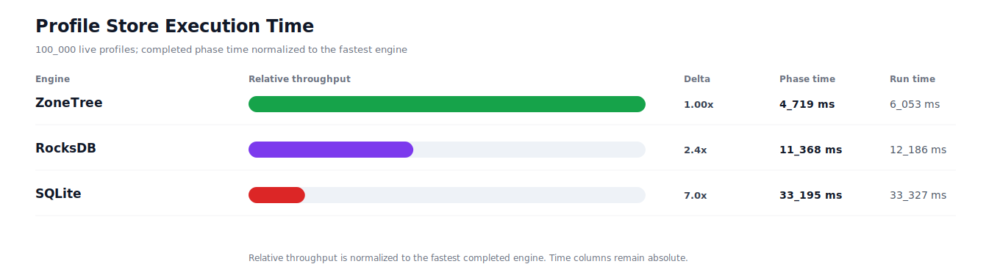
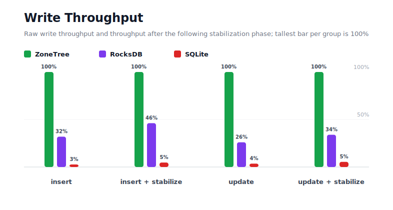
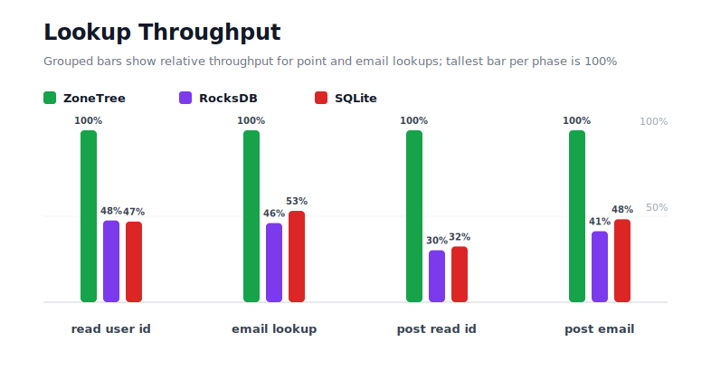
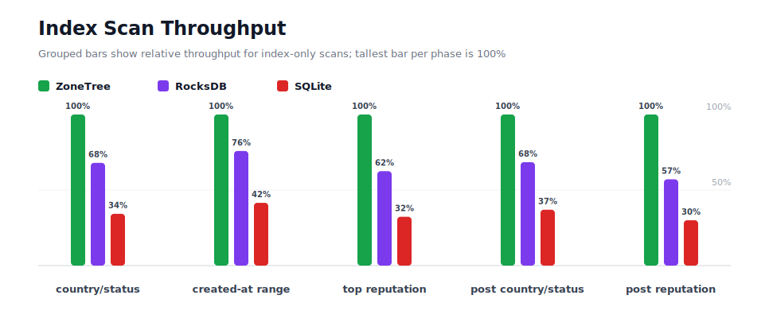
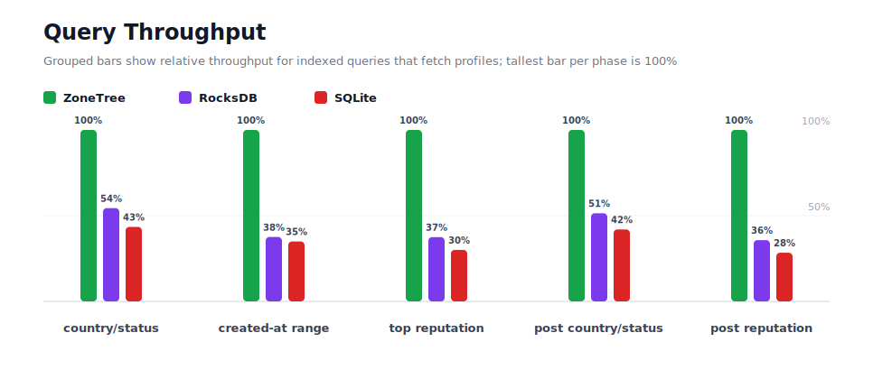
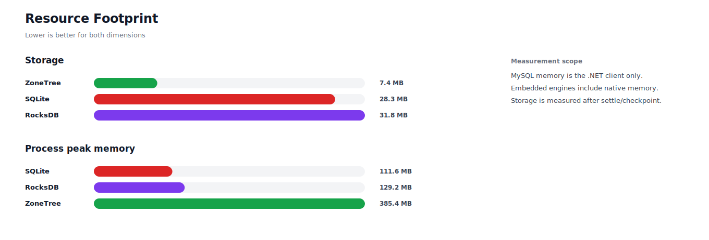

# Benchmark 100K Profiles - Windows

## Charts

### Execution Time

### Write Throughput

### Lookup Throughput

### Index Scan Throughput

### Query Throughput

### Resource Footprint

## Total By Engine

| Engine | Status | Run time | Completed phase time | Pre-read stabilize | Post-update stabilize | Settle | Reopen | Verify | Storage | Process peak memory | Final checksum |
| --- | --- | ---: | ---: | ---: | ---: | ---: | ---: | ---: | ---: | ---: | --- |
| ZoneTree | Completed | 6_053 ms | 4_719 ms | 220 ms | 212 ms | 14 ms | 83 ms | 12 ms | 7.4 MB | 385.4 MB | `1C7232F217FD84C5` |
| RocksDB | Completed | 12_186 ms | 11_368 ms | 196 ms | 259 ms | 1 ms | 59 ms | 19 ms | 31.8 MB | 129.2 MB | `1C7232F217FD84C5` |
| SQLite | Completed | 33_327 ms | 33_195 ms | n/a | n/a | 12 ms | 1 ms | 9 ms | 28.3 MB | 111.6 MB | `1C7232F217FD84C5` |

## Correctness

Checksum validation passed across completed engines: ZoneTree, RocksDB, SQLite.

## Interpretation Notes

* This benchmark measures live single-operation profile inserts, updates, reads, and indexed queries.
* ZoneTree and RocksDB secondary indexes are maintained by the benchmark application using separate stores.
* SQLite maintains secondary indexes inside the database engine.
* Embedded engines run in the benchmark process.
* Completed phase time is the sum of measured workload phases. Run time also includes initialization, stabilization, settle/checkpoint, reopen, verification, and reporting overhead.
* The write throughput chart includes raw write phases and derived write-readiness bars that add the following stabilization phase.
* Storage is measured after each engine settles or checkpoints its data.
* Process peak memory is measured for the benchmark process.

## Write Readiness

| Engine | Insert | Pre-read stabilize | Insert + stabilize | Insert ready throughput | Update | Post-update stabilize | Update + stabilize | Update ready throughput |
| --- | ---: | ---: | ---: | ---: | ---: | ---: | ---: | ---: |
| ZoneTree | 292 ms | 220 ms | 512 ms | 195_193/s | 405 ms | 212 ms | 617 ms | 162_120/s |
| RocksDB | 914 ms | 196 ms | 1_110 ms | 90_078/s | 1_558 ms | 259 ms | 1_817 ms | 55_023/s |
| SQLite | 10_902 ms | n/a | 10_902 ms | 9_172/s | 11_415 ms | n/a | 11_415 ms | 8_760/s |

## Phase Results

### ZoneTree

| Phase | Operations | Time | Throughput | Checksum |
| --- | ---: | ---: | ---: | --- |
| insert profiles | 100_000 | 292 ms | 342_591/s | `37C6E9056D5AC045` |
| read by user id | 100_000 | 130 ms | 771_144/s | `3C75C3A02940F75F` |
| lookup by email | 100_000 | 188 ms | 531_084/s | `8EACBB38279A3446` |
| scan country/status index | 25_000 | 107 ms | 233_250/s | `E552753D44C21BA5` |
| query country/status | 25_000 | 723 ms | 34_582/s | `EA8772E3AB058C58` |
| scan created-at index | 25_000 | 131 ms | 191_473/s | `FC8BCFD3FAD1BCC5` |
| query created-at range | 25_000 | 532 ms | 46_976/s | `C3B4316ADCB40DA9` |
| scan top reputation index | 25_000 | 85 ms | 293_848/s | `284B0B82839B0CE5` |
| query top reputation | 25_000 | 478 ms | 52_356/s | `1236496CCF0CCC4D` |
| update profiles | 100_000 | 405 ms | 246_738/s | `FA3F051A503B5D43` |
| post-update read by user id | 100_000 | 85 ms | 1_174_314/s | `2AD19D2C2B2F8F3D` |
| post-update lookup by email | 100_000 | 168 ms | 596_338/s | `6B8148031A502EBA` |
| post-update scan country/status index | 25_000 | 115 ms | 216_665/s | `422CBC91A8A0F391` |
| post-update query country/status | 25_000 | 734 ms | 34_075/s | `535B4B15066136A1` |
| post-update scan top reputation index | 25_000 | 82 ms | 306_003/s | `A9EB6CCD50444945` |
| post-update query top reputation | 25_000 | 465 ms | 53_787/s | `642610547F49FEED` |

### RocksDB

| Phase | Operations | Time | Throughput | Checksum |
| --- | ---: | ---: | ---: | --- |
| insert profiles | 100_000 | 914 ms | 109_375/s | `37C6E9056D5AC045` |
| read by user id | 100_000 | 273 ms | 366_677/s | `3C75C3A02940F75F` |
| lookup by email | 100_000 | 409 ms | 244_462/s | `8EACBB38279A3446` |
| scan country/status index | 25_000 | 158 ms | 158_575/s | `E552753D44C21BA5` |
| query country/status | 25_000 | 1_329 ms | 18_808/s | `EA8772E3AB058C58` |
| scan created-at index | 25_000 | 172 ms | 145_233/s | `FC8BCFD3FAD1BCC5` |
| query created-at range | 25_000 | 1_417 ms | 17_647/s | `C3B4316ADCB40DA9` |
| scan top reputation index | 25_000 | 136 ms | 183_613/s | `284B0B82839B0CE5` |
| query top reputation | 25_000 | 1_274 ms | 19_621/s | `1236496CCF0CCC4D` |
| update profiles | 100_000 | 1_558 ms | 64_169/s | `FA3F051A503B5D43` |
| post-update read by user id | 100_000 | 282 ms | 354_911/s | `2AD19D2C2B2F8F3D` |
| post-update lookup by email | 100_000 | 406 ms | 246_236/s | `6B8148031A502EBA` |
| post-update scan country/status index | 25_000 | 169 ms | 148_328/s | `422CBC91A8A0F391` |
| post-update query country/status | 25_000 | 1_427 ms | 17_518/s | `535B4B15066136A1` |
| post-update scan top reputation index | 25_000 | 143 ms | 174_767/s | `A9EB6CCD50444945` |
| post-update query top reputation | 25_000 | 1_301 ms | 19_215/s | `642610547F49FEED` |

### SQLite

| Phase | Operations | Time | Throughput | Checksum |
| --- | ---: | ---: | ---: | --- |
| insert profiles | 100_000 | 10_902 ms | 9_172/s | `37C6E9056D5AC045` |
| read by user id | 100_000 | 276 ms | 361_747/s | `3C75C3A02940F75F` |
| lookup by email | 100_000 | 355 ms | 282_078/s | `8EACBB38279A3446` |
| scan country/status index | 25_000 | 313 ms | 79_967/s | `E552753D44C21BA5` |
| query country/status | 25_000 | 1_664 ms | 15_024/s | `EA8772E3AB058C58` |
| scan created-at index | 25_000 | 314 ms | 79_561/s | `FC8BCFD3FAD1BCC5` |
| query created-at range | 25_000 | 1_523 ms | 16_420/s | `C3B4316ADCB40DA9` |
| scan top reputation index | 25_000 | 263 ms | 94_966/s | `284B0B82839B0CE5` |
| query top reputation | 25_000 | 1_590 ms | 15_719/s | `1236496CCF0CCC4D` |
| update profiles | 100_000 | 11_415 ms | 8_760/s | `FA3F051A503B5D43` |
| post-update read by user id | 100_000 | 263 ms | 380_750/s | `2AD19D2C2B2F8F3D` |
| post-update lookup by email | 100_000 | 347 ms | 287_810/s | `6B8148031A502EBA` |
| post-update scan country/status index | 25_000 | 312 ms | 80_107/s | `422CBC91A8A0F391` |
| post-update query country/status | 25_000 | 1_748 ms | 14_302/s | `535B4B15066136A1` |
| post-update scan top reputation index | 25_000 | 272 ms | 91_842/s | `A9EB6CCD50444945` |
| post-update query top reputation | 25_000 | 1_637 ms | 15_270/s | `642610547F49FEED` |

## Configuration

* Profiles: 100_000
* Parallelism: 1
* Profile writes: individual operations
* UserId reads: 100_000
* Email lookups: 100_000
* Query count: 25_000
* Profile updates: 100_000
* Post-update UserId reads: 100_000
* Post-update email lookups: 100_000
* Post-update query count: 25_000
* Query limit: 50
* Seed: 570123434
* Timeout: 120_000 seconds per engine

## Environment

* OS: Microsoft Windows 10.0.26200
* Architecture: X64
* .NET: 10.0.6
* CPU: Intel(R) Core(TM) Ultra 7 265KF
* Logical processors: 20
* Total available memory: 63.6 GB
* Initial process working set: 54.8 MB

## Engine Settings

### ZoneTree

* MutableSegmentMaxItemCount: 250000
* SparseArrayStepSize: 16
* KeyCacheSize: 1024
* ValueCacheSize: 1024
* IteratorPrefetchSize: 16
* BlockCacheLifeTime: 1 minutes
* BottomMergePolicy: Full bottom merge when bottom segment count exceeds 1
* ReadStabilization: Settle before read/query phases

### RocksDB

* Databases: profiles,email-index,country-status-index,created-at-index,reputation-index
* Compression: Zstd
* WriteBufferMb: 1024
* MaxWriteBufferNumber: 4
* WriteSync: false
* ReadStabilization: Compact before read/query phases

### SQLite

* JournalMode: WAL
* Synchronous: NORMAL
* CacheMb: 1024
* MmapMb: 1024
* TempStore: MEMORY

## Durability Settings

* ZoneTree: AsyncCompressed WAL default; MutableSegmentMaxItemCount=250000; SparseArrayStepSize=16; KeyCacheSize=1024; ValueCacheSize=1024; IteratorPrefetchSize=16; BlockCacheLifeTime=1 minutes; application-managed secondary indexes; background maintainers enabled.
* RocksDB: WAL enabled; five separate RocksDB instances; no WriteBatch across indexes; compression=Zstd; write_buffer_size=1024 MB per database; max_write_buffer_number=4.
* SQLite: WAL journal mode; synchronous=NORMAL; cache=1024 MB; mmap=1024 MB; native SQL indexes; single-row writes use autocommit.
