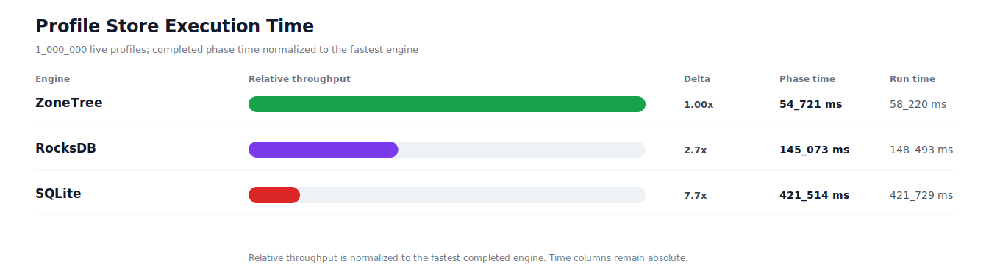
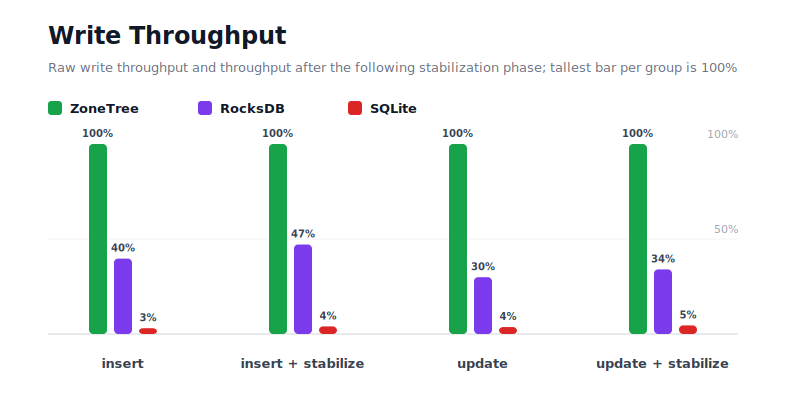
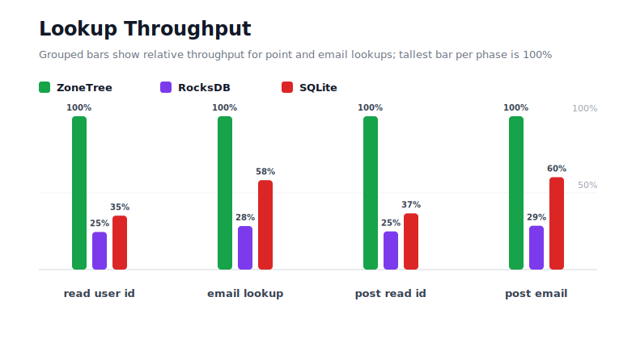
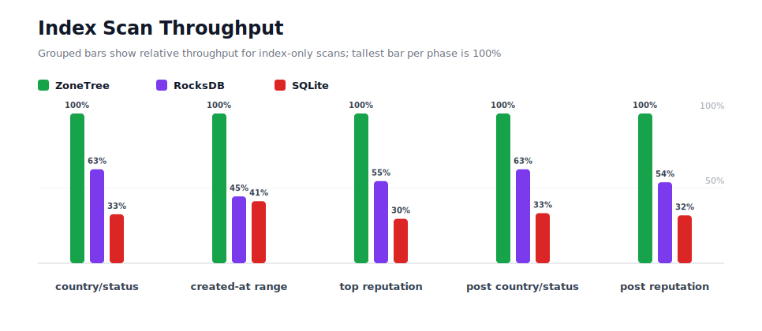
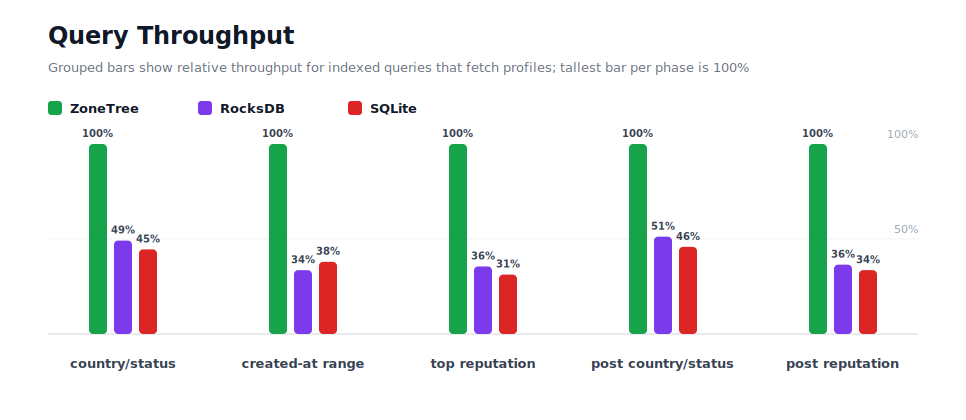
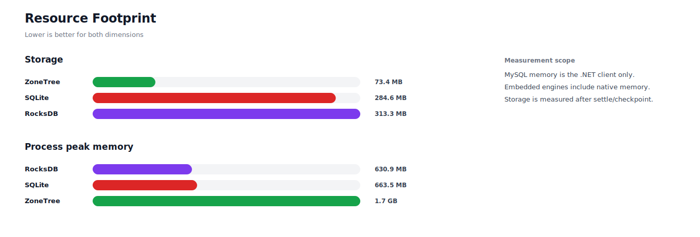

# Benchmark 1M Profiles - Windows

## Charts

### Execution Time

### Write Throughput

### Lookup Throughput

### Index Scan Throughput

### Query Throughput

### Resource Footprint

## Total By Engine

| Engine | Status | Run time | Completed phase time | Pre-read stabilize | Post-update stabilize | Settle | Reopen | Verify | Storage | Process peak memory | Final checksum |
| --- | --- | ---: | ---: | ---: | ---: | ---: | ---: | ---: | ---: | ---: | --- |
| ZoneTree | Completed | 58_220 ms | 54_721 ms | 1_231 ms | 1_539 ms | 16 ms | 113 ms | 12 ms | 73.4 MB | 1.7 GB | `B7578931045C8FC5` |
| RocksDB | Completed | 148_493 ms | 145_073 ms | 1_068 ms | 1_853 ms | 1 ms | 47 ms | 141 ms | 313.3 MB | 630.9 MB | `B7578931045C8FC5` |
| SQLite | Completed | 421_729 ms | 421_514 ms | n/a | n/a | 30 ms | 1 ms | 58 ms | 284.6 MB | 663.5 MB | `B7578931045C8FC5` |

## Correctness

Checksum validation passed across completed engines: ZoneTree, RocksDB, SQLite.

## Interpretation Notes

* This benchmark measures live single-operation profile inserts, updates, reads, and indexed queries.
* ZoneTree and RocksDB secondary indexes are maintained by the benchmark application using separate stores.
* SQLite maintains secondary indexes inside the database engine.
* Embedded engines run in the benchmark process.
* Completed phase time is the sum of measured workload phases. Run time also includes initialization, stabilization, settle/checkpoint, reopen, verification, and reporting overhead.
* The write throughput chart includes raw write phases and derived write-readiness bars that add the following stabilization phase.
* Storage is measured after each engine settles or checkpoints its data.
* Process peak memory is measured for the benchmark process.

## Write Readiness

| Engine | Insert | Pre-read stabilize | Insert + stabilize | Insert ready throughput | Update | Post-update stabilize | Update + stabilize | Update ready throughput |
| --- | ---: | ---: | ---: | ---: | ---: | ---: | ---: | ---: |
| ZoneTree | 3_901 ms | 1_231 ms | 5_132 ms | 194_847/s | 6_654 ms | 1_539 ms | 8_193 ms | 122_056/s |
| RocksDB | 9_830 ms | 1_068 ms | 10_898 ms | 91_758/s | 22_256 ms | 1_853 ms | 24_109 ms | 41_479/s |
| SQLite | 128_306 ms | n/a | 128_306 ms | 7_794/s | 181_530 ms | n/a | 181_530 ms | 5_509/s |

## Phase Results

### ZoneTree

| Phase | Operations | Time | Throughput | Checksum |
| --- | ---: | ---: | ---: | --- |
| insert profiles | 1_000_000 | 3_901 ms | 256_328/s | `70EEB1E90366F6E5` |
| read by user id | 1_000_000 | 1_042 ms | 959_984/s | `0FB577C390019AC8` |
| lookup by email | 1_000_000 | 2_375 ms | 421_135/s | `9C199CC596F7AC10` |
| scan country/status index | 250_000 | 1_025 ms | 243_853/s | `61A2EA3E2821B78E` |
| query country/status | 250_000 | 7_675 ms | 32_575/s | `59430B6E3710B73A` |
| scan created-at index | 250_000 | 1_296 ms | 192_950/s | `5DCF6A52134EE2E1` |
| query created-at range | 250_000 | 6_020 ms | 41_529/s | `F7273374D314AB37` |
| scan top reputation index | 250_000 | 806 ms | 310_067/s | `29FF27B972C9DD05` |
| query top reputation | 250_000 | 5_024 ms | 49_761/s | `BF3EF75489BD5D95` |
| update profiles | 1_000_000 | 6_654 ms | 150_293/s | `2440ADD57E65500B` |
| post-update read by user id | 1_000_000 | 1_066 ms | 937_925/s | `7DB9AA24CC9A8B8E` |
| post-update lookup by email | 1_000_000 | 2_429 ms | 411_723/s | `43569B6DA38ACCB5` |
| post-update scan country/status index | 250_000 | 1_021 ms | 244_799/s | `E81A287B61AC0B4A` |
| post-update query country/status | 250_000 | 8_090 ms | 30_904/s | `187087226FE86156` |
| post-update scan top reputation index | 250_000 | 845 ms | 295_776/s | `2FCAC43A8D128B85` |
| post-update query top reputation | 250_000 | 5_453 ms | 45_849/s | `A983697B4465FA75` |

### RocksDB

| Phase | Operations | Time | Throughput | Checksum |
| --- | ---: | ---: | ---: | --- |
| insert profiles | 1_000_000 | 9_830 ms | 101_726/s | `70EEB1E90366F6E5` |
| read by user id | 1_000_000 | 4_245 ms | 235_578/s | `0FB577C390019AC8` |
| lookup by email | 1_000_000 | 8_361 ms | 119_609/s | `9C199CC596F7AC10` |
| scan country/status index | 250_000 | 1_634 ms | 152_963/s | `61A2EA3E2821B78E` |
| query country/status | 250_000 | 15_608 ms | 16_017/s | `59430B6E3710B73A` |
| scan created-at index | 250_000 | 2_903 ms | 86_121/s | `5DCF6A52134EE2E1` |
| query created-at range | 250_000 | 17_925 ms | 13_947/s | `F7273374D314AB37` |
| scan top reputation index | 250_000 | 1_471 ms | 170_005/s | `29FF27B972C9DD05` |
| query top reputation | 250_000 | 14_131 ms | 17_691/s | `BF3EF75489BD5D95` |
| update profiles | 1_000_000 | 22_256 ms | 44_932/s | `2440ADD57E65500B` |
| post-update read by user id | 1_000_000 | 4_282 ms | 233_528/s | `7DB9AA24CC9A8B8E` |
| post-update lookup by email | 1_000_000 | 8_498 ms | 117_673/s | `43569B6DA38ACCB5` |
| post-update scan country/status index | 250_000 | 1_627 ms | 153_620/s | `E81A287B61AC0B4A` |
| post-update query country/status | 250_000 | 15_794 ms | 15_829/s | `187087226FE86156` |
| post-update scan top reputation index | 250_000 | 1_562 ms | 160_028/s | `2FCAC43A8D128B85` |
| post-update query top reputation | 250_000 | 14_945 ms | 16_728/s | `A983697B4465FA75` |

### SQLite

| Phase | Operations | Time | Throughput | Checksum |
| --- | ---: | ---: | ---: | --- |
| insert profiles | 1_000_000 | 128_306 ms | 7_794/s | `70EEB1E90366F6E5` |
| read by user id | 1_000_000 | 2_962 ms | 337_615/s | `0FB577C390019AC8` |
| lookup by email | 1_000_000 | 4_073 ms | 245_512/s | `9C199CC596F7AC10` |
| scan country/status index | 250_000 | 3_136 ms | 79_731/s | `61A2EA3E2821B78E` |
| query country/status | 250_000 | 17_237 ms | 14_504/s | `59430B6E3710B73A` |
| scan created-at index | 250_000 | 3_127 ms | 79_948/s | `5DCF6A52134EE2E1` |
| query created-at range | 250_000 | 15_845 ms | 15_778/s | `F7273374D314AB37` |
| scan top reputation index | 250_000 | 2_717 ms | 92_015/s | `29FF27B972C9DD05` |
| query top reputation | 250_000 | 16_076 ms | 15_551/s | `BF3EF75489BD5D95` |
| update profiles | 1_000_000 | 181_530 ms | 5_509/s | `2440ADD57E65500B` |
| post-update read by user id | 1_000_000 | 2_909 ms | 343_811/s | `7DB9AA24CC9A8B8E` |
| post-update lookup by email | 1_000_000 | 4_030 ms | 248_126/s | `43569B6DA38ACCB5` |
| post-update scan country/status index | 250_000 | 3_054 ms | 81_872/s | `E81A287B61AC0B4A` |
| post-update query country/status | 250_000 | 17_645 ms | 14_168/s | `187087226FE86156` |
| post-update scan top reputation index | 250_000 | 2_644 ms | 94_559/s | `2FCAC43A8D128B85` |
| post-update query top reputation | 250_000 | 16_224 ms | 15_409/s | `A983697B4465FA75` |

## Configuration

* Profiles: 1_000_000
* Parallelism: 1
* Profile writes: individual operations
* UserId reads: 1_000_000
* Email lookups: 1_000_000
* Query count: 250_000
* Profile updates: 1_000_000
* Post-update UserId reads: 1_000_000
* Post-update email lookups: 1_000_000
* Post-update query count: 250_000
* Query limit: 50
* Seed: 570123434
* Timeout: 120_000 seconds per engine

## Environment

* OS: Microsoft Windows 10.0.26200
* Architecture: X64
* .NET: 10.0.6
* CPU: Intel(R) Core(TM) Ultra 7 265KF
* Logical processors: 20
* Total available memory: 63.6 GB
* Initial process working set: 141.2 MB
* Benchmark version: 1.0.0.0
* ZoneTree version: 1.9.6.0
* Microsoft.Data.Sqlite version: 10.0.0
* SQLite runtime version: 3.50.3
* SQLitePCLRaw.core version: 2.1.11
* SQLitePCLRaw.lib.e_sqlite3 version: 3.50.3
* RocksDbSharp version: 6.2.2
* RocksDbNative version: 6.2.2
* MySqlConnector version: 2.4.0

## Engine Settings

### ZoneTree

* MutableSegmentMaxItemCount: 250000
* SparseArrayStepSize: 16
* KeyCacheSize: 1024
* ValueCacheSize: 1024
* IteratorPrefetchSize: 16
* BlockCacheLifeTime: 1 minutes
* BottomMergePolicy: Full bottom merge when bottom segment count exceeds 1
* ReadStabilization: Settle before read/query phases

### RocksDB

* Databases: profiles,email-index,country-status-index,created-at-index,reputation-index
* Compression: Zstd
* WriteBufferMb: 1024
* MaxWriteBufferNumber: 4
* WriteSync: false
* ReadStabilization: Compact before read/query phases

### SQLite

* JournalMode: WAL
* Synchronous: NORMAL
* CacheMb: 1024
* MmapMb: 1024
* TempStore: MEMORY

## Durability Settings

* ZoneTree: AsyncCompressed WAL default; MutableSegmentMaxItemCount=250000; SparseArrayStepSize=16; KeyCacheSize=1024; ValueCacheSize=1024; IteratorPrefetchSize=16; BlockCacheLifeTime=1 minutes; application-managed secondary indexes; background maintainers enabled.
* RocksDB: WAL enabled; five separate RocksDB instances; no WriteBatch across indexes; compression=Zstd; write_buffer_size=1024 MB per database; max_write_buffer_number=4.
* SQLite: WAL journal mode; synchronous=NORMAL; cache=1024 MB; mmap=1024 MB; native SQL indexes; single-row writes use autocommit.
