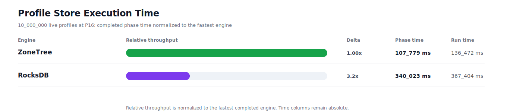
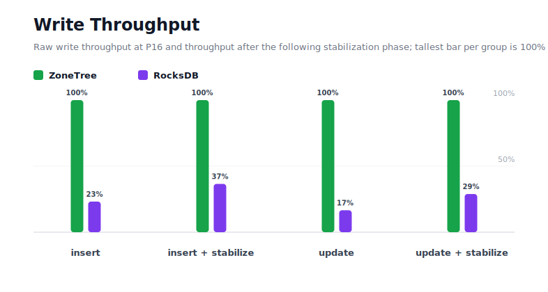
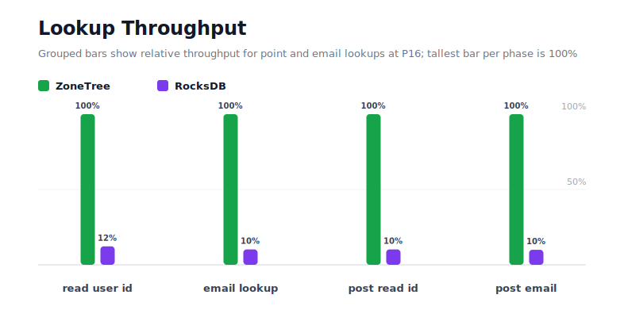
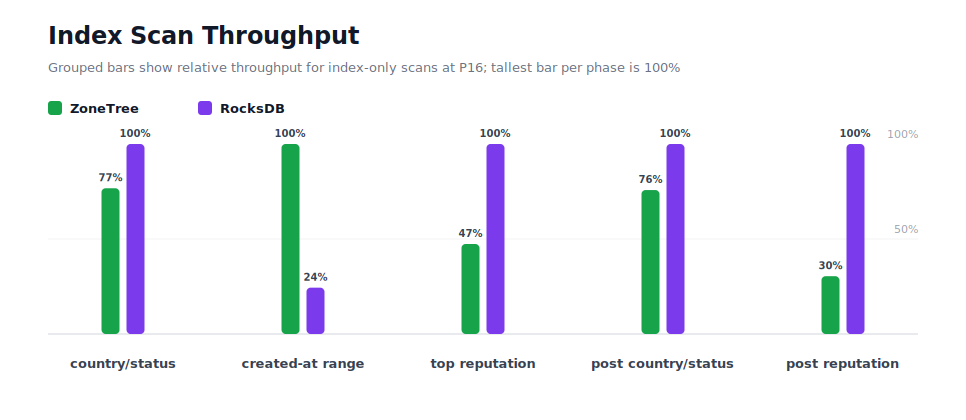
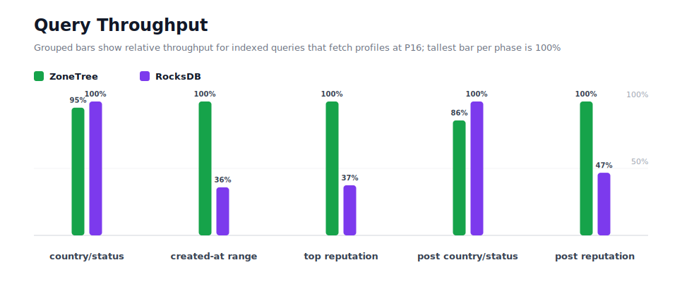
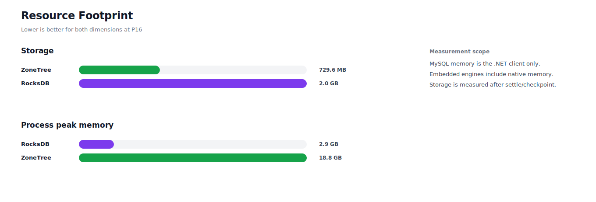

# Benchmark 10M Profiles / P16 - Windows

## Charts

### Execution Time

### Write Throughput

### Lookup Throughput

### Index Scan Throughput

### Query Throughput

### Resource Footprint

## Total By Engine

| Engine | Status | Run time | Completed phase time | Pre-read stabilize | Post-update stabilize | Settle | Reopen | Verify | Storage | Process peak memory | Final checksum |
| --- | --- | ---: | ---: | ---: | ---: | ---: | ---: | ---: | ---: | ---: | --- |
| ZoneTree | Completed | 136_472 ms | 107_779 ms | 11_860 ms | 15_321 ms | 16 ms | 501 ms | 12 ms | 729.6 MB | 18.8 GB | `78E34B89C21C4B51` |
| RocksDB | Completed | 367_404 ms | 340_023 ms | 12_723 ms | 12_223 ms | 1 ms | 60 ms | 1_795 ms | 2.0 GB | 2.9 GB | `78E34B89C21C4B51` |

## Correctness

Checksum validation passed across completed engines: ZoneTree, RocksDB.

## Interpretation Notes

* This benchmark measures live single-operation profile inserts, updates, reads, and indexed queries.
* ZoneTree and RocksDB secondary indexes are maintained by the benchmark application using separate stores.
* Embedded engines run in the benchmark process.
* Completed phase time is the sum of measured workload phases. Run time also includes initialization, stabilization, settle/checkpoint, reopen, verification, and reporting overhead.
* The write throughput chart includes raw write phases and derived write-readiness bars that add the following stabilization phase.
* Storage is measured after each engine settles or checkpoints its data.
* Process peak memory is measured for the benchmark process.

## Write Readiness

| Engine | Insert | Pre-read stabilize | Insert + stabilize | Insert ready throughput | Update | Post-update stabilize | Update + stabilize | Update ready throughput |
| --- | ---: | ---: | ---: | ---: | ---: | ---: | ---: | ---: |
| ZoneTree | 12_521 ms | 11_860 ms | 24_382 ms | 410_143/s | 15_957 ms | 15_321 ms | 31_278 ms | 319_716/s |
| RocksDB | 53_960 ms | 12_723 ms | 66_683 ms | 149_964/s | 95_936 ms | 12_223 ms | 108_160 ms | 92_456/s |

## Phase Results

### ZoneTree

| Phase | Operations | Time | Throughput | Checksum |
| --- | ---: | ---: | ---: | --- |
| insert profiles | 10_000_000 | 12_521 ms | 798_634/s | `60657D05C5C3D63A` |
| read by user id | 10_000_000 | 1_368 ms | 7_312_120/s | `164E82FF406E47D2` |
| lookup by email | 10_000_000 | 3_257 ms | 3_069_941/s | `9CD5A008A3E41795` |
| scan country/status index | 2_500_000 | 1_884 ms | 1_326_866/s | `EC7FD1325EF846AC` |
| query country/status | 2_500_000 | 15_950 ms | 156_736/s | `40F3106F1D77B892` |
| scan created-at index | 2_500_000 | 2_097 ms | 1_192_222/s | `BA6DA500E34572F2` |
| query created-at range | 2_500_000 | 7_130 ms | 350_653/s | `DDD17E96EFDE8485` |
| scan top reputation index | 2_500_000 | 3_716 ms | 672_728/s | `51A3F660A0184945` |
| query top reputation | 2_500_000 | 6_474 ms | 386_180/s | `6FAB7460EDD12C85` |
| update profiles | 10_000_000 | 15_957 ms | 626_703/s | `073C2921F3D8CC5D` |
| post-update read by user id | 10_000_000 | 1_628 ms | 6_141_007/s | `3AFA1FBC5EB0299F` |
| post-update lookup by email | 10_000_000 | 3_225 ms | 3_100_734/s | `D3DBDF6061A6F409` |
| post-update scan country/status index | 2_500_000 | 1_912 ms | 1_307_726/s | `3B38EC782FF0AA8A` |
| post-update query country/status | 2_500_000 | 17_723 ms | 141_059/s | `AFECAF06842CA75B` |
| post-update scan top reputation index | 2_500_000 | 5_298 ms | 471_839/s | `2AB5FE5D392BC6A5` |
| post-update query top reputation | 2_500_000 | 7_639 ms | 327_283/s | `43A8DFA8C728DD25` |

### RocksDB

| Phase | Operations | Time | Throughput | Checksum |
| --- | ---: | ---: | ---: | --- |
| insert profiles | 10_000_000 | 53_960 ms | 185_324/s | `60657D05C5C3D63A` |
| read by user id | 10_000_000 | 11_164 ms | 895_710/s | `164E82FF406E47D2` |
| lookup by email | 10_000_000 | 31_934 ms | 313_145/s | `9CD5A008A3E41795` |
| scan country/status index | 2_500_000 | 1_445 ms | 1_729_870/s | `EC7FD1325EF846AC` |
| query country/status | 2_500_000 | 15_213 ms | 164_337/s | `40F3106F1D77B892` |
| scan created-at index | 2_500_000 | 8_601 ms | 290_649/s | `BA6DA500E34572F2` |
| query created-at range | 2_500_000 | 19_854 ms | 125_918/s | `DDD17E96EFDE8485` |
| scan top reputation index | 2_500_000 | 1_760 ms | 1_420_168/s | `51A3F660A0184945` |
| query top reputation | 2_500_000 | 17_295 ms | 144_547/s | `6FAB7460EDD12C85` |
| update profiles | 10_000_000 | 95_936 ms | 104_236/s | `073C2921F3D8CC5D` |
| post-update read by user id | 10_000_000 | 15_927 ms | 627_870/s | `3AFA1FBC5EB0299F` |
| post-update lookup by email | 10_000_000 | 32_321 ms | 309_400/s | `D3DBDF6061A6F409` |
| post-update scan country/status index | 2_500_000 | 1_448 ms | 1_726_000/s | `3B38EC782FF0AA8A` |
| post-update query country/status | 2_500_000 | 15_217 ms | 164_288/s | `AFECAF06842CA75B` |
| post-update scan top reputation index | 2_500_000 | 1_612 ms | 1_551_112/s | `2AB5FE5D392BC6A5` |
| post-update query top reputation | 2_500_000 | 16_334 ms | 153_055/s | `43A8DFA8C728DD25` |

## Configuration

* Profiles: 10_000_000
* Parallelism: 16
* Profile writes: individual operations
* UserId reads: 10_000_000
* Email lookups: 10_000_000
* Query count: 2_500_000
* Profile updates: 10_000_000
* Post-update UserId reads: 10_000_000
* Post-update email lookups: 10_000_000
* Post-update query count: 2_500_000
* Query limit: 50
* Seed: 570123434
* Timeout: 120_000 seconds per engine

## Environment

* OS: Microsoft Windows 10.0.26200
* Architecture: X64
* .NET: 10.0.6
* CPU: Intel(R) Core(TM) Ultra 7 265KF
* Logical processors: 20
* Total available memory: 63.6 GB
* Initial process working set: 913.4 MB

## Engine Settings

### ZoneTree

* MutableSegmentMaxItemCount: 250000
* SparseArrayStepSize: 16
* KeyCacheSize: 1024
* ValueCacheSize: 1024
* IteratorPrefetchSize: 16
* BlockCacheLifeTime: 1 minutes
* BottomMergePolicy: Full bottom merge when bottom segment count exceeds 1
* ReadStabilization: Settle before read/query phases

### RocksDB

* Databases: profiles,email-index,country-status-index,created-at-index,reputation-index
* Compression: Zstd
* WriteBufferMb: 1024
* MaxWriteBufferNumber: 4
* WriteSync: false
* ReadStabilization: Compact before read/query phases

## Durability Settings

* ZoneTree: AsyncCompressed WAL default; MutableSegmentMaxItemCount=250000; SparseArrayStepSize=16; KeyCacheSize=1024; ValueCacheSize=1024; IteratorPrefetchSize=16; BlockCacheLifeTime=1 minutes; application-managed secondary indexes; background maintainers enabled.
* RocksDB: WAL enabled; five separate RocksDB instances; no WriteBatch across indexes; compression=Zstd; write_buffer_size=1024 MB per database; max_write_buffer_number=4.
