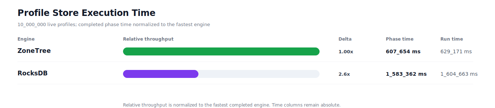
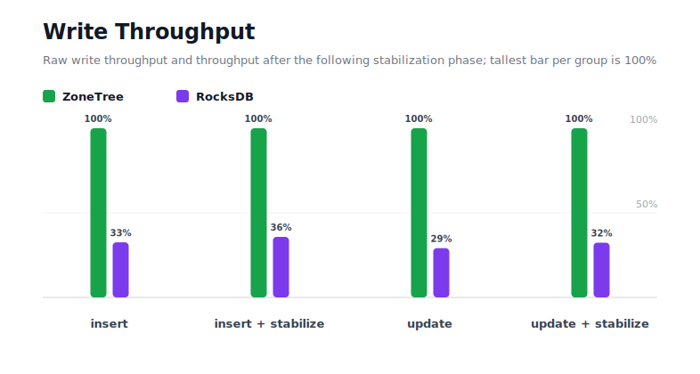
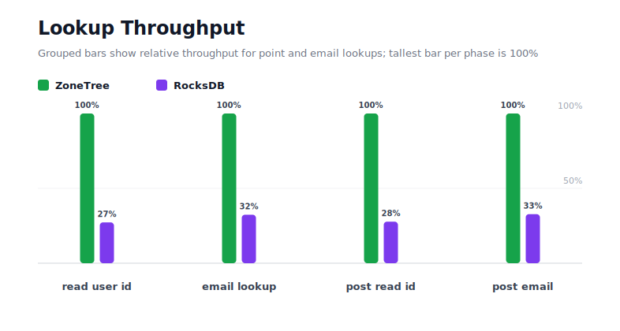
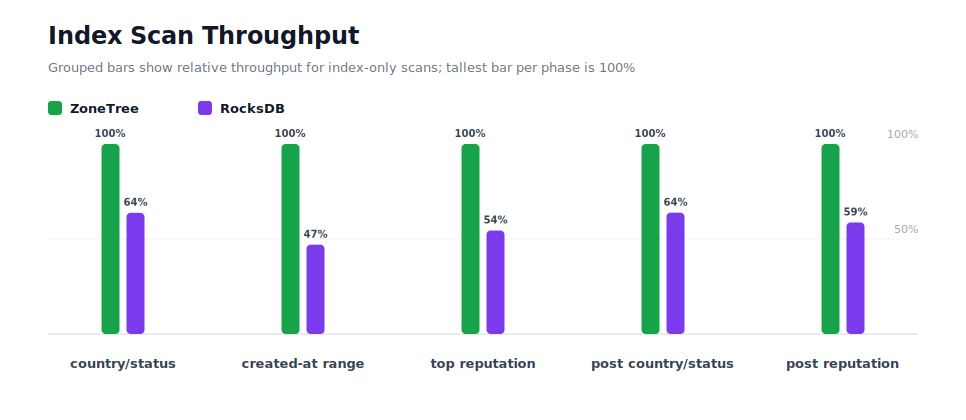
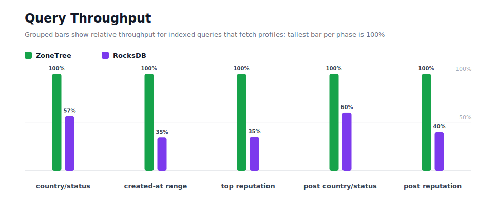
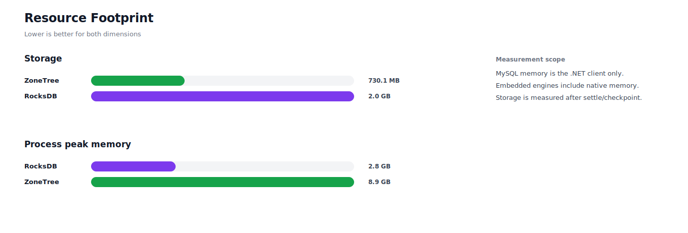

# Benchmark 10M Profiles - Windows

## Charts

### Execution Time

### Write Throughput

### Lookup Throughput

### Index Scan Throughput

### Query Throughput

### Resource Footprint

## Total By Engine

| Engine | Status | Run time | Completed phase time | Pre-read stabilize | Post-update stabilize | Settle | Reopen | Verify | Storage | Process peak memory | Final checksum |
| --- | --- | ---: | ---: | ---: | ---: | ---: | ---: | ---: | ---: | ---: | --- |
| ZoneTree | Completed | 629_171 ms | 607_654 ms | 5_252 ms | 14_783 ms | 15 ms | 538 ms | 12 ms | 730.1 MB | 8.9 GB | `78E34B89C21C4B51` |
| RocksDB | Completed | 1_604_663 ms | 1_583_362 ms | 5_000 ms | 14_003 ms | 1 ms | 52 ms | 1_757 ms | 2.0 GB | 2.8 GB | `78E34B89C21C4B51` |

## Correctness

Checksum validation passed across completed engines: ZoneTree, RocksDB.

## Interpretation Notes

* This benchmark measures live single-operation profile inserts, updates, reads, and indexed queries.
* ZoneTree and RocksDB secondary indexes are maintained by the benchmark application using separate stores.
* Embedded engines run in the benchmark process.
* Completed phase time is the sum of measured workload phases. Run time also includes initialization, stabilization, settle/checkpoint, reopen, verification, and reporting overhead.
* The write throughput chart includes raw write phases and derived write-readiness bars that add the following stabilization phase.
* Storage is measured after each engine settles or checkpoints its data.
* Process peak memory is measured for the benchmark process.

## Write Readiness

| Engine | Insert | Pre-read stabilize | Insert + stabilize | Insert ready throughput | Update | Post-update stabilize | Update + stabilize | Update ready throughput |
| --- | ---: | ---: | ---: | ---: | ---: | ---: | ---: | ---: |
| ZoneTree | 34_884 ms | 5_252 ms | 40_135 ms | 249_156/s | 92_180 ms | 14_783 ms | 106_963 ms | 93_491/s |
| RocksDB | 107_120 ms | 5_000 ms | 112_121 ms | 89_190/s | 316_535 ms | 14_003 ms | 330_539 ms | 30_254/s |

## Phase Results

### ZoneTree

| Phase | Operations | Time | Throughput | Checksum |
| --- | ---: | ---: | ---: | --- |
| insert profiles | 10_000_000 | 34_884 ms | 286_668/s | `07762AC56C55E0A5` |
| read by user id | 10_000_000 | 15_312 ms | 653_097/s | `F4608F0DA193D0D9` |
| lookup by email | 10_000_000 | 36_590 ms | 273_296/s | `ADE91BF4BD85A55B` |
| scan country/status index | 2_500_000 | 10_131 ms | 246_766/s | `A29BE83BE119E914` |
| query country/status | 2_500_000 | 76_564 ms | 32_652/s | `3AB5B8133AFFB607` |
| scan created-at index | 2_500_000 | 14_736 ms | 169_649/s | `179FCE1FC14C464D` |
| query created-at range | 2_500_000 | 63_205 ms | 39_554/s | `5FC94052E1F97D6B` |
| scan top reputation index | 2_500_000 | 7_497 ms | 333_459/s | `0D17B3C3B0D7E8E5` |
| query top reputation | 2_500_000 | 46_958 ms | 53_239/s | `8203F6DB8D98AB65` |
| update profiles | 10_000_000 | 92_180 ms | 108_484/s | `6BDE7DC8A52F666F` |
| post-update read by user id | 10_000_000 | 16_625 ms | 601_521/s | `5D5C9BD3AB671AA6` |
| post-update lookup by email | 10_000_000 | 38_565 ms | 259_300/s | `D68F7DE2F29ABC22` |
| post-update scan country/status index | 2_500_000 | 10_262 ms | 243_620/s | `974D6B6A832CB320` |
| post-update query country/status | 2_500_000 | 82_960 ms | 30_135/s | `EFC6EAD2344094A4` |
| post-update scan top reputation index | 2_500_000 | 8_210 ms | 304_489/s | `CE24AE7598966365` |
| post-update query top reputation | 2_500_000 | 52_974 ms | 47_193/s | `B53F030441D4FE85` |

### RocksDB

| Phase | Operations | Time | Throughput | Checksum |
| --- | ---: | ---: | ---: | --- |
| insert profiles | 10_000_000 | 107_120 ms | 93_353/s | `07762AC56C55E0A5` |
| read by user id | 10_000_000 | 56_141 ms | 178_122/s | `F4608F0DA193D0D9` |
| lookup by email | 10_000_000 | 112_982 ms | 88_510/s | `ADE91BF4BD85A55B` |
| scan country/status index | 2_500_000 | 15_884 ms | 157_393/s | `A29BE83BE119E914` |
| query country/status | 2_500_000 | 135_473 ms | 18_454/s | `3AB5B8133AFFB607` |
| scan created-at index | 2_500_000 | 31_332 ms | 79_791/s | `179FCE1FC14C464D` |
| query created-at range | 2_500_000 | 182_729 ms | 13_681/s | `5FC94052E1F97D6B` |
| scan top reputation index | 2_500_000 | 13_763 ms | 181_643/s | `0D17B3C3B0D7E8E5` |
| query top reputation | 2_500_000 | 133_261 ms | 18_760/s | `8203F6DB8D98AB65` |
| update profiles | 10_000_000 | 316_535 ms | 31_592/s | `6BDE7DC8A52F666F` |
| post-update read by user id | 10_000_000 | 59_904 ms | 166_933/s | `5D5C9BD3AB671AA6` |
| post-update lookup by email | 10_000_000 | 117_701 ms | 84_961/s | `D68F7DE2F29ABC22` |
| post-update scan country/status index | 2_500_000 | 16_066 ms | 155_611/s | `974D6B6A832CB320` |
| post-update query country/status | 2_500_000 | 138_212 ms | 18_088/s | `EFC6EAD2344094A4` |
| post-update scan top reputation index | 2_500_000 | 13_986 ms | 178_745/s | `CE24AE7598966365` |
| post-update query top reputation | 2_500_000 | 132_272 ms | 18_900/s | `B53F030441D4FE85` |

## Configuration

* Profiles: 10_000_000
* Parallelism: 1
* Profile writes: individual operations
* UserId reads: 10_000_000
* Email lookups: 10_000_000
* Query count: 2_500_000
* Profile updates: 10_000_000
* Post-update UserId reads: 10_000_000
* Post-update email lookups: 10_000_000
* Post-update query count: 2_500_000
* Query limit: 50
* Seed: 570123434
* Timeout: 120_000 seconds per engine

## Environment

* OS: Microsoft Windows 10.0.26200
* Architecture: X64
* .NET: 10.0.6
* CPU: Intel(R) Core(TM) Ultra 7 265KF
* Logical processors: 20
* Total available memory: 63.6 GB
* Initial process working set: 744.8 MB
* Benchmark version: 1.0.0.0
* ZoneTree version: 1.9.6.0
* Microsoft.Data.Sqlite version: 10.0.0
* SQLite runtime version: 3.50.3
* SQLitePCLRaw.core version: 2.1.11
* SQLitePCLRaw.lib.e_sqlite3 version: 3.50.3
* RocksDbSharp version: 6.2.2
* RocksDbNative version: 6.2.2
* MySqlConnector version: 2.4.0

## Engine Settings

### ZoneTree

* MutableSegmentMaxItemCount: 250000
* SparseArrayStepSize: 16
* KeyCacheSize: 1024
* ValueCacheSize: 1024
* IteratorPrefetchSize: 16
* BlockCacheLifeTime: 1 minutes
* BottomMergePolicy: Full bottom merge when bottom segment count exceeds 1
* ReadStabilization: Settle before read/query phases

### RocksDB

* Databases: profiles,email-index,country-status-index,created-at-index,reputation-index
* Compression: Zstd
* WriteBufferMb: 1024
* MaxWriteBufferNumber: 4
* WriteSync: false
* ReadStabilization: Compact before read/query phases

## Durability Settings

* ZoneTree: AsyncCompressed WAL default; MutableSegmentMaxItemCount=250000; SparseArrayStepSize=16; KeyCacheSize=1024; ValueCacheSize=1024; IteratorPrefetchSize=16; BlockCacheLifeTime=1 minutes; application-managed secondary indexes; background maintainers enabled.
* RocksDB: WAL enabled; five separate RocksDB instances; no WriteBatch across indexes; compression=Zstd; write_buffer_size=1024 MB per database; max_write_buffer_number=4.
