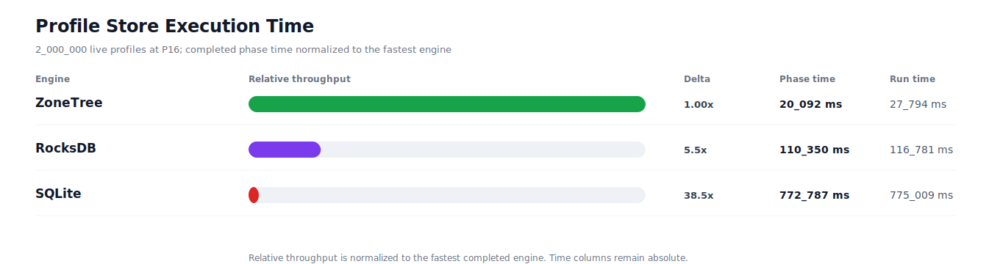
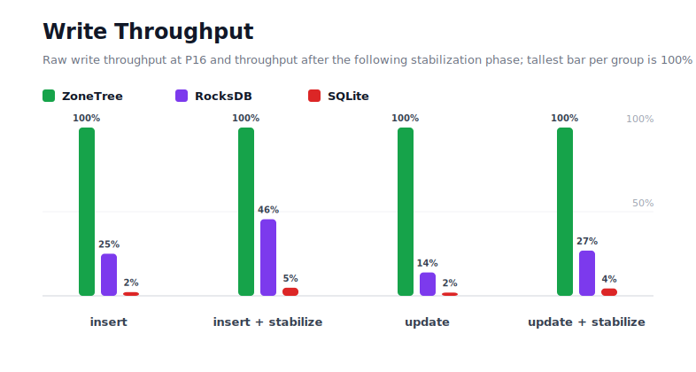
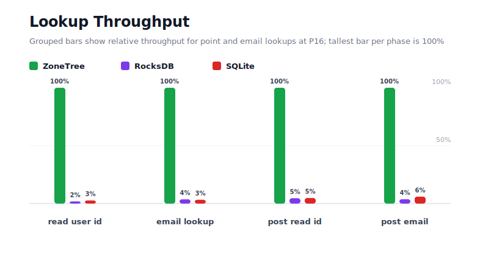
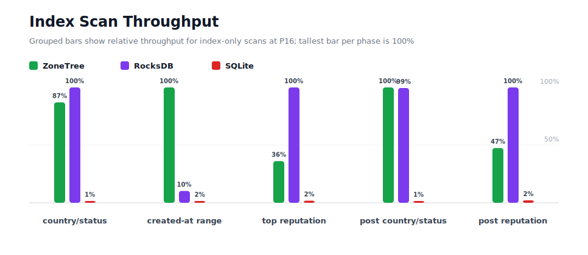
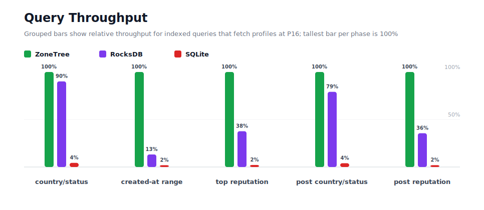
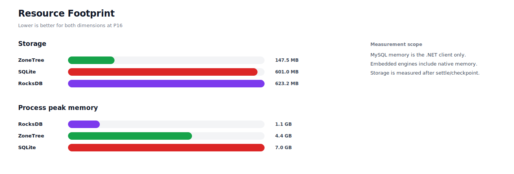

# Benchmark 2M Profiles / P16 - Windows

## Charts

### Execution Time

### Write Throughput

### Lookup Throughput

### Index Scan Throughput

### Query Throughput

### Resource Footprint

## Total By Engine

| Engine | Status | Run time | Completed phase time | Pre-read stabilize | Post-update stabilize | Settle | Reopen | Verify | Storage | Process peak memory | Final checksum |
| --- | --- | ---: | ---: | ---: | ---: | ---: | ---: | ---: | ---: | ---: | --- |
| ZoneTree | Completed | 27_794 ms | 20_092 ms | 3_152 ms | 3_714 ms | 26 ms | 177 ms | 11 ms | 147.5 MB | 4.4 GB | `A7EB98FFC773884D` |
| RocksDB | Completed | 116_781 ms | 110_350 ms | 2_055 ms | 3_687 ms | 1 ms | 49 ms | 286 ms | 623.2 MB | 1.1 GB | `A7EB98FFC773884D` |
| SQLite | Completed | 775_009 ms | 772_787 ms | n/a | n/a | 2_017 ms | 1 ms | 25 ms | 601.0 MB | 7.0 GB | `A7EB98FFC773884D` |

## Correctness

Checksum validation passed across completed engines: ZoneTree, RocksDB, SQLite.

## Interpretation Notes

* This benchmark measures live single-operation profile inserts, updates, reads, and indexed queries.
* ZoneTree and RocksDB secondary indexes are maintained by the benchmark application using separate stores.
* SQLite maintains secondary indexes inside the database engine.
* Embedded engines run in the benchmark process.
* Completed phase time is the sum of measured workload phases. Run time also includes initialization, stabilization, settle/checkpoint, reopen, verification, and reporting overhead.
* The write throughput chart includes raw write phases and derived write-readiness bars that add the following stabilization phase.
* Storage is measured after each engine settles or checkpoints its data.
* Process peak memory is measured for the benchmark process.

## Write Readiness

| Engine | Insert | Pre-read stabilize | Insert + stabilize | Insert ready throughput | Update | Post-update stabilize | Update + stabilize | Update ready throughput |
| --- | ---: | ---: | ---: | ---: | ---: | ---: | ---: | ---: |
| ZoneTree | 2_708 ms | 3_152 ms | 5_860 ms | 341_306/s | 2_903 ms | 3_714 ms | 6_617 ms | 302_266/s |
| RocksDB | 10_822 ms | 2_055 ms | 12_877 ms | 155_319/s | 20_918 ms | 3_687 ms | 24_605 ms | 81_283/s |
| SQLite | 122_329 ms | n/a | 122_329 ms | 16_349/s | 150_971 ms | n/a | 150_971 ms | 13_248/s |

## Phase Results

### ZoneTree

| Phase | Operations | Time | Throughput | Checksum |
| --- | ---: | ---: | ---: | --- |
| insert profiles | 2_000_000 | 2_708 ms | 738_572/s | `2B78272BB2987534` |
| read by user id | 2_000_000 | 298 ms | 6_715_545/s | `18FD8FACB4EB5B65` |
| lookup by email | 2_000_000 | 536 ms | 3_730_700/s | `0C2CB81D0A7184CA` |
| scan country/status index | 500_000 | 447 ms | 1_119_009/s | `54FC0396ADDBA50C` |
| query country/status | 500_000 | 3_030 ms | 165_005/s | `7BF226FD0368CEF1` |
| scan created-at index | 500_000 | 456 ms | 1_096_171/s | `B1370B4F83D94D56` |
| query created-at range | 500_000 | 1_319 ms | 379_193/s | `68342B1529FE49D8` |
| scan top reputation index | 500_000 | 1_041 ms | 480_277/s | `51197A6A5F249705` |
| query top reputation | 500_000 | 1_270 ms | 393_749/s | `149050C9EF2101A5` |
| update profiles | 2_000_000 | 2_903 ms | 688_989/s | `AF1D0CFF51ABC807` |
| post-update read by user id | 2_000_000 | 262 ms | 7_633_640/s | `BF327DDD07F65CA5` |
| post-update lookup by email | 2_000_000 | 485 ms | 4_120_841/s | `3240F8217F297852` |
| post-update scan country/status index | 500_000 | 401 ms | 1_245_485/s | `06B0B6C71184C367` |
| post-update query country/status | 500_000 | 2_713 ms | 184_295/s | `AA479A8D3825AD81` |
| post-update scan top reputation index | 500_000 | 984 ms | 508_066/s | `B5DDC196C9A394E5` |
| post-update query top reputation | 500_000 | 1_239 ms | 403_681/s | `9EAD54AC35AC1B85` |

### RocksDB

| Phase | Operations | Time | Throughput | Checksum |
| --- | ---: | ---: | ---: | --- |
| insert profiles | 2_000_000 | 10_822 ms | 184_812/s | `2B78272BB2987534` |
| read by user id | 2_000_000 | 15_621 ms | 128_034/s | `18FD8FACB4EB5B65` |
| lookup by email | 2_000_000 | 14_682 ms | 136_226/s | `0C2CB81D0A7184CA` |
| scan country/status index | 500_000 | 389 ms | 1_284_988/s | `54FC0396ADDBA50C` |
| query country/status | 500_000 | 3_363 ms | 148_657/s | `7BF226FD0368CEF1` |
| scan created-at index | 500_000 | 4_431 ms | 112_840/s | `B1370B4F83D94D56` |
| query created-at range | 500_000 | 9_999 ms | 50_005/s | `68342B1529FE49D8` |
| scan top reputation index | 500_000 | 376 ms | 1_329_066/s | `51197A6A5F249705` |
| query top reputation | 500_000 | 3_374 ms | 148_186/s | `149050C9EF2101A5` |
| update profiles | 2_000_000 | 20_918 ms | 95_610/s | `AF1D0CFF51ABC807` |
| post-update read by user id | 2_000_000 | 5_678 ms | 352_214/s | `BF327DDD07F65CA5` |
| post-update lookup by email | 2_000_000 | 12_910 ms | 154_917/s | `3240F8217F297852` |
| post-update scan country/status index | 500_000 | 404 ms | 1_239_110/s | `06B0B6C71184C367` |
| post-update query country/status | 500_000 | 3_430 ms | 145_792/s | `AA479A8D3825AD81` |
| post-update scan top reputation index | 500_000 | 467 ms | 1_070_479/s | `B5DDC196C9A394E5` |
| post-update query top reputation | 500_000 | 3_486 ms | 143_437/s | `9EAD54AC35AC1B85` |

### SQLite

| Phase | Operations | Time | Throughput | Checksum |
| --- | ---: | ---: | ---: | --- |
| insert profiles | 2_000_000 | 122_329 ms | 16_349/s | `2B78272BB2987534` |
| read by user id | 2_000_000 | 11_022 ms | 181_453/s | `18FD8FACB4EB5B65` |
| lookup by email | 2_000_000 | 16_287 ms | 122_801/s | `0C2CB81D0A7184CA` |
| scan country/status index | 500_000 | 28_484 ms | 17_554/s | `54FC0396ADDBA50C` |
| query country/status | 500_000 | 69_631 ms | 7_181/s | `7BF226FD0368CEF1` |
| scan created-at index | 500_000 | 28_566 ms | 17_503/s | `B1370B4F83D94D56` |
| query created-at range | 500_000 | 69_181 ms | 7_227/s | `68342B1529FE49D8` |
| scan top reputation index | 500_000 | 20_584 ms | 24_291/s | `51197A6A5F249705` |
| query top reputation | 500_000 | 59_489 ms | 8_405/s | `149050C9EF2101A5` |
| update profiles | 2_000_000 | 150_971 ms | 13_248/s | `AF1D0CFF51ABC807` |
| post-update read by user id | 2_000_000 | 5_420 ms | 368_986/s | `BF327DDD07F65CA5` |
| post-update lookup by email | 2_000_000 | 8_120 ms | 246_300/s | `3240F8217F297852` |
| post-update scan country/status index | 500_000 | 28_191 ms | 17_736/s | `06B0B6C71184C367` |
| post-update query country/status | 500_000 | 68_450 ms | 7_305/s | `AA479A8D3825AD81` |
| post-update scan top reputation index | 500_000 | 21_899 ms | 22_832/s | `B5DDC196C9A394E5` |
| post-update query top reputation | 500_000 | 64_164 ms | 7_793/s | `9EAD54AC35AC1B85` |

## Configuration

* Profiles: 2_000_000
* Parallelism: 16
* Profile writes: individual operations
* UserId reads: 2_000_000
* Email lookups: 2_000_000
* Query count: 500_000
* Profile updates: 2_000_000
* Post-update UserId reads: 2_000_000
* Post-update email lookups: 2_000_000
* Post-update query count: 500_000
* Query limit: 50
* Seed: 570123434
* Timeout: 120_000 seconds per engine

## Environment

* OS: Microsoft Windows 10.0.26200
* Architecture: X64
* .NET: 10.0.6
* CPU: Intel(R) Core(TM) Ultra 7 265KF
* Logical processors: 20
* Total available memory: 63.6 GB
* Initial process working set: 218.9 MB

## Engine Settings

### ZoneTree

* MutableSegmentMaxItemCount: 250000
* SparseArrayStepSize: 16
* KeyCacheSize: 1024
* ValueCacheSize: 1024
* IteratorPrefetchSize: 16
* BlockCacheLifeTime: 1 minutes
* BottomMergePolicy: Full bottom merge when bottom segment count exceeds 1
* ReadStabilization: Settle before read/query phases

### RocksDB

* Databases: profiles,email-index,country-status-index,created-at-index,reputation-index
* Compression: Zstd
* WriteBufferMb: 1024
* MaxWriteBufferNumber: 4
* WriteSync: false
* ReadStabilization: Compact before read/query phases

### SQLite

* JournalMode: WAL
* Synchronous: NORMAL
* CacheMb: 1024
* MmapMb: 1024
* TempStore: MEMORY

## Durability Settings

* ZoneTree: AsyncCompressed WAL default; MutableSegmentMaxItemCount=250000; SparseArrayStepSize=16; KeyCacheSize=1024; ValueCacheSize=1024; IteratorPrefetchSize=16; BlockCacheLifeTime=1 minutes; application-managed secondary indexes; background maintainers enabled.
* RocksDB: WAL enabled; five separate RocksDB instances; no WriteBatch across indexes; compression=Zstd; write_buffer_size=1024 MB per database; max_write_buffer_number=4.
* SQLite: WAL journal mode; synchronous=NORMAL; cache=1024 MB; mmap=1024 MB; native SQL indexes; single-row writes use autocommit.
