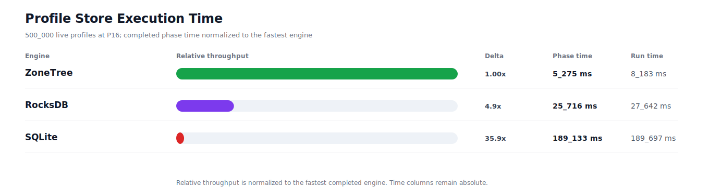
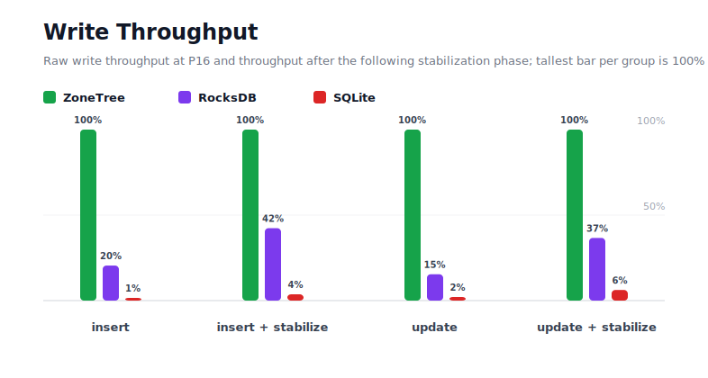
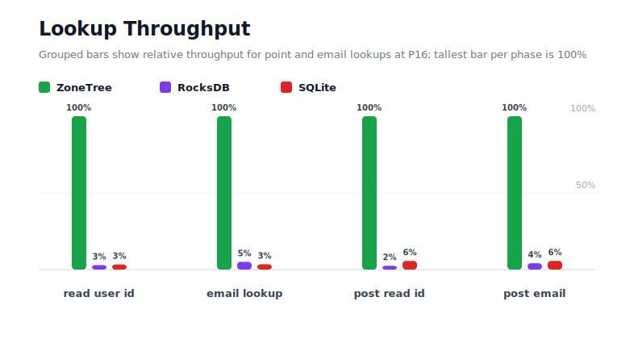
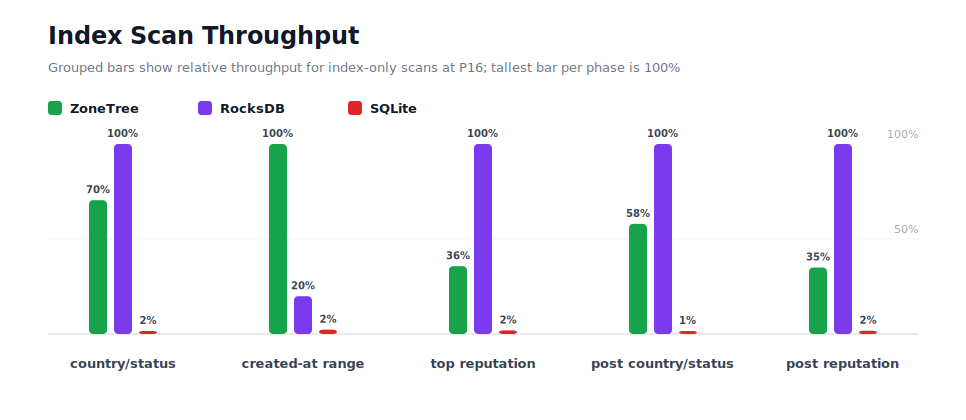
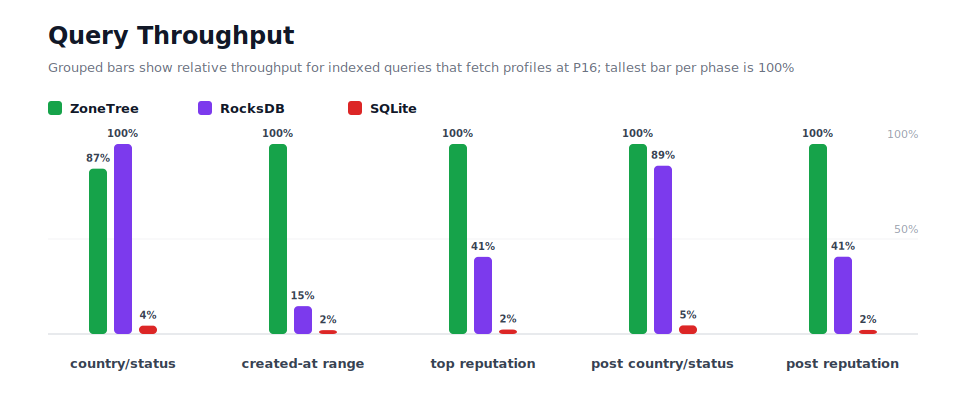
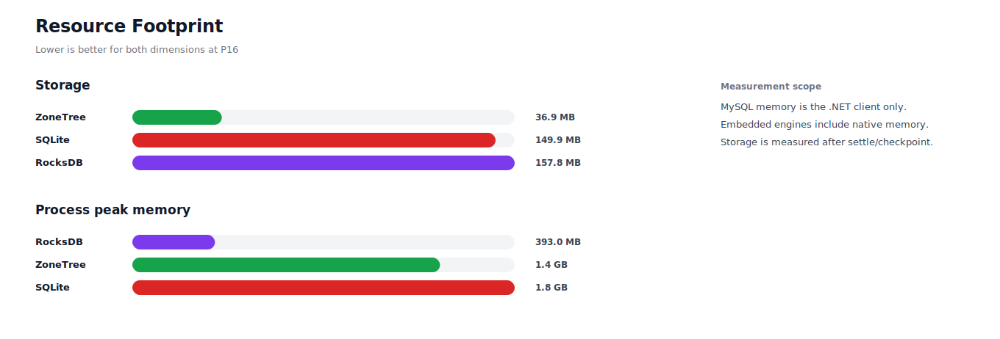

# Benchmark 500K Profiles / P16 - Windows

## Charts

### Execution Time

### Write Throughput

### Lookup Throughput

### Index Scan Throughput

### Query Throughput

### Resource Footprint

## Total By Engine

| Engine | Status | Run time | Completed phase time | Pre-read stabilize | Post-update stabilize | Settle | Reopen | Verify | Storage | Process peak memory | Final checksum |
| --- | --- | ---: | ---: | ---: | ---: | ---: | ---: | ---: | ---: | ---: | --- |
| ZoneTree | Completed | 8_183 ms | 5_275 ms | 790 ms | 1_225 ms | 14 ms | 96 ms | 12 ms | 36.9 MB | 1.4 GB | `DF2D9443B36E4083` |
| RocksDB | Completed | 27_642 ms | 25_716 ms | 558 ms | 947 ms | 1 ms | 46 ms | 75 ms | 157.8 MB | 393.0 MB | `DF2D9443B36E4083` |
| SQLite | Completed | 189_697 ms | 189_133 ms | n/a | n/a | 423 ms | 1 ms | 10 ms | 149.9 MB | 1.8 GB | `DF2D9443B36E4083` |

## Correctness

Checksum validation passed across completed engines: ZoneTree, RocksDB, SQLite.

## Interpretation Notes

* This benchmark measures live single-operation profile inserts, updates, reads, and indexed queries.
* ZoneTree and RocksDB secondary indexes are maintained by the benchmark application using separate stores.
* SQLite maintains secondary indexes inside the database engine.
* Embedded engines run in the benchmark process.
* Completed phase time is the sum of measured workload phases. Run time also includes initialization, stabilization, settle/checkpoint, reopen, verification, and reporting overhead.
* The write throughput chart includes raw write phases and derived write-readiness bars that add the following stabilization phase.
* Storage is measured after each engine settles or checkpoints its data.
* Process peak memory is measured for the benchmark process.

## Write Readiness

| Engine | Insert | Pre-read stabilize | Insert + stabilize | Insert ready throughput | Update | Post-update stabilize | Update + stabilize | Update ready throughput |
| --- | ---: | ---: | ---: | ---: | ---: | ---: | ---: | ---: |
| ZoneTree | 519 ms | 790 ms | 1_310 ms | 381_787/s | 636 ms | 1_225 ms | 1_860 ms | 268_780/s |
| RocksDB | 2_535 ms | 558 ms | 3_093 ms | 161_662/s | 4_130 ms | 947 ms | 5_077 ms | 98_486/s |
| SQLite | 35_649 ms | n/a | 35_649 ms | 14_026/s | 30_005 ms | n/a | 30_005 ms | 16_664/s |

## Phase Results

### ZoneTree

| Phase | Operations | Time | Throughput | Checksum |
| --- | ---: | ---: | ---: | --- |
| insert profiles | 500_000 | 519 ms | 963_125/s | `50011E4C9D5F3019` |
| read by user id | 500_000 | 95 ms | 5_282_564/s | `F3B941DE4C92818E` |
| lookup by email | 500_000 | 148 ms | 3_383_687/s | `40C0411114A3A804` |
| scan country/status index | 125_000 | 166 ms | 753_123/s | `1B1C2F0D73543877` |
| query country/status | 125_000 | 954 ms | 130_991/s | `2F314B7F8E40E3D9` |
| scan created-at index | 125_000 | 157 ms | 796_921/s | `F2636513B5F3CD4C` |
| query created-at range | 125_000 | 335 ms | 372_590/s | `E2906385B10DFC3E` |
| scan top reputation index | 125_000 | 250 ms | 500_568/s | `E6264551104EB4A5` |
| query top reputation | 125_000 | 334 ms | 374_315/s | `7A0CCC6AFE1F7735` |
| update profiles | 500_000 | 636 ms | 786_599/s | `CE4B50575224FE7D` |
| post-update read by user id | 500_000 | 81 ms | 6_197_307/s | `79C378667BBF73CE` |
| post-update lookup by email | 500_000 | 120 ms | 4_180_315/s | `0524A9D61F6190E5` |
| post-update scan country/status index | 125_000 | 161 ms | 778_498/s | `63B6F85AED445147` |
| post-update query country/status | 125_000 | 732 ms | 170_694/s | `2FE41B172678D1CC` |
| post-update scan top reputation index | 125_000 | 257 ms | 486_930/s | `8B8F035B222D5F35` |
| post-update query top reputation | 125_000 | 332 ms | 376_925/s | `14538CD9CDA8AA65` |

### RocksDB

| Phase | Operations | Time | Throughput | Checksum |
| --- | ---: | ---: | ---: | --- |
| insert profiles | 500_000 | 2_535 ms | 197_236/s | `50011E4C9D5F3019` |
| read by user id | 500_000 | 3_235 ms | 154_537/s | `F3B941DE4C92818E` |
| lookup by email | 500_000 | 2_925 ms | 170_949/s | `40C0411114A3A804` |
| scan country/status index | 125_000 | 117 ms | 1_069_219/s | `1B1C2F0D73543877` |
| query country/status | 125_000 | 830 ms | 150_565/s | `2F314B7F8E40E3D9` |
| scan created-at index | 125_000 | 789 ms | 158_346/s | `F2636513B5F3CD4C` |
| query created-at range | 125_000 | 2_289 ms | 54_600/s | `E2906385B10DFC3E` |
| scan top reputation index | 125_000 | 89 ms | 1_402_114/s | `E6264551104EB4A5` |
| query top reputation | 125_000 | 823 ms | 151_925/s | `7A0CCC6AFE1F7735` |
| update profiles | 500_000 | 4_130 ms | 121_073/s | `CE4B50575224FE7D` |
| post-update read by user id | 500_000 | 3_234 ms | 154_604/s | `79C378667BBF73CE` |
| post-update lookup by email | 500_000 | 2_894 ms | 172_757/s | `0524A9D61F6190E5` |
| post-update scan country/status index | 125_000 | 93 ms | 1_343_378/s | `63B6F85AED445147` |
| post-update query country/status | 125_000 | 827 ms | 151_185/s | `2FE41B172678D1CC` |
| post-update scan top reputation index | 125_000 | 90 ms | 1_391_691/s | `8B8F035B222D5F35` |
| post-update query top reputation | 125_000 | 815 ms | 153_322/s | `14538CD9CDA8AA65` |

### SQLite

| Phase | Operations | Time | Throughput | Checksum |
| --- | ---: | ---: | ---: | --- |
| insert profiles | 500_000 | 35_649 ms | 14_026/s | `50011E4C9D5F3019` |
| read by user id | 500_000 | 2_853 ms | 175_247/s | `F3B941DE4C92818E` |
| lookup by email | 500_000 | 4_266 ms | 117_210/s | `40C0411114A3A804` |
| scan country/status index | 125_000 | 7_774 ms | 16_080/s | `1B1C2F0D73543877` |
| query country/status | 125_000 | 18_858 ms | 6_629/s | `2F314B7F8E40E3D9` |
| scan created-at index | 125_000 | 6_892 ms | 18_138/s | `F2636513B5F3CD4C` |
| query created-at range | 125_000 | 16_514 ms | 7_569/s | `E2906385B10DFC3E` |
| scan top reputation index | 125_000 | 4_737 ms | 26_390/s | `E6264551104EB4A5` |
| query top reputation | 125_000 | 14_231 ms | 8_783/s | `7A0CCC6AFE1F7735` |
| update profiles | 500_000 | 30_005 ms | 16_664/s | `CE4B50575224FE7D` |
| post-update read by user id | 500_000 | 1_430 ms | 349_577/s | `79C378667BBF73CE` |
| post-update lookup by email | 500_000 | 2_107 ms | 237_292/s | `0524A9D61F6190E5` |
| post-update scan country/status index | 125_000 | 6_985 ms | 17_896/s | `63B6F85AED445147` |
| post-update query country/status | 125_000 | 16_175 ms | 7_728/s | `2FE41B172678D1CC` |
| post-update scan top reputation index | 125_000 | 5_221 ms | 23_942/s | `8B8F035B222D5F35` |
| post-update query top reputation | 125_000 | 15_438 ms | 8_097/s | `14538CD9CDA8AA65` |

## Configuration

* Profiles: 500_000
* Parallelism: 16
* Profile writes: individual operations
* UserId reads: 500_000
* Email lookups: 500_000
* Query count: 125_000
* Profile updates: 500_000
* Post-update UserId reads: 500_000
* Post-update email lookups: 500_000
* Post-update query count: 125_000
* Query limit: 50
* Seed: 570123434
* Timeout: 120_000 seconds per engine

## Environment

* OS: Microsoft Windows 10.0.26200
* Architecture: X64
* .NET: 10.0.6
* CPU: Intel(R) Core(TM) Ultra 7 265KF
* Logical processors: 20
* Total available memory: 63.6 GB
* Initial process working set: 104.9 MB

## Engine Settings

### ZoneTree

* MutableSegmentMaxItemCount: 250000
* SparseArrayStepSize: 16
* KeyCacheSize: 1024
* ValueCacheSize: 1024
* IteratorPrefetchSize: 16
* BlockCacheLifeTime: 1 minutes
* BottomMergePolicy: Full bottom merge when bottom segment count exceeds 1
* ReadStabilization: Settle before read/query phases

### RocksDB

* Databases: profiles,email-index,country-status-index,created-at-index,reputation-index
* Compression: Zstd
* WriteBufferMb: 1024
* MaxWriteBufferNumber: 4
* WriteSync: false
* ReadStabilization: Compact before read/query phases

### SQLite

* JournalMode: WAL
* Synchronous: NORMAL
* CacheMb: 1024
* MmapMb: 1024
* TempStore: MEMORY

## Durability Settings

* ZoneTree: AsyncCompressed WAL default; MutableSegmentMaxItemCount=250000; SparseArrayStepSize=16; KeyCacheSize=1024; ValueCacheSize=1024; IteratorPrefetchSize=16; BlockCacheLifeTime=1 minutes; application-managed secondary indexes; background maintainers enabled.
* RocksDB: WAL enabled; five separate RocksDB instances; no WriteBatch across indexes; compression=Zstd; write_buffer_size=1024 MB per database; max_write_buffer_number=4.
* SQLite: WAL journal mode; synchronous=NORMAL; cache=1024 MB; mmap=1024 MB; native SQL indexes; single-row writes use autocommit.
