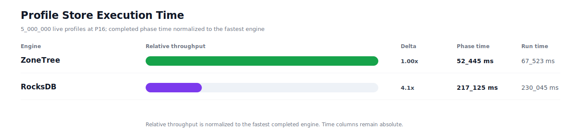
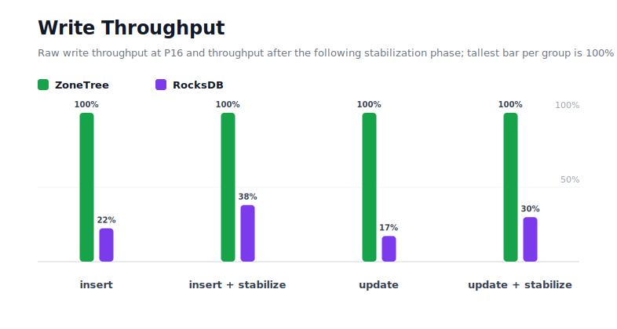
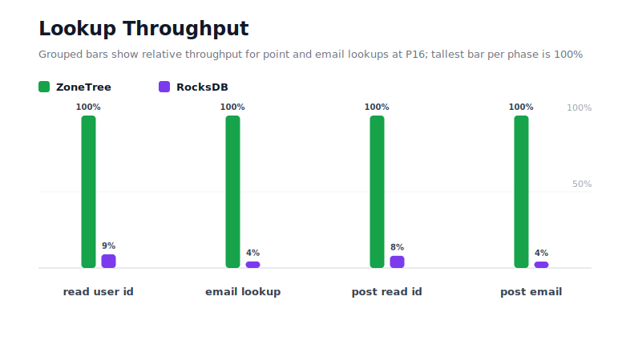
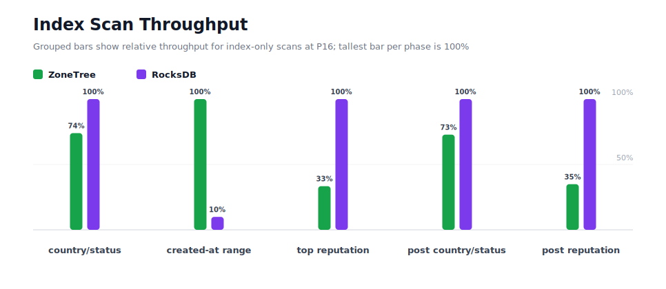
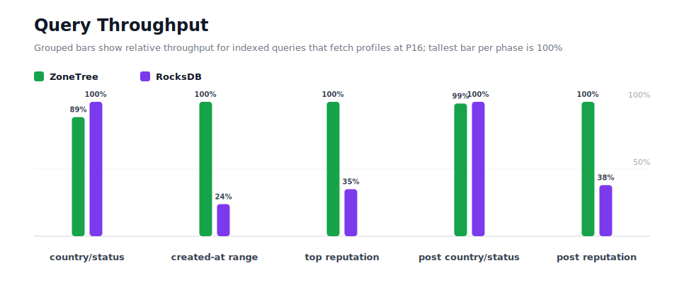
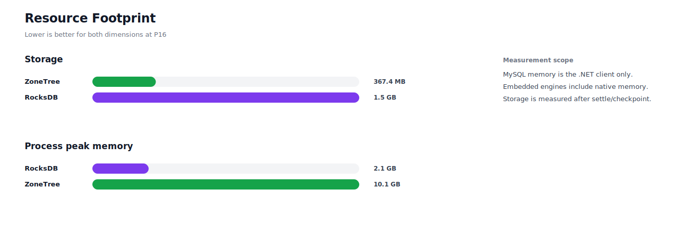

# Benchmark 5M Profiles / P16 - Windows

## Charts

### Execution Time

### Write Throughput

### Lookup Throughput

### Index Scan Throughput

### Query Throughput

### Resource Footprint

## Total By Engine

| Engine | Status | Run time | Completed phase time | Pre-read stabilize | Post-update stabilize | Settle | Reopen | Verify | Storage | Process peak memory | Final checksum |
| --- | --- | ---: | ---: | ---: | ---: | ---: | ---: | ---: | ---: | ---: | --- |
| ZoneTree | Completed | 67_523 ms | 52_445 ms | 6_330 ms | 7_629 ms | 15 ms | 240 ms | 11 ms | 367.4 MB | 10.1 GB | `46D8A7E801AF2C78` |
| RocksDB | Completed | 230_045 ms | 217_125 ms | 5_731 ms | 5_945 ms | 1 ms | 50 ms | 708 ms | 1.5 GB | 2.1 GB | `46D8A7E801AF2C78` |

## Correctness

Checksum validation passed across completed engines: ZoneTree, RocksDB.

## Interpretation Notes

* This benchmark measures live single-operation profile inserts, updates, reads, and indexed queries.
* ZoneTree and RocksDB secondary indexes are maintained by the benchmark application using separate stores.
* Embedded engines run in the benchmark process.
* Completed phase time is the sum of measured workload phases. Run time also includes initialization, stabilization, settle/checkpoint, reopen, verification, and reporting overhead.
* The write throughput chart includes raw write phases and derived write-readiness bars that add the following stabilization phase.
* Storage is measured after each engine settles or checkpoints its data.
* Process peak memory is measured for the benchmark process.

## Write Readiness

| Engine | Insert | Pre-read stabilize | Insert + stabilize | Insert ready throughput | Update | Post-update stabilize | Update + stabilize | Update ready throughput |
| --- | ---: | ---: | ---: | ---: | ---: | ---: | ---: | ---: |
| ZoneTree | 5_933 ms | 6_330 ms | 12_264 ms | 407_709/s | 7_926 ms | 7_629 ms | 15_555 ms | 321_442/s |
| RocksDB | 26_511 ms | 5_731 ms | 32_242 ms | 155_078/s | 46_108 ms | 5_945 ms | 52_054 ms | 96_055/s |

## Phase Results

### ZoneTree

| Phase | Operations | Time | Throughput | Checksum |
| --- | ---: | ---: | ---: | --- |
| insert profiles | 5_000_000 | 5_933 ms | 842_714/s | `A9B2B7203E9651E7` |
| read by user id | 5_000_000 | 689 ms | 7_260_318/s | `1D1E5DD4C5A178CD` |
| lookup by email | 5_000_000 | 1_465 ms | 3_413_763/s | `396156D83FB49B40` |
| scan country/status index | 1_250_000 | 955 ms | 1_309_265/s | `B7BD2D152F1AFFE1` |
| query country/status | 1_250_000 | 8_518 ms | 146_750/s | `A1DE293574C06D66` |
| scan created-at index | 1_250_000 | 1_122 ms | 1_113_677/s | `F90B4F28382222C9` |
| query created-at range | 1_250_000 | 3_460 ms | 361_247/s | `2594FE6637C9CC2A` |
| scan top reputation index | 1_250_000 | 2_481 ms | 503_928/s | `998AC961090B0585` |
| query top reputation | 1_250_000 | 2_965 ms | 421_575/s | `A09380754DCE86A5` |
| update profiles | 5_000_000 | 7_926 ms | 630_875/s | `2A5E0D2A49A10A67` |
| post-update read by user id | 5_000_000 | 613 ms | 8_159_045/s | `E7459C3F8BC27513` |
| post-update lookup by email | 5_000_000 | 1_426 ms | 3_506_229/s | `01FFB666E8034783` |
| post-update scan country/status index | 1_250_000 | 992 ms | 1_260_098/s | `90A88BB781FB061D` |
| post-update query country/status | 1_250_000 | 8_248 ms | 151_545/s | `2BF4FDDC318767FC` |
| post-update scan top reputation index | 1_250_000 | 2_499 ms | 500_176/s | `884C15620C602745` |
| post-update query top reputation | 1_250_000 | 3_153 ms | 396_407/s | `36BFEEF3B7B7E4C5` |

### RocksDB

| Phase | Operations | Time | Throughput | Checksum |
| --- | ---: | ---: | ---: | --- |
| insert profiles | 5_000_000 | 26_511 ms | 188_603/s | `A9B2B7203E9651E7` |
| read by user id | 5_000_000 | 7_658 ms | 652_915/s | `1D1E5DD4C5A178CD` |
| lookup by email | 5_000_000 | 33_855 ms | 147_690/s | `396156D83FB49B40` |
| scan country/status index | 1_250_000 | 706 ms | 1_770_131/s | `B7BD2D152F1AFFE1` |
| query country/status | 1_250_000 | 7_549 ms | 165_582/s | `A1DE293574C06D66` |
| scan created-at index | 1_250_000 | 11_349 ms | 110_139/s | `F90B4F28382222C9` |
| query created-at range | 1_250_000 | 14_506 ms | 86_169/s | `2594FE6637C9CC2A` |
| scan top reputation index | 1_250_000 | 828 ms | 1_509_788/s | `998AC961090B0585` |
| query top reputation | 1_250_000 | 8_471 ms | 147_559/s | `A09380754DCE86A5` |
| update profiles | 5_000_000 | 46_108 ms | 108_440/s | `2A5E0D2A49A10A67` |
| post-update read by user id | 5_000_000 | 7_644 ms | 654_129/s | `E7459C3F8BC27513` |
| post-update lookup by email | 5_000_000 | 33_902 ms | 147_486/s | `01FFB666E8034783` |
| post-update scan country/status index | 1_250_000 | 722 ms | 1_730_843/s | `90A88BB781FB061D` |
| post-update query country/status | 1_250_000 | 8_145 ms | 153_473/s | `2BF4FDDC318767FC` |
| post-update scan top reputation index | 1_250_000 | 873 ms | 1_432_316/s | `884C15620C602745` |
| post-update query top reputation | 1_250_000 | 8_298 ms | 150_640/s | `36BFEEF3B7B7E4C5` |

## Configuration

* Profiles: 5_000_000
* Parallelism: 16
* Profile writes: individual operations
* UserId reads: 5_000_000
* Email lookups: 5_000_000
* Query count: 1_250_000
* Profile updates: 5_000_000
* Post-update UserId reads: 5_000_000
* Post-update email lookups: 5_000_000
* Post-update query count: 1_250_000
* Query limit: 50
* Seed: 570123434
* Timeout: 120_000 seconds per engine

## Environment

* OS: Microsoft Windows 10.0.26200
* Architecture: X64
* .NET: 10.0.6
* CPU: Intel(R) Core(TM) Ultra 7 265KF
* Logical processors: 20
* Total available memory: 63.6 GB
* Initial process working set: 422.8 MB

## Engine Settings

### ZoneTree

* MutableSegmentMaxItemCount: 250000
* SparseArrayStepSize: 16
* KeyCacheSize: 1024
* ValueCacheSize: 1024
* IteratorPrefetchSize: 16
* BlockCacheLifeTime: 1 minutes
* BottomMergePolicy: Full bottom merge when bottom segment count exceeds 1
* ReadStabilization: Settle before read/query phases

### RocksDB

* Databases: profiles,email-index,country-status-index,created-at-index,reputation-index
* Compression: Zstd
* WriteBufferMb: 1024
* MaxWriteBufferNumber: 4
* WriteSync: false
* ReadStabilization: Compact before read/query phases

## Durability Settings

* ZoneTree: AsyncCompressed WAL default; MutableSegmentMaxItemCount=250000; SparseArrayStepSize=16; KeyCacheSize=1024; ValueCacheSize=1024; IteratorPrefetchSize=16; BlockCacheLifeTime=1 minutes; application-managed secondary indexes; background maintainers enabled.
* RocksDB: WAL enabled; five separate RocksDB instances; no WriteBatch across indexes; compression=Zstd; write_buffer_size=1024 MB per database; max_write_buffer_number=4.
