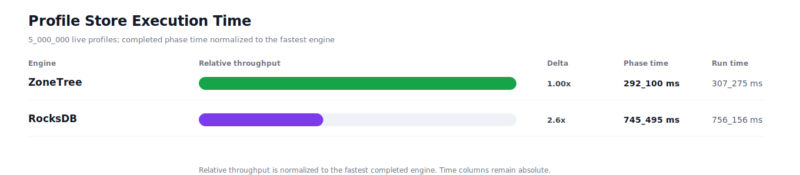
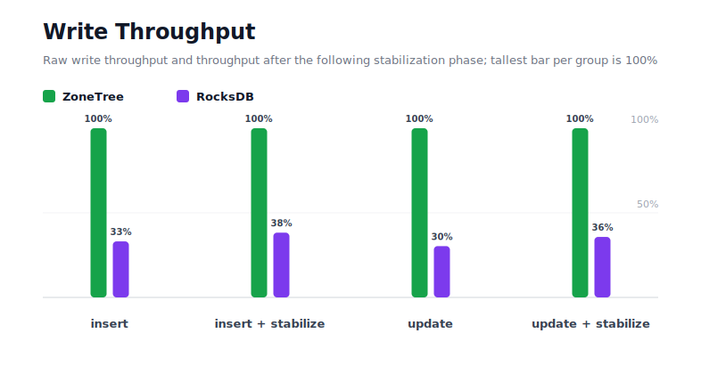
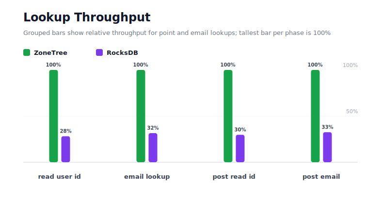
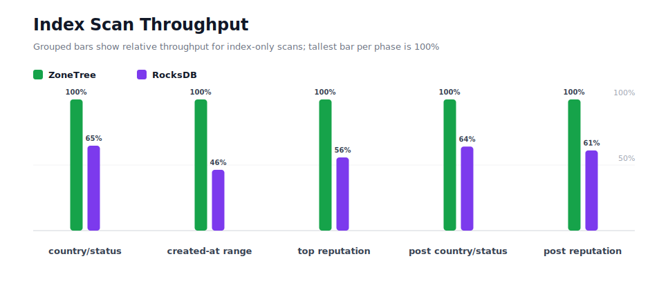
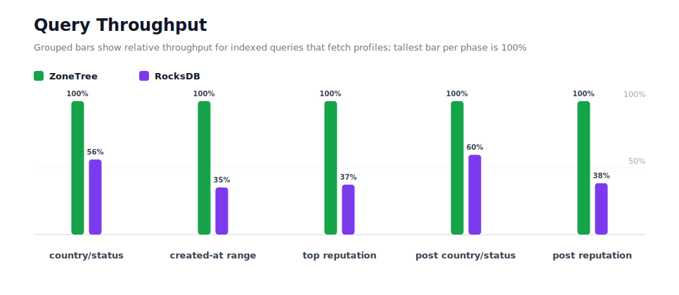
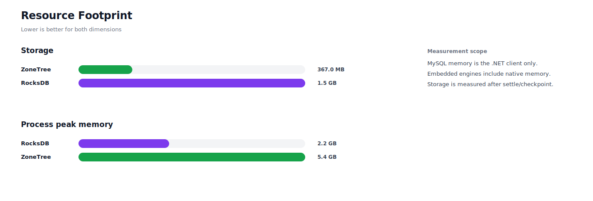

# Benchmark 5M Profiles - Windows

## Charts

### Execution Time

### Write Throughput

### Lookup Throughput

### Index Scan Throughput

### Query Throughput

### Resource Footprint

## Total By Engine

| Engine | Status | Run time | Completed phase time | Pre-read stabilize | Post-update stabilize | Settle | Reopen | Verify | Storage | Process peak memory | Final checksum |
| --- | --- | ---: | ---: | ---: | ---: | ---: | ---: | ---: | ---: | ---: | --- |
| ZoneTree | Completed | 307_275 ms | 292_100 ms | 4_181 ms | 9_784 ms | 15 ms | 321 ms | 13 ms | 367.0 MB | 5.4 GB | `46D8A7E801AF2C78` |
| RocksDB | Completed | 756_156 ms | 745_495 ms | 3_833 ms | 5_713 ms | 1 ms | 50 ms | 698 ms | 1.5 GB | 2.2 GB | `46D8A7E801AF2C78` |

## Correctness

Checksum validation passed across completed engines: ZoneTree, RocksDB.

## Interpretation Notes

* This benchmark measures live single-operation profile inserts, updates, reads, and indexed queries.
* ZoneTree and RocksDB secondary indexes are maintained by the benchmark application using separate stores.
* Embedded engines run in the benchmark process.
* Completed phase time is the sum of measured workload phases. Run time also includes initialization, stabilization, settle/checkpoint, reopen, verification, and reporting overhead.
* The write throughput chart includes raw write phases and derived write-readiness bars that add the following stabilization phase.
* Storage is measured after each engine settles or checkpoints its data.
* Process peak memory is measured for the benchmark process.

## Write Readiness

| Engine | Insert | Pre-read stabilize | Insert + stabilize | Insert ready throughput | Update | Post-update stabilize | Update + stabilize | Update ready throughput |
| --- | ---: | ---: | ---: | ---: | ---: | ---: | ---: | ---: |
| ZoneTree | 17_401 ms | 4_181 ms | 21_581 ms | 231_680/s | 43_260 ms | 9_784 ms | 53_044 ms | 94_261/s |
| RocksDB | 52_556 ms | 3_833 ms | 56_390 ms | 88_669/s | 142_677 ms | 5_713 ms | 148_391 ms | 33_695/s |

## Phase Results

### ZoneTree

| Phase | Operations | Time | Throughput | Checksum |
| --- | ---: | ---: | ---: | --- |
| insert profiles | 5_000_000 | 17_401 ms | 287_342/s | `1CE7E98CB02A5BE5` |
| read by user id | 5_000_000 | 6_869 ms | 727_883/s | `AEA5A1780B272814` |
| lookup by email | 5_000_000 | 16_116 ms | 310_244/s | `8C938BAD6D81DE32` |
| scan country/status index | 1_250_000 | 5_149 ms | 242_746/s | `B79C7B37665D1476` |
| query country/status | 1_250_000 | 37_561 ms | 33_279/s | `6CA0BA910B744D18` |
| scan created-at index | 1_250_000 | 7_090 ms | 176_295/s | `8DC6BE6EDE720671` |
| query created-at range | 1_250_000 | 31_082 ms | 40_216/s | `161BAEF279779E37` |
| scan top reputation index | 1_250_000 | 3_900 ms | 320_526/s | `8EABE473965ABDA5` |
| query top reputation | 1_250_000 | 24_240 ms | 51_568/s | `239CAFF01A8FE9A5` |
| update profiles | 5_000_000 | 43_260 ms | 115_581/s | `AD890A8797F25027` |
| post-update read by user id | 5_000_000 | 7_395 ms | 676_094/s | `537ED4CF9543514D` |
| post-update lookup by email | 5_000_000 | 16_808 ms | 297_482/s | `F71390337A010BCF` |
| post-update scan country/status index | 1_250_000 | 5_141 ms | 243_140/s | `455D3F66E87CBCD7` |
| post-update query country/status | 1_250_000 | 40_523 ms | 30_847/s | `8B4F4083259744A8` |
| post-update scan top reputation index | 1_250_000 | 4_054 ms | 308_321/s | `0A945E5B0B54D925` |
| post-update query top reputation | 1_250_000 | 25_509 ms | 49_002/s | `53DA4C62CB40A725` |

### RocksDB

| Phase | Operations | Time | Throughput | Checksum |
| --- | ---: | ---: | ---: | --- |
| insert profiles | 5_000_000 | 52_556 ms | 95_136/s | `1CE7E98CB02A5BE5` |
| read by user id | 5_000_000 | 24_408 ms | 204_847/s | `AEA5A1780B272814` |
| lookup by email | 5_000_000 | 51_076 ms | 97_893/s | `8C938BAD6D81DE32` |
| scan country/status index | 1_250_000 | 7_955 ms | 157_126/s | `B79C7B37665D1476` |
| query country/status | 1_250_000 | 66_721 ms | 18_735/s | `6CA0BA910B744D18` |
| scan created-at index | 1_250_000 | 15_300 ms | 81_698/s | `8DC6BE6EDE720671` |
| query created-at range | 1_250_000 | 87_847 ms | 14_229/s | `161BAEF279779E37` |
| scan top reputation index | 1_250_000 | 6_992 ms | 178_765/s | `8EABE473965ABDA5` |
| query top reputation | 1_250_000 | 64_752 ms | 19_305/s | `239CAFF01A8FE9A5` |
| update profiles | 5_000_000 | 142_677 ms | 35_044/s | `AD890A8797F25027` |
| post-update read by user id | 5_000_000 | 24_872 ms | 201_027/s | `537ED4CF9543514D` |
| post-update lookup by email | 5_000_000 | 51_650 ms | 96_805/s | `F71390337A010BCF` |
| post-update scan country/status index | 1_250_000 | 8_025 ms | 155_756/s | `455D3F66E87CBCD7` |
| post-update query country/status | 1_250_000 | 67_759 ms | 18_448/s | `8B4F4083259744A8` |
| post-update scan top reputation index | 1_250_000 | 6_633 ms | 188_465/s | `0A945E5B0B54D925` |
| post-update query top reputation | 1_250_000 | 66_269 ms | 18_862/s | `53DA4C62CB40A725` |

## Configuration

* Profiles: 5_000_000
* Parallelism: 1
* Profile writes: individual operations
* UserId reads: 5_000_000
* Email lookups: 5_000_000
* Query count: 1_250_000
* Profile updates: 5_000_000
* Post-update UserId reads: 5_000_000
* Post-update email lookups: 5_000_000
* Post-update query count: 1_250_000
* Query limit: 50
* Seed: 570123434
* Timeout: 120_000 seconds per engine

## Environment

* OS: Microsoft Windows 10.0.26200
* Architecture: X64
* .NET: 10.0.6
* CPU: Intel(R) Core(TM) Ultra 7 265KF
* Logical processors: 20
* Total available memory: 63.6 GB
* Initial process working set: 418.6 MB
* Benchmark version: 1.0.0.0
* ZoneTree version: 1.9.6.0
* Microsoft.Data.Sqlite version: 10.0.0
* SQLite runtime version: 3.50.3
* SQLitePCLRaw.core version: 2.1.11
* SQLitePCLRaw.lib.e_sqlite3 version: 3.50.3
* RocksDbSharp version: 6.2.2
* RocksDbNative version: 6.2.2
* MySqlConnector version: 2.4.0

## Engine Settings

### ZoneTree

* MutableSegmentMaxItemCount: 250000
* SparseArrayStepSize: 16
* KeyCacheSize: 1024
* ValueCacheSize: 1024
* IteratorPrefetchSize: 16
* BlockCacheLifeTime: 1 minutes
* BottomMergePolicy: Full bottom merge when bottom segment count exceeds 1
* ReadStabilization: Settle before read/query phases

### RocksDB

* Databases: profiles,email-index,country-status-index,created-at-index,reputation-index
* Compression: Zstd
* WriteBufferMb: 1024
* MaxWriteBufferNumber: 4
* WriteSync: false
* ReadStabilization: Compact before read/query phases

## Durability Settings

* ZoneTree: AsyncCompressed WAL default; MutableSegmentMaxItemCount=250000; SparseArrayStepSize=16; KeyCacheSize=1024; ValueCacheSize=1024; IteratorPrefetchSize=16; BlockCacheLifeTime=1 minutes; application-managed secondary indexes; background maintainers enabled.
* RocksDB: WAL enabled; five separate RocksDB instances; no WriteBatch across indexes; compression=Zstd; write_buffer_size=1024 MB per database; max_write_buffer_number=4.
