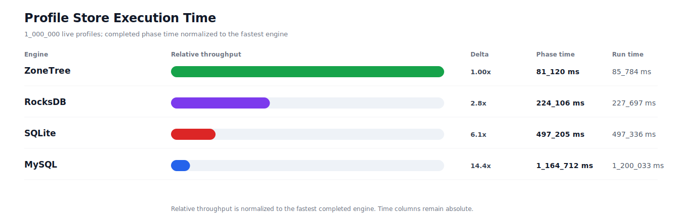
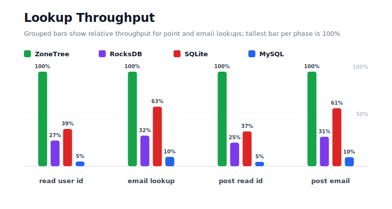
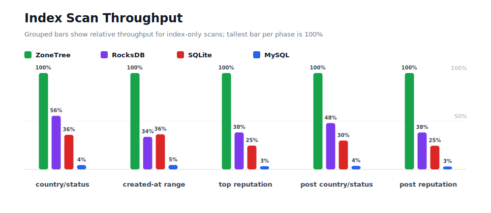
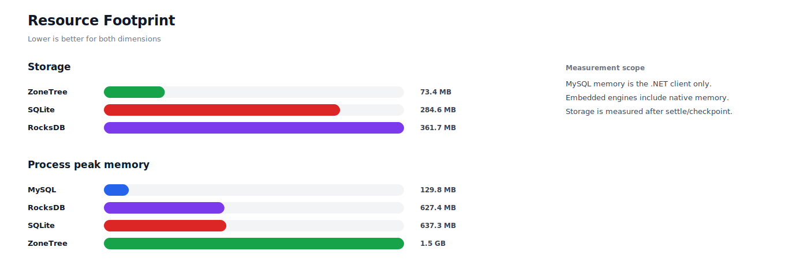

# Benchmark 1M Profiles

## Charts

### Execution Time

### Write Throughput

### Lookup Throughput

### Index Scan Throughput

### Query Throughput

### Resource Footprint

## Total By Engine

| Engine | Status | Run time | Completed phase time | Pre-read stabilize | Post-update stabilize | Settle | Reopen | Verify | Storage | Process peak memory | Final checksum |
| --- | --- | ---: | ---: | ---: | ---: | ---: | ---: | ---: | ---: | ---: | --- |
| ZoneTree | Completed | 85_784 ms | 81_120 ms | 2_143 ms | 1_551 ms | 14 ms | 105 ms | 8 ms | 73.4 MB | 1.5 GB | `B7578931045C8FC5` |
| RocksDB | Completed | 227_697 ms | 224_106 ms | 1_182 ms | 1_978 ms | 0 ms | 45 ms | 148 ms | 361.7 MB | 627.4 MB | `B7578931045C8FC5` |
| SQLite | Completed | 497_336 ms | 497_205 ms | n/a | n/a | 52 ms | 0 ms | 6 ms | 284.6 MB | 637.3 MB | `B7578931045C8FC5` |
| MySQL | Timed out after 1.200 seconds; interrupted: post-update scan country/status index | 1_200_033 ms | 1_164_712 ms | n/a | n/a | n/a | n/a | n/a | n/a | 129.8 MB | n/a |

## Correctness

Checksum validation passed across completed engines: ZoneTree, RocksDB, SQLite. Incomplete engines excluded: MySQL.

## Interpretation Notes

* This benchmark measures live single-operation profile inserts, updates, reads, and indexed queries.
* ZoneTree and RocksDB secondary indexes are maintained by the benchmark application using separate stores.
* SQLite and MySQL maintain secondary indexes inside the database engine.
* MySQL is measured as a client/server database over TCP.
* Embedded engines run in the benchmark process.
* Completed phase time is the sum of measured workload phases. Run time also includes initialization, stabilization, settle/checkpoint, reopen, verification, and reporting overhead.
* Storage is measured after each engine settles or checkpoints its data.
* Process peak memory is measured for the benchmark process. For MySQL, this excludes MySQL server/container memory.
* Timeout results include only completed phases, and checksum comparison is performed only across completed engines.

## Phase Results

### ZoneTree

| Phase | Operations | Time | Throughput | Checksum |
| --- | ---: | ---: | ---: | --- |
| insert profiles | 1_000_000 | 5_771 ms | 173_274/s | `70EEB1E90366F6E5` |
| read by user id | 1_000_000 | 989 ms | 1_011_053/s | `0FB577C390019AC8` |
| lookup by email | 1_000_000 | 2_259 ms | 442_712/s | `9C199CC596F7AC10` |
| scan country/status index | 250_000 | 1_634 ms | 153_040/s | `B3350AAEFBCE068F` |
| query country/status | 250_000 | 12_002 ms | 20_829/s | `11A194A99CB7D634` |
| scan created-at index | 250_000 | 1_638 ms | 152_599/s | `E3FE4E613ABE23A5` |
| query created-at range | 250_000 | 10_974 ms | 22_781/s | `B8595B9702849552` |
| scan top reputation index | 250_000 | 956 ms | 261_598/s | `FD457DADD7424105` |
| query top reputation | 250_000 | 7_359 ms | 33_970/s | `B472892F8C7EF235` |
| update profiles | 1_000_000 | 12_169 ms | 82_174/s | `2440ADD57E65500B` |
| post-update read by user id | 1_000_000 | 1_079 ms | 927_113/s | `7DB9AA24CC9A8B8E` |
| post-update lookup by email | 1_000_000 | 2_192 ms | 456_206/s | `43569B6DA38ACCB5` |
| post-update scan country/status index | 250_000 | 1_346 ms | 185_747/s | `896A595A5F979F99` |
| post-update query country/status | 250_000 | 12_418 ms | 20_131/s | `EF5D80897CBF7824` |
| post-update scan top reputation index | 250_000 | 978 ms | 255_595/s | `905E8A81EE9017E5` |
| post-update query top reputation | 250_000 | 7_355 ms | 33_990/s | `1A17E74A9E34D635` |

### RocksDB

| Phase | Operations | Time | Throughput | Checksum |
| --- | ---: | ---: | ---: | --- |
| insert profiles | 1_000_000 | 10_327 ms | 96_836/s | `70EEB1E90366F6E5` |
| read by user id | 1_000_000 | 4_635 ms | 215_737/s | `0FB577C390019AC8` |
| lookup by email | 1_000_000 | 9_239 ms | 108_236/s | `9C199CC596F7AC10` |
| scan country/status index | 250_000 | 2_880 ms | 86_809/s | `B3350AAEFBCE068F` |
| query country/status | 250_000 | 27_228 ms | 9_182/s | `11A194A99CB7D634` |
| scan created-at index | 250_000 | 4_855 ms | 51_489/s | `E3FE4E613ABE23A5` |
| query created-at range | 250_000 | 31_879 ms | 7_842/s | `B8595B9702849552` |
| scan top reputation index | 250_000 | 2_538 ms | 98_511/s | `FD457DADD7424105` |
| query top reputation | 250_000 | 26_027 ms | 9_605/s | `B472892F8C7EF235` |
| update profiles | 1_000_000 | 23_263 ms | 42_986/s | `2440ADD57E65500B` |
| post-update read by user id | 1_000_000 | 4_868 ms | 205_430/s | `7DB9AA24CC9A8B8E` |
| post-update lookup by email | 1_000_000 | 9_651 ms | 103_617/s | `43569B6DA38ACCB5` |
| post-update scan country/status index | 250_000 | 2_861 ms | 87_394/s | `896A595A5F979F99` |
| post-update query country/status | 250_000 | 31_534 ms | 7_928/s | `EF5D80897CBF7824` |
| post-update scan top reputation index | 250_000 | 2_549 ms | 98_088/s | `905E8A81EE9017E5` |
| post-update query top reputation | 250_000 | 29_773 ms | 8_397/s | `1A17E74A9E34D635` |

### SQLite

| Phase | Operations | Time | Throughput | Checksum |
| --- | ---: | ---: | ---: | --- |
| insert profiles | 1_000_000 | 132_369 ms | 7_555/s | `70EEB1E90366F6E5` |
| read by user id | 1_000_000 | 2_700 ms | 370_433/s | `0FB577C390019AC8` |
| lookup by email | 1_000_000 | 3_577 ms | 279_601/s | `9C199CC596F7AC10` |
| scan country/status index | 250_000 | 4_547 ms | 54_984/s | `B3350AAEFBCE068F` |
| query country/status | 250_000 | 27_978 ms | 8_935/s | `11A194A99CB7D634` |
| scan created-at index | 250_000 | 4_510 ms | 55_434/s | `E3FE4E613ABE23A5` |
| query created-at range | 250_000 | 25_226 ms | 9_910/s | `B8595B9702849552` |
| scan top reputation index | 250_000 | 3_972 ms | 62_948/s | `FD457DADD7424105` |
| query top reputation | 250_000 | 26_654 ms | 9_380/s | `B472892F8C7EF235` |
| update profiles | 1_000_000 | 195_653 ms | 5_111/s | `2440ADD57E65500B` |
| post-update read by user id | 1_000_000 | 2_595 ms | 385_328/s | `7DB9AA24CC9A8B8E` |
| post-update lookup by email | 1_000_000 | 3_492 ms | 286_390/s | `43569B6DA38ACCB5` |
| post-update scan country/status index | 250_000 | 4_577 ms | 54_618/s | `896A595A5F979F99` |
| post-update query country/status | 250_000 | 28_463 ms | 8_783/s | `EF5D80897CBF7824` |
| post-update scan top reputation index | 250_000 | 3_977 ms | 62_859/s | `905E8A81EE9017E5` |
| post-update query top reputation | 250_000 | 26_916 ms | 9_288/s | `1A17E74A9E34D635` |

### MySQL

Interrupted: post-update scan country/status index

| Phase | Operations | Time | Throughput | Checksum |
| --- | ---: | ---: | ---: | --- |
| insert profiles | 1_000_000 | 144_555 ms | 6_918/s | `70EEB1E90366F6E5` |
| read by user id | 1_000_000 | 102_118 ms | 9_793/s | `0FB577C390019AC8` |
| lookup by email | 1_000_000 | 108_485 ms | 9_218/s | `9C199CC596F7AC10` |
| scan country/status index | 250_000 | 38_138 ms | 6_555/s | `B3350AAEFBCE068F` |
| query country/status | 250_000 | 71_829 ms | 3_480/s | `11A194A99CB7D634` |
| scan created-at index | 250_000 | 38_924 ms | 6_423/s | `E3FE4E613ABE23A5` |
| query created-at range | 250_000 | 69_648 ms | 3_589/s | `B8595B9702849552` |
| scan top reputation index | 250_000 | 30_930 ms | 8_083/s | `FD457DADD7424105` |
| query top reputation | 250_000 | 61_728 ms | 4_050/s | `B472892F8C7EF235` |
| update profiles | 1_000_000 | 296_612 ms | 3_371/s | `2440ADD57E65500B` |
| post-update read by user id | 1_000_000 | 96_640 ms | 10_348/s | `7DB9AA24CC9A8B8E` |
| post-update lookup by email | 1_000_000 | 105_107 ms | 9_514/s | `43569B6DA38ACCB5` |

## Configuration

* Profiles: 1_000_000
* Profile writes: individual operations
* UserId reads: 1_000_000
* Email lookups: 1_000_000
* Query count: 250_000
* Profile updates: 1_000_000
* Post-update UserId reads: 1_000_000
* Post-update email lookups: 1_000_000
* Post-update query count: 250_000
* Query limit: 100
* Seed: 570123434
* Timeout: 1_200 seconds per engine

## Environment

* OS: Microsoft Windows 10.0.26200
* Architecture: X64
* .NET: 10.0.6
* CPU: Intel(R) Core(TM) Ultra 7 265KF
* Logical processors: 20
* Total available memory: 63.6 GB
* Initial process working set: 104.6 MB

## Engine Settings

### ZoneTree

* MutableSegmentMaxItemCount: 250000
* SparseArrayStepSize: 16
* KeyCacheSize: 1024
* ValueCacheSize: 1024
* IteratorPrefetchSize: 16
* BlockCacheLifeTime: 1 minutes
* ReadStabilization: Settle before read/query phases

### RocksDB

* Databases: profiles,email-index,country-status-index,created-at-index,reputation-index
* Compression: Zstd
* WriteBufferMb: 1024
* MaxWriteBufferNumber: 4
* WriteSync: false
* ReadStabilization: Compact before read/query phases

### SQLite

* JournalMode: WAL
* Synchronous: NORMAL
* CacheMb: 1024
* MmapMb: 1024
* TempStore: MEMORY

### MySQL

* Host: 192.168.178.25
* Port: 3306
* Database: profilebench
* User: root

## Durability Settings

* ZoneTree: AsyncCompressed WAL default; MutableSegmentMaxItemCount=250000; SparseArrayStepSize=16; KeyCacheSize=1024; ValueCacheSize=1024; IteratorPrefetchSize=16; BlockCacheLifeTime=1 minutes; application-managed secondary indexes; background maintainers enabled.
* RocksDB: WAL enabled; five separate RocksDB instances; no WriteBatch across indexes; compression=Zstd; write_buffer_size=1024 MB per database; max_write_buffer_number=4.
* SQLite: WAL journal mode; synchronous=NORMAL; cache=1024 MB; mmap=1024 MB; native SQL indexes; single-row writes use autocommit.
* MySQL: InnoDB; benchmark Docker disables binlog, sets innodb_flush_log_at_trx_commit=2 and sync_binlog=0; native SQL indexes; single-row writes use autocommit.
