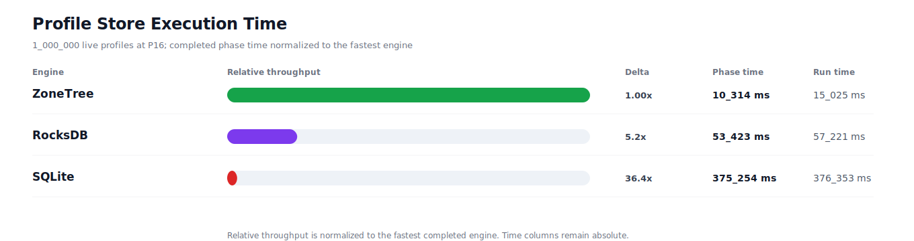
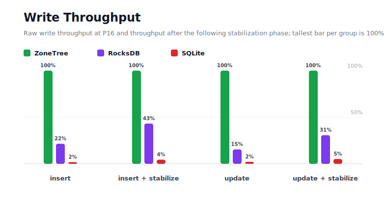
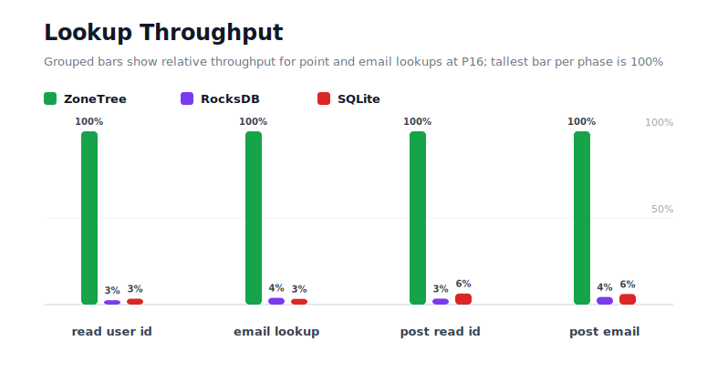
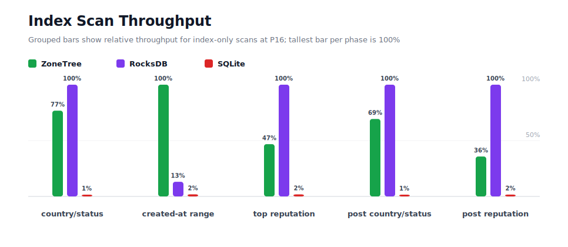
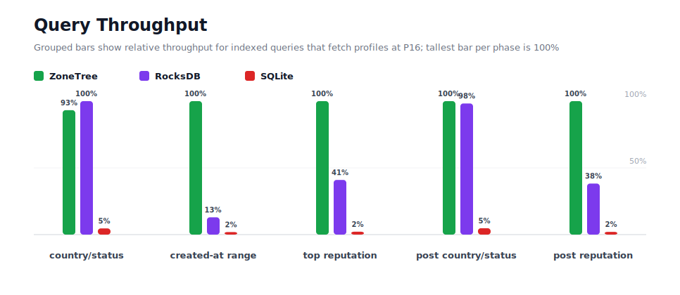
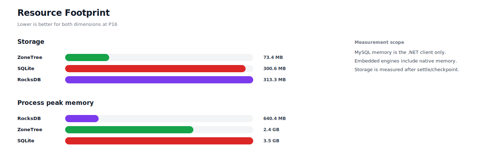

# Profiles 1M P16

## Charts

### Execution Time

### Write Throughput

### Lookup Throughput

### Index Scan Throughput

### Query Throughput
"

### Resource Footprint

## Total By Engine

| Engine | Status | Run time | Completed phase time | Pre-read stabilize | Post-update stabilize | Settle | Reopen | Verify | Storage | Process peak memory | Final checksum |
| --- | --- | ---: | ---: | ---: | ---: | ---: | ---: | ---: | ---: | ---: | --- |
| ZoneTree | Completed | 15_025 ms | 10_314 ms | 1_668 ms | 2_034 ms | 29 ms | 112 ms | 12 ms | 73.4 MB | 2.4 GB | `B7578931045C8FC5` |
| RocksDB | Completed | 57_221 ms | 53_423 ms | 1_246 ms | 2_034 ms | 1 ms | 50 ms | 143 ms | 313.3 MB | 640.4 MB | `B7578931045C8FC5` |
| SQLite | Completed | 376_353 ms | 375_254 ms | n/a | n/a | 936 ms | 1 ms | 15 ms | 300.6 MB | 3.5 GB | `B7578931045C8FC5` |

## Correctness

Checksum validation passed across completed engines: ZoneTree, RocksDB, SQLite.

## Interpretation Notes

* This benchmark measures live single-operation profile inserts, updates, reads, and indexed queries.
* ZoneTree and RocksDB secondary indexes are maintained by the benchmark application using separate stores.
* SQLite maintains secondary indexes inside the database engine.
* Embedded engines run in the benchmark process.
* Completed phase time is the sum of measured workload phases. Run time also includes initialization, stabilization, settle/checkpoint, reopen, verification, and reporting overhead.
* The write throughput chart includes raw write phases and derived write-readiness bars that add the following stabilization phase.
* Storage is measured after each engine settles or checkpoints its data.
* Process peak memory is measured for the benchmark process.

## Write Readiness

| Engine | Insert | Pre-read stabilize | Insert + stabilize | Insert ready throughput | Update | Post-update stabilize | Update + stabilize | Update ready throughput |
| --- | ---: | ---: | ---: | ---: | ---: | ---: | ---: | ---: |
| ZoneTree | 1_125 ms | 1_668 ms | 2_793 ms | 358_096/s | 1_430 ms | 2_034 ms | 3_464 ms | 288_670/s |
| RocksDB | 5_219 ms | 1_246 ms | 6_464 ms | 154_693/s | 9_238 ms | 2_034 ms | 11_272 ms | 88_716/s |
| SQLite | 62_696 ms | n/a | 62_696 ms | 15_950/s | 67_247 ms | n/a | 67_247 ms | 14_871/s |

## Phase Results

### ZoneTree

| Phase | Operations | Time | Throughput | Checksum |
| --- | ---: | ---: | ---: | --- |
| insert profiles | 1_000_000 | 1_125 ms | 889_006/s | `FEBD9185EFEF90EA` |
| read by user id | 1_000_000 | 187 ms | 5_334_710/s | `570C7C195BC46EB1` |
| lookup by email | 1_000_000 | 262 ms | 3_813_071/s | `D9A340DA0A79BF2B` |
| scan country/status index | 250_000 | 245 ms | 1_022_050/s | `074C13DEC9D66F9B` |
| query country/status | 250_000 | 1_685 ms | 148_343/s | `11314C2D73BD8D25` |
| scan created-at index | 250_000 | 262 ms | 955_942/s | `2D8343DE38FEB987` |
| query created-at range | 250_000 | 649 ms | 385_240/s | `87784D38A4FA7B1E` |
| scan top reputation index | 250_000 | 393 ms | 635_452/s | `E083CDA3090226C5` |
| query top reputation | 250_000 | 635 ms | 393_729/s | `258F00803FCC6F85` |
| update profiles | 1_000_000 | 1_430 ms | 699_232/s | `39DC4EC8871CD076` |
| post-update read by user id | 1_000_000 | 172 ms | 5_810_876/s | `F70B3DE998EC77E8` |
| post-update lookup by email | 1_000_000 | 245 ms | 4_074_174/s | `99A2343A1FC52620` |
| post-update scan country/status index | 250_000 | 278 ms | 897_808/s | `793881F928350E78` |
| post-update query country/status | 250_000 | 1_615 ms | 154_791/s | `85BAEB9A2CEAE7A6` |
| post-update scan top reputation index | 250_000 | 496 ms | 504_018/s | `405A6335926BC525` |
| post-update query top reputation | 250_000 | 633 ms | 394_635/s | `B98C6CAA95AB4485` |

### RocksDB

| Phase | Operations | Time | Throughput | Checksum |
| --- | ---: | ---: | ---: | --- |
| insert profiles | 1_000_000 | 5_219 ms | 191_623/s | `FEBD9185EFEF90EA` |
| read by user id | 1_000_000 | 7_468 ms | 133_911/s | `570C7C195BC46EB1` |
| lookup by email | 1_000_000 | 6_737 ms | 148_430/s | `D9A340DA0A79BF2B` |
| scan country/status index | 250_000 | 188 ms | 1_331_884/s | `074C13DEC9D66F9B` |
| query country/status | 250_000 | 1_571 ms | 159_129/s | `11314C2D73BD8D25` |
| scan created-at index | 250_000 | 1_998 ms | 125_100/s | `2D8343DE38FEB987` |
| query created-at range | 250_000 | 5_013 ms | 49_866/s | `87784D38A4FA7B1E` |
| scan top reputation index | 250_000 | 184 ms | 1_358_731/s | `E083CDA3090226C5` |
| query top reputation | 250_000 | 1_551 ms | 161_234/s | `258F00803FCC6F85` |
| update profiles | 1_000_000 | 9_238 ms | 108_252/s | `39DC4EC8871CD076` |
| post-update read by user id | 1_000_000 | 4_994 ms | 200_257/s | `F70B3DE998EC77E8` |
| post-update lookup by email | 1_000_000 | 5_592 ms | 178_820/s | `99A2343A1FC52620` |
| post-update scan country/status index | 250_000 | 193 ms | 1_295_390/s | `793881F928350E78` |
| post-update query country/status | 250_000 | 1_644 ms | 152_076/s | `85BAEB9A2CEAE7A6` |
| post-update scan top reputation index | 250_000 | 177 ms | 1_411_416/s | `405A6335926BC525` |
| post-update query top reputation | 250_000 | 1_657 ms | 150_901/s | `B98C6CAA95AB4485` |

### SQLite

| Phase | Operations | Time | Throughput | Checksum |
| --- | ---: | ---: | ---: | --- |
| insert profiles | 1_000_000 | 62_696 ms | 15_950/s | `FEBD9185EFEF90EA` |
| read by user id | 1_000_000 | 5_521 ms | 181_123/s | `570C7C195BC46EB1` |
| lookup by email | 1_000_000 | 7_961 ms | 125_612/s | `D9A340DA0A79BF2B` |
| scan country/status index | 250_000 | 14_010 ms | 17_845/s | `074C13DEC9D66F9B` |
| query country/status | 250_000 | 34_045 ms | 7_343/s | `11314C2D73BD8D25` |
| scan created-at index | 250_000 | 14_011 ms | 17_843/s | `2D8343DE38FEB987` |
| query created-at range | 250_000 | 34_082 ms | 7_335/s | `87784D38A4FA7B1E` |
| scan top reputation index | 250_000 | 10_138 ms | 24_660/s | `E083CDA3090226C5` |
| query top reputation | 250_000 | 29_296 ms | 8_534/s | `258F00803FCC6F85` |
| update profiles | 1_000_000 | 67_247 ms | 14_871/s | `39DC4EC8871CD076` |
| post-update read by user id | 1_000_000 | 2_691 ms | 371_657/s | `F70B3DE998EC77E8` |
| post-update lookup by email | 1_000_000 | 4_016 ms | 249_004/s | `99A2343A1FC52620` |
| post-update scan country/status index | 250_000 | 14_024 ms | 17_827/s | `793881F928350E78` |
| post-update query country/status | 250_000 | 33_863 ms | 7_383/s | `85BAEB9A2CEAE7A6` |
| post-update scan top reputation index | 250_000 | 10_702 ms | 23_361/s | `405A6335926BC525` |
| post-update query top reputation | 250_000 | 30_952 ms | 8_077/s | `B98C6CAA95AB4485` |

## Configuration

* Profiles: 1_000_000
* Parallelism: 16
* Profile writes: individual operations
* UserId reads: 1_000_000
* Email lookups: 1_000_000
* Query count: 250_000
* Profile updates: 1_000_000
* Post-update UserId reads: 1_000_000
* Post-update email lookups: 1_000_000
* Post-update query count: 250_000
* Query limit: 50
* Seed: 570123434
* Timeout: 120_000 seconds per engine

## Environment

* OS: Microsoft Windows 10.0.26200
* Architecture: X64
* .NET: 10.0.6
* CPU: Intel(R) Core(TM) Ultra 7 265KF
* Logical processors: 20
* Total available memory: 63.6 GB
* Initial process working set: 145.3 MB
* Benchmark version: 1.0.0.0
* ZoneTree version: 1.9.6.0
* Microsoft.Data.Sqlite version: 10.0.0
* SQLite runtime version: 3.50.3
* SQLitePCLRaw.core version: 2.1.11
* SQLitePCLRaw.lib.e_sqlite3 version: 3.50.3
* RocksDbSharp version: 6.2.2
* RocksDbNative version: 6.2.2
* MySqlConnector version: 2.4.0

## Engine Settings

### ZoneTree

* MutableSegmentMaxItemCount: 250000
* SparseArrayStepSize: 16
* KeyCacheSize: 1024
* ValueCacheSize: 1024
* IteratorPrefetchSize: 16
* BlockCacheLifeTime: 1 minutes
* BottomMergePolicy: Full bottom merge when bottom segment count exceeds 1
* ReadStabilization: Settle before read/query phases

### RocksDB

* Databases: profiles,email-index,country-status-index,created-at-index,reputation-index
* Compression: Zstd
* WriteBufferMb: 1024
* MaxWriteBufferNumber: 4
* WriteSync: false
* ReadStabilization: Compact before read/query phases

### SQLite

* JournalMode: WAL
* Synchronous: NORMAL
* CacheMb: 1024
* MmapMb: 1024
* TempStore: MEMORY

## Durability Settings

* ZoneTree: AsyncCompressed WAL default; MutableSegmentMaxItemCount=250000; SparseArrayStepSize=16; KeyCacheSize=1024; ValueCacheSize=1024; IteratorPrefetchSize=16; BlockCacheLifeTime=1 minutes; application-managed secondary indexes; background maintainers enabled.
* RocksDB: WAL enabled; five separate RocksDB instances; no WriteBatch across indexes; compression=Zstd; write_buffer_size=1024 MB per database; max_write_buffer_number=4.
* SQLite: WAL journal mode; synchronous=NORMAL; cache=1024 MB; mmap=1024 MB; native SQL indexes; single-row writes use autocommit.
