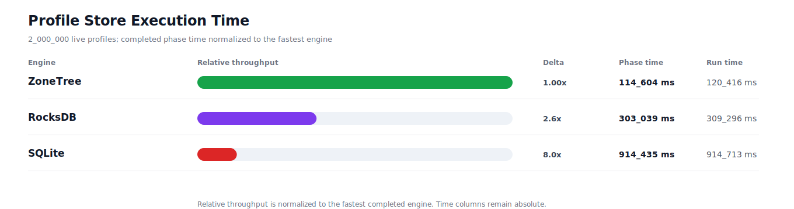
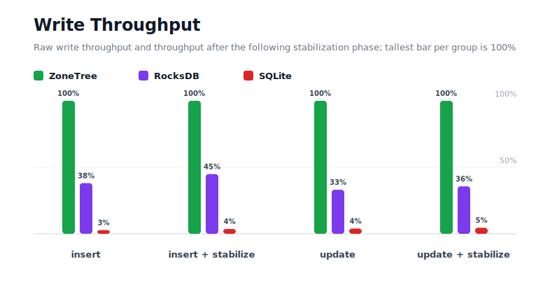
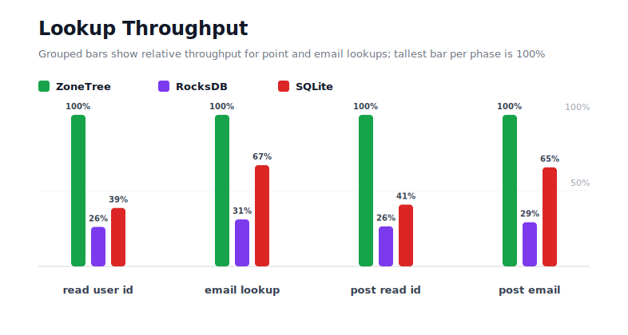
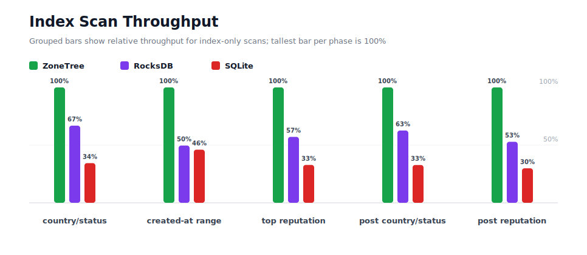
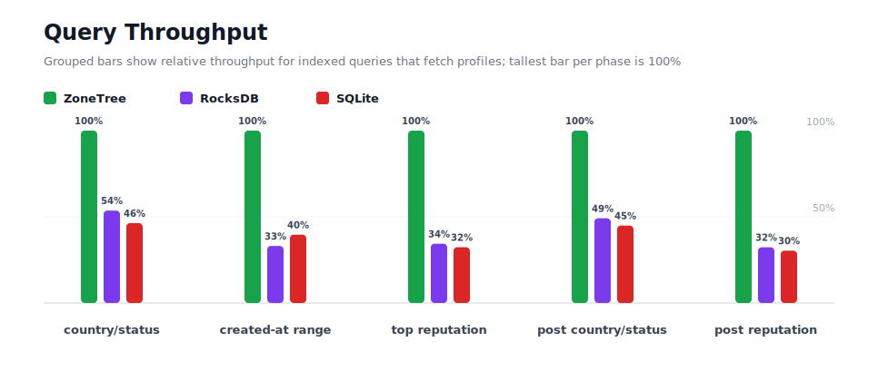
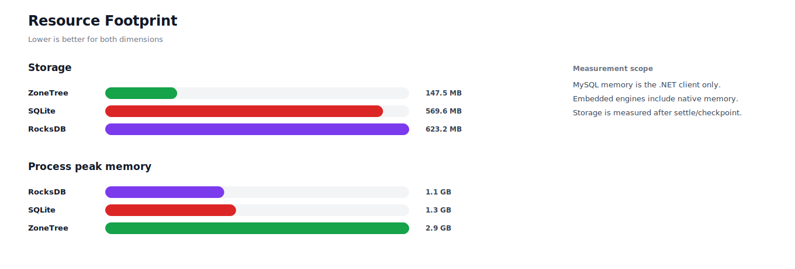

# Profiles 2M P1

## Charts

### Execution Time

### Write Throughput

### Lookup Throughput

### Index Scan Throughput

### Query Throughput

### Resource Footprint

## Total By Engine

| Engine | Status | Run time | Completed phase time | Pre-read stabilize | Post-update stabilize | Settle | Reopen | Verify | Storage | Process peak memory | Final checksum |
| --- | --- | ---: | ---: | ---: | ---: | ---: | ---: | ---: | ---: | ---: | --- |
| ZoneTree | Completed | 120_416 ms | 114_604 ms | 2_294 ms | 2_555 ms | 14 ms | 167 ms | 12 ms | 147.5 MB | 2.9 GB | `A7EB98FFC773884D` |
| RocksDB | Completed | 309_296 ms | 303_039 ms | 2_010 ms | 3_569 ms | 1 ms | 50 ms | 278 ms | 623.2 MB | 1.1 GB | `A7EB98FFC773884D` |
| SQLite | Completed | 914_713 ms | 914_435 ms | n/a | n/a | 21 ms | 1 ms | 115 ms | 569.6 MB | 1.3 GB | `A7EB98FFC773884D` |

## Correctness

Checksum validation passed across completed engines: ZoneTree, RocksDB, SQLite.

## Interpretation Notes

* This benchmark measures live single-operation profile inserts, updates, reads, and indexed queries.
* ZoneTree and RocksDB secondary indexes are maintained by the benchmark application using separate stores.
* SQLite maintains secondary indexes inside the database engine.
* Embedded engines run in the benchmark process.
* Completed phase time is the sum of measured workload phases. Run time also includes initialization, stabilization, settle/checkpoint, reopen, verification, and reporting overhead.
* The write throughput chart includes raw write phases and derived write-readiness bars that add the following stabilization phase.
* Storage is measured after each engine settles or checkpoints its data.
* Process peak memory is measured for the benchmark process.

## Write Readiness

| Engine | Insert | Pre-read stabilize | Insert + stabilize | Insert ready throughput | Update | Post-update stabilize | Update + stabilize | Update ready throughput |
| --- | ---: | ---: | ---: | ---: | ---: | ---: | ---: | ---: |
| ZoneTree | 7_752 ms | 2_294 ms | 10_046 ms | 199_088/s | 16_460 ms | 2_555 ms | 19_015 ms | 105_180/s |
| RocksDB | 20_352 ms | 2_010 ms | 22_363 ms | 89_435/s | 49_700 ms | 3_569 ms | 53_269 ms | 37_545/s |
| SQLite | 274_996 ms | n/a | 274_996 ms | 7_273/s | 416_389 ms | n/a | 416_389 ms | 4_803/s |

## Phase Results

### ZoneTree

| Phase | Operations | Time | Throughput | Checksum |
| --- | ---: | ---: | ---: | --- |
| insert profiles | 2_000_000 | 7_752 ms | 258_006/s | `4F24F178E189EEA5` |
| read by user id | 2_000_000 | 2_308 ms | 866_449/s | `94FEA7BBDF9EB16F` |
| lookup by email | 2_000_000 | 5_636 ms | 354_847/s | `7911E6F89610C9DB` |
| scan country/status index | 500_000 | 2_112 ms | 236_690/s | `FF334B02B19EEB47` |
| query country/status | 500_000 | 15_905 ms | 31_437/s | `7A39FF8F682EA682` |
| scan created-at index | 500_000 | 2_890 ms | 173_004/s | `BF45DF5EE0C200CD` |
| query created-at range | 500_000 | 12_497 ms | 40_011/s | `D3E6F86C306E84D2` |
| scan top reputation index | 500_000 | 1_713 ms | 291_862/s | `2A869DDD6838E065` |
| query top reputation | 500_000 | 10_406 ms | 48_049/s | `D35AC53DF1237365` |
| update profiles | 2_000_000 | 16_460 ms | 121_506/s | `1100814B966927C5` |
| post-update read by user id | 2_000_000 | 2_404 ms | 831_915/s | `B004A4D20A4A3848` |
| post-update lookup by email | 2_000_000 | 5_442 ms | 367_484/s | `D353A40B4BEBE4B5` |
| post-update scan country/status index | 500_000 | 2_022 ms | 247_314/s | `3875E1E8C236F0F9` |
| post-update query country/status | 500_000 | 15_576 ms | 32_100/s | `7DB733996D701F52` |
| post-update scan top reputation index | 500_000 | 1_597 ms | 313_032/s | `B99A64873AA64365` |
| post-update query top reputation | 500_000 | 9_883 ms | 50_592/s | `BFED9315B44CCEE5` |

### RocksDB

| Phase | Operations | Time | Throughput | Checksum |
| --- | ---: | ---: | ---: | --- |
| insert profiles | 2_000_000 | 20_352 ms | 98_268/s | `4F24F178E189EEA5` |
| read by user id | 2_000_000 | 8_857 ms | 225_805/s | `94FEA7BBDF9EB16F` |
| lookup by email | 2_000_000 | 18_175 ms | 110_040/s | `7911E6F89610C9DB` |
| scan country/status index | 500_000 | 3_159 ms | 158_290/s | `FF334B02B19EEB47` |
| query country/status | 500_000 | 29_663 ms | 16_856/s | `7A39FF8F682EA682` |
| scan created-at index | 500_000 | 5_824 ms | 85_856/s | `BF45DF5EE0C200CD` |
| query created-at range | 500_000 | 37_773 ms | 13_237/s | `D3E6F86C306E84D2` |
| scan top reputation index | 500_000 | 2_999 ms | 166_747/s | `2A869DDD6838E065` |
| query top reputation | 500_000 | 30_251 ms | 16_528/s | `D35AC53DF1237365` |
| update profiles | 2_000_000 | 49_700 ms | 40_242/s | `1100814B966927C5` |
| post-update read by user id | 2_000_000 | 9_099 ms | 219_815/s | `B004A4D20A4A3848` |
| post-update lookup by email | 2_000_000 | 18_673 ms | 107_109/s | `D353A40B4BEBE4B5` |
| post-update scan country/status index | 500_000 | 3_227 ms | 154_927/s | `3875E1E8C236F0F9` |
| post-update query country/status | 500_000 | 31_696 ms | 15_775/s | `7DB733996D701F52` |
| post-update scan top reputation index | 500_000 | 3_021 ms | 165_511/s | `B99A64873AA64365` |
| post-update query top reputation | 500_000 | 30_571 ms | 16_355/s | `BFED9315B44CCEE5` |

### SQLite

| Phase | Operations | Time | Throughput | Checksum |
| --- | ---: | ---: | ---: | --- |
| insert profiles | 2_000_000 | 274_996 ms | 7_273/s | `4F24F178E189EEA5` |
| read by user id | 2_000_000 | 5_987 ms | 334_034/s | `94FEA7BBDF9EB16F` |
| lookup by email | 2_000_000 | 8_437 ms | 237_055/s | `7911E6F89610C9DB` |
| scan country/status index | 500_000 | 6_146 ms | 81_359/s | `FF334B02B19EEB47` |
| query country/status | 500_000 | 34_311 ms | 14_573/s | `7A39FF8F682EA682` |
| scan created-at index | 500_000 | 6_279 ms | 79_625/s | `BF45DF5EE0C200CD` |
| query created-at range | 500_000 | 31_535 ms | 15_856/s | `D3E6F86C306E84D2` |
| scan top reputation index | 500_000 | 5_220 ms | 95_776/s | `2A869DDD6838E065` |
| query top reputation | 500_000 | 32_174 ms | 15_540/s | `D35AC53DF1237365` |
| update profiles | 2_000_000 | 416_389 ms | 4_803/s | `1100814B966927C5` |
| post-update read by user id | 2_000_000 | 5_898 ms | 339_118/s | `B004A4D20A4A3848` |
| post-update lookup by email | 2_000_000 | 8_326 ms | 240_199/s | `D353A40B4BEBE4B5` |
| post-update scan country/status index | 500_000 | 6_176 ms | 80_956/s | `3875E1E8C236F0F9` |
| post-update query country/status | 500_000 | 34_672 ms | 14_421/s | `7DB733996D701F52` |
| post-update scan top reputation index | 500_000 | 5_345 ms | 93_552/s | `B99A64873AA64365` |
| post-update query top reputation | 500_000 | 32_543 ms | 15_364/s | `BFED9315B44CCEE5` |

## Configuration

* Profiles: 2_000_000
* Parallelism: 1
* Profile writes: individual operations
* UserId reads: 2_000_000
* Email lookups: 2_000_000
* Query count: 500_000
* Profile updates: 2_000_000
* Post-update UserId reads: 2_000_000
* Post-update email lookups: 2_000_000
* Post-update query count: 500_000
* Query limit: 50
* Seed: 570123434
* Timeout: 120_000 seconds per engine

## Environment

* OS: Microsoft Windows 10.0.26200
* Architecture: X64
* .NET: 10.0.6
* CPU: Intel(R) Core(TM) Ultra 7 265KF
* Logical processors: 20
* Total available memory: 63.6 GB
* Initial process working set: 232.6 MB
* Benchmark version: 1.0.0.0
* ZoneTree version: 1.9.6.0
* Microsoft.Data.Sqlite version: 10.0.0
* SQLite runtime version: 3.50.3
* SQLitePCLRaw.core version: 2.1.11
* SQLitePCLRaw.lib.e_sqlite3 version: 3.50.3
* RocksDbSharp version: 6.2.2
* RocksDbNative version: 6.2.2
* MySqlConnector version: 2.4.0

## Engine Settings

### ZoneTree

* MutableSegmentMaxItemCount: 250000
* SparseArrayStepSize: 16
* KeyCacheSize: 1024
* ValueCacheSize: 1024
* IteratorPrefetchSize: 16
* BlockCacheLifeTime: 1 minutes
* BottomMergePolicy: Full bottom merge when bottom segment count exceeds 1
* ReadStabilization: Settle before read/query phases

### RocksDB

* Databases: profiles,email-index,country-status-index,created-at-index,reputation-index
* Compression: Zstd
* WriteBufferMb: 1024
* MaxWriteBufferNumber: 4
* WriteSync: false
* ReadStabilization: Compact before read/query phases

### SQLite

* JournalMode: WAL
* Synchronous: NORMAL
* CacheMb: 1024
* MmapMb: 1024
* TempStore: MEMORY

## Durability Settings

* ZoneTree: AsyncCompressed WAL default; MutableSegmentMaxItemCount=250000; SparseArrayStepSize=16; KeyCacheSize=1024; ValueCacheSize=1024; IteratorPrefetchSize=16; BlockCacheLifeTime=1 minutes; application-managed secondary indexes; background maintainers enabled.
* RocksDB: WAL enabled; five separate RocksDB instances; no WriteBatch across indexes; compression=Zstd; write_buffer_size=1024 MB per database; max_write_buffer_number=4.
* SQLite: WAL journal mode; synchronous=NORMAL; cache=1024 MB; mmap=1024 MB; native SQL indexes; single-row writes use autocommit.
