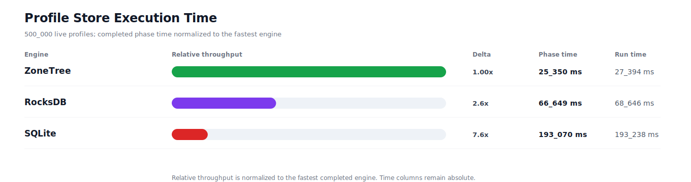
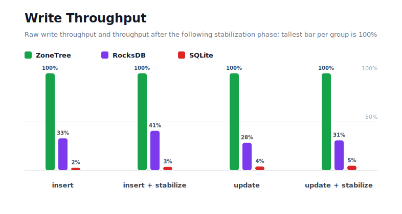
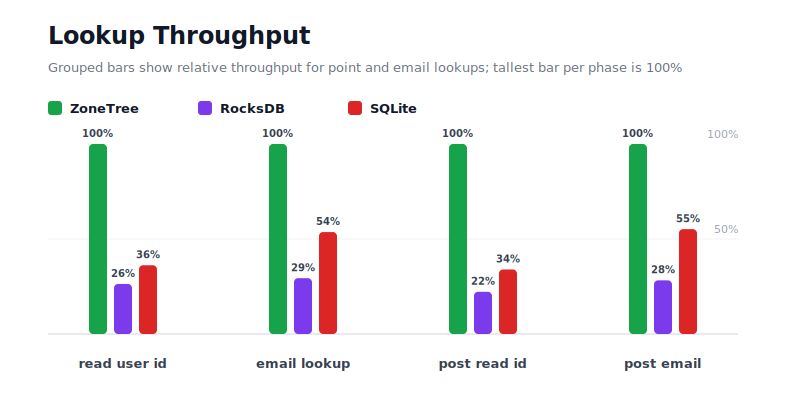
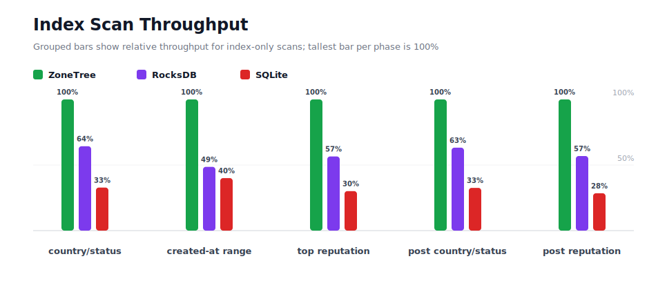
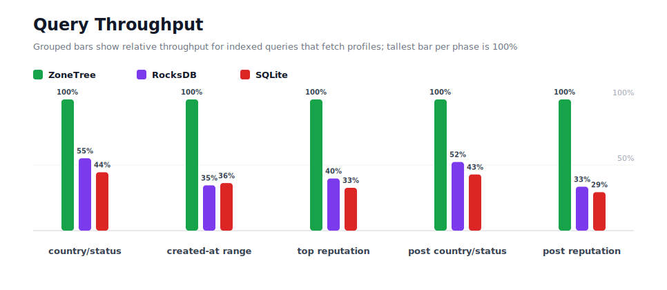
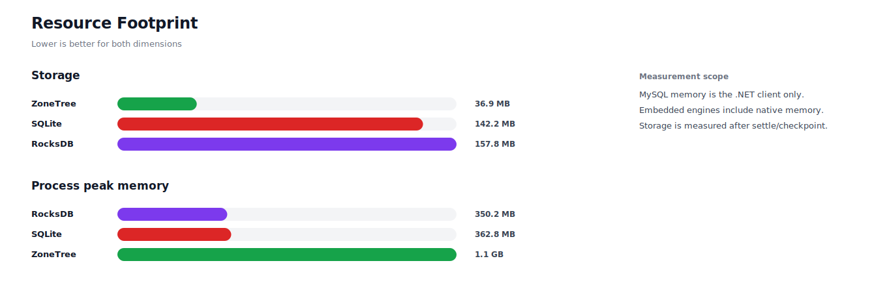

# Profiles 500K P1

## Charts

### Execution Time

### Write Throughput

### Lookup Throughput

### Index Scan Throughput

### Query Throughput

### Resource Footprint

## Total By Engine

| Engine | Status | Run time | Completed phase time | Pre-read stabilize | Post-update stabilize | Settle | Reopen | Verify | Storage | Process peak memory | Final checksum |
| --- | --- | ---: | ---: | ---: | ---: | ---: | ---: | ---: | ---: | ---: | --- |
| ZoneTree | Completed | 27_394 ms | 25_350 ms | 615 ms | 563 ms | 13 ms | 91 ms | 12 ms | 36.9 MB | 1.1 GB | `DF2D9443B36E4083` |
| RocksDB | Completed | 68_646 ms | 66_649 ms | 590 ms | 992 ms | 1 ms | 44 ms | 82 ms | 157.8 MB | 350.2 MB | `DF2D9443B36E4083` |
| SQLite | Completed | 193_238 ms | 193_070 ms | n/a | n/a | 22 ms | 1 ms | 30 ms | 142.2 MB | 362.8 MB | `DF2D9443B36E4083` |

## Correctness

Checksum validation passed across completed engines: ZoneTree, RocksDB, SQLite.

## Interpretation Notes

* This benchmark measures live single-operation profile inserts, updates, reads, and indexed queries.
* ZoneTree and RocksDB secondary indexes are maintained by the benchmark application using separate stores.
* SQLite maintains secondary indexes inside the database engine.
* Embedded engines run in the benchmark process.
* Completed phase time is the sum of measured workload phases. Run time also includes initialization, stabilization, settle/checkpoint, reopen, verification, and reporting overhead.
* The write throughput chart includes raw write phases and derived write-readiness bars that add the following stabilization phase.
* Storage is measured after each engine settles or checkpoints its data.
* Process peak memory is measured for the benchmark process.

## Write Readiness

| Engine | Insert | Pre-read stabilize | Insert + stabilize | Insert ready throughput | Update | Post-update stabilize | Update + stabilize | Update ready throughput |
| --- | ---: | ---: | ---: | ---: | ---: | ---: | ---: | ---: |
| ZoneTree | 1_590 ms | 615 ms | 2_205 ms | 226_760/s | 2_846 ms | 563 ms | 3_409 ms | 146_656/s |
| RocksDB | 4_828 ms | 590 ms | 5_418 ms | 92_281/s | 10_079 ms | 992 ms | 11_071 ms | 45_163/s |
| SQLite | 64_032 ms | n/a | 64_032 ms | 7_809/s | 73_719 ms | n/a | 73_719 ms | 6_782/s |

## Phase Results

### ZoneTree

| Phase | Operations | Time | Throughput | Checksum |
| --- | ---: | ---: | ---: | --- |
| insert profiles | 500_000 | 1_590 ms | 314_436/s | `B11DAA52EA85C1C5` |
| read by user id | 500_000 | 522 ms | 957_107/s | `C99FB8E32773191A` |
| lookup by email | 500_000 | 1_059 ms | 472_026/s | `706F2D03429A82A7` |
| scan country/status index | 125_000 | 514 ms | 243_294/s | `8E356BA871BD7F8C` |
| query country/status | 125_000 | 3_768 ms | 33_172/s | `278730BE6AF6228A` |
| scan created-at index | 125_000 | 624 ms | 200_183/s | `B5DDE0691514B8AD` |
| query created-at range | 125_000 | 2_858 ms | 43_729/s | `A688AA86490F2738` |
| scan top reputation index | 125_000 | 393 ms | 318_194/s | `540603A72FECF405` |
| query top reputation | 125_000 | 2_614 ms | 47_821/s | `5921287764708505` |
| update profiles | 500_000 | 2_846 ms | 175_681/s | `6AB28B68BED1A31E` |
| post-update read by user id | 500_000 | 480 ms | 1_040_952/s | `C372C9201718339D` |
| post-update lookup by email | 500_000 | 1_070 ms | 467_369/s | `EBA2EFF100A143BD` |
| post-update scan country/status index | 125_000 | 502 ms | 248_990/s | `A315FF71BC274C9E` |
| post-update query country/status | 125_000 | 3_753 ms | 33_303/s | `DA7DC60B48D60B33` |
| post-update scan top reputation index | 125_000 | 377 ms | 331_287/s | `7242B60DCFE2F6E5` |
| post-update query top reputation | 125_000 | 2_378 ms | 52_567/s | `34B1375F7919D3C5` |

### RocksDB

| Phase | Operations | Time | Throughput | Checksum |
| --- | ---: | ---: | ---: | --- |
| insert profiles | 500_000 | 4_828 ms | 103_566/s | `B11DAA52EA85C1C5` |
| read by user id | 500_000 | 1_983 ms | 252_088/s | `C99FB8E32773191A` |
| lookup by email | 500_000 | 3_606 ms | 138_675/s | `706F2D03429A82A7` |
| scan country/status index | 125_000 | 799 ms | 156_477/s | `8E356BA871BD7F8C` |
| query country/status | 125_000 | 6_833 ms | 18_294/s | `278730BE6AF6228A` |
| scan created-at index | 125_000 | 1_284 ms | 97_315/s | `B5DDE0691514B8AD` |
| query created-at range | 125_000 | 8_276 ms | 15_104/s | `A688AA86490F2738` |
| scan top reputation index | 125_000 | 695 ms | 179_844/s | `540603A72FECF405` |
| query top reputation | 125_000 | 6_579 ms | 19_000/s | `5921287764708505` |
| update profiles | 500_000 | 10_079 ms | 49_606/s | `6AB28B68BED1A31E` |
| post-update read by user id | 500_000 | 2_162 ms | 231_296/s | `C372C9201718339D` |
| post-update lookup by email | 500_000 | 3_789 ms | 131_972/s | `EBA2EFF100A143BD` |
| post-update scan country/status index | 125_000 | 794 ms | 157_410/s | `A315FF71BC274C9E` |
| post-update query country/status | 125_000 | 7_175 ms | 17_422/s | `DA7DC60B48D60B33` |
| post-update scan top reputation index | 125_000 | 664 ms | 188_357/s | `7242B60DCFE2F6E5` |
| post-update query top reputation | 125_000 | 7_104 ms | 17_597/s | `34B1375F7919D3C5` |

### SQLite

| Phase | Operations | Time | Throughput | Checksum |
| --- | ---: | ---: | ---: | --- |
| insert profiles | 500_000 | 64_032 ms | 7_809/s | `B11DAA52EA85C1C5` |
| read by user id | 500_000 | 1_444 ms | 346_303/s | `C99FB8E32773191A` |
| lookup by email | 500_000 | 1_974 ms | 253_312/s | `706F2D03429A82A7` |
| scan country/status index | 125_000 | 1_566 ms | 79_827/s | `8E356BA871BD7F8C` |
| query country/status | 125_000 | 8_470 ms | 14_757/s | `278730BE6AF6228A` |
| scan created-at index | 125_000 | 1_560 ms | 80_146/s | `B5DDE0691514B8AD` |
| query created-at range | 125_000 | 7_887 ms | 15_850/s | `A688AA86490F2738` |
| scan top reputation index | 125_000 | 1_304 ms | 95_830/s | `540603A72FECF405` |
| query top reputation | 125_000 | 8_014 ms | 15_599/s | `5921287764708505` |
| update profiles | 500_000 | 73_719 ms | 6_782/s | `6AB28B68BED1A31E` |
| post-update read by user id | 500_000 | 1_414 ms | 353_632/s | `C372C9201718339D` |
| post-update lookup by email | 500_000 | 1_938 ms | 257_946/s | `EBA2EFF100A143BD` |
| post-update scan country/status index | 125_000 | 1_541 ms | 81_114/s | `A315FF71BC274C9E` |
| post-update query country/status | 125_000 | 8_766 ms | 14_260/s | `DA7DC60B48D60B33` |
| post-update scan top reputation index | 125_000 | 1_325 ms | 94_354/s | `7242B60DCFE2F6E5` |
| post-update query top reputation | 125_000 | 8_116 ms | 15_401/s | `34B1375F7919D3C5` |

## Configuration

* Profiles: 500_000
* Parallelism: 1
* Profile writes: individual operations
* UserId reads: 500_000
* Email lookups: 500_000
* Query count: 125_000
* Profile updates: 500_000
* Post-update UserId reads: 500_000
* Post-update email lookups: 500_000
* Post-update query count: 125_000
* Query limit: 50
* Seed: 570123434
* Timeout: 120_000 seconds per engine

## Environment

* OS: Microsoft Windows 10.0.26200
* Architecture: X64
* .NET: 10.0.6
* CPU: Intel(R) Core(TM) Ultra 7 265KF
* Logical processors: 20
* Total available memory: 63.6 GB
* Initial process working set: 104.8 MB
* Benchmark version: 1.0.0.0
* ZoneTree version: 1.9.6.0
* Microsoft.Data.Sqlite version: 10.0.0
* SQLite runtime version: 3.50.3
* SQLitePCLRaw.core version: 2.1.11
* SQLitePCLRaw.lib.e_sqlite3 version: 3.50.3
* RocksDbSharp version: 6.2.2
* RocksDbNative version: 6.2.2
* MySqlConnector version: 2.4.0

## Engine Settings

### ZoneTree

* MutableSegmentMaxItemCount: 250000
* SparseArrayStepSize: 16
* KeyCacheSize: 1024
* ValueCacheSize: 1024
* IteratorPrefetchSize: 16
* BlockCacheLifeTime: 1 minutes
* BottomMergePolicy: Full bottom merge when bottom segment count exceeds 1
* ReadStabilization: Settle before read/query phases

### RocksDB

* Databases: profiles,email-index,country-status-index,created-at-index,reputation-index
* Compression: Zstd
* WriteBufferMb: 1024
* MaxWriteBufferNumber: 4
* WriteSync: false
* ReadStabilization: Compact before read/query phases

### SQLite

* JournalMode: WAL
* Synchronous: NORMAL
* CacheMb: 1024
* MmapMb: 1024
* TempStore: MEMORY

## Durability Settings

* ZoneTree: AsyncCompressed WAL default; MutableSegmentMaxItemCount=250000; SparseArrayStepSize=16; KeyCacheSize=1024; ValueCacheSize=1024; IteratorPrefetchSize=16; BlockCacheLifeTime=1 minutes; application-managed secondary indexes; background maintainers enabled.
* RocksDB: WAL enabled; five separate RocksDB instances; no WriteBatch across indexes; compression=Zstd; write_buffer_size=1024 MB per database; max_write_buffer_number=4.
* SQLite: WAL journal mode; synchronous=NORMAL; cache=1024 MB; mmap=1024 MB; native SQL indexes; single-row writes use autocommit.
